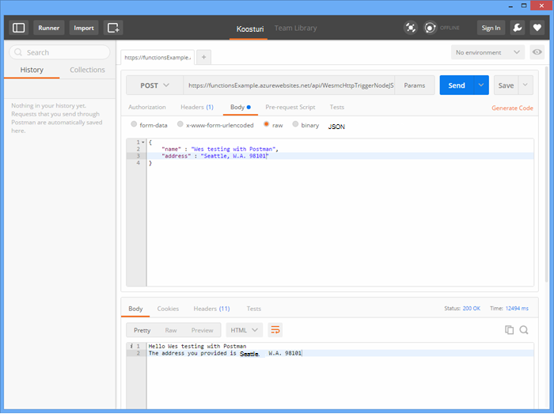

<properties
   pageTitle="Azure'i funktsioonide testimine | Microsoft Azure'i"
   description="Testige oma Azure'i funktsioonide postiljon, cURL ja Node.js abil."
   services="functions"
   documentationCenter="na"
   authors="wesmc7777"
   manager="erikre"
   editor=""
   tags=""
   keywords="Azure'i funktsioone, funktsioonide, event töötlus, webhooks, dünaamiline Arvuta, serverless arhitektuur, testimine"/>

<tags
   ms.service="functions"
   ms.devlang="multiple"
   ms.topic="article"
   ms.tgt_pltfrm="multiple"
   ms.workload="na"
   ms.date="08/19/2016"
   ms.author="wesmc"/>

# Azure'i funktsioonide testimine

## Ülevaade

Selles õpetuses me juhendab erineval testimine funktsioonid. Me määratleb http päästik funktsiooni aktsepteerib sisend päringustringi või koosolekukutse sisusse kaudu. Vaikimisi **HttpTrigger Node.js funktsioon** malli koodi toetab on `name` päringu päringustringi parameetri. Lisame koodi toetamiseks selle parameetri koos `address` teave kasutajale koosolekukutse kehasse.

## Funktsiooni testimiseks loomine

Enamiku selles õpetuses, kasutame veidi muudetud versiooni **HttpTrigger Nodejs funktsioon** Mall, mis on saadaval, kui loote uue funktsiooni.  Saate vaadata [esimese Azure'i funktsioon õppetükk loomine](functions-create-first-azure-function.md) kui vajate abi loomise uue funktsiooni.  [Azure portaali]funktsiooni test loomisel saate valida malli **HttpTrigger Nodejs funktsioon** lihtsalt.

Funktsioon vaikemalli on põhiliselt Tere tulemast maailma funktsiooni kaja tagasi nime koosolekukutse kehasse või päringu stringi parameeter, `name=<your name>`.  Uuendame koodi saab sisestada nime ja aadressi JSON sisuna koosolekukutse kehasse. Seejärel kuvatakse funktsiooni kaja need tagasi klient, kui need on saadaval.   

Järgmine kood, mida me kasutame testimiseks funktsiooni värskendamiseks tehke järgmist.

    module.exports = function(context, req) {
        context.log("Node.js HTTP trigger function processed a request. RequestUri=%s", req.originalUrl);
        context.log("Request Headers = " + JSON.stringify(req.headers));    
    
        if (req.query.name || (req.body && req.body.name)) {
            if (typeof req.query.name != "undefined") {
                context.log("Name was provided as a query string param..."); 
                ProcessNewUserInformation(context, req.query.name);
            }
            else {
                context.log("Processing user info from request body..."); 
                ProcessNewUserInformation(context, req.body.name, req.body.address);
            }
        }
        else {
            context.res = {
                status: 400,
                body: "Please pass a name on the query string or in the request body"
            };
        }
        context.done();
    };
    
    function ProcessNewUserInformation(context, name, address)
    {    
        context.log("Processing User Information...");            
        context.log("name = " + name);            
        echoString = "Hello " + name;
        
        if (typeof address != "undefined")
        {
            echoString += "\n" + "The address you provided is " + address;
            context.log("address = " + address);            
        }
        
        context.res = {
                // status: 200, /* Defaults to 200 */
                body: echoString
            };
    }

## Testige funktsiooni abil

### Testige cURL

Sageli kui testimise tarkvara, ei ole vaja otsida veelgi kui käsurea silumine rakenduse abil, pole erinevad koos funktsioonidega.

Kopeerige ülaltoodud funktsiooni testimiseks portaalist **Funktsioon URL-i** . See on järgmisel kujul: 

    https://<Your Function App>.azurewebsites.net/api/<Your Function Name>?code=<your access code>
    
See on teie funktsiooni käivitamise URL-i, saame testida cURL käsu abil teha saamiseks klõpsake käsurea (`-G` või `--get`) taotluse vastu meie funktsiooni:

    curl -G https://<Your Function App>.azurewebsites.net/api/<Your Function Name>?code=<your access code>
    
Selles teatud eeltoodud näites nõuab Päringuparameetri string, mis saab edasi andmetena (`-d`) cURL käsk:

    curl -G https://<Your Function App>.azurewebsites.net/api/<Your Function Name>?code=<your access code> -d name=<Enter a name here>
    
Vajutage enter ja te näete funktsiooni väljund käsurea kohta.

Aknas portaali **logid** logitakse funktsiooni täitmisel väljund sarnaneb järgmisega:

    2016-04-05T21:55:09  Welcome, you are now connected to log-streaming service.
    2016-04-05T21:55:30.738 Function started (Id=ae6955da-29db-401a-b706-482fcd1b8f7a)
    2016-04-05T21:55:30.738 Node.js HTTP trigger function processed a request. RequestUri=https://functionsExample.azurewebsites.net/api/HttpTriggerNodeJS1?code=XXXXXXX&name=Azure Functions
    2016-04-05T21:55:30.738 Function completed (Success, Id=ae6955da-29db-401a-b706-482fcd1b8f7a)

### Testige brauseris

Funktsioonid, mis nõuavad parameetrid või ainult vaja päringustringi parameetrite, saab katsetada brauseris.

Me ülalnimetatud funktsiooni testimiseks kopeerida **Funktsioon URL-i** portaal. See on järgmisel kujul:

    https://<Your Function App>.azurewebsites.net/api/<Your Function Name>?code=<your access code>

Lisa selle `name` päringu päringustringi parameetri järgmiselt, kasutades tegelik nimi on `<Enter a name here>` kohatäite.

    https://<Your Function App>.azurewebsites.net/api/<Your Function Name>?code=<your access code>&name=<Enter a name here>

Kleepige URL brauseri aadressiribale ja peaks saama vastuse sarnaneb järgmisega.

Aknas portaali **logid** logitakse funktsiooni täitmisel väljund sarnaneb järgmisega:

    2016-03-23T07:34:59  Welcome, you are now connected to log-streaming service.
    2016-03-23T07:35:09.195 Function started (Id=61a8c5a9-5e44-4da0-909d-91d293f20445)
    2016-03-23T07:35:10.338 Node.js HTTP trigger function processed a request. RequestUri=https://functionsExample.azurewebsites.net/api/WesmcHttpTriggerNodeJS1?code=XXXXXXXXXX==&name=Wes from a browser
    2016-03-23T07:35:10.338 Request Headers = {"cache-control":"max-age=0","connection":"Keep-Alive","accept":"text/html","accept-encoding":"gzip","accept-language":"en-US"}
    2016-03-23T07:35:10.338 Name was provided as a query string param.
    2016-03-23T07:35:10.338 Processing User Information...
    2016-03-23T07:35:10.369 Function completed (Success, Id=61a8c5a9-5e44-4da0-909d-91d293f20445)

### Testige postiljon

Soovitatav tööriist testimiseks enamik teie funktsioonid on postiljon. Postiljon installimiseks lugege teemat [Postiljon saada](https://www.getpostman.com/). Postiljon leiate palju lisateavet atribuutide HTTP-päring juhtida.

> [AZURE.TIP] ÜLEJÄÄNUD klient, kus teil on mugav kasutada. Siin on mõned alternatiivid postiljon.  
> 
> * [Viiuldaja](http://www.telerik.com/fiddler)  
> * [Paw](https://luckymarmot.com/paw)  

Funktsiooni taotluse asutusele postiljon testimine 

1. Käivitage postiljon nurgas Chrome'i brauseri akna vasakus ülanurgas nuppu **rakendused** .
2. **Funktsioon URL-i** kopeerimine ja kleepimine postiljon. See sisaldab selle pääsukood päringustringi parameetri.
3. HTTP **postitusse**muuta.
4. Klõpsake **keha** > **töötlemata** ja lisage JSON taotluse keha umbes järgmine:

        {
            "name" : "Wes testing with Postman",
            "address" : "Seattle, W.A. 98101"
        }

5. Klõpsake nuppu **saada**.

Järgmisel pildil on kujutatud testimine lihtsa kaja funktsiooni näide selles õpetuses. 

Aknas portaali **logid** logitakse funktsiooni täitmisel väljund sarnaneb järgmisega:

    2016-03-23T08:04:51  Welcome, you are now connected to log-streaming service.
    2016-03-23T08:04:57.107 Function started (Id=dc5db8b1-6f1c-4117-b5c4-f6b602d538f7)
    2016-03-23T08:04:57.763 Node.js HTTP trigger function processed a request. RequestUri=https://functions841def78.azurewebsites.net/api/WesmcHttpTriggerNodeJS1?code=XXXXXXXXXX==
    2016-03-23T08:04:57.763 Request Headers = {"cache-control":"no-cache","connection":"Keep-Alive","accept":"*/*","accept-encoding":"gzip","accept-language":"en-US"}
    2016-03-23T08:04:57.763 Processing user info from request body...
    2016-03-23T08:04:57.763 Processing User Information...
    2016-03-23T08:04:57.763 name = Wes testing with Postman
    2016-03-23T08:04:57.763 address = Seattle, W.A. 98101
    2016-03-23T08:04:57.795 Function completed (Success, Id=dc5db8b1-6f1c-4117-b5c4-f6b602d538f7)
    
### Testige bloobimälu päästik, salvestusruumi Explorerit

Saate testida bloobimälu päästik funktsioon [Microsoft Azure'i salvestusruumi](http://storageexplorer.com/)Exploreriga.

1. [Azure'i portaalis] oma funktsioonid rakenduse luua uue C#, F # või sõlm bloobimälu päästik funktsiooni. Määrake tee jälgimine oma bloobimälu container nimi. Näiteks:

        files

2. Klõpsake soovitud **+** nuppu, et valida või luua salvestusruumi konto, mida soovite kasutada. Klõpsake nuppu **Loo**.

3. Luua tekstifaili järgmine tekst ja salvestage see.

        A text file for blob trigger function testing.

4. Käivitage [Microsoft Azure'i salvestusruumi Exploreri](http://storageexplorer.com/) ja ühendage bloobimälu container salvestusruumi konto, jälgida.

5. Klõpsake nuppu **üles laadida** ja teksti faili üles laadida.

    

    Vaikimisi bloobimälu päästik funktsioon koodi aruande bloobimälu logisid töötlemine:

        2016-03-24T11:30:10  Welcome, you are now connected to log-streaming service.
        2016-03-24T11:30:34.472 Function started (Id=739ebc07-ff9e-4ec4-a444-e479cec2e460)
        2016-03-24T11:30:34.472 C# Blob trigger function processed: A text file for blob trigger function testing.
        2016-03-24T11:30:34.472 Function completed (Success, Id=739ebc07-ff9e-4ec4-a444-e479cec2e460)

## Testige funktsiooni funktsioonide pesastamine

### Nupp Käivita funktsioonide portaalis testimine

Portaalis **käivitamine** nupp, mis võimaldab teil teha mõned piiratud testimine. Saate sisestada taotluse keha, kasutades nuppu Käivita, kuid te ei saa anda päringustringi parameetrite või värskendada taotluse päised.

Testida HTTP päästik funktsioon me varem loodud, lisades JSON tekstistring, mis sarnaneb järgmise välja **koosolekukutse kehasse** ja seejärel klõpsake nuppu **Käivita** .

    {
        "name" : "Wes testing Run button",
        "address" : "USA"
    } 

Aknas portaali **logid** logitakse funktsiooni täitmisel väljund sarnaneb järgmisega:

    2016-03-23T08:03:12  Welcome, you are now connected to log-streaming service.
    2016-03-23T08:03:17.357 Function started (Id=753a01b0-45a8-4125-a030-3ad543a89409)
    2016-03-23T08:03:18.697 Node.js HTTP trigger function processed a request. RequestUri=https://functions841def78.azurewebsites.net/api/wesmchttptriggernodejs1
    2016-03-23T08:03:18.697 Request Headers = {"connection":"Keep-Alive","accept":"*/*","accept-encoding":"gzip","accept-language":"en-US"}
    2016-03-23T08:03:18.697 Processing user info from request body...
    2016-03-23T08:03:18.697 Processing User Information...
    2016-03-23T08:03:18.697 name = Wes testing Run button
    2016-03-23T08:03:18.697 address = USA
    2016-03-23T08:03:18.744 Function completed (Success, Id=753a01b0-45a8-4125-a030-3ad543a89409)

### Ajastiteenuse päästik test

Mõned funktsioonid ei saa tõesti katsetada eelnevalt mainitud tööriistu. Näiteks järjekorda päästik funktsioon, mis käivitub, kui sõnumi katkeb viimise [Azure'i järjekorda](../storage/storage-dotnet-how-to-use-queues.md). Teil võib alati kirjutada koodi kukutage sõnumi oma järjekorda ja allpool on esitatud näide selle konsooli projekti. Kuid on teine võimalus abil saate otse funktsioonide katsetamiseks.  

Võite kasutada timer käivitamiseks konfigureeritud järjekorda väljund sidumine. Ajastiteenuse päästik koodi saaksid siis kirjutada testi sõnumite järjekorda. Selles jaotises juhendab näide kaudu. 

Üksikasjalikumat teavet sidumiste Azure'i funktsioonide kasutamise kohta leiate [Azure'i funktsioonide tootearendusmaterjal](functions-reference.md). 

#### Järjekorda päästik testimiseks loomine

Seda moodust näitamaks esmalt loome järjekorda päästik funktsiooni soovime testimiseks nimega järjekorda `queue-newusers`. See funktsioon töötleb loobumist sellest Azure järjekorda salvestusruumi uue kasutaja nime ja aadressi teave. 

> [AZURE.NOTE] Kui kasutate muu järjekorra nimi, veenduge, et kasutatav nimi vastab [järjekorrad nime andmise ja metaandmete](https://msdn.microsoft.com/library/dd179349.aspx) reeglid.  Muul juhul saate HTTP olekukoodi 400: vigane päring. 

1. [Azure'i portaalis] oma funktsioonid rakenduse nuppu **Uus funktsioon** > **QueueTrigger - C#**.
2. Sisestage järjekorra nimi, et jälgida funktsiooni järjekord 

        queue-newusers 

3. Klõpsake soovitud **+** (lisa) nuppu, et valida või luua salvestusruumi konto, mida soovite kasutada. Klõpsake nuppu **Loo**.
4. Jätke see portaali brauseriaknas avatud, et saaksite jälgida log kirjeid vaikimisi järjekorda funktsioon malli kood.

#### Ajastiteenuse päästik loobuda sõnumi järjekorda loomine

1. [Azure portaali] avamine uues brauseriaknas ja liikuge oma funktsioon rakenduse.
2. Klõpsake nuppu **Uus funktsioon** > **TimerTrigger - C#**. Sisestage cron avaldis määramiseks sageduse timer koodi käivitada oma järjekorda funktsioon testimine. Klõpsake nuppu **Loo**. Kui soovite käivitada iga 30 sekundi järel, saate kasutada järgmisi [CRON avaldis](https://wikipedia.org/wiki/Cron#CRON_expression)test.

        */30 * * * * *

2. Klõpsake oma uue timer päästik **integreerida** sakki.
3. Klõpsake jaotises **väljundi**, klõpsake nuppu **+ Uus väljund** . Klõpsake nuppu **järjekord** ja **Valige** nupp.
4. Pange tähele, et nimi, mida kasutate **järjekorda sõnumi objekti** saate kasutada see funktsioon timer kood.

        myQueue

4. Sisestage järjekorra nimi, kuhu sõnum saadetakse. 

        queue-newusers 

3. Klõpsake soovitud **+** kasutasite varem järjekorda päästik salvestusruumi konto valimiseks nuppu (lisa). Klõpsake nuppu **Salvesta**.
4. Klõpsake vahekaarti **arendada** oma timer päästik jaoks.
5. C# timer funktsiooni saate kasutada järgmine kood, kui kasutasite sama järjekorra sõnumi objekti nimi eespool näidatud. Klõpsake nuppu **Salvesta**

        using System;
        
        public static void Run(TimerInfo myTimer, out String myQueue, TraceWriter log)
        {
            String newUser = 
            "{\"name\":\"User testing from C# timer function\",\"address\":\"XYZ\"}";
        
            log.Verbose($"C# Timer trigger function executed at: {DateTime.Now}");   
            log.Verbose($"{newUser}");   
            
            myQueue = newUser;
        }

Selles etapis C# funktsioon timer käivitatakse iga 30 sekundi järel, kui kasutasite näide cron avaldist. Funktsioon timer logisid aruande iga täitmise:

    2016-03-24T10:27:02  Welcome, you are now connected to log-streaming service.
    2016-03-24T10:27:30.004 Function started (Id=04061790-974f-4043-b851-48bd4ac424d1)
    2016-03-24T10:27:30.004 C# Timer trigger function executed at: 3/24/2016 10:27:30 AM
    2016-03-24T10:27:30.004 {"name":"User testing from C# timer function","address":"XYZ"}
    2016-03-24T10:27:30.004 Function completed (Success, Id=04061790-974f-4043-b851-48bd4ac424d1)

Funktsiooni järjekorda brauseriaknas, kuvatakse iga sõnumi töödelda:

    2016-03-24T10:27:06  Welcome, you are now connected to log-streaming service.
    2016-03-24T10:27:30.607 Function started (Id=e304450c-ff48-44dc-ba2e-1df7209a9d22)
    2016-03-24T10:27:30.607 C# Queue trigger function processed: {"name":"User testing from C# timer function","address":"XYZ"}
    2016-03-24T10:27:30.607 Function completed (Success, Id=e304450c-ff48-44dc-ba2e-1df7209a9d22)
    
## Funktsiooni koodiga testimine

### Testige HTTP päästik funktsiooni koodiga: Node.js

Saate käivitada http päringu testimiseks oma Azure'i funktsioon Node.js kood. 

Veenduge, et määrata.

- Funktsiooni `host` taotluse suvandite oma funktsioon rakendus Host
- Funktsiooni nime, klõpsake selle `path`.
- Pääsukood (`<your code>`) klõpsake soovitud `path`.

Koodi näide:

    var http = require("http");
    
    var nameQueryString = "name=Wes%20Query%20String%20Test%20From%20Node.js";
    
    var nameBodyJSON = {
        name : "Wes testing with Node.JS code",
        address : "Dallas, T.X. 75201"
    };
    
    var bodyString = JSON.stringify(nameBodyJSON);
    
    var options = {
      host: "functions841def78.azurewebsites.net",
      //path: "/api/HttpTriggerNodeJS2?code=sc1wt62opn7k9buhrm8jpds4ikxvvj42m5ojdt0p91lz5jnhfr2c74ipoujyq26wab3wk5gkfbt9&" + nameQueryString,
      path: "/api/HttpTriggerNodeJS2?code=sc1wt62opn7k9buhrm8jpds4ikxvvj42m5ojdt0p91lz5jnhfr2c74ipoujyq26wab3wk5gkfbt9",
      method: "POST",
      headers : {
          "Content-Type":"application/json",
          "Content-Length": Buffer.byteLength(bodyString)
        }    
    };
    
    callback = function(response) {
      var str = ""
      response.on("data", function (chunk) {
        str += chunk;
      });
    
      response.on("end", function () {
        console.log(str);
      });
    }
    
    var req = http.request(options, callback);
    console.log("*** Sending name and address in body ***");
    console.log(bodyString);
    req.end(bodyString);

Väljund:

    C:\Users\Wesley\testing\Node.js>node testHttpTriggerExample.js
    *** Sending name and address in body ***
    {"name" : "Wes testing with Node.JS code","address" : "Dallas, T.X. 75201"}
    Hello Wes testing with Node.JS code
    The address you provided is Dallas, T.X. 75201
        
Aknas portaali **logid** logitakse funktsiooni täitmisel väljund sarnaneb järgmisega:

    2016-03-23T08:08:55  Welcome, you are now connected to log-streaming service.
    2016-03-23T08:08:59.736 Function started (Id=607b891c-08a1-427f-910c-af64ae4f7f9c)
    2016-03-23T08:09:01.153 Node.js HTTP trigger function processed a request. RequestUri=http://functionsExample.azurewebsites.net/api/WesmcHttpTriggerNodeJS1/?code=XXXXXXXXXX==
    2016-03-23T08:09:01.153 Request Headers = {"connection":"Keep-Alive","host":"functionsExample.azurewebsites.net"}
    2016-03-23T08:09:01.153 Name not provided as query string param. Checking body...
    2016-03-23T08:09:01.153 Request Body Type = object
    2016-03-23T08:09:01.153 Request Body = [object Object]
    2016-03-23T08:09:01.153 Processing User Information...
    2016-03-23T08:09:01.215 Function completed (Success, Id=607b891c-08a1-427f-910c-af64ae4f7f9c)
    

### Testida järjekorda päästik funktsiooni koodiga: C# #

Varem mainitud järjekorda päästik võib testida, kasutades koodi loobuda sõnumi järjekorras. Järgmine näide kood aluseks on esitatud õpetusega [Alustamine Azure'i järjekorda salvestusruumi](../storage/storage-dotnet-how-to-use-queues.md) C# koodi. Muude keelte jaoks koodi pakutakse ka selle lingi kaudu.

Järgmine kood testimiseks konsooli Appis peate tegema järgmist:

- [Konfigureerimine teie salvestusruumi ühendusstringi app.config faili](../storage/storage-dotnet-how-to-use-queues.md#setup-a-storage-connection-string).
- Järgmine kood aktsepteerib ajal käitusaja käsurea argumentidena nimi ja aadress uus kasutaja. Liigu on `name` ja `address` parameetrid rakendus. Näiteks`C:\myQueueConsoleApp\test.exe "Wes testing queues" "in a console app"`

Näide C# koodi:

    static void Main(string[] args)
    {
        string name = null;
        string address = null;
        string queueName = "queue-newusers";
        string JSON = null;

        if (args.Length > 0)
        {
            name = args[0];
        }
        if (args.Length > 1)
        {
            address = args[1];
        }

        // Retrieve storage account from connection string
        CloudStorageAccount storageAccount = CloudStorageAccount.Parse(ConfigurationManager.AppSettings["StorageConnectionString"]);

        // Create the queue client
        CloudQueueClient queueClient = storageAccount.CreateCloudQueueClient();

        // Retrieve a reference to a queue
        CloudQueue queue = queueClient.GetQueueReference(queueName);

        // Create the queue if it doesn't already exist
        queue.CreateIfNotExists();

        // Create a message and add it to the queue.
        if (name != null)
        {
            if (address != null)
                JSON = String.Format("{{\"name\":\"{0}\",\"address\":\"{1}\"}}", name, address);
            else
                JSON = String.Format("{{\"name\":\"{0}\"}}", name);
        }

        Console.WriteLine("Adding message to " + queueName + "...");
        Console.WriteLine(JSON);

        CloudQueueMessage message = new CloudQueueMessage(JSON);
        queue.AddMessage(message);
    }

Funktsiooni järjekorda brauseriaknas, kuvatakse iga sõnumi töödelda:

    2016-03-24T10:27:06  Welcome, you are now connected to log-streaming service.
    2016-03-24T10:27:30.607 Function started (Id=e304450c-ff48-44dc-ba2e-1df7209a9d22)
    2016-03-24T10:27:30.607 C# Queue trigger function processed: {"name":"Wes testing queues","address":"in a console app"}
    2016-03-24T10:27:30.607 Function completed (Success, Id=e304450c-ff48-44dc-ba2e-1df7209a9d22)

<!-- URLs. -->

[Azure'i portaal]: https://portal.azure.com
