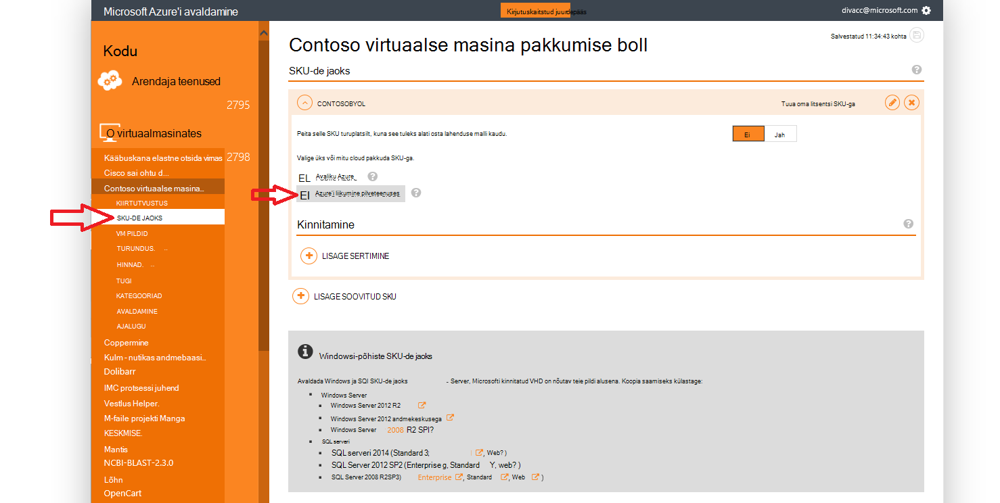
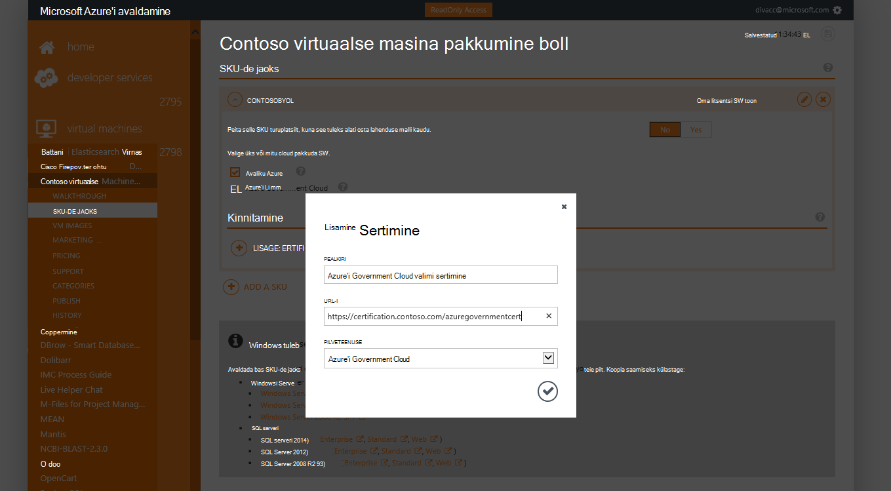
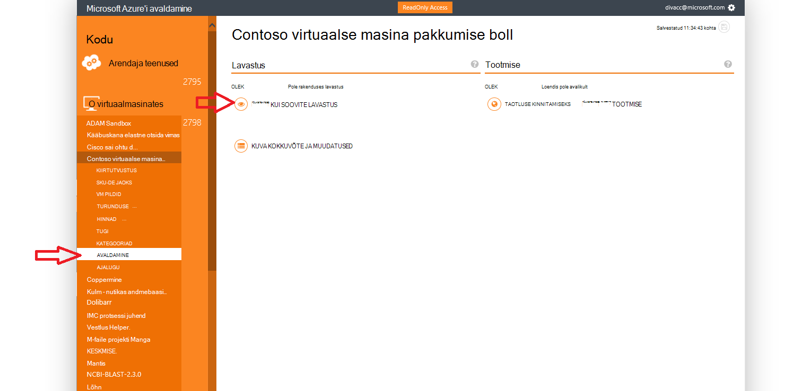
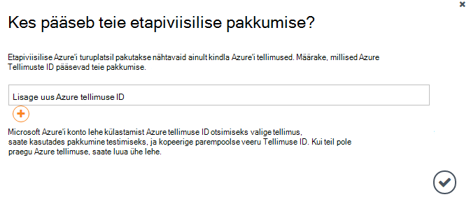
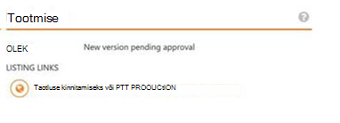

<properties
            pageTitle="Azure'i valitsuse dokumentidele | Microsoft Azure'i"
            description="See pakub võrdlus funktsioonid ja juhised arendada Azure'i Government rakendusi."
            services="Azure-Government"
            cloud="gov"
            documentationCenter=""
            authors="tsingh"
            manager="asimm"
            editor=""/>
 
<tags    ms.service="multiple"
            ms.devlang="na"
            ms.topic="article"
            ms.tgt_pltfrm="na"
            ms.workload="azure-government"
            ms.date="10/20/2016"
            ms.author="zakramer;tsingh;divacc"/> 

# Valitsuse Azure'i turuplats
Partneritele huvi avaldada oma pakkumisi Azure'i turuplatsi for Government, leiate allpool.

## Avaldamine
>[AZURE.NOTE] Kui te ei ole olemasoleva Azure'i turuplatsi sertifitseeritud partneri, täitke juhised [siin](../marketplace-publishing/marketplace-publishing-getting-started.md) enne jätkamist.

### Samm 1  
Logige sisse [https://publish.windowsazure.com](https://publish.windowsazure.com)

### Samm 2
Klõpsake nuppu pakkumine, mille soovite avaldada

### Samm 3
Klõpsake **SKU-de jaoks** ja klõpsake välja Azure'i Government Cloud

>[AZURE.NOTE] Toetatakse ainult tuua teie enda litsents (BYOL) SKU-de jaoks.  See suvand pole saadaval grupikindlustusleping (PayG) SKU-de jaoks.

### Samm 4
Klõpsake soovitud + lisa sertimine link linke lisada mis tahes kinnitamine teie pakkumise jaoks.

### Juhis 5
Taotluse prooviversiooni konto Microsoft Azure Governmenti pilveteenuses selleks, et saaksite testimiseks avaldamise portaalis pilt: [https://azuregov.microsoft.com/trial/azuregovtrial](https://azuregov.microsoft.com/trial/azuregovtrial)

Teie nõuetele vastavuse partner, kes pakub U.S. federal riik, kohaliku või tribal üksused on kinnitatud ja antakse kinnituse e-posti teel.  Prooviversiooni konto on saadaval rakenduses on 3-5 päeva.

### Juhist 6
Avalda ja seejärel klõpsake PTT lavastus. 

Teil palutakse sisestada whitelisted tellimus, mis on juurdepääs on etapiviisilise pakkuda. Sisestage kontolt värskelt omandatud Azure Governmenti prooviversiooni Tellimuse ID.

### Juhis 7
Kui pakkumine on edukalt etapiviisilise, saate oma pildi testida [https://portal.azure.us](https://portal.azure.us) Azure Governmenti prooviversiooni kontoga sisse logida.

### Samm 8
Kui teie pildi prooviversiooni tellimuse kasutamise, on kinnitatud, saate muuta pakkumine kättesaadavaks otse klõpsates avalda ja paluda kinnitamist minge tootmise. 

## Järgmised sammud

Lisateave ja värskendused, tellida [Microsoft Azure'i Government ajaveebi](https://blogs.msdn.microsoft.com/azuregov/).
