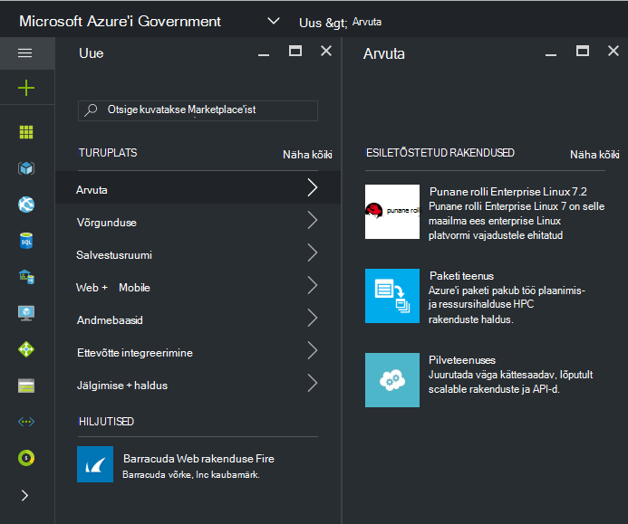
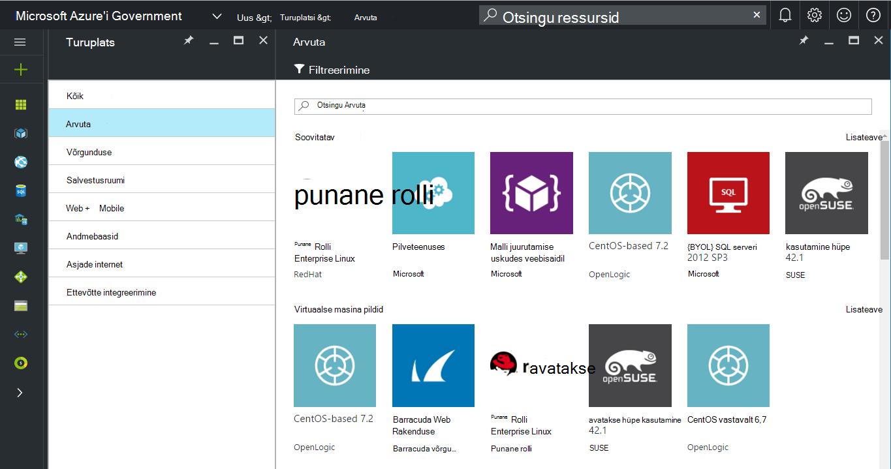
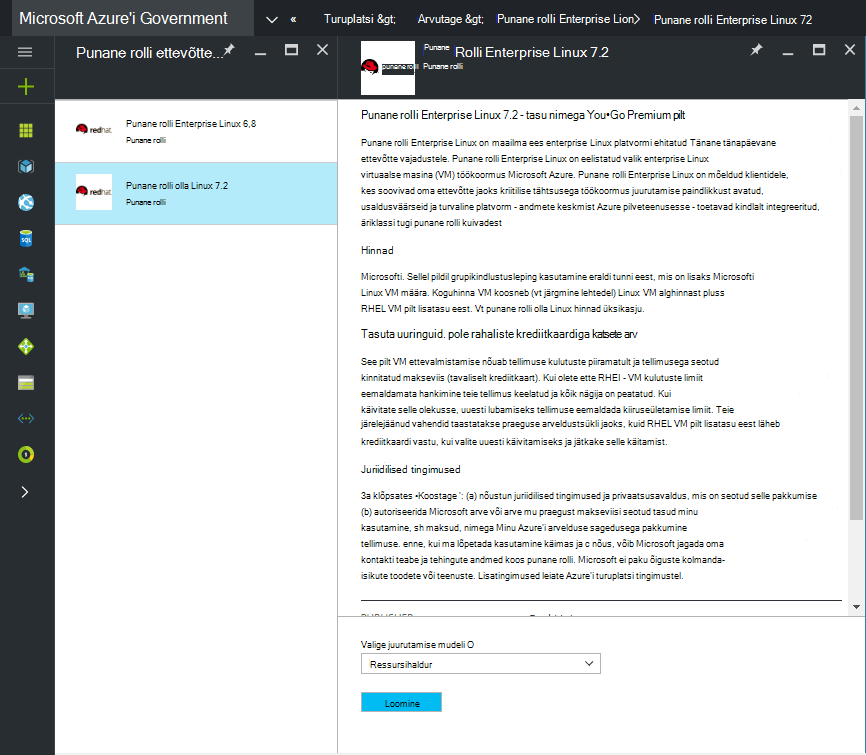
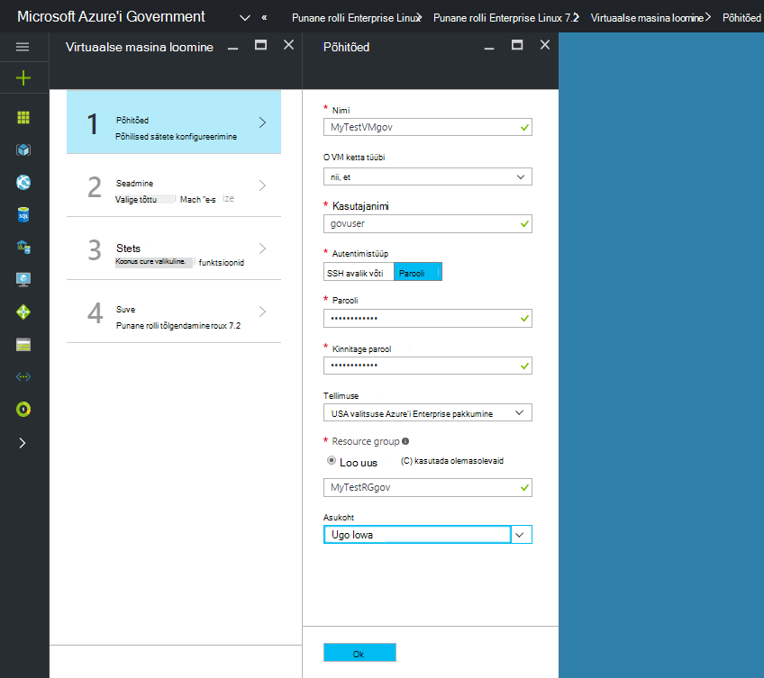
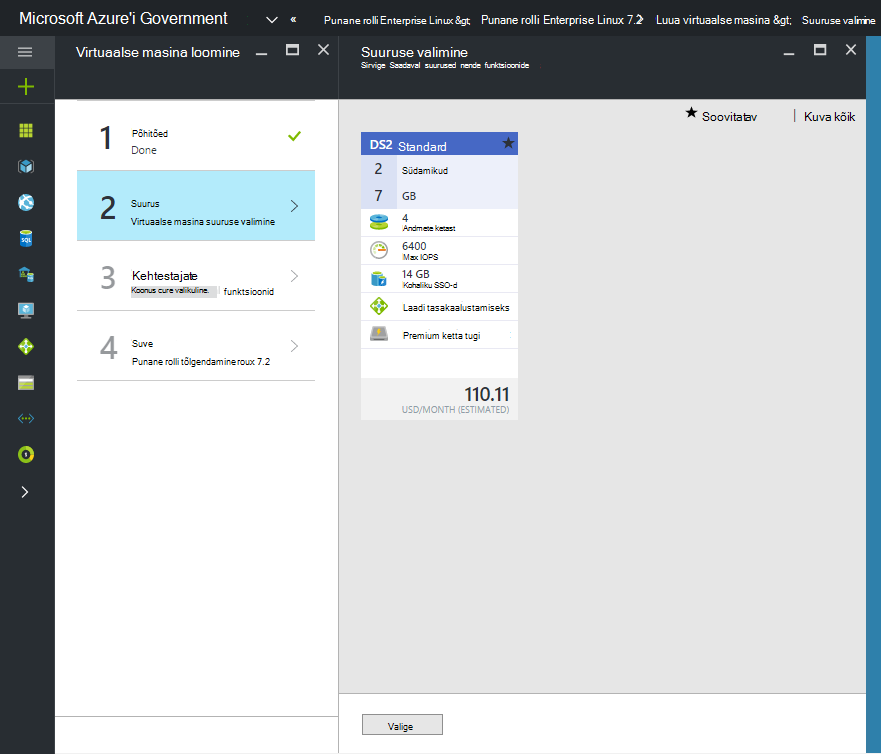

 <properties
    pageTitle="Azure'i valitsuse dokumentidele | Microsoft Azure'i"
    description="See pakub võrdlus funktsioonid ja juhised arendada Azure'i Government rakendusi."
    services="Azure-Government"
    cloud="gov"
    documentationCenter=""
    authors="VybavaRamadoss"
    manager="asimm"
    editor=""/>

<tags   ms.service="multiple"
    ms.devlang="na"
    ms.topic="article"
    ms.tgt_pltfrm="na"
    ms.workload="azure-government"
    ms.date="10/20/2016"
    ms.author="zakramer;vybavar"/>

# Azure'i turuplats for Government
Azure'i turuplatsi on saadaval Azure Governmenti pilte avaldajate turuplatsi värskendatud loendiga. 

## Variatsioonid
Allpool on mõned kaalutlused Government Azure'i turuplatsi kasutamisel:

- Ainult tuua teie enda litsents (BYOL) pildid on saadaval. Te ei pääse mis tahes pilte, mis nõuavad ostu tehingu kaudu Azure'i turuplatsilt
- Ainult alamkomplekt pildid on praegu saadaval võrreldes avaliku turuplatsilt. Saadaval piltide loetelu leiate [siit](../azure-government-image-gallery.md) 
- Enne ettevalmistamise pilt, teie ettevõtte administraator peab võimaldama Azure tellimuse ostmisel turuplats
  - Logige sisse portaali nimega ettevõtte administraator
  - Liikuge *haldamine*
  - Klõpsake jaotises *Registreerimise üksikasjad* *Azure'i turuplatsi* rea üksuse kõrval olevat pliiatsiikooni
  - Tavalise *Lubatud või keelatud* vastavalt vajadusele
  - Klõpsake nuppu *Salvesta*

>[AZURE.NOTE] Kui olete huvitatud muuta oma pilte, mis on saadaval Azure Governmenti vaadake lisateavet [partneri kasutuselevõtt juhised](documentation-government-manage-marketplace-partners.md) .

### Samm 1
Turuplatsi

  

### Samm 2
Erinevate toodete õige otsimiseks Sirvi.

Publisheri turuplatsi loetletakse kinnitamine osana toote kirjeldus, mis aitavad teil teha õige valik. 

### Samm 3
Valige soovitud product\image

### Samm 4
Käivitage loomine meilivoo ja sisestage vajalikud andmed juurutamiseks

>[AZURE.NOTE] Asukoha rippmenüüst ainult Azure Governmenti asukohad on nähtavad

### Juhis 5
Jälgige hinnad

### Juhist 6
Kõigi viisardietappide ja ebausaldusväärsete alustamiseks klõpsake nuppu Ok

## Järgmised sammud

Lisateave ja värskendused, tellida [Microsoft Azure'i Government ajaveebi](https://blogs.msdn.microsoft.com/azuregov/).
