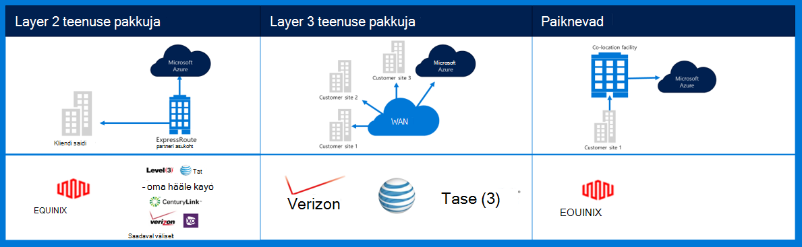
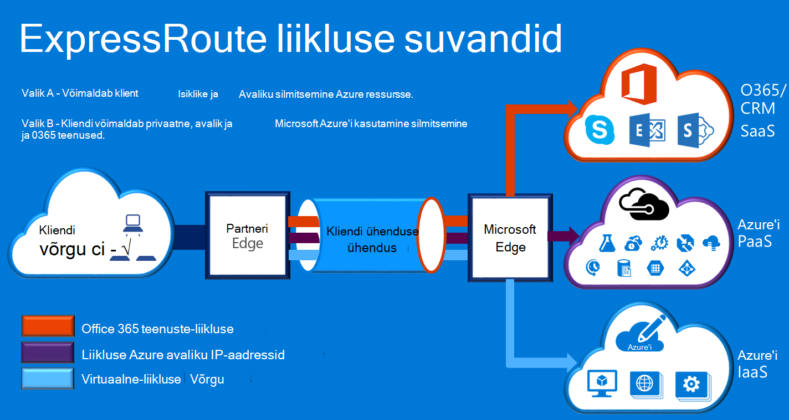

<properties
    pageTitle="Azure'i Governmenmt dokumentatsiooni | Microsoft Azure'i"
    description="See võimaldab võrrelda funktsioonid ja juhised e Government privaatne Ühenduvus"
    services="Azure-Government"
    cloud="gov" 
    documentationCenter=""
    authors="ryansoc"
    manager="zakramer"
    editor=""/>

<tags
    ms.service="multiple"
    ms.devlang="na"
    ms.topic="article"
    ms.tgt_pltfrm="na"
    ms.workload="azure-government"
    ms.date="09/28/2016"
    ms.author="ryansoc"/>

#  Azure'i Government võrgunduse

##  ExpressRoute (privaatne Connectivity)

ExpressRoute on üldiselt saadaval Azure Government. Lisateavet (sh partnerid ja silmitsemine asukohad), leiate <a href="https://azure.microsoft.com/en-us/documentation/services/expressroute/">ExpressRoute avaliku dokumentatsiooni </a>.

###  Variatsioonid

ExpressRoute on üldiselt kättesaadav (GA) Azure'i valitsuse. 

- Government kliendid ühenduse füüsilise eraldatud võimsus sihtotstarbeline Azure Governmenti (gov –) ExpressRoute (ER) ühenduse kaudu

- Azure'i gov – pakub suurem kättesaadavus & kestvus tehtavate mitmes piirkonnas paari asub vähemalt 500 miili lahku 

- Vaikimisi kõik Azure'i gov – ER ühenduvuse on konfigureeritud aktiivne-aktiivne üleliigne tugi lõhkemist ja pakub kuni 10 G ringi võimsus (väikseim on 50MB)

- Azure'i gov – ER asukohad pakuvad optimeeritud radade (lühima humala, madal latentsus, suure jõudlusega jne) kliendid ja Azure gov – geograafilise liigne piirkondade jaoks

- Azure'i gov – ER privaatne ühendus ei kasuta, läbida või sõltuvad Interneti-ühendus

- Azure'i gov – füüsiline ja loogiline taristu füüsilise pühendunud ja eraldatud ja juurdepääs on piiratud USA isikud

- Microsofti kuulub ja toimib kõik fiber taristu Azure'i gov – regioonide ja Azure gov – ER vastavad-minu kohad

- Azure'i gov – ER pakub Microsoft Azure'i, O365 ja CRM pilveteenused

### Kaalutlused

On kaks põhilised teenused, mis pakuvad privaatvõrgu Ühenduvus Azure Governmenti sisse: VPN (-saidilt tüüpilised ettevõtte jaoks) ja ExpressRoute.

Azure'i ExpressRoute saab luua privaatne ühendused Azure'i Government andmekeskuste ja teie asutusesisese taristu või colocation keskkonnas. ExpressRoute ühendused ei saa minna üle avaliku Interneti-töökindluse, kiirem kiirust ja alumise latentsused kui tüüpilised Interneti-ühendused. Mõnel juhul kasutamine andmete edastamiseks vahel eeldusel süsteemid ja Azure jääb märgatavat maksumus eeliste ExpressRoute ühendused.   

ExpressRoute, saate luua ühendusi Azure ExpressRoute asukohas (nt Exchange'i pakkuja poole) või otse loote Azure'i WAN olemasoleva võrgu kaudu (nagu on multi sildi vahetamine (MPLS) VPN, esitatud võrgu pakkuja).

    

Võrguteenuste Azure'i valitsuse kliendi rakendused ja lahendusi, on tungivalt soovitatav, et ühenduse Azure'i Government rakendatakse ExpressRoute (privaatne Ühenduvus). Kui kasutatakse VPN ühendusi, järgmist tuleks kaaluda:

- Klientide pöörduma oma eelarve ametlik/asutus kas privaatne ühenduvuse või muud turvalist ühendust süsteem on nõutav ja tuvastada, millega tuleks arvestada täiendavate piiranguteta.

- Klientide tuleks otsustada, kas mandaat, et VPN saidilt marsruuditakse privaatne ühenduvuse tsooni kaudu.

- Klientide peaksite hankima on MPLS ringi või VPN litsentsitud privaatne ühenduvuse juurdepääsu pakkujaga.

Kõik kliendid, kes kasutavad privaatne ühenduvuse arhitektuur tuleks kinnitada, et vastav rakendamist ja säilitada kliendi ühenduse lüüs võrk ja Internet (GN / ma) serva Azure'i valitsuse ruuteri piiritlemine punkti. Samuti ettevõtte peab looma oma asutusesiseses keskkonnas ja lüüsi võrgu/kliendi (GN/C) serva ruuteri piiritlemine punkti vaheline võrguühendus Azure'i Government.

## Järgmised sammud

Jaoks täiendav teave ja värskendused palun tellida soovitud <a href="https://blogs.msdn.microsoft.com/azuregov/">Microsoft Azure'i Government ajaveeb.</a>
