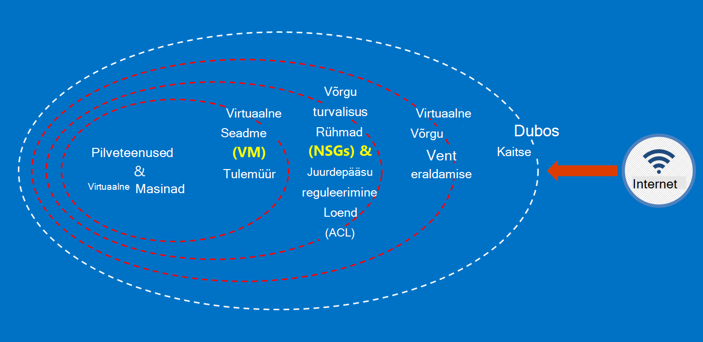

<properties
    pageTitle="Azure'i valitsuse dokumentidele | Microsoft Azure'i"
    description="See pakub võrdlus funktsioonid ja juhiseid Azure'i valitsuse rakenduste arendamise kohta"
    services="Azure-Government"
    cloud="gov" 
    documentationCenter=""
    authors="ryansoc"
    manager="zakramer"
    editor=""/>

<tags
    ms.service="multiple"
    ms.devlang="na"
    ms.topic="article"
    ms.tgt_pltfrm="na"
    ms.workload="azure-government"
    ms.date="08/25/2016"
    ms.author="ryansoc"/>

#  Azure'i Government dokumentatsiooni ülevaade

##  Azure'i valitsuse dokumentidele tutvustus

See sait kirjeldatakse võimalusi [Microsoft Azure'i](https://azure.microsoft.com/features/gov/) teenuste ja pakub üldised juhised kehtivad kõigi kliendid. Enne tellimuse Azure Governmenti konkreetselt reguleeritud andmete hulgas peaks tutvumine Azure Governmenti võimaluste ja küsige oma konto meeskonnatöö, kui teil on küsimusi.

Tutvuge [Microsoft Azure'i usaldada vastavuse lehel](http://www.microsoft.com/en-us/TrustCenter/Compliance/default.aspx) ajakohasema teabe saamiseks klõpsake Azure Governmenti teenused, teatud akrediteeringud alusel. Lisateenuse Microsoft võib olla saadaval, aga ei kuulu Azure Governmenti hõlmatud teenuste ja selles dokumendis ei käsitleta. Azure Governmenti teenused võib lubada saate kasutada mitmesuguseid uusi ressursse, rakenduste või kolmandate osapoolte teenuste – või Microsoft kasutamine ja privaatsuse eraldi tingimuste alusel – mis ei kuulu selle dokumendi ulatus. Teie vastutate läbivaatamise terminite kõigi selliste "lisandmooduli" pakkumiste, nt turuplatsi pakkumisi, et tagada, et need vastaksid teie vajadustele täitmise kohta.

Azure'i Government on saadaval üksused, mis andmeid, mis on teatud valitsuse määrus ja tingimuste (nt NIST 800.171 (DIB), Talletada, IRS 1075, DoD L4 ja CJIS), kus Azure Governmenti kasutamine on nõutav eeskirjadele. Azure'i Government kliendid on nõuetele vastavuse kontrollimine.

Üksuste Azure Governmenti nõuetele vastavuse kohta küsimusi peaks küsige oma konto meeskonnatöö.

##  Azure'i Government kliendi andmete turvamise põhimõtted

Azure'i Government pakub mitmesuguseid funktsioone ja teenuseid, mille abil saate koostada pilve lahendusi reguleeritud kontrolli all andmed teie vajadustele. Nõuetele vastavuse kliendi lahendus on midagi enamat kui out-of-box Azure'i Government võimalusi, koos ühtlase andmete turvalisus tava rakendamise.
Kui majutate Azure'i Government lahendust, Microsoft tegeleb paljude tasemel cloud taristu nendele nõuetele.

Järgmisel joonisel on esitatud Azure kaitsevallid põhjalikud mudel. Microsoft osutab näiteks lihtsa pilvetaristu DDOS, nt turvalisus seadmete kliendikohased rakenduse DDOS peab klient võimaluste koos.

Sellel lehel kirjeldatakse põhimõtted tagamiseks oma teenused ja rakendused, pakkudes juhiseid ja heade tavade kohta, kuidas neid põhimõtteid; Teisisõnu, kuidas kliendid peaksid kasutama nutikas Azure Governmenti kohustused, mis on vajalikud lahenduse, mis tegeleb Talletada teavet ja kohustused täita.

Üldised põhimõtted turvaliseks kliendiandmete on:
* Krüptimise abil andmete kaitsmine
* Saladusi haldamine
* Andmete juurdepääsu piiramise eraldamise

##  Krüptimine kliendiandmete kaitsmine

Turvalisus ja nõuetele kohustuste täitmise auto juhtimise ajal suurenevad liikumine ja andmete krüptimine tähtsus. Kasutada efektiivse krüptimise rakendamist täiustamiseks praeguse võrgu ja rakenduse turbemeetmete – ja vähendada pilvepõhise keskkonna üldine.

### Ülejäänud krüptimist
Ülejäänud andmete krüptimise rakendab kettaruumi hoitakse kliendi sisu kaitsta. On mitu võimalust, see võib juhtuda.

### Salvestusruumi teenuse krüptimine

Azure'i salvestusruumi teenuse krüptimine on lubatud tasemel salvestusruumi konto tulemuseks Blokeeri plekid ja lehe plekid on krüptitud automaatselt, kui Azure Storage kirjutatud. Kui peate lugema andmed Azure Storage, see dekrüptitakse salvestusruumi teenus võttis enne tagastatakse. Kasutage seda kaitsta teie andmeid muuta või lisada koodi kõik rakendused ilma.

### Azure'i ketta krüptimine
Azure'i ketta krüptimise abil krüptida OS ketast ja andmete ketast kasutada, on Azure virtuaalse masina. Integreerimine Azure klahvi Vault annab kontrolli ja aitab hallata ketta krüptimise võtmed.

### Kliendipoolne krüptimine
Kliendipoolne krüptimise on arvutisiseste Java ja .net-i salvestusruumi kliendi teegid, mida saate kasutada Azure klahvi Vault API, muutes selle lihtsalt rakendada. Azure'i klahvi Vault abil pääseda saladusi Azure'i klahvi võlvkelder teatud isikutele Azure Active Directory abil.

### Krüptimine

Azure'i valitsuse Ühenduvus saadaval tavaline krüptimine toetab taseme Turve (TLS) 1.2 protokoll ja X.509 serdid. Federal teabe töötlemise Standard (FIPS) 140-2 tase 1 cryptographic algoritmide kasutatakse ka taristu võrguühenduste Azure Governmenti andmekeskuste vahel.  Windows Server 2012 R2 Windows 8-plus VMs, ja Azure Failikettad saate kasutada ja SMB 3.0 krüptimiseks VM vahel faili ühiskasutusse andmine. Kliendipoolne krüptimise andmete krüptimiseks enne, kui see on üle, mis kliendi rakendus ja selle järele andmeid dekrüptida salvestusruum kokku üle.

### Head tavad krüptimine

* IaaS VMs: Azure'i ketta krüptimise. Salvestusruumi teenuse krüptimise krüptimiseks VHD failid, mis on kasutada nende ketast Azure Storage varundada, kuid see ainult krüptib äsja kirjutatud andmed. See tähendab, et krüptitakse kui loote VM ja seejärel lubada salvestusruumi teenuse krüptimise salvestusruumi konto VHD faili versioonimissätteid, ainult muudatusi, mitte algse VHD faili.
* Kliendipoolne krüptimine: See on kõige ebaturvalisem viis, krüptimist, kuna see krüptib see enne teel ja krüptib ülejäänud andmete jaoks. Siiski ei nõua koodi lisamiseks rakenduste abil salvestusruumi, mida võiksite mitte teha. Sel juhul saate kasutada HTTPs ja salvestusruumi teenuse krüptimise teel andmete jaoks ülejäänud andmete krüptimiseks. Kliendipoolne krüptimine hõlmab ka rohkem koormust klientide – teil on konto nii teie skaleeritavus plaanid, eriti siis, kui olete krüptimise ja suunamine palju andmeid.

Krüptimise kohta lisateabe saamiseks leiate Azure'i suvandid [Salvestusruumi turvalisuse juhend](/storage-security-guide).

##  Hallates saladusi kliendiandmete kaitsmine

Turvaline võtme haldamise oluline kaitsmine pilves. Klientide püüdma võtme haldamise lihtsustamiseks ja hallata klahvid andmete krüptimiseks kasutatavat pilve rakendused ja teenused.

### Head tavad saladusi haldamine

* Klahv Vault abil minimeerida saladusi jäämine raske koodiga konfiguratsiooni faile, skriptide kaudu või lähtekoodi. Azure'i klahvi Vault krüptib klahvid (nt krüptimise võtmed Azure'i ketta krüptimiseks) ja saladused (nt paroolid), talletades neid FIPS 140-2 tase 2 kinnitatud riistvara turvalisus moodulid (HSMs). Lisatud assurance, saate importida või klõpsake nende HSMs võtmed.
* Rakenduse koodi ja malle peaks sisaldama ainult URI viited saladusi (st tegelik saladusi ei ole kood, konfigureerimine või source code hoidlate). See takistab tootenumbri andmepüügi eest sise- või repotehingute, nt harvest-eest GitHub.
* Keeruka RBAC juhtelementide jooksul klahvi Vault kasutada. Usaldusväärsete tehtemärk jätab ettevõtte või edastamine uude rühma ettevõttes, nad peaks olema ei saa pääse saladusi.  

Lisateabe saamiseks lugege [Klahvi Vault Azure'i valitsuse](/azure-government/azure-government-tech-keyvault)

##  Andmete juurdepääsu piiramise eraldamise

Eraldamise on piirmäärad, osadeks ja ümbriste piiramiseks ainult autoriseeritud kasutajad, teenuste ja rakenduste abil. Näiteks rentnikud vahe on oluline turvalisus rentnikuga pilveteenuste platvormide nagu Microsoft Azure'i. Loogika eraldamise aitab vältida ühest rentnikust segamise teine rentnik toimingud.

### Keskkonna eraldamise
Azure'i Government keskkond on füüsilise eksemplari, mis on Microsofti veebisaidil network ülejäänud eraldi. See on saavutada sarja füüsilise- ja loogikaväärtused juhtelemendid, mis sisaldavad järgmist: turvaliseks füüsilise takistused Biomeetrilised seadmed ja foto abil.  Kindla identimisteabe ja multifactor autentimist Microsofti töötajad loogilise juurdepääsu tootmiskeskkonda kasutamine.  Kõigi teenuste taristu Azure Governmenti asub Ameerika Ühendriikides.

#### Kliendi kohta eraldi
Azure'i rakendab võrgu juurdepääsu reguleerimine ja eraldamine VLAN eraldamise ACL-ID, kuni laadimine soolise ja IP-filtrid

Klientide täpsemaks saate teostavad nende ressursside tellimused, ressursside rühmad, virtuaalse võrgu ja alamvõrku.

Microsoft Azure eraldamise kohta lisateabe saamiseks leiate [Azure'i turvalisus juhend eraldamise osas](/azure-security-getting-started/#isolation).

Jaoks täiendav teave ja värskendused palun tellida soovitud <a href="https://blogs.msdn.microsoft.com/azuregov/">Microsoft Azure'i Government ajaveeb.</a>
