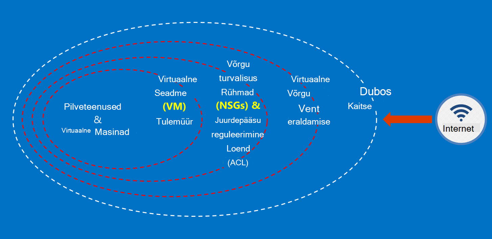

<properties
    pageTitle="Azure'i teenuste | Microsoft Azure'i"
    description="Pakub ja Azure Governmenti saadaval teenuste ülevaade"
    services="Azure-Government"
    cloud="gov"
    documentationCenter=""
    authors="zakramer"
    manager="liki"
    editor="" />

<tags
    ms.service="multiple"
    ms.devlang="na"
    ms.topic="article"
    ms.tgt_pltfrm="na"
    ms.workload="azure-government"
    ms.date="10/18/2016"
    ms.author="ryansoc" />

#  Turvalisus

##  Azure Governmenti kliendi andmete turvamise põhimõtted

Azure'i Government pakub mitmesuguseid funktsioone ja teenuseid, mille abil saate koostada pilve lahendusi reguleeritud kontrolli all andmed teie vajadustele. Nõuetele vastavuse kliendi lahendus on midagi enamat kui out-of-box Azure Governmenti võimalusi, koos ühtlase andmete turvalisus tava rakendamise.

Kui majutate Azure'i valitsuse lahenduse, Microsoft tegeleb paljude tasemel cloud taristu nendele nõuetele.

Järgmisel joonisel on esitatud Azure kaitsevallid põhjalikud mudel. Microsoft osutab näiteks lihtsa pilvetaristu DDOS, nt turvalisus seadmete kliendikohased rakenduse DDOS peab klient võimaluste koos.

Sellel lehel kirjeldatakse põhimõtted tagamiseks oma teenused ja rakendused, pakkudes juhiseid ja heade tavade kohta, kuidas neid põhimõtteid; Teisisõnu, kuidas kliendid peaksid kasutama nutikas Azure Governmenti kohustused, mis on vajalikud lahenduse, mis tegeleb Talletada teavet ja kohustused täita.

 Üldised põhimõtted turvaliseks kliendiandmete on:

- Krüptimise abil andmete kaitsmine
- Saladusi haldamine
- Andmete juurdepääsu piiramise eraldamise

###  Krüptimine kliendiandmete kaitsmine

Turvalisus ja nõuetele kohustuste täitmise auto juhtimise ajal suurenevad liikumine ja andmete krüptimine tähtsus. Kasutada efektiivse krüptimise rakendamist täiustamiseks praeguse võrgu ja rakenduse turbemeetmete – ja vähendada pilvepõhise keskkonna üldine.

#### Ülejäänud krüptimist
Ülejäänud andmete krüptimise kehtib kliendi sisu kettaruumi hoitakse kaitse. On mitu võimalust, see võib juhtuda.

#### Salvestusruumi teenuse krüptimine

Azure'i salvestusruumi teenuse krüptimine on lubatud tasemel salvestusruumi konto tulemuseks Blokeeri plekid ja lehe plekid on krüptitud automaatselt, kui Azure Storage kirjutatud. Kui peate lugema andmed Azure Storage, see dekrüptitakse salvestusruumi teenus võttis enne tagastatakse. Kasutage seda kaitsta teie andmeid muuta või lisada koodi kõik rakendused ilma.

#### Kliendipoolne krüptimine
Kliendipoolne krüptimise on ehitatud Java ja .net-i salvestusruumi kliendi teegid, mida saate kasutada Azure klahvi Vault API, muutes selle lihtsalt rakendada. Azure'i klahvi Vault abil pääseda saladusi Azure'i klahvi võlvkelder teatud isikutele Azure Active Directory abil.

#### Krüptimine

Azure'i valitsuse Ühenduvus saadaval tavaline krüptimine toetab taseme Turve (TLS) 1.2 protokoll ja X.509 serdid. Federal teabe töötlemise Standard (FIPS) 140-2 tase 1 cryptographic algoritmide kasutatakse ka taristu võrguühenduste Azure Governmenti andmekeskuste vahel.  Windows Server 2012 R2 ja Windows 8-plus VMs ja Azure Failikettad saate kasutada SMB 3.0 krüptimise vahel VM ja faili ühiskasutusse andmine. Kliendipoolne krüptimise andmete krüptimiseks enne, kui see on üle, mis kliendi rakendus ja selle järele andmeid dekrüptida salvestusruum kokku üle.

#### Head tavad krüptimine

- IaaS VMs: Azure'i ketta krüptimise. Salvestusruumi teenuse krüptimise krüptimiseks VHD failid, mis on kasutada nende ketast Azure Storage varundada, kuid see ainult krüptib äsja kirjutatud andmed. See tähendab, et krüptitakse kui loote VM ja seejärel lubada salvestusruumi teenuse krüptimise salvestusruumi kontol, mis hoiab VHD faili, ainult muudatusi, mitte algse VHD faili.
- Kliendipoolne krüptimine: See on kõige ebaturvalisem viis, krüptimist, kuna see krüptib see enne teel ja krüptib ülejäänud andmete jaoks. Siiski ei nõua koodi lisamiseks rakenduste abil salvestusruumi, mida võiksite mitte teha. Sel juhul saate kasutada HTTPs ja salvestusruumi teenuse krüptimise teel andmete jaoks ülejäänud andmete krüptimiseks. Kliendipoolne krüptimine hõlmab ka rohkem koormust klientide – teil on konto nii teie skaleeritavus plaanid, eriti siis, kui olete krüptimise ja suunamine palju andmeid.

###  Hallates saladusi kliendiandmete kaitsmine

Turvaline võtme haldamise oluline kaitsmine pilves. Klientide püüdma võtme haldamise lihtsustamiseks ja hallata klahvide andmete krüptimiseks kasutatavat pilve rakendused ja teenused.

#### Head tavad saladusi haldamine

- Klahv Vault abil minimeerida saladusi jäämine raske koodiga konfiguratsiooni faile, skriptide kaudu või lähtekoodi. Azure'i klahvi Vault krüptib klahvid (nt krüptimise võtmed Azure'i ketta krüptimiseks) ja saladused (nt paroolid), talletades neid FIPS 140-2 tase 2 kinnitatud riistvara turvalisus moodulid (HSMs). Lisatud assurance, saate importida või klõpsake nende HSMs võtmed.
- Rakenduse koodi ja malle peaks sisaldama ainult URI viited saladusi (st tegelik saladusi ei ole kood, konfigureerimine või source code hoidlate). See takistab tootenumbri andmepüügi eest sise- või repotehingute, nt harvest-eest GitHub.
- Keeruka RBAC juhtelementide jooksul klahvi Vault kasutada. Usaldusväärsete tehtemärk jätab ettevõtte või edastamine uude rühma ettevõttes, nad peaks olema ei saa pääse saladusi.

Lisateavet <a href="https://azure.microsoft.com/documentation/services/key-vault">Azure klahvi Vault avaliku dokumentatsiooni.</a>

###  Andmete juurdepääsu piiramise eraldamise

Eraldamise on piirmäärad, osadeks ja ümbriste piiramiseks ainult autoriseeritud kasutajad, teenuste ja rakenduste abil. Näiteks rentnikud vahe on oluline turvalisus rentnikuga pilveteenuste platvormide nagu Microsoft Azure'i. Loogika eraldamise aitab vältida ühest rentnikust segamise teine rentnik toimingud.

#### Keskkonna eraldamise
Azure'i Government keskkond on füüsilise eksemplari, mis on Microsofti veebisaidil network ülejäänud eraldi. See on saavutada sarja füüsiline ja loogiline juhtelemendid, mis sisaldavad järgmist:

- Turvaliseks füüsilise takistused Biomeetrilised seadmed ja foto abil.
- Kindla identimisteabe ja multifactor autentimist Microsofti töötajad loogilise juurdepääsu tootmiskeskkonda kasutamine.
- Kõigi teenuste taristu Azure Governmenti asub Ameerika Ühendriikides.

#### Kliendi kohta eraldi
Azure'i rakendab võrgu juurdepääsu reguleerimine ja eraldamine VLAN eraldamise ACL-ID, kuni laadimine soolise ja IP-filtrid

Klientide täpsemaks saate teostavad nende ressursside tellimused, ressursside rühmad, virtuaalse võrgu ja alamvõrku.

## Sõelumine

Hiljuti teada FedRAMP kõrge ja kaitsevallid osakonna (DoD) mõju taseme 4 akrediteerimise. Turve ja nõuetele vastavus ribal tõstnud üle Azure Governmenti keskkonnas.

Meil on nüüd sõelumine meie veebisaidil liikmesriikide asutuse kontrollimine tehtemärgid õiguse ja krediitkaardiga (NACLC) jaos 5.6.2.2, on DoD Cloud arvutuste turvalisus nõuded juhend (SRG) määratletud:

>[AZURE.NOTE] Minimaalne tausta uurimine on nõutavad teatud CSP isikute juurdepääsu tase 4, ja 5 teabe põhjal "mittekriitilise tähtsusega-tundlik" (nt DoD ADP-2) on mõne riigi asutuse uurige jurisdiktsiooni ja krediitkaarti (NACLC) (jaoks "mittekriitilise tähtsusega tundliku" alltöövõtjate) või on mõõdukas Risk tausta uurimine (MBI) jaoks "mõõdukas risk" asukoha määramine.

Järgmises tabelis on kokkuvõte meie praeguse sõelumine Azure Governmenti ettevõtjatele:

Azure'i gov – piletid ja tausta kontrollimine | Kirjeldus|
---|---|
USA kodakondsuse |USA kodakondsus kontrollimine.
Microsofti pilveteenuste tausta sisse (iga kahe)|Isikukood Otsi, kriminaalse sisse, Office võõrkeelsed varad kontroll-loend (OFAC), Bureau of Industry ja turve loendi (BIS) Office'i kaitsevallid Trade juhtelementide abist ilma isikute loend.
Riigi asutuse sisse õiguse ja krediitkaarti (NACLC) (iga viie aasta) | Lisab sõrmejälje tausta sisse FBI andmebaaside suhtes. Lisateabe saamiseks külastage<a href="https://www.opm.gov/investigations/background-investigations/federal-investigations-notices/1997/fin97-02/"> Office'i personali haldamise lehel</a>. | 
<a href="https://www.microsoft.com/en-us/TrustCenter/Compliance/CJIS">Kriminaalõiguse Information Services (CJIS)</a> | CJIS on riik, kohaliku ja FBI government sõelumine Millised protsessid sõrmejälje kirjete ja valideerib funktsionaalseid töötajatega, kes võivad olla juurdepääs kriitilised kriminaalõiguse teave (CJI) andmete kriminaalõiguse ajalugu.  Iga maakonna ei oma tausta sisse ja edaspidised kinnitamise kõik töötajad CJI juurde pääseda.|

Azure'i personali, rakendatakse Accessi järgmistest põhimõtetest.

- Ülesannete on selgelt määratletud, koos eraldi kohustused taotlemise, kinnitamine ja juurutamine muudatused.
- Juurdepääs on määratletud liidesed, mis on teatud funktsioonid kaudu.
- Juurdepääs on just-in-time (JIT) ja antakse ainult kohta juhtum alusel või teatud hooldustööde sündmuse ja alati piiratud aja jooksul.
- Juurdepääs on reegli vastavalt määratletud rollid, mis määratakse ainult tõrkeotsingu vajalikud õigused.

Sõelumine standardid sisaldavad USA kodakondsus kõigi Microsofti tugiteenuste ja töötajate valideerimise enne tähistav Azure Governmenti majutatud süsteemid. Toe töötajad, kes vajavad andmete edastamiseks kasutada turvalist võimaluste Azure'i valitsuse. Turvaline andmeedastus nõuab autentimist identimisteabe pääsete eraldi kogum. Näiteks süsteemi metaandmete juurdepääsuks kasutada toimingute töötajatele teatud veebipõhine sisemise Haldusriistad, kirjutuskaitstud API-de ja JIT tõus.

## Järgmised sammud

Jaoks täiendav teave ja värskendused palun tellida soovitud <a href="https://blogs.msdn.microsoft.com/azuregov/">Microsoft Azure'i Government ajaveeb.</a>
