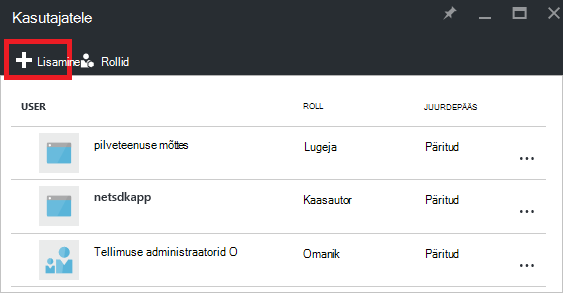
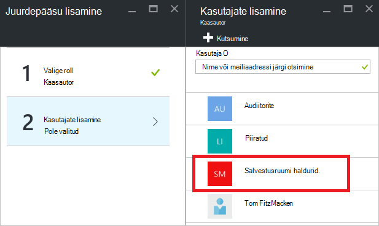

<properties
   pageTitle="Azure'i portaali armatuurlaua juurdepääsu | Microsoft Azure'i"
   description="Selles artiklis selgitatakse, kuidas jagatavate armatuurlaua Azure'i portaalis."
   services="azure-portal"
   documentationCenter=""
   authors="tfitzmac"
   manager="timlt"
   editor="tysonn"/>

<tags
   ms.service="multiple"
   ms.devlang="NA"
   ms.topic="article"
   ms.tgt_pltfrm="NA"
   ms.workload="na"
   ms.date="08/01/2016"
   ms.author="tomfitz"/>

# Azure'i armatuurlaudade ühiskasutus

Pärast konfigureerimist armatuurlaua, saate selle avaldada ja ühiskasutusse andmine teiste kasutajatega ettevõttes. Te lubate teistele Azure [Rollipõhine juurdepääsu juhtimine](../active-directory/role-based-access-control-configure.md)abil armatuurlauale juurdepääs. Saate määrata kasutaja või kasutajate rühma lisamine rolli ja see määratleb, kas need kasutajad, saate kuvada või muuta avaldatud armatuurlaud. 

Kõigi avaldatud armatuurlauad on rakendatud Azure ressursse, mis tähendab, et nad üksustena mõistliku teie tellimus on olemas ja sisalduvad ressursirühma.  Juurdepääsu juhtimine seisukohalt ei erine muud ressursid, nt virtuaalse masina või salvestusruumi konto armatuurlaudade.

> [AZURE.TIP] Üksikute paanid armatuurlaual Jõusta ressursside need kuvada oma Accessi juhtelemendi nõuetele.  Seega saate kujundada armatuurlaua, mida jagatakse üldjoontes ajal endiselt kaitsmine andmeid üksikute paanid.

## Mõistmine juurdepääsu reguleerimine armatuurlaudade jaoks

Rollipõhine juurdepääsu reguleerimine, saate määrata kasutajate rollid ulatus kolme erinevatel tasanditel:

- tellimuse
- ressursirühm
- ressurss

Määratavad õigused päritakse tellimuselt, ressurss allapoole. Avaldatud armatuurlaud on ressurss. Seetõttu võib juba olla tellimuse rollid, mis töötavad samuti avaldatud armatuurlaua määratud kasutajad. 

Siin on näide.  Oletame, et teil on Azure tellimus ja teie meeskond liikmete on määratud rolle **omanik**, **kaasautor**või **lugeja** tellimuse. Kasutajad, kes on omanikud ja kaasautorite on võimalik loendis, vaatamine, loomine, muutmine või kustutamine armatuurlaudade jooksul tellimus.  Kasutajad, kellel on lugejad saavad loend ja vaade armatuurlauad, kuid ei saa muuta või need kustutada.  Lugeja kasutajad saavad kohaliku muudatuste tegemiseks avaldatud armatuurlauale (näiteks probleemi tõrkeotsinguks), kuid ei saa neid muudatusi serveris avaldada.  Neil on võimalus tehke armatuurlaual privaatne koopia enda jaoks

Siiski võib ka õiguste määramise ressursirühm, mis sisaldab mitut armatuurlaudade või rakenduse üksikuid armatuurlaud. Näiteks võib juhtuda, et kasutajate rühma peaks on piiratud õiguste üle tellimust, kuid kindla armatuurlaua suurem juurdepääs. Nende kasutajate määrata selle armatuurlaua roll. 

## Armatuurlaua avaldamine

Oletame lõpetamist armatuurlaua, mida soovite ühiskasutusse anda kasutajate rühma tellimuse konfigureerimine. Alltoodud juhiseid kujutatakse kohandatud rühma nimega salvestusruumi haldurid, kuid saate nimi oma rühma, mida iganes soovite. Active Directory rühmale loomine ja selle rühma kasutajate lisamise kohta leiate teavet teemast [Azure Active Directory rühmade haldamine](../active-directory/active-directory-accessmanagement-manage-groups.md).

1. Armatuurlaua, valige **Anna ühiskasutusse**.

     

2. Enne määramine juurdepääsu, peate avaldama armatuurlaud. Vaikimisi avaldatakse ressursi rühma nimega **armatuurlaudade**armatuurlaud. Valige **avaldada**.

     

Nüüd on avaldatud armatuurlauale. Kui tellimuse päritud õiguste sobivad, pole vaja midagi teha veel. Ettevõtte teiste kasutajate saab avada ja muuta armatuurlaua rollist tellimuse põhjal. Siiski selles õpetuses mõeldud vaatame määrata kasutajate rühma roll, et armatuurlaud.

## Armatuurlaua juurdepääsu määramine

1. Pärast avaldamist armatuurlaud, valige **Halda kasutajad**.

     

2. Kuvatakse loend olemasolevatele kasutajatele, mis on juba määratud roll armatuurlaua. Olemasolevate kasutajate loendit saab erinevas järgmisel pildil. Määrangute päritakse tõenäoliselt tellimusest. Uus kasutaja või rühma lisada, klõpsake käsku **Lisa**.

     

3. Valige roll, mis tähistab õigusi, kellele soovite anda. Selle näite puhul valige **kaasautori**.

     

4. Valige kasutaja või rühm, mida soovite rolli määramine. Kui te ei näe kasutaja või rühma loendist otsite, kasutage otsinguvälja. Saadaval rühmad loendisse sõltub teie Active Directory loodud rühmad.

      

5. Kui olete kasutajate või rühmade lisamise lõpetanud, klõpsake nuppu **OK**. 

6. Uue ülesande on lisatud kasutajate loendit. Pange tähele, et **juurdepääs** on loetletud **määratud** asemel **päritud**.

     

## Järgmised sammud

- Rollide loendi leiate teemast [RBAC: sisseehitatud rollid](../active-directory/role-based-access-built-in-roles.md).
- Ressursside haldamise kohta leiate teemast [Azure haldamine ressursid portaali kaudu](resource-group-portal.md).