<properties
   pageTitle="Azure'i portaali armatuurlaudade | Microsoft Azure'i"
   description="Selles artiklis selgitatakse, kuidas luua ja redigeerida armatuurlaudade Azure'i portaalis."
   services="azure-portal"
   documentationCenter=""
   authors="sewatson"
   manager="timlt"
   editor="tysonn"/>

<tags
   ms.service="multiple"
   ms.devlang="NA"
   ms.topic="article"
   ms.tgt_pltfrm="NA"
   ms.workload="na"
   ms.date="09/06/2016"
   ms.author="sewatson"/>

# Loomine ja ühiskasutus armatuurlaudade Azure'i portaalis

Saate mitu armatuurlaudade loomine ja ühiskasutusse anda, kellel on juurdepääs teie Azure'i tellimused.  See postitus läheb läbi põhitõdesid loomine ja redigeerimine, avaldamine ja armatuurlaudade juurdepääsu haldamine.

## Armatuurlaudade ja labad kohandamine

Käivitamist armatuurlaudade paar kuud tagasi, alates pidev vähenemine blade kohandused ja kiire tõus armatuurlaua kohandused. See tugev kasutus trend näitab eelistate kohandamise armatuurlaudade labad üle. Selle trendi toetamiseks me eemaldab labad kohandamine ja suunata meie püüete tõhustamine armatuurlaua funktsioone. Kui teil on kohandatud tera, eemaldatakse kiiresti oma kohandamine. Kinnitada, et kohandamine säilitamiseks kohandatud paanide lisamine armatuurlauale. Lihtsalt paremklõpsake paani ja valige **Kinnita armatuurlaud** , nagu on näidatud järgmisel pildil.

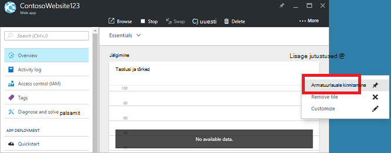

## Armatuurlaua loomine

Armatuurlaua loomine praeguse armatuurlaua nime kõrval nuppu **armatuurlaud** .  

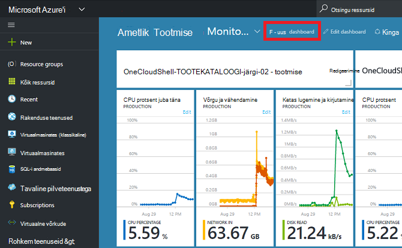

See toiming loob uue, tühja, Privaatne armatuurlaua ja asetab kohandamine režiim, kus saate armatuurlaua nime ja lisada või paane ümber korraldada.  Selles režiimis ahendatavad paani Galerii võtab üle vasakpoolses navigeerimismenüüs.  Paani galerii abil saate kiiresti leida paanid Azure ressurssidena mitmel viisil: saate sirvida [ressursirühm](../azure-resource-manager/resource-group-overview.md#resource-groups), ressursi tüüp, [sildi](../resource-group-using-tags.md)või, kui otsite oma ressursi nime järgi.  

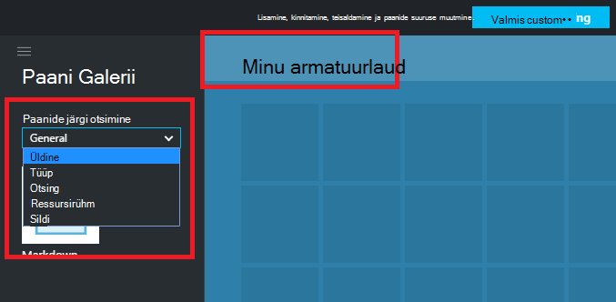

Paanide lisamine, pukseerimine peale armatuurlaua pind kuhu soovite.

Seal on uus kategooria nimega **Üldine** paanide, mis pole seotud kindla ressursi.  Selles näites me kinnitada allahindlusest paani.  Sellel paanil saate kohandatud sisu lisamine armatuurlauale.  Paani toetab lihttekstiks, [allahindlusest süntaks](https://daringfireball.net/projects/markdown/syntax)ja piiratud hulk HTML-vormingus.  (Turvalisuse huvides ei saa teha asju, mis annavad `<script>` sildid või kasutada teatud stiil CSS-i, mis võivad takistada portaali element.) 

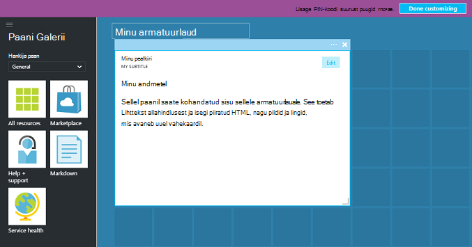

## Armatuurlaua redigeerimine

Pärast armatuurlaua loomist saate kinnitada paani Galerii või paani kujutis labad paanid. Vaatame kinnitada meie ressursirühm kujutis. Saate üksuse sirvimisel või ressursside rühma keelest kas PIN-koodi. Mõlema lähenemisel tulemuseks kinnitamine paani esituse ressursirühma.

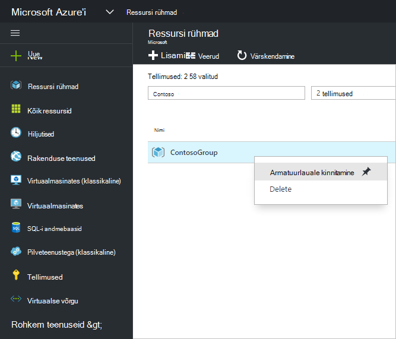

Pärast üksuse kinnitamine, kuvatakse see teie armatuurlaual.

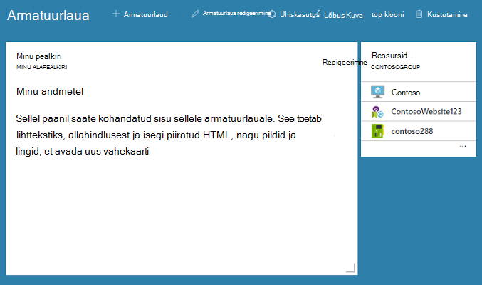

Nüüd kus oleme allahindlusest paani ja ressursirühma kinnitatud armatuurlaud, saame suurust muuta ja ümber korraldada paanid sobiv paigutus.

Libistamisel ja valides "..." või ruutu, paremklõpsates saate vaadata kõiki selle paani kontekstipõhine käske. Vaikimisi on kaks üksused.

1. **Eemalda armatuurlaualt** – eemaldab paani armatuurlaud
2.  **Kohanda** – sisestab režiimi kohandamine

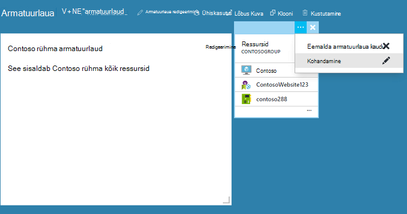

Valides kohandamine, saate suuruse muutmine ja paanide järjestust. Paani suuruse muutmiseks valige uus kontekstimenüü, nagu on näidatud järgmisel pildil.

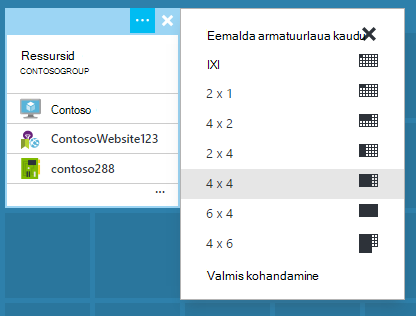

Või kui paani toetab mis tahes suurusega, saate alumises parempoolses nurgas soovitud suuruseni lohistada.

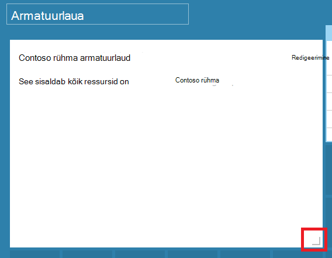

Pärast suuruse muutmise paanid, saate vaadata armatuurlaud.

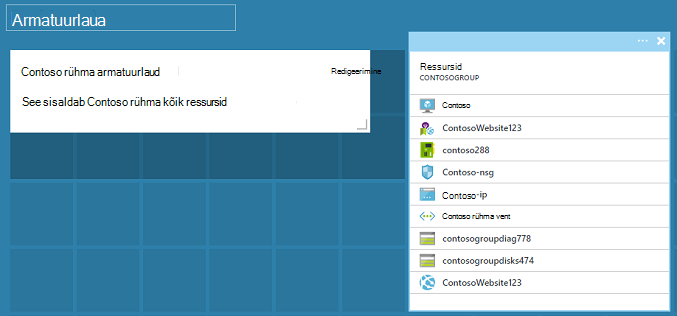

Kui olete lõpetanud kohandamise armatuurlaud, valige lihtsalt soovitud **kohandamise valmis** väljumiseks kohandamine režiimi või paremklõpsake ja valige kontekstimenüüst **kohandamise valmis** .

## Armatuurlaua avaldamine ja hallata juurdepääsu reguleerimine

Armatuurlaua loomisel on vaikimisi, mis tähendab, et te olete ainus isik, kes saavad seda vaadata privaatseks.  Teistele nähtavaks muuta, kasutada muid armatuurlaua käskude kõrval kuvatavat nuppu **Anna ühiskasutusse** .

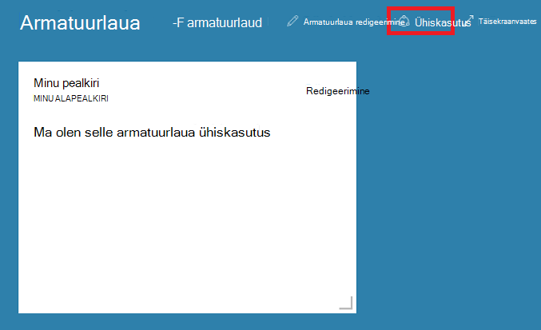

Teil palutakse valida tellimust ja ressursirühma armatuurlaua avaldada. Armatuurlaudade sujuvalt integreerida ökosüsteemi oleme rakendanud ühiskasutusega armatuurlaudade Azure ressurssidena (nii, et te ei saa ühiskasutusse anda, tippides e-posti aadress).  Enamik paanid portaalis kuvatava teabe juurdepääsu reguleerib [Azure'i Rollipõhine juurdepääsu juhtimine](../active-directory/role-based-access-control-configure.md ). Lähtudes juurdepääsu juhtimine ühiskasutusega armatuurlaudade ei erine virtuaalse masina või salvestusruumi konto.  

Oletame, et teil on Azure tellimus ja oma meeskonna liikmetele määratud rolle **omanik**, **kaasautor**või **lugeja** tellimuse.  Kasutajad, kes on omanikud ja kaasautorite on võimalik loendis, vaatamine, loomine, muutmine või kustutamine armatuurlaudade tellimuse sees.  Kasutajad, kellel on lugejad saavad loend ja vaade armatuurlauad, kuid ei saa muuta või need kustutada.  Lugeja kasutajad saavad ühiskasutusega armatuurlauale kohaliku muudatuste tegemiseks, kuid ei saa neid muudatusi serveris avaldada.  Siiski saate tegemise isikliku koopia armatuurlaua isiklikuks kasutamiseks.  Nagu alati, üksikute paanid armatuurlaual Jõusta oma Accessi kontrolli reeglid põhjal ressursse, mis vastavad.  

Mugavuse huvides portaali avaldamise kogemus juhendab teid suunas mustri kui asetate armatuurlaudade nimetatakse **armatuurlaudade**ressursirühma.  

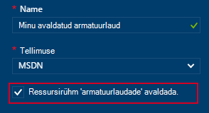

Võite ka armatuurlaua avaldamiseks kindla ressursirühma.  Juurdepääsu reguleerimine selle armatuurlaua vastab juurdepääsu reguleerimine ressursirühma.  Saate hallata selle ressursi jaotises ressursside kasutajate juurdepääs armatuurlauad.

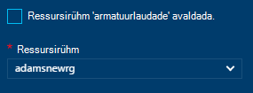

Pärast avaldamist armatuurlauale, paani **ühiskasutus + juurdepääsu** juhtimine värskendada ja kuvada teavet avaldatud armatuurlaua, sh link armatuurlaud kasutajate juurdepääsu haldamine.  See link käivitab standardset Rollipõhine juurdepääsu juhtimine toru kasutada mis tahes Azure'i ressursile juurdepääsu haldamiseks.  Saate saate alati naasta see vaade, valides **ühiskasutus**.

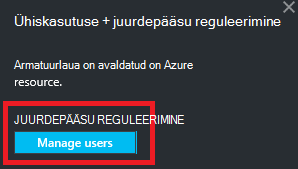

## Järgmised sammud

- Ressursid haldamise kohta leiate teemast [portaali kaudu hallata Azure ressursse](resource-group-portal.md).
- Juurutamiseks ressursse, lugege teemat [Deploy ressursid ressursihaldur mallide ja Azure portaali](../resource-group-template-deploy-portal.md).