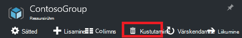

<properties 
    pageTitle="Azure'i portaali abil saate hallata Azure ressursid | Microsoft Azure'i" 
    description="Azure'i portaal ja Azure ressursside haldamine abil saate hallata oma ressursse. Näitab, kuidas töötada armatuurlaudade ressursid jälgimiseks." 
    services="azure-resource-manager,azure-portal" 
    documentationCenter="" 
    authors="tfitzmac" 
    manager="timlt" 
    editor="tysonn"/>

<tags 
    ms.service="azure-resource-manager" 
    ms.workload="multiple" 
    ms.tgt_pltfrm="na" 
    ms.devlang="na" 
    ms.topic="article" 
    ms.date="09/12/2016" 
    ms.author="tomfitz"/>

# Azure'i ressursid portaali kaudu hallata

> [AZURE.SELECTOR]
- [Azure'i PowerShelli](../powershell-azure-resource-manager.md)
- [Azure'i CLI](../xplat-cli-azure-resource-manager.md)
- [Portaal](resource-group-portal.md) 
- [REST API-GA](../resource-manager-rest-api.md)

Selles teemas kirjeldatakse, kuidas kasutada [Azure portaali](https://portal.azure.com) [Azure'i ressursihaldur](../azure-resource-manager/resource-group-overview.md) hallata oma Azure ressursse. Portaali kaudu ressursse rakendades kohta leiate teemast [Deploy ressursid ressursihaldur mallide ja Azure portaali](../resource-group-template-deploy-portal.md).

Praegu pole igal teenusel toetab portaali või ressursihaldur. Nende teenuste jaoks peate kasutama [klassikaline portaalis](https://manage.windowsazure.com). Iga teenuse olekut leiate [Azure'i portaali-saadavus diagrammi](https://azure.microsoft.com/features/azure-portal/availability/).

## Ressursi rühmade haldamiseks

1. Ressursi rühmade tellimuse vaatamiseks valige **Ressursi rühmad**.

    

1. Ka tühjad ressursikeskuse rühma loomiseks valige **Lisa**.

    

1. Sisestage nimi ja asukoht uue ressursirühma. Valige **Loo**.

    

1. Võib-olla peate valima **värskendamine** kuvamiseks vastloodud ressursirühma.

    

1. Kuvatakse teie ressursi rühma teabe kohandamiseks valige **veerud**.

    

1. Valige lisatavad veerud ja seejärel valige **Update**.

    

1. Teenuse juurutamisel oma uue ressursirühma ressursside kohta lisateabe saamiseks vt [Deploy ressursid ressursihaldur mallide ja Azure portaali](../resource-group-template-deploy-portal.md).

1. Kiireks juurdepääsuks ressursirühma, saate kinnitada tera armatuurlauale.

    

1. Armatuurlaua kuvatakse ressursirühma ja oma ressursse. Saate valida, kas ressursi rühmade või mõni oma ressursse üksusele liikumine.

    

## Sildi ressursid

Saate rakendada ressursi rühmad ja ressursside loogiliselt korraldada oma varasid sildid. Siltide töötamise kohta leiate artiklist [kasutamine siltide korraldamiseks oma Azure ressursse](../resource-group-using-tags.md).

[AZURE.INCLUDE [resource-manager-tag-resource](../../includes/resource-manager-tag-resources.md)]

## Kuvari ressursid

Kui valite ressursi, ressursside tera esitab vaikimisi diagrammid ja tabelid, jälgida selle ressursi tüüp.

1. Valige ressursi ja pange tähele jaotise **jälgimine** . See sisaldab graafikud, mis on seotud ressursside tüüp. Järgmisel pildil on kujutatud jälgida andmeid salvestusruumi konto jaoks vaikesätteid.

    

1. Saate kinnitada jaotise tera armatuurlauale, valides kolmikpunkti (…) üles jaotis. Saate kohandada suurus jaotise tera või selle täielikult eemaldada. Järgmisel pildil on kujutatud kinnitamine, kohandamine ja CPU ja mälu jaotise eemaldada.

    

1. Pärast kinnitamine jaotise armatuurlaud, näete kokkuvõttele armatuurlaual. Ja valige see kohe suunab teid andmete kohta rohkem üksikasju.

    

1. Täielikult kohandada portaali kaudu jälgida andmeid, liikuge vaikimisi armatuurlauale ja valige **armatuurlaud**.

    

1. Tippige oma uue armatuurlaua nimi ja lohistage armatuurlaua paanid. Paanid on filtreeritud erinevaid võimalusi.

    

     Töötamine armatuurlaudade kohta lisateabe saamiseks vaadake [loomine ja ühiskasutus armatuurlaudade Azure'i portaalis](azure-portal-dashboards.md).

## Ressursside haldamine

Ressursi labale näete ressursi haldamise võimalusi. Portaalis esitatud halduse valikute ressursile jaoks. Näete ülaserva ressursi tera ja vasakul küljel haldamise käske.

Järgmiste võimaluste hulgast, saate teha toiminguid nagu käivitamine ja peatamine virtuaalse masina või konfigureerimist virtuaalse masina atribuudid.

## Teisalda ressursid

Kui vajate ressursid teisaldamiseks teise ressursirühm või mõne muu tellimuse, vt [teisaldamine ressursid uue ressursirühma või tellimusele](../resource-group-move-resources.md).

## Lukusta ressursid

Saate lukustada tellimuse, ressursirühm või ressursside vältimaks teiste kasutajate kogemata kustutamise või muutmine kriitiliste ressursid ettevõttes. Lisateabe saamiseks vt [Lock ressursse Azure'i ressursihaldur](../resource-group-lock-resources.md).

[AZURE.INCLUDE [resource-manager-lock-resources](../../includes/resource-manager-lock-resources.md)]

## Saate vaadata oma tellimust ja kulud

Saate vaadata teavet oma tellimuse ja selle kulude kohta kõigi oma ressursse. Valige **tellimuste** ja see tellimus, mida soovite näha. Teil olla ainult üks tellimus valimiseks.

Sees tellimuse tera, näete kirjuta määr.

Ja jaotus kulude ressursside tüübi järgi.

## Ekspordi Mall

Pärast häälestamist ressursirühma, soovite vaadata ressursirühma ressursihaldur mall. Malli eksportimise pakub kahte eelised:

1. Saate hõlpsasti automatiseerida tulevaste juurutustes lahendus Kuna Mall sisaldab täielik infrastruktuur.

2. Võite saada tuttav malli süntaks vaadates juures on JavaScript Object märke (JSON) mis tähistab teie lahendus.

Üksikasjalikud juhised leiate teemast [Azure ressursihaldur eksportimine malli olemasoleva ressursid](../resource-manager-export-template.md).

## Ressursirühm või ressursse kustutamine

Ressursi rühma kustutamisel kustutatakse kõik sisalduvate ressursid. Saate ka kustutada üksikuid vahendeid ressursirühma. Soovite ettevaatlik ressursirühma kustutamisel, kuna muud ressursi rühmad, mis on seotud võib olla ressursid. Ressursihaldur ei kustuta lingitud ressursse, kuid need ei pruugi õigesti töötada ilma oodatud ressursid.

## Järgmised sammud

- Auditilogide vaatamiseks lugege teemat [auditi toimingud koos ressursihaldur](../resource-group-audit.md).
- Juurutamise tõrkeotsing, leiate [tõrkeotsingu ressursside rühma juurutuste Azure'i portaalis](../resource-manager-troubleshoot-deployments-portal.md).
- Juurutamine portaali kaudu, lugege teemat [Deploy ressursid ressursihaldur mallide ja Azure portaali](../resource-group-template-deploy-portal.md).
- Ressursside juurdepääsu haldamiseks vaadake teemat [kasutamine rollimääranguid juurdepääsu oma ressursse Azure tellimuse haldamiseks](../active-directory/role-based-access-control-configure.md).

