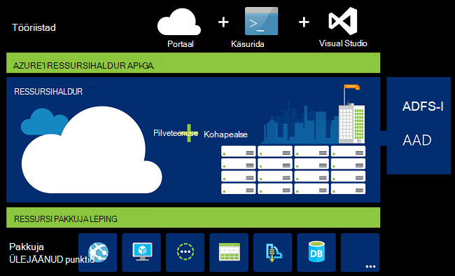
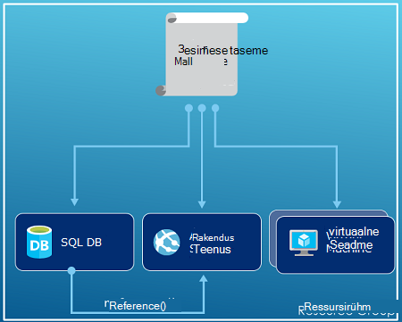
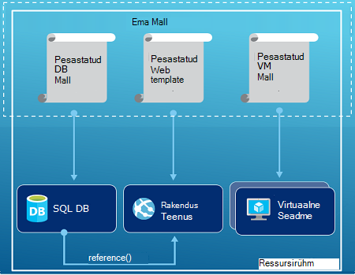
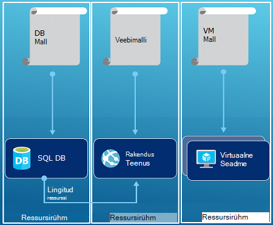

<properties
   pageTitle="Azure'i ressursihaldur ülevaade | Microsoft Azure'i"
   description="Kirjeldab, kuidas kasutada Azure ressursihaldur juurutamise, haldus ja juurdepääsu kontroll ressursside Azure."
   services="azure-resource-manager"
   documentationCenter="na"
   authors="tfitzmac"
   manager="timlt"
   editor="tysonn"/>

<tags
   ms.service="azure-resource-manager"
   ms.devlang="na"
   ms.topic="get-started-article"
   ms.tgt_pltfrm="na"
   ms.workload="na"
   ms.date="10/21/2016"
   ms.author="tomfitz"/>

# Azure'i ressursihaldur ülevaade

Tavaliselt tehakse taristu rakenduse paljude komponentide – võib-olla virtuaalse masina, salvestusruumi konto ja virtuaalse võrgu, või web appi, andmebaasi, andmebaasiserveri ja 3 tootja teenused. Te ei näe neid komponendid eraldi isikud, selle asemel kuvatakse need nii seotud ja omavahel seotud osa ühe üksuse. Soovite juurutada, hallata ja jälgida neid rühmana. Azure'i ressursihaldur võimaldab töötada ressursside kohta teie lahendus rühmana. Saate juurutada, värskendamine või kustutada kõik ressursid oma lahenduse ühe koordineeritud kasutusel. Malli kasutamine juurutamiseks ja sellel mallil saate töötada viibite, nt katsetada, lavastus ja tootmise. Ressursihaldur pakub turvalisus, auditeerimine ja funktsioone, mis aitavad teil hallata oma ressursse pärast juurutamise sildistamine. 

## Terminoloogia

Kui olete uue Azure ressursihaldur, on teatud tingimustel ei pruugi tuttav.

- **Ressursi** - mõistliku üksust, mis on saadaval Azure kaudu. Mõned levinud ressursid on virtuaalse masina, salvestusruumi konto, veebirakenduse, andmebaasi ja virtuaalse võrgu, kuid on palju muud.
- **ressursirühm** - ümbrises, mis on seotud ressursid Azure lahenduse. Ressursirühma saate kaasata kõik ressursid lahendus või ainult need ressursid, millest soovite rühmana hallata. Saate otsustada, kuidas soovite eraldada ressursid ressursside rühmadesse põhjal, mis teeb teie asutuse jaoks kõige loogilisem. Vaadake [ressursside rühmad](#resource-groups).
- **ressursi pakkuja** - teenus, mis varustab ressursse, saate juurutada ja hallata ressursihaldur kaudu. Iga ressursi pakkuja pakub toimingute juurutatud ressursside töötamiseks. Mõned levinud ressursi andmepakkujad on Microsoft.Compute, mis varustab virtuaalse masina ressurss, Microsoft.Storage, mis varustab salvestusruumi konto ressursi, ja Microsoft.Web, mis varustab ressursse, mis on seotud veebirakenduste. Lugege teemat [Ressursi pakkujad](#resource-providers).
- **Ressursihaldur malli** - A JavaScript Object märke (JSON) faili, mis määratleb ühe või mitme ressursid juurutada ressursirühma. Samuti määratletakse sõltuvuste juurutatud ressursse. Malli saab juurutada ressursside pidevalt ja korduvalt. Vt [malli juurutamise](#template-deployment).
- **deklaratiivseid süntaks** - süntaksi, mis võimaldab teil maakond "Siin on ma kavatse loomine" ilma kirjutamiseks programmeerimise jada käske luua. Ressursihaldur mall on kujutatud deklaratiivseid süntaks. Faili saate määratleda atribuutide taristu juurutada Azure. 

## Ressursihaldur kasutamise eelised

Ressursihaldur pakub mitmeid eeliseid.

- Saate juurutada, hallata ja jälgida kõik ressursid teie lahendus rühma, mitte töötlemise nende ressursside ükshaaval.
- Saate korduvalt juurutada kogu arengu elutsükli lahendus ja usaldada oma ressursid on juurutatud ühtsete olekus.
- Saate hallata oma taristu deklaratiivseid Mallid, mitte skriptide kaudu.
- Saate määratleda sõltuvuste ressursse, nii et need on juurutatud õiges järjestuses.
- Saate rakendada juurdepääsu reguleerimine kõikide teenuste oma ressursi rühma Kuna Rollipõhine juurdepääsu reguleerimine (RBAC) on algupäraselt integreeritud halduse platvormi.
- Saate rakendada siltide ressursid kõik teie tellimus ressursside loogiliselt korraldamiseks.
- Ettevõtte arved selgitama vaatamine kulude rühma ressursside ühiskasutus sama silti.  

Ressursihaldur pakub uute võimaluste juurutada ja hallata oma lahendusi. Kui kasutasite varasemas juurutamise mudeli ja soovite teada saada muudatuste kohta, lugege teemat [mõistmine ressursihaldur juurutus- ja klassikaline juurutamise](../resource-manager-deployment-model.md).

## Ühtse halduse kiht

Ressursihaldur pakub kiht järjepideva haldamise toimingute sooritamist Azure PowerShelli, Azure'i CLI, Azure portaali, REST API-ga ja arengu tööriistade kaudu. Kõigi tööriistade kasutamine levinud toimingute kogum. Saate kasutada tööriistu, mis töötavad teie jaoks kõige paremini, ja saate neid kasutada vaheldumisi ilma segadust. 

Näete järgmist pilti, kuidas kõigi tööriistade kasutamine samas Azure'i ressursihaldur API. API edastab taotlused ressursihaldur teenus, mis kontrollib ja lubab taotlused. Ressursihaldur seejärel marsruudib taotluste korral ressurss pakkujad.

## Juhised

Järgmiseid soovitusi, mis aitavad teil ära, ressursihaldur töötades oma lahendusi.

1. Ülesande määratlemine ja juurutamine oma taristu deklaratiivseid süntaks ressursihaldur malle mitte tingimata käskude kaudu.
2. Määratleda konfiguratsiooni ja juurutamise etappide malli. Peaks olema pole teie lahendus häälestamise juhised.
3. Käivitage olulistel käsud hallata oma ressursse, näiteks alustamine või lõpetamine rakenduse või seadme.
4. Sama elutsükli ressursi rühma korraldada ressursse. Kõik muud korraldamine ressursse kasutada silte.

Veel soovitusi, leiate [Azure'i ressursihaldur mallide loomise head tavad](../resource-manager-template-best-practices.md).

## Ressursi rühmad

On mõned olulised mõjutavad tegurid ressursirühma määratlemisel.

1. Kõik ressursse oma rühma peaksid sama elutsükli ühiskasutusse anda. Juurutada, värskendada ja kustutada koos. Kui üks ressurss, nt andmebaasiserveri, peab olemas eri juurutamise tsükli tuleks teise ressursirühma.
2. Iga ressursi saate eksisteerivad ainult ühte ressursirühma.
3. Saate lisada või ressursirühma ressursi igal ajal eemaldada.
4. Saate teisaldada ressursi ressursi ühest rühmast teise. Lisateavet leiate teemast [teisaldamine ressursid uue ressursirühma või tellimuse](../resource-group-move-resources.md).
4. Ressursirühma võib sisaldada ressursse, mis asuvad eri piirkondades.
5. Ressursirühma saab piiritlemiseks juurdepääsu reguleerimine haldustoimingute kohta.
6. Ressursi saab interaktiivselt kasutada muude ressursside rühmade ressursid. Selle suhtluse on kui kaks ressursid on seotud, kuid jagada sama elutsükli (nt veebirakenduste andmebaasiga ühenduse loomisel).

Luues ressursirühma, peate selle ressursi rühma asukoha. Võib tekkida, "miks ressursirühma vajab asukoht? Ja kui ressursside võib olla eri kohti, kui ressursirühma, miks ressursside rühma kohta on oluline üldse?" Ressursirühma talletab metaandmete ressursside kohta. Seetõttu, kui määrate ressursirühma asukoht, määrate metaandmete talletuskoht. Nõuetele vastavuse tagamiseks, peate veenduge, et teie andmed on salvestatud kindla ala.

## Ressursi pakkujad

Iga ressursi pakkuja pakub ressursse ja Azure teenuse töötamiseks. Näiteks, kui soovite talletada võtmed ja saladused, saate töötada **Microsoft.KeyVault** ressursi pakkuja. Selle ressursi pakkuja pakub ressursi tüüp, mida kutsutakse **hoidlateks** loomiseks olulisi hoidla, ja ressursside failitüübina **võlvid/saladused** loomise salajase võtme võlvkelder. 

Enne alustanud oma ressursse rakendades, peaks teil saada aru saadaval ressursi pakkujad. Teab ressursi pakkujad ja ressursside nimed abil saate määratleda soovite juurutada Azure ressursse.

Saate tuua kõik ressursi pakkujad järgmine PowerShelli cmdlet-käsk:

    Get-AzureRmResourceProvider -ListAvailable

Või Azure CLI, tuua kõik ressursi pakkujad järgmine käsk:

    azure provider list

Saate ressursi pakkujate, et peate kasutama tagastatud loend läbi vaadata.

Ressursi pakkuja üksikasjade saamiseks pakkuja nimeruumi oma käsk Lisa. Käsk tagastab ressursi pakkuja ja toetatud asukohad ja API versioonid iga ressursi jaoks toetatud ressursi tüübid. Järgmine PowerShelli cmdlet-käsk saab Microsoft.Compute üksikasjad:

    (Get-AzureRmResourceProvider -ProviderNamespace Microsoft.Compute).ResourceTypes

Või Azure CLI, tuua toetatud ressursi tüübid, asukohad ja API versioonide jaoks Microsoft.Compute, järgmine käsk:

    azure provider show Microsoft.Compute --json > c:\Azure\compute.json

Lisateavet leiate teemast [ressursihaldur pakkujate ning API versioonide ja skeemid](../resource-manager-supported-services.md).

## Malli juurutamine

Ressursi Manager, saate luua mall (JSON vormingus), mis määrab taristu- ja Azure lahendusse konfigureerimine. Malli abil saate korduvalt juurutada lahendus kogu elutsükli ja usaldada oma ressursid on juurutatud ühtsete olekus. Lahenduse loomisel portaalist sisaldab lahenduse juurutamise malli automaatselt. Teil pole oma malli loomine algusest peale ise luua, kuna saate alustada malli abil oma lahenduse ja seda vastavalt oma vajadustele kohandada. Saate tuua malli olemasoleva ressursi rühma eksporditava ressursirühma või kindla juurutamise jaoks kasutatava malli vaatamine. Vaatamine [eksporditud Mall](../resource-manager-export-template.md) on hea viis malli süntaksi kohta.

Mall ja kuidas saate koostada selle vormingu kohta leiate lisateavet teemast [Azure ressursihaldur mallide koostamine](../resource-group-authoring-templates.md) ja [Ressursihaldur malli tutvustust](../resource-manager-template-walkthrough.md).

Ressursihaldur töötleb nagu mis tahes muu taotluse mall (vt teemat pildi jaoks [ühtsete halduse layer](#consistent-management-layer)). Selle malli sõelub ja teisendab selle süntaksi REST API toimingute korral ressurss pakkujate. Näiteks kui ressursihaldur saab malli järgmised ressursside määratlemine:

    "resources": [
      {
        "apiVersion": "2016-01-01",
        "type": "Microsoft.Storage/storageAccounts",
        "name": "mystorageaccount",
        "location": "westus",
        "sku": {
          "name": "Standard_LRS"
        },
        "kind": "Storage",
        "properties": {
        }
      }
      ]

See muudab määratluse REST API järgmine toiming, mis saadetakse Microsoft.Storage ressursi pakkuja:

    PUT
    https://management.azure.com/subscriptions/{subscriptionId}/resourceGroups/{resourceGroupName}/providers/Microsoft.Storage/storageAccounts/mystorageaccount?api-version=2016-01-01
    REQUEST BODY
    {
      "location": "westus",
      "properties": {
      }
      "sku": {
        "name": "Standard_LRS"
      },   
      "kind": "Storage"
    }

Kui määratlete Mallid ja ressursside rühmad, on täiesti mida ja kuidas soovite hallata oma lahenduse. Näiteks saate juurutada ühe ressursirühm kolme esimese taseme rakenduse kaudu ühe malli.

Kuid teil pole oma kogu taristu määratleda ühe malli. Sageli, on mõistlik jagada oma juurutamise nõudeid suunatud, otstarve kohased mallide. Saate seda hõlpsalt eri need Mallid eri lahendusi. Kindla lahenduse juurutamiseks loote juhtslaidi Mall, mis ühendab kõik nõutavad mallid. Järgmisel pildil on kujutatud juurutamise kolme esimese taseme lahenduse ema Mall, mis sisaldab kolme pesastatud mallid.

Kui te, näevad teie astme võttes eraldi olelusring ette, saate juurutada oma kolmest tasemest eraldi ressursi rühmad. Pange tähele, et veel saate ressursside seotud ressursside muude ressursside rühmad.

Soovitusi veel mallide kujundamine, vt [mustrite kujundamiseks Azure'i ressursihaldur Mallid](../best-practices-resource-manager-design-templates.md). Pesastatud mallide kohta leiate teavet teemast [lingitud mallide Azure'i ressursihaldur kasutamine](../resource-group-linked-templates.md).

Azure'i ressursihaldur analüüsib sõltuvused tagada ressursid on loodud õiges järjestuses. Kui üks ressurss sõltub olevat väärtust teisest teise ressursi (nt virtuaalse masina vajavad salvestusruumi konto ketast), saate määrata sõltuvus. Lisateabe saamiseks vt [defineerimine sõltuvused Azure'i ressursihaldur Mallid](../resource-group-define-dependencies.md).

Malli saate kasutada ka infrastruktuuri värskendusi. Näiteks saate lisada ressursi teie lahendus ja lisada reeglid ressursid, mis on juba juurutanud. Kui malli loomine ressursi, kuid et ressursi juba olemas, teeb Azure'i ressursihaldur värskendus uue varade loomise asemel. Azure'i ressursihaldur värskendab olemasoleva vara muutmata oleks nagu uued.  

Kui vajate täiendavaid toiminguid nagu installimine teatud tarkvara, mis ei sisalda häälestamise pakub ressursihaldur laiendid stsenaariumid. Kui kasutate konfiguratsiooni halduse teenuse nagu DSC, Chef või nuku, saate jätkata selle teenuse töötamise laiendid abil. Virtuaalse masina laiendid kohta leiate teavet teemast [virtuaalse masina laiendid ja funktsioonide kohta](../virtual-machines/virtual-machines-windows-extensions-features.md). 

Lõpuks Mall muutub lähtekoodi oma rakenduse osa. Saate oma source code hoidlasse sissemöllimine ja seda värskendada oma rakenduse areneb. Saate redigeerida malli Visual Studio kaudu.

Pärast määratlemine malli, olete valmis kasutama ressursside Azure. Juurutamine ressursside kohta leiate teemast käsud:

- [Ressursside ressursihaldur mallide ja Azure PowerShelli juurutamine](../resource-group-template-deploy.md)
- [Ressursside ressursihaldur mallide ja Azure CLI juurutamine](../resource-group-template-deploy-cli.md)
- [Ressursihaldur mallide ja Azure portaali ressursse juurutamine](../resource-group-template-deploy-portal.md)
- [Ressursihaldur mallide ja ressursihaldur REST API ressursse juurutamine](../resource-group-template-deploy-rest.md)

## Sildid

Ressursihaldur pakub Suhtlussiltide funktsioon, mis võimaldab teil liigitada ressursid vastavalt oma vajadustele haldamine või arveldus. Siltide kasutamine, kui olete keerukate saidikogumi ressursi rühmad ja-ressursside ja visualiseerida vara nii, et enamik mõttekas teile vaja. Näiteks võib sildistamine ressursse, mis sarnast rolli Teeni teie asutuses või sama osakonna kuuluvad. Ilma sildid, saate oma asutuse kasutajate luua mitme ressursse, mis võib olla keeruline hiljem tuvastada ja hallata. Näiteks soovite kustutada kõik konkreetse projekti ressursid. Kui need ressursid on sildistatud pole projekti, tuleb käsitsi oleks neid lihtsam leida. Sildistamine võib olla tähtis viis teile vähendada mittevajalike hindade kohta oma tellimuse. 

Ressursid pole vaja asu sama ressursirühm sildi ühiskasutusse anda. Saate luua oma sildi taksonoomia tagamaks, et kõik teie asutuse kasutajatele kasutaks levinud siltide asemel kasutajad tahtmatult rakendamise veidi teistsugused silte (nt "osakonnas" asemel "osakond").

Järgmises näites on kujutatud rakendatud virtuaalse masina sildi.

    "resources": [    
      {
        "type": "Microsoft.Compute/virtualMachines",
        "apiVersion": "2015-06-15",
        "name": "SimpleWindowsVM",
        "location": "[resourceGroup().location]",
        "tags": {
            "costCenter": "Finance"
        },
        ...
      }
    ]

Sildi väärtus ressurssidega toomiseks kasutada järgmine PowerShelli cmdlet-käsk:

    Find-AzureRmResource -TagName costCenter -TagValue Finance

Või Azure CLI järgmine käsk:

    azure resource list -t costCenter=Finance --json

Saate vaadata ka sildistatud ressursid Azure portaali kaudu.

Tellimuse [kasutamise aruanne](../billing/billing-understand-your-bill.md) sisaldab sildi nimed ning väärtused, mis võimaldab teil leheküljepiiri maksab, sildid. Siltide kohta leiate lisateavet teemast [kasutamine siltide korraldamiseks oma Azure ressursse](../resource-group-using-tags.md).

## Juurdepääsu reguleerimine

Ressursihaldur võimaldab kontrollida, kellel on juurdepääs teie asutuse jaoks teatud toiminguid. Algupäraselt ühendab Rollipõhine juurdepääsu reguleerimine (RBAC) halduse platvormi ja selle juurdepääsu reguleerimine kehtib kõiki teenuseid ressursirühma. 

On kaks peamist põhimõtet mõista töötamisel Rollipõhine juurdepääsu reguleerimine.

- Roll määratlused - kirjeldatakse õiguste kogumi ning saab kasutada paljude ülesanded.
- Rollimäärangud - seostada mõne kindla ulatuse (tellimuse, ressursirühm või ressursside) määratlus identiteediga (kasutaja või rühma). Ülesande pärivad madalama otsinguulatuste.

Kasutajaid saate lisada eelmääratletud platvormi ja ressursside kohased rollid. Näiteks saate ära eelmääratletud rolli nimetatakse lugeja, mis võimaldab kasutajatel vaadata ressursid, kuid need ei muutu. Kasutajate lisamine ettevõttes, mida on vaja seda tüüpi Accessi lugeja rollile ja rakendada see tellimus, ressursirühm või ressursside roll.

Azure'i pakub nelja platvormi järgmised rollid.

1.  Omaniku - saate kõike, kaasa arvatud juurdepääsu haldamine
2.  Kaasautor – saate hallata kõike, kuid juurdepääs
3.  Lugeja – saate vaadata kõike, kuid ei saa muuta
4.  Kasutaja juurdepääs administraator – saate hallata kasutajate juurdepääsu Azure ressursid

Azure'i pakub mitmeid ressursi kohased rollid. Mõned levinud on:

1.  Virtuaalse masina kaasautor – saate hallata virtuaalmasinates, kuid ei anna neile juurde ja ei saa hallata virtuaalse võrgu või salvestusruumi kontoga on ühendatud
2.  Võrgu kaasautor - haldamine kõigi võrgu ressursse, kuid ei anna neile juurdepääsu
3.  Salvestusruumi konto kaasautor - Halda salvestusruumi kontod, kuid ei anna neile juurdepääsu
4. SQL serveriga kaasautor – saate hallata SQL-i serverite ja andmebaaside, kuid mitte turvalisusega seotud poliitika
5. Veebisaidi kaasautor – saate hallata veebisaite, kuid mitte web lepingud on ühendatud

Rollid ja lubatud toimingute täieliku loendi leiate teemast [RBAC: sisseehitatud rollid](../active-directory/role-based-access-built-in-roles.md). Rollipõhine juurdepääsu reguleerimine kohta leiate lisateavet teemast [Azure Rollipõhine juurdepääsu reguleerimine](../active-directory/role-based-access-control-configure.md). 

Mõnel juhul, mida soovite käivitada koodi või skripti, mis kasutab ressursse, kuid te ei soovi käivituma kasutaja mandaat. Selle asemel soovite luua nimega teenuse põhisumma rakenduse identiteedi ja määrata põhisumma teenuse jaoks sobiv roll. Ressursihaldur võimaldab teil luua rakenduse mandaat ja programmiliselt autentida rakendus. Teenuse põhisumma loomise kohta leiate lisateavet leiate järgmistest teemadest.

- [Azure'i PowerShelli abil saate luua teenuse põhilise juurdepääs ressurssidele](../resource-group-authenticate-service-principal.md)
- [Azure'i CLI abil saate luua teenuse põhilise juurdepääs ressurssidele](../resource-group-authenticate-service-principal-cli.md)
- [Portaali abil saate luua Active Directory rakenduse ja teenuse põhilise, millele pääsete juurde ressursid](../resource-group-create-service-principal-portal.md)

Saate vältida kasutajate kustutamine või nende muutmine kriitiliste ressursse eraldi ka lukustada. Lisateavet leiate teemast [Lock ressursse Azure'i ressursihaldur](../resource-group-lock-resources.md).

## Logid

Ressursihaldur logib kõik toimingud, et luua, muuta või kustutada ressurss. Saate logid leidmiseks tõrge, kui tõrkeotsingu või jälgida, kuidas muuta oma asutuse kasutaja ressursi. Logide vaatamiseks valige **logid** **sätted** tera ressursirühma. Saate filtreerida logid palju erinevaid väärtusi, sh, mille kasutaja algatatud toiming. Logid töötamise kohta leiate teavet teemast [auditilogi toimingute abil ressursihaldur](../resource-group-audit.md).

## Kohandatud poliitika

Ressursihaldur võimaldab teil luua kohandatud poliitikate haldamise teie ressursse. Tüüpi poliitikate loomist saate kaasata mitmesuguse stsenaariumid. Saate jõustada nimereeglistik ressursse, piiratud, millist tüüpi ja esinemisjuhtu ressursside saab kasutada või piirkonnad majutada mõnda tüüpi ressursside limiit. Saate nõuda sildi väärtus korraldamiseks arveldamine osakondade ressursse. Saate luua poliitikate abil vähendada ja järjepidevuse teie tellimus. 

Määratleda JSON poliitika ja seejärel rakendage neile kas teie tellimus üle või ressursirühma. Poliitika on erinevas Rollipõhine juurdepääsu reguleerimine, kuna need on rakendatud ressursi tüübid.

Järgmises näites on kujutatud poliitika, mis on kõik ressursid costCenter sildi määramisega sildi kooskõlas.

    {
      "if": {
        "not" : {
          "field" : "tags",
          "containsKey" : "costCenter"
        }
      },
      "then" : {
        "effect" : "deny"
      }
    }

On veel mitmesuguseid poliitikaid, saate luua. Lisateabe saamiseks vt [Kasutamine poliitika haldamine ressursid ja reguleerida juurdepääsu](../resource-manager-policy.md).

## SDK-d

Azure'i SDK-d on saadaval mitme keele ja platvormid.
Iga keele need rakendused on saadaval ökosüsteemi paketi manager ja GitHub kaudu.

Azure'i rahulik API tehnilised andmed luuakse koodi iga nende SDK-d.
Need kirjeldused on avatud allikas ja põhjal ärplema 2.0 määratlus.
SDK kood luuakse kaudu avatud lähtekoodi projekti, mis nimetatakse AutoRest.
AutoRest muudab need rahulik API kirjeldused kliendi teekidesse mitmes keeles.
Kui soovite mis tahes aspektide SDK-d on loodud koodi parandamiseks, tööriistad on SDK-sid luua terve kogumi on avatud, vabalt saadaval ja ulatuslikult vastuvõetud API määratlus vormingu põhjal.

Siin on meie avatud Source SDK hoidlate. Me Tere tagasiside, probleemide ja tõmmake taotlused.

[.NET](https://github.com/Azure/azure-sdk-for-net) | [Java](https://github.com/Azure/azure-sdk-for-java) | [Node.js](https://github.com/Azure/azure-sdk-for-node) | [PHP](https://github.com/Azure/azure-sdk-for-php) | [Python](https://github.com/Azure/azure-sdk-for-python) | [Ruby](https://github.com/Azure/azure-sdk-ruby)

> [AZURE.NOTE]Kui SDK ei paku vajalikke funktsioone, saate ka helistada [Azure'i REST API](https://msdn.microsoft.com/library/azure/dn790568.aspx) otse.

## Näidised

### .NET-I

- [Azure'i ressursid ja ressursside rühmade haldamine](https://azure.microsoft.com/documentation/samples/resource-manager-dotnet-resources-and-groups/)
- [Juurutamine on SSH lubatud VM malli abil](https://azure.microsoft.com/documentation/samples/resource-manager-dotnet-template-deployment/)

### Java

- [Azure'i ressursside haldamine](https://azure.microsoft.com/documentation/samples/resources-java-manage-resource/)
- [Azure'i ressursi rühmade haldamiseks](https://azure.microsoft.com/documentation/samples/resources-java-manage-resource-group/)
- [Juurutamine on SSH lubatud VM malli abil](https://azure.microsoft.com/documentation/samples/resources-java-deploy-using-arm-template/)

### Node.js

- [Azure'i ressursse ja ressursside rühmade haldamine](https://azure.microsoft.com/documentation/samples/resource-manager-node-resources-and-groups/)
- [Juurutamine on SSH lubatud VM malli abil](https://azure.microsoft.com/documentation/samples/resource-manager-node-template-deployment/)

### Python

- [Azure'i ressursid ja ressursside rühmade haldamine](https://azure.microsoft.com/documentation/samples/resource-manager-python-resources-and-groups/)
- [Juurutamine on SSH lubatud VM malli abil](https://azure.microsoft.com/documentation/samples/resource-manager-python-template-deployment/)

### Ruby

- [Azure'i ressursid ja ressursside rühmade haldamine](https://azure.microsoft.com/documentation/samples/resource-manager-ruby-resources-and-groups/)
- [Juurutada mõne SSH lubatud VM malli abil](https://azure.microsoft.com/documentation/samples/resource-manager-ruby-template-deployment/)

Lisaks need näidised, saate otsida näidised Galerii kaudu.

[.NET](https://azure.microsoft.com/documentation/samples/?service=azure-resource-manager&platform=dotnet) | [Java](https://azure.microsoft.com/documentation/samples/?service=azure-resource-manager&platform=java) | [Node.js](https://azure.microsoft.com/documentation/samples/?service=azure-resource-manager&platform=nodejs) | [Python](https://azure.microsoft.com/documentation/samples/?service=azure-resource-manager&platform=python) | [Ruby](https://azure.microsoft.com/documentation/samples/?service=azure-resource-manager&platform=ruby)

## Järgmised sammud

- Antud Sissejuhatus töötamine Mallid, leiate teemast [eksportida mõne olemasoleva ressursse Azure'i ressursihaldur malli](../resource-manager-export-template.md).
- Põhjalikumat ülevaadet malli loomine, vaadake [Ressursihaldur malli tutvustust](../resource-manager-template-walkthrough.md).
- Malli saate kasutada funktsioone, vt [malli funktsioonid](../resource-group-template-functions.md)
- Visual Studio abil ressursihaldur kasutamise kohta leiate artiklist [loomine ja juurutamine Azure ressursi rühma Visual Studio kaudu](../vs-azure-tools-resource-groups-deployment-projects-create-deploy.md).
- VS koodi ressursihaldur koos kasutamise kohta leiate teemast [Azure ressursihaldur Mallid Visual Studio kood töötamine](../resource-manager-vs-code.md).

Siit leiate ülevaate tutvustava video:

[AZURE.VIDEO azure-resource-manager-overview]

[powershellref]: https://msdn.microsoft.com/library/azure/dn757692(v=azure.200).aspx
