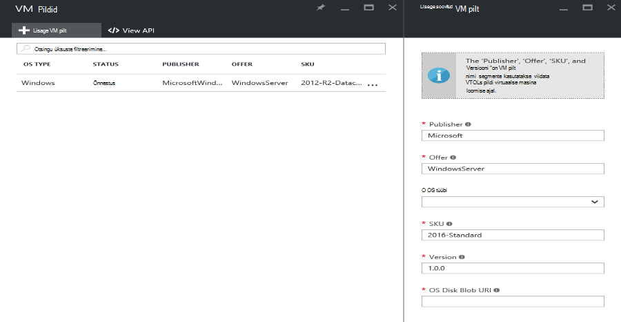

<properties
    pageTitle="Azure'i virnas VM pildi lisamine | Microsoft Azure'i"
    description="Ettevõtte kohandatud Windows või Linux VM pilt rentnike kasutada lisamine"
    services="azure-stack"
    documentationCenter=""
    authors="mattmcg"
    manager="darmour"
    editor=""/>

<tags
    ms.service="azure-stack"
    ms.workload="na"
    ms.tgt_pltfrm="na"
    ms.devlang="na"
    ms.topic="get-started-article"
    ms.date="09/26/2016"
    ms.author="mattmcg"/>

# <a name="make-a-custom-virtual-machine-image-available-in-azure-stack"></a>Azure'i virnas kättesaadavaks kohandatud virtuaalse masina pilt


Azure'i Virnlintdiagrammil abil VM pilte, näiteks oma ettevõtte kohandatud VHD, nende rentnike jaoks kättesaadavaks teha. Pilte saate viidatud Azure'i ressursihaldur mallid või lisatud Azure'i turuplatsi UI turuplatsi üksuse loomine. Windows Server 2012 R2 pilt sisaldab vaikimisi Azure'i virnas tehnilise eelvaate.

> [AZURE.NOTE] Valige **Uus** UI, ning seejärel valides **Virtuaalmasinates** kategooria saab kasutada VM piltide turuplats üksustega. VM pilt on loetletud.


## <a name="add-a-vm-image-to-marketplace-with-powershell"></a>Turuplatsi PowerShelliga VM pildi lisamine

Kui VM pilt VHD on saadaval kohalikult konsooli VM (või mõnda muud väliselt ühendatud seadet), siis tehke järgmist:

1. Opsüsteemi Windows või Linux kettaruumi pilti VHD vormingus (mitte VHDX) ettevalmistamine.
    -   Windowsi pilte, [üles laadida pildi Windows VM Azure'i ressursihaldur juurutuste](virtual-machines-windows-upload-image.md) artikkel sisaldab pildi ettevalmistamine juhiseid jaotises **ettevalmistamine VHD üles laadida** .
    -   Linux pilte, järgige valmistada pilt või kasutage Azure'i virnas Linux olemasoleva pildi [juurutamine Linux virtuaalmasinates klõpsake Azure virnas](azure-stack-linux.md)artiklis kirjeldatud juhiseid.

2. [Azure'i virnas tööriistade hoidla](https://aka.ms/azurestackaddvmimage)klooni, ja importige **ComputeAdmin** mooduli

    ```powershell
    Import-Module .\ComputeAdmin\AzureStack.ComputeAdmin.psm1
    ```

3. Cmdlet-käsu Lisa-VMImage dokumentidega VM pildi lisada.
    -  Sisaldavad Publisheri, pakkumine, SKU ja versioon VM pilt. Neid parameetreid kasutatakse Azure ressursihaldur Mallid, mis viitavad VM pilt.
    -  Saate määrata Windowsi või Linuxi osType.
    -  Kaasata oma Azure Active Directory rentniku ID vormil * &lt;myaadtenant&gt;*. onmicrosoft.com.
    - Järgmine on näide kutsumise skripti:

    ```powershell
       Add-VMImage -publisher "Canonical" -offer "UbuntuServer" -sku "14.04.3-LTS" -version "1.0.0" -osType Linux -osDiskLocalPath 'C:\Users\AzureStackAdmin\Desktop\UbuntuServer.vhd' -tenantID <myaadtenant>.onmicrosoft.com
    ```

    > [AZURE.NOTE] Cmdlet taotleb mandaat VM pildi lisamine. Sisestage administraatori Azure Active Directory mandaat, näiteks serviceadmin@ * &lt;myaadtenant&gt;*. onmicrosoft.com küsimuse.  

Käsk teeb järgmist.
- Azure'i virnas keskkonnas autendib
- Lisatud kohaliku VHD vastloodud ajutine salvestusruumi konto
- Lisab VM pilt hoidlasse VM pilt
- Loob üksuse turuplats

Veenduge, et käsu käivitus edukalt, minge portaali turuplats ja seejärel veenduge, et VM pilt on saadaval **Virtuaalmasinates** kategooria.

> 

Järgmine on käsk parameetrite kirjeldus.


| Parameetri | Kirjeldus |
|----------| ------------ |
|**tenantID** | Oma Azure Active Directory rentniku ID vorm * &lt;AADTenantID*. onmicrosoft.com&gt;. |
|**Publisheri** | Publisheri nimi lõigust VM pilt, mis rentnikukontodele kasutamine juurutamisel pilt. Näide on "Microsoft". Ärge lisage tühiku ega muid erimärke väli.|
|**pakkumine** | Pakkumise nimi lõigust VM pilt, mis rentnikukontodele kasutamine juurutamisel VM pilt. Näide on "WindowsServer". Ärge lisage tühiku ega muid erimärke väli. |
| **SKU-ga** | SKU nimi lõigust VM pilt, mis rentnikukontodele kasutamine juurutamisel VM pilt. Näide on "Datacenter2016". Ärge lisage tühiku ega muid erimärke väli. |
|**versioon** | Versiooni VM pilt, mis rentnikukontodele kasutamine juurutamisel VM pilt. See versioon on vormingus * \#.\#. \#*. Näide on "1.0.0". Ärge lisage tühiku ega muid erimärke väli.|
| **osType** | Pildi osType peab olema "Windows" või "Linux". |
|**osDiskLocalPath** | Kohalik tee OS kettale VHD, mida soovite virnas Azure'i VM pildina üleslaadimiseks. |
|**dataDiskLocalPaths**| Valikuline massiivi andmete ketast VM pilt osana üleslaaditud kohaliku liikumisteid.|
|**CreateGalleryItem**| Kahendmuutujaga lipu, mis määrab, kas soovite luua üksuse turuplatsil. Vaikimisi on seatud väärtusele tõene.|
|**pealkiri**| Turuplatsi üksuse kuvatav nimi. Vaikimisi on seatud Publisher-pakkumine Sku VM pildi lisada.|
|**kirjeldus**| Turuplatsi üksuse kirjeldus. |
|**osDiskBlobURI**| Soovi korral võite seda skripti aktsepteerib tavalise nimetusega osDisk bloobimälu URI.|
|**dataDiskBlobURIs**| Soovi korral võite seda skripti aktsepteerib ka massiivi bloobimälu URI-d andmete ketast pildi lisamine.|


## <a name="add-a-vm-image-through-the-portal"></a>Lisage VM pilt portaali kaudu

> [AZURE.NOTE] See meetod nõuab eraldi turuplatsi üksuse loomisel.

Ühe nõue pildid on, nad saavad viidatud bloobimälu URI. Opsüsteemi Windows või Linux kettaruumi pilti VHD vormingus (mitte VHDX) ettevalmistamine ja laadige salvestusruumi konto Azure või Azure virnas pilt. Kui pilt on juba Azure-või Virnlintdiagrammil Azure'i bloobimälu üles laaditud, võite selle sammu vahele jätta.

Järgige **konto salvestusruumi VM pildi üleslaadimine**etappi kaudu [üles laadida pildi Windows VM Azure'i ressursihaldur juurutuste](https://azure.microsoft.com/documentation/articles/virtual-machines-windows-upload-image/) artiklist. Pidage meeles järgmist:

-   Linux pildi, järgige juhiseid, et valmistada pilt või kasutada Azure virnas Linux olemasoleva pildi [juurutamine Linux virtuaalmasinates klõpsake Azure virnas](azure-stack-linux.md)artiklis kirjeldatud.

- See on tõhusam üles laadida pildi Azure virnas bloobimälu kui Azure'i bloobimälu, kuna push VM pilt hoidlasse Azure'i virnas pilt vähem aega kulub. Laadi juhiseid järgides veenduge, et asendada 'Sisselogimine Azure' samm [Autentida PowerShelli abil Microsoft Azure'i virnas](azure-stack-deploy-template-powershell.md) etappi.

- Kirjutage bloobimälu URI, kuhu üles laadida pildi. See on järgmises vormingus: * &lt;storageAccount&gt;/&lt;blobContainer&gt;/&lt;targetVHDName&gt;*.vhd

2.  Funktsiooni bloobimälu anonüümselt hõlbustamine, minge salvestusruumi konto bloobimälu ümbris, kus VM pilt VHD üles laaditud **bloobimälu,** et ja valige **Juurdepääsu poliitika**. Kui soovite, saate selle asemel ümbris ühiskasutusega juurdepääsu signatuuri luua ja lisada see osa bloobimälu URI.


1.  Logige sisse Azure'i virnas administraatorina. Avage **piirkonna haldus**. Märkige jaotises **RPs** **Arvutada ressursi pakkuja** > **VM pildid** > **Lisa**

    

2.  Sisestage järgmine enne Publisheri, pakkumine, SKU ja versiooni VM pilt. Nende nimi segmente viidata VM pildi Azure'i ressursihaldur mallid. Veenduge, et valida **osType** õigesti. Sisestage **osDiskBlobURI**, kui pilt on üles laaditud URI juhises 1. Klõpsake nuppu **Loo** VM pilt loomise alustamiseks.

    

3.  VM pilt olekuks "Õnnestus" kui pilt on lisatud.

4.  Rentnike jaoks saate juurutada VM pilt, määrates Azure'i ressursihaldur mallis Publisheri, pakkumine, SKU ja versiooni VM pilt. Kättesaadavaks VM pilt kergemini rentniku ettenähtud UI, on kõige parem viis [turuplats üksuse loomine](azure-stack-create-and-publish-marketplace-item.md).
