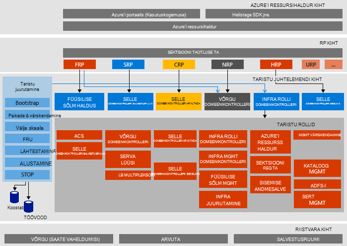

<properties
    pageTitle="Microsoft Azure'i virnas tõendada, kontseptsiooni (POC) arhitektuur | Microsoft Azure'i"
    description="Saate vaadata Microsoft Azure'i virnas POC arhitektuur."
    services="azure-stack"
    documentationCenter=""
    authors="heathl17"
    manager="byronr"
    editor=""/>

<tags
    ms.service="azure-stack"
    ms.workload="na"
    ms.tgt_pltfrm="na"
    ms.devlang="na"
    ms.topic="article"
    ms.date="10/25/2016"
    ms.author="helaw"/>

# Microsoft Azure'i virnas POC arhitektuur

Azure'i virnas POC on üks sõlme juurutamise Azure'i virnas Technical Preview 2. Kõik komponendid on virtuaalmasinates töötab ühe host arvutisse installitud. 

## Loogika arhitektuur skeem
Järgmine diagramm näitab Azure'i virnas POC ja selle osade loogiline arhitektuur.

## Virtuaalse masina rollid
Azure'i virnas POC pakub teenuseid kasutades järgmised VMs POC hosti:

 - **MAS-ACS01** Virtuaalne kohapeal majutusteenuste Azure'i virnas salvestusruumi.

 - **MAS-ADFS01** Virtuaalse masina majutusteenuse Active Directory Federation Services.  Selle virtuaalse masina ei kasutata Technical Preview 2.  

 - **MAS-ASQL01**  Virtuaalse masina on sisemine andmete talletamine Azure'i virnas taristu rollid.  

 - **MAS-BGPNAT01** Virtuaalse masina toimides serva ruuteri NAT ja VPN võimaluste leiate Azure'i virnas.

 - **MAS-CA01** Virtuaalse masina serdi asutuse teenuste Azure'i virnas rolli teenuste jaoks.

 - **MAS-CON01** Virtuaalse masina arendajatele PowerShelli, Visual Studio ja muid tööriistu.

 - **MAS-DC01** Virtuaalse masina majutusteenuse virnas Microsoft Azure Active Directory ja DNS-i DHCP teenused.

 - **MAS-GWY01** Virtuaalse masina pakkuvad serva lüüsi VPN-saidilt ühendused rentniku võrkudes, nt.

 - **MAS-NC01**  Virtuaalse masina majutusteenuse võrgu domeenikontrolleri, kes haldab Azure'i virnas võrguteenuste.  

 - **MAS-SLB01**  Virtuaalse masina pakub laadi tasakaalustamiseks teenuste Azure'i virnas rentnikud-ja Azure virnas taristu teenused.  

 - **MAS-SUS01**  Virtuaalne hosting Windows Server Update Services, ja vastutab muude virnas Azure'i virtuaalmasinates värskendused.

 - **MAS-WAS01**  Virtuaalse masina majutusteenuse portaali ja Azure ressursihaldur teenused.

 - **MAS-XRP01** Virtuaalne core ressursi pakkujad Microsoft Azure'i virnas, sh Arvuta, võrgu ja salvestusruumi ressursi pakkujad hostiva masina.

## Salvestusruumi teenused
Salvestusruumi teenused füüsilise hosti operatsioonisüsteem on järgmised.

 - **Teenuse ACS bloobimälu** Azure'i ühtsete salvestusruumi bloobimälu teenus, mis pakub bloobimälu ja tabeli salvestusruumi.

 - **SoFS** Skaala-out faili Server.

 - **ReFS CSV** Olles faili süsteemi kobar jagatud maht.

 - **Virtuaalne ketas**, **Salvestusruumi**ja **Salvestusruumi tühikuid otsese** on aluseks oleva vastava salvestusruumi tehnoloogia Windows Server Microsoft Azure'i virnas core salvestusruumi ressursi pakkuja lubamiseks.

## Järgmised sammud

[Azure'i Virnlintdiagrammil juurutamine](azure-stack-deploy.md)

[Esimese stsenaariumid proovimiseks](azure-stack-first-scenarios.md)

