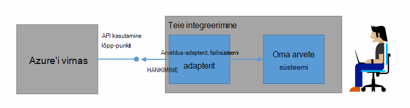
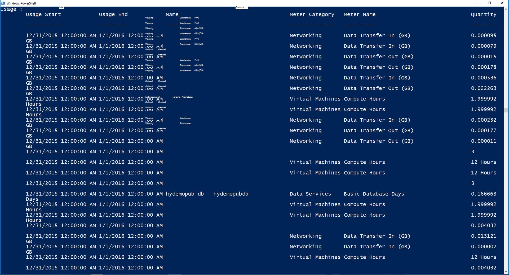

<properties
    pageTitle="Kliendi arveldus- ja Azure virnas tagasinõude | Microsoft Azure'i"
    description="Saate teada, kuidas Azure'i virnas ressursi kasutamine teabe toomiseks."
    services="azure-stack"
    documentationCenter=""
    authors="AlfredoPizzirani"
    manager="byronr"
    editor=""/>

<tags
    ms.service="azure-stack"
    ms.workload="na"
    ms.tgt_pltfrm="na"
    ms.devlang="na"
    ms.topic="article"
    ms.date="10/18/2016"
    ms.author="alfredop"/>

# Kliendi arve ja tagasinõude Azure'i virnas

Nüüd, kui kasutate Azure virnas, on mõistlik mõelda, kuidas jälgida kasutust. Teenuse pakkujad toetuvad bill oma klientidele ja mõista andmiseks teenuste kasutusteavet.
Ettevõtted, ka tavaliselt jälgida kasutust osakonna.

Azure'i virnas pole arvete süsteem. See ei tasu oma rentnikke ressursside nad kasutavad. Kuid Azure'i virnas on taristu koguda ja liitmine kasutusandmete iga ressurss pakkuja. Saate andmetele juurdepääsuks ja eksportimine arvete süsteemi abil arvelduse adapterit või eksportimine business intelligence tööriista nagu Microsoft Power BI.

## Millist kasutus teavet leida, ja kuidas?

Azure'i virnas ressursi pakkujad luua kasutus kirjete iga tunni järel. Kirjete kuvamine iga ressurss, mis oli tarbitud ja milline tellimus tarbitud ressursi summa. Andmed on salvestatud. Pääsete andmetele REST API kaudu.

Teenuse administraator saab tuua kasutusandmete kõigi rentniku tellimuste. Üksikute rentnike jaoks saate alla laadida ainult enda teabele.

Kasutuse kirjed on teavet salvestusruumi, võrgu ja Arvuta kasutus. Loendi meetrit, lugege [artiklit](azure-stack-usage-related-faq.md).

## Saate tuua kasutamise kohta

Kirjete loomiseks on oluline, et teil on ressursid ja aktiivselt kasutades süsteem. Kui te pole kindel, kas teil on opsüsteemi ressursse, Azure'i virnas turuplatsil juurutada, käivitage virtuaalse masina (VM). Ülevaade VM jälgimise blade veendumaks, et see töötab.

Soovitame, et käivitada Windows PowerShelli cmdlet-käskude kasutamine andmete kuvamiseks.
PowerShelli kõned ressursi kasutamine API-d.

1.  [Installida ja konfigureerida Azure PowerShelli](https://azure.microsoft.com/en-us/documentation/articles/powershell-install-configure/).

2.  Azure'i ressursihaldur sisse logida, kasutage PowerShelli cmdlet-käsk **Logi sisse – AzureRmAccount**.

3.  Valige tellimus, mida kasutasite ressursid loomiseks, tippige **Get-AzureRmSubscription – SubscriptionName "sub" | Valige-AzureRmSubscription**.

4.  Andmete toomiseks kasutada PowerShelli cmdlet-käsk [**Get-UsageAggregates**](https://msdn.microsoft.com/en-us/library/mt619285.aspx).
    Kui kasutusandmete on saadaval, tagastatakse PowerShellis, nagu järgmises näites. PowerShelli tagastab 1000 tekstiridade kasutus kõne kohta.
    Argument *jätku* abil saate tuua esimese 1000 väljaspool ridade kogumit. Andmete kasutamise kohta leiate lisateavet teemast [Ressursi kasutamine API viide](azure-stack-provider-resource-api.md).

    

## Järgmised sammud

[Pakkuja ressursikasutus API](azure-stack-provider-resource-api.md)

[Rentniku ressursikasutus API](azure-stack-tenant-resource-usage-api.md)

[Kasutus-seotud KKK](azure-stack-usage-related-faq.md)
