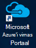
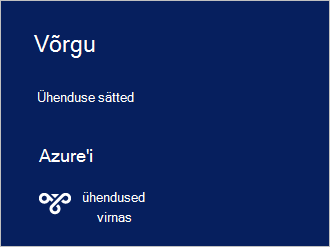

<properties
    pageTitle="Ühenduse loomine Azure virnas | Microsoft Azure'i"
    description="Saate teada, kuidas ühendada Azure'i virnas"
    services="azure-stack"
    documentationCenter=""
    authors="ErikjeMS"
    manager="byronr"
    editor=""/>

<tags
    ms.service="azure-stack"
    ms.workload="na"
    ms.tgt_pltfrm="na"
    ms.devlang="na"
    ms.topic="get-started-article"
    ms.date="10/18/2016"
    ms.author="erikje"/>

# <a name="connect-to-azure-stack"></a>Ühenduse loomine Azure virnas
Hallata ressursse, peab ühenduse Azure'i virnas POC arvuti. Saate teha ühte järgmistest suvanditest ühendus.

 - Kaugtöölaua: võimaldab kiiresti ühendust arvutist POC samaaegseid Üksikkasutaja.
 - Virtuaalse privaatvõrgu (VPN): võimaldab mitme samaaegne Kasutajad ühenduse kliendid väljaspool Azure'i virnas infrastruktuuri (nõuab konfigureerimine).

## <a name="connect-with-remote-desktop"></a>Kaugtöölaua kasutajaga
Kaugtöölaua ühendus, saate töötada samaaegseid üksikkasutaja portaalis haldamiseks ressursse. Samuti saate tööriistad MAS-CON01 virtual arvutisse.

1.  Azure'i virnas POC füüsilise arvutisse sisse logida.

2.  Avage kaugtöölaua klient ja MAS-CON01 ühendada. Sisestage kasutajanimi ja haldus parool sisestatud Azure'i virnas häälestamise ajal **AzureStack\AzureStackAdmin** .  

3.  Topeltklõpsake töölaual MAS-CON01 [portaali](azure-stack-key-features.md#portal)avamiseks **Microsoft Azure virnas portaali** ikooni (https://portal.azurestack.local/).

    

4.  Logige sisse määratud installimise ajal Azure Active Directory mandaadi abil.

## <a name="connect-with-vpn"></a>VPN-i abil ühendamine
Virtuaalse Privaatvõrgu ühenduste kasutajatel mitme samaaegseid ühenduse kliendid Azure'i virnas taristu väljaspool. Portaali abil saate hallata tundlike. Tööriistad, nt Visual Studio ja PowerShelli, saate kasutada ka teie kohalikku klientarvutisse.

1.  Installige AzureRM mooduli abil järgmine käsk:
   
    ```PowerShell
    Install-Module -Name AzureRm -RequiredVersion 1.2.6 -Scope CurrentUser
    ```   
   
2. Azure'i virnas tööriistad skriptide allalaadimiseks.  Tugiteenustele sirvides [GitHub hoidla](https://github.com/Azure/AzureStack-Tools)või töötab järgmine Windows PowerShelli skripti administraatorina saate alla laadida faile:
    
    >[AZURE.NOTE]  Järgmised toimingud on vaja PowerShelli 5.0.  Kontrollige oma versiooni, käivitage $PSVersionTable.PSVersion ja võrdlus "põhiversioon".  

    ```PowerShell
       
       #Download the tools archive
       invoke-webrequest https://github.com/Azure/AzureStack-Tools/archive/master.zip -OutFile master.zip

       #Expand the downloaded files. 
       expand-archive master.zip -DestinationPath . -Force

       #Change to the tools directory
       cd AzureStack-Tools-master
    ````

3.  Seansi jooksul PowerShelli liikuge kausta, **ühendamine** ja AzureStack.Connect.psm1 mooduli importimine.

    ```PowerShell
    cd Connect
    import-module .\AzureStack.Connect.psm1
    ```

4.  Azure'i virnas VPN-ühendus, käivitage järgmine Windows PowerShelli. Enne töötab, asustades administraatori parooli ja Azure virnas host aadressiväljadega. 
    
    ```PowerShell
    #Change the IP Address below to match your Azure Stack host
    $hostIP = "<HostIP>"

    # Change password below to reference the password provided for administrator during Azure Stack installation
    $Password = ConvertTo-SecureString "<Admin Password>" -AsPlainText -Force

    # Add Azure Stack One Node host & CA to the trusted hosts on your client computer
    Set-Item wsman:\localhost\Client\TrustedHosts -Value $hostIP -Concatenate
    Set-Item wsman:\localhost\Client\TrustedHosts -Value mas-ca01.azurestack.local -Concatenate  

    # Update Azure Stack host address to be the IP Address of the Azure Stack POC Host
    $natIp = Get-AzureStackNatServerAddress -HostComputer $hostIP -Password $Password

    # Create VPN connection entry for the current user
    Add-AzureStackVpnConnection -ServerAddress $natIp -Password $Password

    # Connect to the Azure Stack instance. This command (or the GUI steps in step 5) can be used to reconnect
    Connect-AzureStackVpn -Password $Password 
    ```

5. Vastava viiba kuvamisel usalda Azure'i virnas host.

6. Küsimise korral installige sert (PowerShelli seansi akna taga kuvatakse viip).

7. Interneti-brauseri portaali ühenduse testimiseks Avage *https://portal.azurestack.local*.

8. **Läbi vaadata ja hallata Azure virnas ühendus, abil oma klienti:**

    

>[AZURE.NOTE] VPN-ühendus ei paku ühenduvuse VMs või muud ressursid. Ühenduvus ressursside kohta leiate teavet teemast [Ühe sõlm VPN-ühendus](azure-stack-create-vpn-connection-one-node-tp2.md)


## <a name="next-steps"></a>Järgmised sammud
[Esimese tööülesanded](azure-stack-first-scenarios.md)

[Installimine ja ühendage PowerShelli abil](azure-stack-connect-powershell.md)

[Installimine ja CLI kasutajaga](azure-stack-connect-cli.md)


