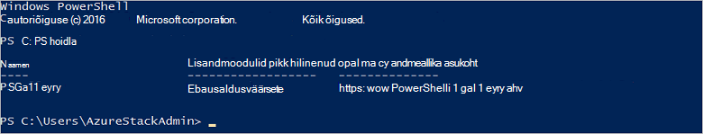

<properties
    pageTitle="Azure'i virnas PowerShelliga ühenduse | Microsoft Azure'i"
    description="Saate teada, kuidas hallata Azure virnas PowerShelli abil"
    services="azure-stack"
    documentationCenter=""
    authors="HeathL17"
    manager="byronr"
    editor=""/>

<tags
    ms.service="azure-stack"
    ms.workload="na"
    ms.tgt_pltfrm="na"
    ms.devlang="na"
    ms.topic="article"
    ms.date="10/19/2016"
    ms.author="helaw"/>

# PowerShelli installimine ja luua ühenduse Azure'i virnas
Sellest juhendist tutvustame juhised ühenduse Azure'i virnas PowerShelli abil. Täidetud neid juhiseid ka aitavad teil hallata ja juurutamine ressursid.

## Installige Azure'i Virnlintdiagrammil PowerShelli cmdlet-käsud

1.  Galeriist PowerShelli installitakse AzureRM cmdlet-käsud. Alustamiseks avage PowerShelli konsooli MAS-CON01 sisse ja käivitage järgmine käsk PowerShelli hoidlate saadaval loendi tagastamiseks.

        Get-PSRepository

      

2.  AzureRM mooduli installimiseks järgmine käsk:

        Install-Module -Name AzureRM -RequiredVersion 1.2.6 -Scope CurrentUser

    >[AZURE.NOTE] *-Ulatus CurrentUser* pole kohustuslik. Kui soovite rohkem kui praeguse kasutaja pääseks juurde moodulid, kopeerige ja kleepige ja *ulatus* parameeter välja jätta.

3.  AzureRM moodulid installimise kinnitamiseks täita järgmised käsud:

        Get-Command -Module AzureRM.AzureStackAdmin

## Ühenduse loomine Azure virnas
Mooduli on saadaval allalaadimiseks, mis tegeleb PowerShelli ühenduse Azure'i virnas saate konfigureerida.  Külastage [Azure'i virnas tööriistad](http://aka.ms/ConnectToAzureStackPS) mooduli ja täiendavad juhised. 

## Hankige tellimuste loend
Selles jaotises saate kontrollida PowerShelli cmdlet-käskude töötavad Azure virnas toomine ja valides tellimuse jaoks.

Teie kontoga seostatud Azure'i virnas tellimuste loendi toomiseks järgmine käsk:

    Get-AzureRmSubscription

## Järgmised sammud
[Mallide PowerShelliga juurutamine](azure-stack-deploy-template-powershell.md)

[Azure'i CLI kasutajaga](azure-stack-connect-cli.md)

[Visual Studio malle juurutamine](azure-stack-deploy-template-visual-studio.md)

