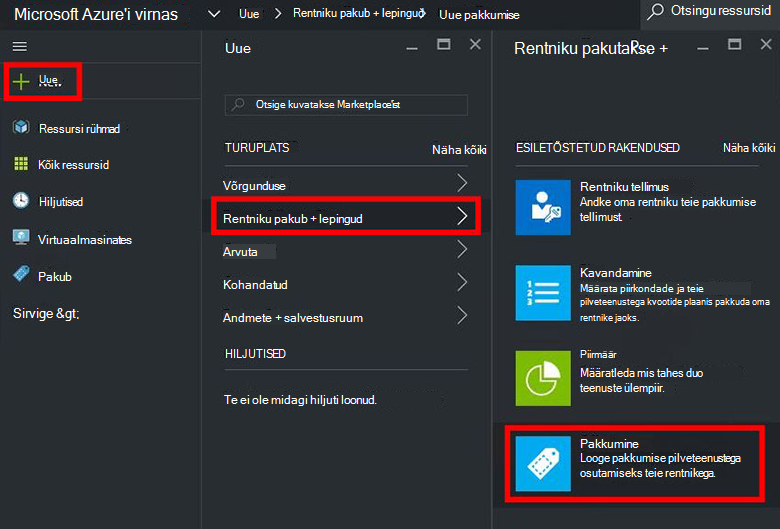
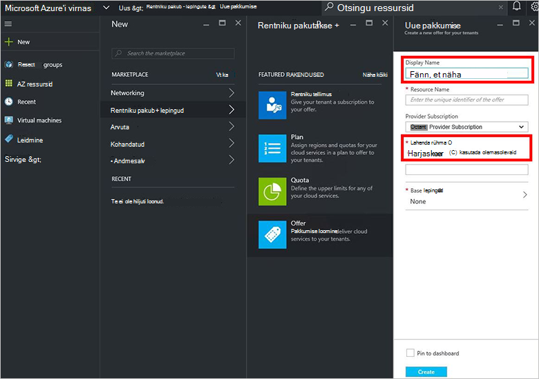
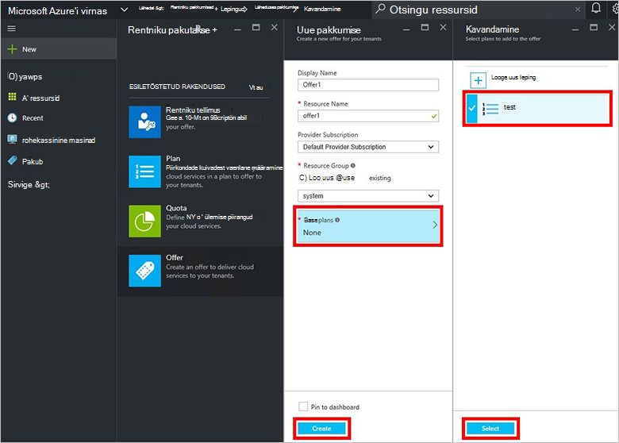
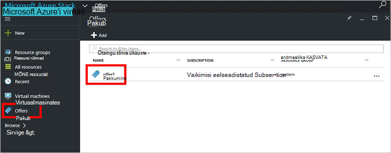
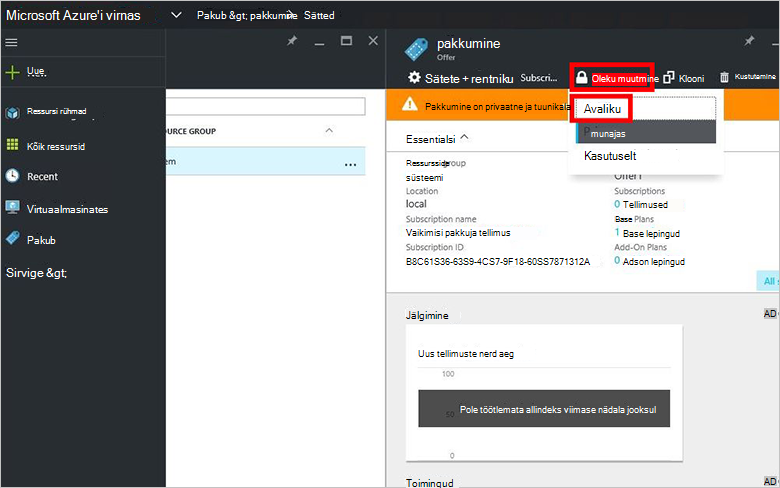

<properties
    pageTitle="Azure'i virnas pakkumise loomine | Microsoft Azure'i"
    description="Teenuse administraator, saate teada, kuidas luua oma rentnikke Azure'i virnas pakkumise."
    services="azure-stack"
    documentationCenter=""
    authors="ErikjeMS"
    manager="byronr"
    editor=""/>

<tags
    ms.service="azure-stack"
    ms.workload="na"
    ms.tgt_pltfrm="na"
    ms.devlang="na"
    ms.topic="get-started-article"
    ms.date="09/26/2016"
    ms.author="erikje"/>

# Azure'i virnas pakkumise loomine

[Pakub](azure-stack-key-features.md#services-plans-offers-and-subscriptions) on üks või mitu lepingud, millele pakkujad esitada rentnikud osta või tellida rühma. Selle dokumendi näitab, kuidas luua pakkumise, mis sisaldab [leping, millele olete loonud](azure-stack-create-plan.md) viimases etapis. Selle pakkumise võimaldab tellijad virtuaalmasinates ette valmistada.

1.  [Logige sisse](azure-stack-connect-azure-stack.md#log-in-as-a-service-administrator) portaali teenuse administraator ja seejärel klõpsake käsku **Uus** > **rentniku pakub + lepingute** > **pakkuda**.
    

2.  **Uus pakkumine** tera, täitke **Kuvatav nimi** ja **Ressursinimi**ja valige uue või olemasoleva **Ressursirühma**. Kuvatav nimi on pakkumise sõbralik nimi. Ainult administraator, saate vaadata ressursi nimi. See on nimi, mida töötamine pakkumine on Azure ressursihaldur ressursi abil administraatorid.

    

3.  Klõpsake **Base lepingud** , **leping** tera, valige lepingud, mida soovite kaasata pakkumine ja **nuppu**. Klõpsake nuppu **Loo** pakkumine loomiseks.

    
    
4. Klõpsake **pakub** ja valige äsja loodud pakkumine.

    

5.  Klõpsake nuppu **Muuda riigi**ja klõpsake **avalik**.
  
    

Pakkumised tuleb avalik, kuvatakse täielik vaate tellimise rentnike jaoks. Pakkumised võib olla:

- **Avalik**: rentnikega nähtav.

- **Privaatne**: nähtav ainult teenuse administraatoritele. Kasulik koostamisel leping või pakkumine, või kui teenuse administraator soovib iga tellimuse kinnitamine.

- **Decommissioned**: uus tellijad suletud. Teenuse administraator saab kasutada tulevaste tellimuste, kuid jätta praeguse tellijad puutumata kasutusest kõrvaldatud.

Pakkumine muudatused ei ole rentniku kohe nähtav. Muudatuste nägemiseks peate Logi välja/sisse logima uude tellimusse "tellimuse valija" ressursid/ressursi rühmade loomisel.

## Järgmised sammud

[Tellinud pakkumise ja seejärel ettevalmistamise VM](azure-stack-subscribe-plan-provision-vm.md)
