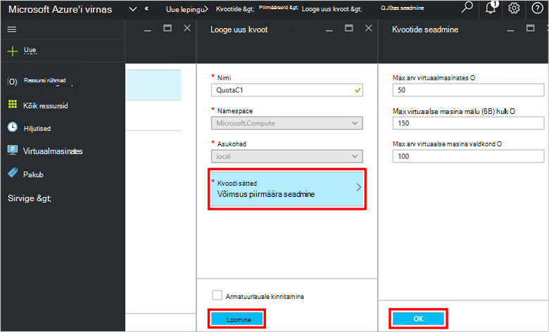

<properties
    pageTitle="Plaani loomine Azure virnas | Microsoft Azure'i"
    description="Teenuse administraatorina, luua leping, mis võimaldab tellijad sätte virtuaalmasinates."
    services="azure-stack"
    documentationCenter=""
    authors="ErikjeMS"
    manager="byronr"
    editor=""/>

<tags
    ms.service="azure-stack"
    ms.workload="na"
    ms.tgt_pltfrm="na"
    ms.devlang="na"
    ms.topic="get-started-article"
    ms.date="09/26/2016"
    ms.author="erikje"/>

# Azure'i virnas plaani loomine

[Lepingud](azure-stack-key-features.md#services-plans-offers-and-subscriptions) on ühe või mitme teenuse rühmitustega. Nagu pakkuja, saate luua oma rentnikke pakkumiseks. Omakorda oma rentnikke tellida pakub kasutada lepingute ja teenuste need suvandid on järgmised. Selles näites näitab, kuidas luua režiimi, mis sisaldab Arvuta, võrgu ja mälu ressursi pakkujad. See leping võimaldab tellijad virtuaalmasinates ette valmistada.

1.  Liikuge brauseris internet https://portal.azurestack.local.

2.  [Logige sisse](azure-stack-connect-azure-stack.md#log-in-as-a-service-administrator) administraatorina teenuse Azure virnas portaali ja sisestage teenuse administraatori õigused (konto 5 sammu [PowerShelli skripti](azure-stack-run-powershell-script.md) jaotise ajal loodud) ja seejärel klõpsake nuppu **Logi sisse**.

    Teenuseadministraatorid saate luua pakkumised ja lepingud ja kasutajate haldamine.

3.  Leping ja rentnikud saate tellida pakkumise loomiseks nuppu **Uus** > **rentniku pakub + lepingute** > **leping**.

    

4.  **Uus leping** tera, täitke **Kuvatav nimi** ja **Ressursside nimi**. Kuvatav nimi on plaani sõbralik nimi, mida rentnikud vaadata. Ainult administraator, saate vaadata ressursi nimi. See on nimi, mis on Azure ressursihaldur ressurss plaani töötamiseks kasutada administraatorid.

    

5.  Saate luua uue **Ressursirühma**või valige olemasoleva nimega ümbris leping (nt "OffersAndPlans")

    

6.  Klõpsake valikut **teenused**, valige **Microsoft.Compute**, **Microsoft.Network**ja **Microsoft.Storage**ja seejärel klõpsake nuppu **Vali**.

    

7.  Klõpsake **piirmäära**, **Microsoft.Storage (local)**, klõpsake nuppu ja seejärel valige vaikimisi kvoodi või klõpsake nuppu **Loo uus kvoot** kohandada kvoodi.

    

8.  Tippige nimi kvoodi, **Kvoodi**sätted, kvoodi väärtused ja klõpsake nuppu **OK**ja seejärel klõpsake nuppu **Loo**.

    

9. Klõpsake **Microsoft.Network (local)**, ja seejärel valige vaikimisi piirmäär või klõpsake nuppu **Loo uus kvoot** kohandada kvoodi.

    

10. Tippige nimi kvoodi, **Kvoodi**sätted, kvoodi väärtused ja klõpsake nuppu **OK**ja seejärel klõpsake nuppu **Loo**.

    

11. Klõpsake **Microsoft.Compute (local)**, ja seejärel valige vaikimisi piirmäär või klõpsake nuppu **Loo uus kvoot** kohandada kvoodi.

    

12.  Tippige nimi kvoodi, **Kvoodi**sätted, kvoodi väärtused klõpsake nuppu **OK**ja seejärel klõpsake nuppu **Loo**.

    

13. **Kvootide** tera, klõpsake nuppu **OK**ja seejärel **Uue lepingu** labale nuppu **Loo** kava loomiseks.

    

14. Teie uue lepingu kuvamiseks klõpsake nuppu **kõik ressursid**, otsida leping ja klõpsake selle nime.

    

## Järgmised sammud

[Pakkumise loomine](azure-stack-create-offer.md)
