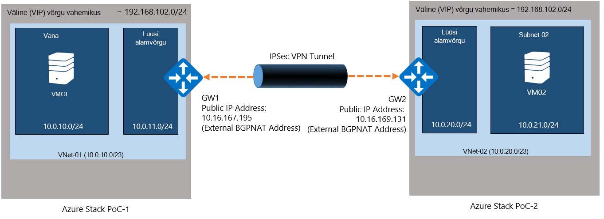
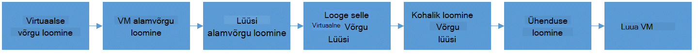
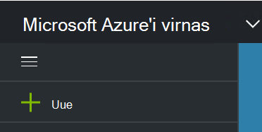
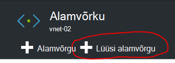
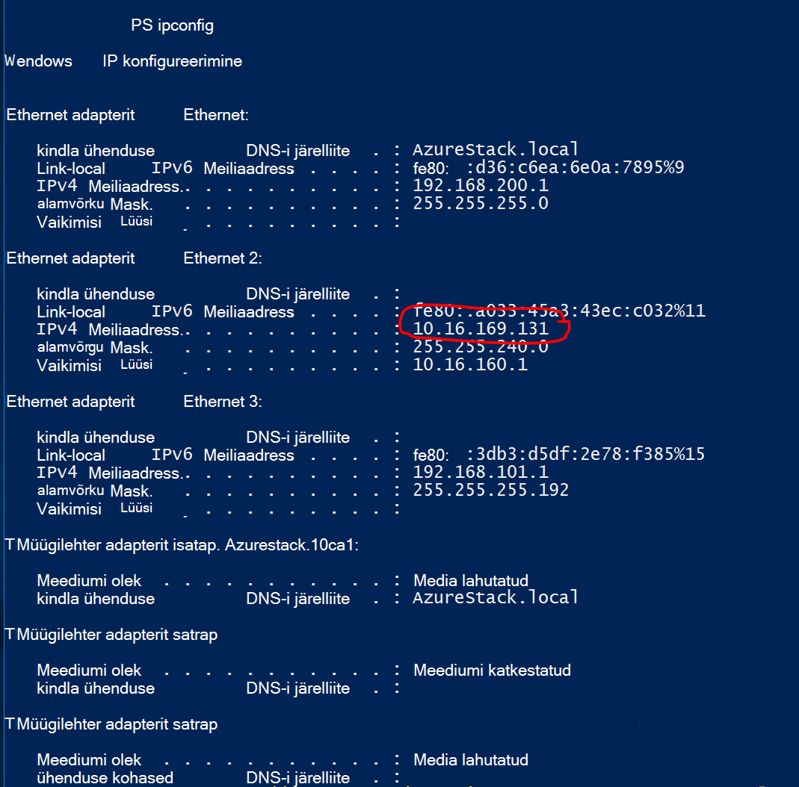
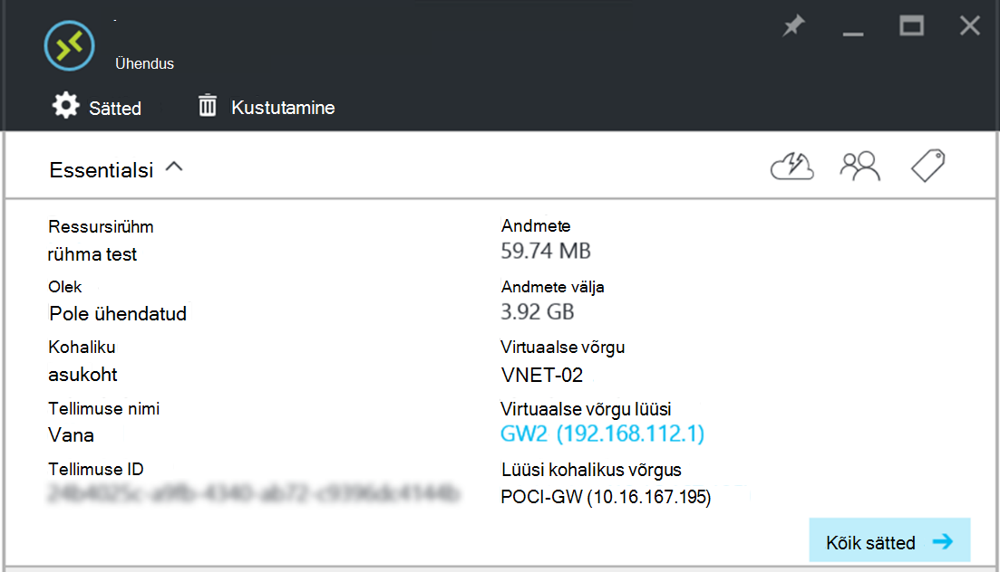

<properties
    pageTitle="Kahe virtuaalse võrgu eri Azure'i virnas PoC keskkonnas vahel-saidilt VPN-ühenduse loomine | Microsoft Azure'i"
    description="Üksikasjalike toimingut, mis võimaldab cloud administraatori vahel kahes ühe sõlme POC keskkonnas TP2-saidilt VPN-ühenduse loomiseks."
    services="azure-stack"
    documentationCenter=""
    authors="ScottNapolitan"
    manager="darmour"
    editor=""/>

<tags
    ms.service="azure-stack"
    ms.workload="na"
    ms.tgt_pltfrm="na"
    ms.devlang="na"
    ms.topic="get-started-article"
    ms.date="09/26/2016"
    ms.author="scottnap"/>

# Kahe virtuaalse võrgu eri Azure'i virnas PoC keskkonnas vahel-saidilt VPN-ühenduse loomine

## Ülevaade

Selles artiklis tutvustatakse kahe virtuaalse võrgu kahte eraldi Azure'i virnas tõendada mõiste (POC) keskkonnas vahel-saidilt VPN-ühenduse loomise juhiseid. Selle eesmärk on aidata inimestele, kes on hindamisel saidilt lüüside aru saada, kuidas häälestada VPN virtuaalne võrkude kaks erinevat Azure'i virnas kasutuselevõttu vahelisi seoseid.  Protsessi tehes saad VPN lüüside Azure'i virnas kasutamise mõistmine.

>[AZURE.NOTE] Selle dokumendi kehtib konkreetselt Azure'i virnas TP2 POC.

### Ühenduse skeem

Järgmine on diagramm, mis näitab, mida meie konfiguratsioon peaks välja nägema kui me valmis.

### Enne alustamist

Selle konfiguratsiooni tegemiseks peate nii, et veenduge, et teil on nende asjade enne alustamist järgmist.

-   Kaks serverid Azure'i virnas POC riistvara nõuetele vastavad määratletud [Azure'i virnas juurutamise eeltingimused](azure-stack-deploy.md)ja muud eeltingimused määratletud dokument.

-   Azure'i virnas tehnilise eelvaate 2 juurutamise pakett.

## POC keskkonnas juurutamine

Selle konfiguratsiooni lõpuleviimiseks Azure'i virnas POC keskkondades on juurutamist.

-   Iga POC juurutamist, saate järgige artikli [Juurutada Azure virnas POC](azure-stack-run-powershell-script.md)üksikasjalikud juurutamise juhiseid.
    Me suunab iga POC keskkonnas dokument üldiselt POC1 ja POC2.

## Arvuta, võrgu- ja kvootide konfigureerimine

Peate kvootide konfigureerimine Arvuta, võrgu- ja nii, et need teenused võib olla seotud leping ja seejärel rentnikukontodele pakkumise saate tellida.

>[AZURE.NOTE] Mida on vaja teha neid juhiseid iga Azure'i virnas POC keskkonnas.

TP1 kogemusi kvootide teenuste loomiseks on muutunud. Kohta, kuidas luua kvootide TP2 juhised leiate <http://aka.ms/mas-create-quotas>. Saate aktsepteerida kõik kvoodi sätete selle ülesande jaoks vaikesätteid.

## Leping ja pakkumise loomine

[Lepingud](azure-stack-key-features.md) on ühe või mitme teenuse rühmitustega. Nagu pakkuja, saate luua oma rentnikke pakkumiseks. Omakorda oma rentnikke tellida pakub kasutada lepingute ja teenuste need suvandid on järgmised.

>[AZURE.NOTE] Peate nende juhiste täitmiseks iga Azure'i virnas POC keskkonnas.

1.  Esmalt luua. Selleks saate järgige [Loo plaan](azure-stack-create-plan.md) Online'i artiklis toodud juhiseid.

2.  Saate luua pakkumise [Loo pakkumise Azure'i virnas](azure-stack-create-offer.md)kirjeldatud juhiseid.

3.  Logige sisse portaali rentniku administraator ja [tellimine loodud pakkumine] (azure-virnas-Telli-leping-sätte-vm.md.

## Luua võrgu ressursse POC 1

Nüüd me tegelikult peame meie konfiguratsiooni seadmine ressursside loomine. Järgnevalt kirjeldatakse, mida me teeme. Neid juhiseid näitan kuidas luua ressursid portaali kaudu, kuid sama suunamist PowerShelli kaudu.

### Logige rentniku jaoks

Teenuse administraator saab logige sisse rentniku testimiseks lepingud, pakutakse ning tellimused, mida võib kasutada oma rentnikke. Kui teil pole veel üks [Loo rentnikukonto](azure-stack-add-new-user-aad.md) enne sisselogimist.

### Virtuaalse võrgu- ja VM alamvõrgu loomine

1.  Rentniku konto abil sisse logida.

2.  Azure'i portaalis, klõpsake ikooni **Uus** .

     
3.  Valige menüüst turuplatsi **Networking** .

4.  Klõpsake menüü üksust **Virtual võrku** .

5.  Ressursside kirjeldus tera allosas nuppu **Loo** . Sisestage vastavalt selle tabeli väljadele järgmised väärtused.

  	| **Väli**             | **Väärtus** |
  	|----------------------- | ------ |
  	| Nimi                  |VNet-01 |
  	| Aadressiruumi jaoks         | 10.0.10.0/23 |
  	| Alamvõrgu nimi           | alamvõrgu-01 |
  	| Alamvõrgu aadress vahemikus  | 10.0.10.0/24 |

6.  Näha peaks olema tellimus, mis on loodud varem täidetud **tellimuse** väli.

7.  Ressursirühma, saate luua uue ressursirühma või kui teil juba on üks, valige Kasuta olemasolevaid.

8.  Kontrollige vaikeasukoha.

9.  Klõpsake nuppu **Loo** .

### Lüüsi alamvõrgu loomine

1.  Avage äsja loodud (Vnet-01) armatuurlaualt Virtual võrguressurssi.

2.  Enne sätted, valige alamvõrku

3.  Virtuaalne võrgu lüüsi alamvõrgu lisamiseks nuppu **Lüüsi alamvõrgu** .

     
4.  Vaikimisi seatakse **GatewaySubnet** alamvõrgu nimi.
    Lüüsi alamvõrku on teisiti ja peab olema seda teatud nime, et õigesti.

5.  Sisestage väljale **aadress vahemikus** **10.0.11.0/24**.

6.  Klõpsake alamvõrgu lüüsi loomiseks nuppu **Loo** .

### Lüüsi virtuaalse võrgu loomine

1.  Azure'i portaalis, klõpsake ikooni **Uus** .

    

2.  Valige menüüst turuplatsi **Networking** .

3.  Valige loendist võrgu ressursse **Virtual võrgu lüüsi** .

4.  Vaadake üle kirjeldus ja klõpsake nuppu **Loo**.

5.  Tippige väljale **nimi** **GW1**.

6.  Klõpsake üksuse **virtuaalne võrgu** virtuaalse võrgu valimine.
    Valige loendist **Vnet-01** .

7.  Klõpsake menüükäsku **avaliku IP-aadress** . Valige avaliku IP address tera avanemisel klõpsake nuppu Loo uus.

8.  Sisestage väljale **nimi** **GW1-PiP** ja klõpsake nuppu **Ok.**

9.  **Lüüsi tüüp** peaks olema **VPN** vaikimisi valitud. Jätke see säte.

10. **VPN-tüüp** peaks olema **marsruutimiseks-põhine** on vaikimisi valitud.
    Jätke see säte.

11. Kontrollige **tellimuse** ja **asukoht** on õiged. Soovi korral saate kinnitada ressursi armatuurlaud. Klõpsake nuppu **Loo**.

### Kohaliku võrgu lüüsi loomine

Kohaliku võrgu lüüsi ressurss on pisut imelik meie stsenaariumi.
Siiski see on tavaliselt mõeldud seotud füüsilise, kohapealne seadmega Azure kasutaksite ühenduse virtuaalse võrgu lüüsi Azure on sama leiate Azure'i, ressurss. Selles näites on algus-ja ühenduse tegelikult virtuaalse võrgu lüüside!

Võimalus mõtlema rohkem üldiselt on mõeldud ressursside kohaliku võrgu lüüsi on alati näitama remote teises otsas ühenduse lüüs. Sellepärast, et selle POC loodi, läheb vaja tegelikult anda välise võrguadapteri aadressi NAT VM muud POC, nagu kohaliku võrgu lüüsi avaliku IP-aadress. Seejärel loome NAT vastendused NAT VM veendumaks, et sooritaja on õigesti ühendatud.

### Saada välise adapterit NAT VM IP-aadress

1.  Logige sisse Azure'i virnas füüsilise seadme jaoks POC2.

2.  [Windowsi klahv] + R, et **käivitada** menüü avamiseks ja tippige **mstsc** ja vajuta enter.

3.  Sisestage väljale **arvuti** **MAS-BGPNAT01** nimi ja klõpsake nuppu **Loo ühendus** .

4.  Klõpsake menüü Start, paremklõpsake PowerShelli ja valige käsk **Käivita administraatorina**.

5.  Tippige **IPConfig/all**.

6.  Ethernet-adapterit, mis on ühendatud võrgu kohapealne üles ja võtke teadmiseks seotud selle adapterit IPv4 aadress. Minu keskkond on **10.16.167.195** , kuid teie enda on midagi muud.

7.  Kirje selle aadressi. See on, mida me kasutame näiteks loome POC1 kohaliku võrgu lüüsi ressursi avaliku IP-aadress.

### Kohaliku võrgu lüüsi ressursside loomine

1.  Logige sisse Azure'i virnas füüsilise seadme jaoks POC1.

2.  **Arvuti** väljale Sisestage nimi **MAS-CON01** ja klõpsake nuppu **Loo ühendus** .

3.  Azure'i portaalis, klõpsake ikooni **Uus** .

    

4.  Valige menüüst turuplatsi **Networking** .

5.  Valige loendist ressursside **kohtvõrgu lüüsi** .

6.  Sisestage väljale **nimi** **POC2-GW**.

7.  Me ei tea meie muude Gateway IP-aadress veel, kuid see on ok, kuna me saate naasta ja hiljem muuta. Nüüd, sisestage **10.16.167.195** **IP-aadressi välja**.

8.  Sisestage väljale **Aadressiruumi** Vnet, mille loome rakenduses POC2 aadressiruumi. See saab olema **10.0.20.0/23** nii sisestage selle väärtuse.

9.  Veenduge, et teie **tellimus**, **Ressursirühm** ja **asukohaga** on kõik õiged, ja klõpsake nuppu **Loo**.

### Ühenduse loomine

1.  Azure'i portaalis, klõpsake ikooni **Uus** .

     

2.  Valige menüüst turuplatsi **Networking** .

3.  Valige loendist ressursid **ühendus** .

4.  Valige **põhilised** sätted labale **ühendusetüübi** **saidi saidi (IPSec)** .

5.  Valige **tellimus**, **Ressursirühm** ja **asukohaga** , ja klõpsake nuppu **Ok**.

6.  Valige **sätted** tera, **Virtuaalse võrgu lüüsi** (**GW1**) varem loodud.

7.  Valige soovitud **kohaliku** **Võrgu lüüsi** (**POC2-GW**) varem loodud.

8.  Sisestage väljale **Ühenduse nimi** **POC1-POC2**.

9.  Sisestage väljale **Ühiskasutuses klahv (PSK)** **12345**. Klõpsake nuppu **Ok**.

### Luua VM

Valideeri andmed kulgevate VPN-ühendus, peate meilisõnumeid saata ega vastu võtta andmeid iga POC VMs. Loome nüüd luua VM POC1 ja sellele meie VM alamvõrgu meie virtuaalse võrgus.

1. Azure'i portaalis, klõpsake ikooni  **Uus** .

     

2.  Valige menüüst turuplatsi **Virtuaalmasinates** .

3.  Valige loendis virtuaalse masina pilte, **Windows Server 2012 R2 andmekeskuse** pilt.

4.  Enne **põhitõed** , väljale **nimi** sisestage väärtus **VM01**.

5.  Sisestage kehtiv kasutajanimi ja parool. Saate kasutada selle kontoga sisse logida VM pärast selle loomist.

6.  Sisestage **tellimus**, **Ressursirühm** ja **asukohaga** ja seejärel klõpsake nuppu **Ok**.

7.  Enne **suurus** , töövooeksemplari VM suuruse valimine ja klõpsake **Valige**.

8.  Enne sätted, saate nõustuda vaikimisi, lihtsalt veenduge, et valitud Virtual võrk on **VNET-01** ja alamvõrgu on seatud **10.0.10.0/24**. Klõpsake nuppu **Ok**.

9.  Kontrollige sätteid enne **Kokkuvõte** ja klõpsake nuppu **Ok**.

## Võrgu ressursse POC 2 loomine

### Logige rentniku jaoks

Teenuse administraator saab logige sisse rentniku testimiseks lepingud, pakutakse ning tellimused, mida võib kasutada oma rentnikke. Kui teil pole veel üks [Loo rentnikukonto](azure-stack-add-new-user-aad.md) enne sisselogimist.

### Virtuaalse võrgu- ja VM alamvõrgu loomine

1. Rentniku konto abil sisse logida.

2. Azure'i portaalis, klõpsake ikooni  **Uus** .

     

3.  Valige menüüst turuplatsi **Networking** .

4.  Klõpsake menüü üksusel **Virtual võrku** .

5.  Ressursside kirjeldus tera allosas nuppu **Loo** . Sisestage järgmised väärtused järgmises tabelis on loetletud asjakohaste väljad.

  	|**Väli**              |**Väärtus** |
  	| ----------------------|----------|
  	| Nimi                  | VNet-02 |
  	| Aadressiruumi jaoks         | 10.0.20.0/23 |
  	| Alamvõrgu nimi           | alamvõrgu-02 |
  	| Alamvõrgu aadress vahemikus  | 10.0.20.0/24 |

6.  Näha peaks olema tellimus, mis on loodud varem täidetud **tellimuse** väli.

7.  Ressursirühma, saate luua uue ressursirühma või kui teil juba on üks, valige Kasuta olemasolevaid.

8.  Kinnitage vaikimisi **asukoht**. Kui soovite, saate kinnitada virtuaalse võrgu armatuurlaud hõlpsaks juurdepääsuks.

9.  Klõpsake nuppu **Loo** .

### Lüüsi alamvõrgu loomine

1.  Avage Virtual võrguressurssi loodud armatuurlaualt (**Vnet-02**).

2.  Enne **sätted** , valige **alamvõrku.**

3.  Virtuaalne võrgu lüüsi alamvõrgu lisamiseks nuppu **Lüüsi alamvõrgu** .

     

4.  Vaikimisi seatakse **GatewaySubnet** alamvõrgu nimi.
    Lüüsi alamvõrku on teisiti ja peab olema seda teatud nime, et õigesti.

5.  Sisestage väljale **aadress vahemikus** **10.0.20.0/24**.

6.  Lüüsi alamvõrgu loomiseks nuppu **Loo** .

### Lüüsi virtuaalse võrgu loomine

1. Azure'i portaalis, klõpsake ikooni  **Uus** .

     

2.  Valige menüüst turuplatsi **Networking** .

3.  Valige loendist võrgu ressursse **Virtual võrgu lüüsi** .

4.  Vaadake üle kirjeldus ja klõpsake nuppu **Loo**.

5.  Tippige väljale **nimi** **GW2**.

6.  Klõpsake üksuse **virtuaalne võrgu** virtuaalse võrgu valimine.
    Valige loendist **Vnet-02** .

7.  Klõpsake menüükäsku **avaliku IP-aadress** . Valige avaliku IP address tera avanemisel klõpsake nuppu Loo uus.

8.  Sisestage väljale **nimi** **GW2-PiP** ja klõpsake nuppu **Ok.**

9.  **Lüüsi tüüp** peaks olema **VPN** vaikimisi valitud. Jätke see säte.

10. **VPN-tüüp** peaks olema **marsruutimiseks-põhine** on vaikimisi valitud.
    Jätke see säte.

11. Kontrollige **tellimuse** ja **asukoht** on õiged. Soovi korral saate kinnitada ressursi armatuurlaud. Klõpsake nuppu **Loo**.

### Kohaliku võrgu lüüsi loomine

#### Saada välise adapterit NAT VM IP-aadress

1.  Logige sisse Azure'i virnas füüsilise seadme jaoks POC1.

2.  Vajutage ja hoidke [Windowsi klahv] + R, et **käivitada** menüü avamine – saate tippida **mstsc** ja vajutage sisestage.

3.  Sisestage väljale **arvuti** **MAS-BGPNAT01** nimi ja klõpsake nuppu **Loo ühendus** .

4.  Klõpsake menüü Start ja PowerShelli paremklõpsake ja valige käsk **Käivita administraatorina**.

5.  Tippige **IPConfig/kõik**.

6.  Otsimine Ethernet-adapterit, mis on kohapealne võrku ühendatud, ja vaadake üle IPv4 aadress selle adapterit seotud. Minu keskkond on **10.16.169.131** , kuid teie enda on midagi muud.

7.  Kirje selle aadressi. See on, mida hiljem kasutame nimega loome POC1 kohaliku võrgu lüüsi ressursi avaliku IP-aadress.

#### Kohaliku võrgu lüüsi ressursside loomine

1.  Logige sisse Azure'i virnas füüsilise seadme jaoks POC2.

2.  Sisestage väljale **arvuti** **MAS-CON01** nimi ja klõpsake nuppu **Loo ühendus** .

3. Azure'i portaalis, klõpsake ikooni **Uus** .

     

4.  Valige menüüst turuplatsi **Networking** .

5.  Valige loendist ressursside **kohtvõrgu lüüs** .

6.  Sisestage väljale **nimi** **POC1-GW**.

7.  Nüüd tuleb avaliku IP-aadressi me registreeritud Virtual võrgu lüüsi POC1. Sisestage **10.16.169.131** **IP-aadressi välja**.

8.  Sisestage väljale **Aadressiruumi** aadressiruumi **Vnet -** 01 POC1 - **10.0.0.0/16**kaudu.

9.  Veenduge, et teie **tellimus**, **Ressursirühm** ja **asukohaga** on kõik õiged, ja klõpsake nuppu **Loo**.

## Ühenduse loomine

1. Azure'i portaalis, klõpsake ikooni  **Uus** .

     

2.  Valige menüüst turuplatsi **Networking** .

3.  Valige loendist ressursid **ühendus** .

4.  Valige **põhilised** sätted labale **ühendusetüübi** **saidi saidi (IPSec)** .

5.  Valige **tellimus**, **Ressursirühm** ja **asukohaga** , ja klõpsake nuppu **Ok**.

6.  Valige **sätted** tera, **Virtuaalse võrgu lüüsi** (**GW1**) varem loodud.

7.  Valige soovitud **kohaliku** **Võrgu lüüsi** (**POC1-GW**) varem loodud.

8.  Sisestage väljale **Ühenduse nimi** **POC2-POC1**.

9.  Sisestage väljale **Ühiskasutuses klahv (PSK)** **12345**. Kui valite muu väärtuse, pidage meeles, et see peab ühtima jagatud võtme POC1 määratud väärtuse. Klõpsake nuppu **Ok**.

## Luua VM

POC1 VM nüüd luua ja sellele meie VM alamvõrgu meie virtuaalse võrgus.

1.  Azure'i portaalis, klõpsake ikooni **Uus** .

     

2.  Valige menüüst turuplatsi **Virtuaalmasinates** .

3.  Valige loendis virtuaalse masina pilte, **Windows Server 2012 R2 andmekeskuse** pilt.

4.  **Põhitõed** enne, sisestage väljale **nimi** väärtus **VM02**.

5.  Sisestage kehtiv kasutajanimi ja parool. Saate kasutada selle kontoga sisse logida VM pärast selle loomist.

6.  Sisestage **tellimus**, **Ressursirühm** ja **asukohaga** , ja seejärel klõpsake nuppu **Ok**.

7.  Enne **suurus** , töövooeksemplari VM suuruse valimine ja klõpsake **Valige**.

8.  Enne sätted, saate nõustuda vaikimisi, lihtsalt veenduge, et valitud Virtual võrk on **VNET-02** ja alamvõrgu on seatud **20.0.0.0/24**. Klõpsake nuppu **Ok**.

9.  Kontrollige sätteid enne **Kokkuvõte** ja klõpsake nuppu **Ok**.

## Iga POC jaoks lüüsi läbikäiku NAT VM konfigureerimine

Kuna soovitud POC on kujundatud iseseisva- ja eraldatud võrk, millel on juurutatud füüsilise host, "Välise" VIP võrku ühendatud lüüside pole tegelikult välise, kuid selle asemel on peidetud ruuteri tehes Address Translation (NAT) taga. Ruuteri on tegelikult Windows Serveri VM (**MAS-BGPNAT01**) töötavad marsruutimine ja Remote Access Services (RRAS) roll POC taristu. Meil on vaja konfigureerida NAT MAS-BGPNAT01 VM lubama ühenduse sooritaja-saidilt VPN-ühendus.

>[AZURE.NOTE] Selle konfiguratsiooni on vaja ainult POC keskkonnas.

### NAT konfigureerimine

Peate tehke nii POC keskkonnas.

1.  Logige sisse Azure'i virnas füüsilise seadme jaoks POC1.

2.  Vajutage ja ootele [Windowsi klahv] + R, et **käivitada** menüü avamiseks ja tippige **mstsc** tabas sisestada.

3.  Sisestage väljale **arvuti** **MAS-BGPNAT01** nimi ja klõpsake nuppu **Loo ühendus** .

4.  Klõpsake menüü Start ja PowerShelli paremklõpsake ja valige käsk **Käivita administraatorina**.

5.  Tippige **IPConfig/kõik**.

6.  Otsimine Ethernet-adapterit, mis on kohapealne võrku ühendatud, ja vaadake üle IPv4 aadress selle adapterit seotud. Minu keskkond on **10.16.169.131** (circled punaselt allpool), kuid teie enda on midagi muud.

     

7.  Sisestage järgmine PowerShelli käsk määrata välise NAT aadressi pordid, mis IKE autentimist. Ärge unustage muuta IP-aadress see, mis vastab teie keskkonnas.

        Add-NetNatExternalAddress -NatName BGPNAT -IPAddress 10.16.169.131 PortStart 499 -PortEnd 501

8. Järgmiseks loome staatilise NAT vastenduse välise aadressi vastendamiseks lüüsi avaliku IP-aadressi kaardil ISAKMP pordi 500 IPSEC tunneliga etapp 1.

        Add-NetNatStaticMapping -NatName BGPNAT -Protocol UDP -ExternalIPAddress 10.16.169.131 -InternalIPAddress 192.168.102.1 -ExternalPort 500 -InternalPort 500

9.  Lõpuks läheb vaja teha NAT läbimise, mis kasutab port 4500 luua edukalt lõpule viidud IPEC tunneliga NAT seadmeid üle.

         Add-NetNatStaticMapping -NatName BGPNAT -Protocol UDP -ExternalIPAddress 10.16.169.131 -InternalIPAddress 192.168.102.1 -ExternalPort 4500 -InternalPort 4500

10.  Korrake juhiseid 1 – 9 POC2.

## Ühenduse testimiseks

Nüüd, kui saidilt ühendus on loodud, tuleks kinnitada, et saame liikluse läbib seda. See toiming on lihtne, nagu see hõlmab ainult ühte VMs lõime kummagi POC keskkonnas sisse logida ja pingida VM lõime muude keskkonnas. Selleks, et saaksime on hakanud liiklus saidilt ühenduse kaudu, soovime veenduge, et me ping VM remote alamvõrgu, mitte VIP otsese IP (DIP) aadress. Selle tegemiseks vajame teada aadress on teises otsas meie ühendus.

### Rentniku VM POC1 sisse logida

1.  Azure'i virnas füüsilise seadme POC1 sisse logida ja rentnikukonto portaali sisse logida.

3.  Klõpsake vasakpoolsel navigeerimisribal **Virtuaalmasinates** ikooni.

4.  Otsige **VM01** VMs loendis varasemas versioonis loodud ja klõpsake seda.

5. Enne virtuaalse masina jaoks klõpsake nuppu **Ühenda**.

     

6.  Avage käsuviip kaudu sisu VM ja tippige tekst **IPConfig/kõik**.

7.  Otsige üles **IPv4 aadress** väljund ja arvesse võtta. See on teil on ping POC2 aadress. Selles keskkonnas aadress on **10.0.10.4**, kuid teie keskkonnas olla erinev. See peaks jääma siiski **10.0.10.0/24** alamvõrku, mis on varem loodud.

### Rentniku VM POC2 sisse logida

1.  Logige sisse Azure'i virnas füüsilist masinat POC2-ja logige sisse portaali rentniku konto abil.

3.  Klõpsake vasakpoolsel navigeerimisribal **Virtuaalmasinates** ikooni.

4.  Otsige **VM02** VMs loendis varasemas versioonis loodud ja klõpsake seda.

5.  Enne virtuaalse masina jaoks klõpsake nuppu **Ühenda**.

     

6.  Avage käsuviip kaudu sisu VM ja tippige tekst **IPConfig/kõik**.

7.  Peaksite nägema IPv4 aadress, mis kuulub 10.0.20.0/24. Minu katselabori aadress on 10.0.20.4, kuid teie enda võivad olla erinevad.

8.  Nüüd VM POC2: Soovime ping VM POC1, kuni soovitud tunneliga. Tehke seda me lindistatud kaudu VM01 DIP ping.
    Minu laboris see on 10.0.10.4, kuid veenduge, et ping leiate oma lab aadress. Peaksite nägema tulemus, mis näeb välja umbes järgmine.

     

9.  Vastuse remote VM näitab edukat test! Saate ühendada VM akna sulgemine või kui teile meeldib, proovige mõnda muud andmeedastuse (nt faili koopia) ühenduse testimiseks tehke.

### Andmete vaatamiseks üleviimise statistika kaudu ühenduse lüüs

Kui soovite teada, kui palju andmeid on läbib saidilt ühenduse, see teave on esitatud ühenduse tera. Selle testi on samuti mugav võimalus veenduge, et ainult saadetud ping läks tegelikult VPN-ühenduse kaudu.

1.  Kui endiselt sisse logitud **ClientVM** sisse POC2, **Microsoft Azure'i virnas POC portaali** rentniku kontoga sisselogimine.

2.  Klõpsake menüükäsku **Sirvi** ja valige **ühendused**.

3.  Klõpsake loendis **POC2-POC1** ühendust.

4.  Enne ühendus, saate vaadata statistika andmete sisse ja välja andmete. Järgmisel pildil näete mõnda suuremat arvu kui lihtsalt ping arvestab. Mis on, kuna me ei faili edastamine ka. Peaksite nägema mõni nullist erinev väärtus.

     
