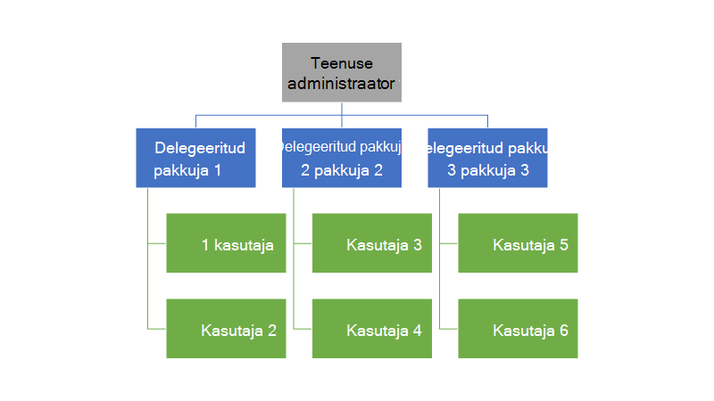

<properties
    pageTitle="Delegeerivad pakkumisi Azure'i virnas | Microsoft Azure'i"
    description="Saate teada, kuidas panna teiste eest pakutakse loomise ja registreerumine kasutajate jaoks."
    services="azure-stack"
    documentationCenter=""
    authors="AlfredoPizzirani"
    manager="byronr"
    editor=""/>

<tags
    ms.service="azure-stack"
    ms.workload="na"
    ms.tgt_pltfrm="na"
    ms.devlang="na"
    ms.topic="article"
    ms.date="10/07/2016"
    ms.author="alfredop"/>

#Delegeerivad pakkumisi Azure'i virnas

Teenuse administraatorina soovite sageli teiste eest pakutakse loomise ja registreerumine kasutajate jaoks saate panna. See võib juhtuda näiteks, kui olete teenuse pakkuja ja soovite edasimüüjate registreeruda kliendid ja hallata neid teie nimel. See võib juhtuda, et ettevõte kui olete selle rühma ja soovite osakondades või tütarettevõtted kasutajate oma sekkumiseta keskne osa.

Delegeerimine aitab teil neid ülesanded, aidates teil jõuda, ja hallata kasutajaid, kui teil oleks võimalik teha otse. Järgmisel joonisel on kujutatud ühe taseme delegeerimine, kuid Azure'i virnas toetab mitut tasemed. Muude teenusepakkujate kuni viis taset saate delegeerida omakorda delegeeritud pakkujad.

Administraatorid saavad volitatud esindaja pakutakse loomine ja rentnikud teistele kasutajatele delegeerimine funktsiooni abil.

##Rollide ja juhiseid delegeerimine

Mõistmaks, delegeerimine, pidage meeles, mis on seotud kolme rolli:

-   **Teenuse administraator** haldab Azure'i virnas taristu, loob mõne pakkumine malli ja delegaatide teistele kasutajatele pakkumiseks.

-   Delegeeritud kasutajate nimetatakse **delegeeritud pakkujad**. Saate nad kuuluvad teiste asutuste (nt Azure Active Directory rentnike jaoks).

-   **Kasutajate** pakub kasutajaks ja kasutada neid haldamine nende töökoormus, VMs loomine, talletamine, jne.

Nagu on näidatud järgmisel pildil, on kaks toimingut delegeerimine häälestamiseks.

1.  Leidke delegeeritud pakkujad. Selleks tellimise nende põhjal leping, mis sisaldab ainult tellimuste teenuste pakkumise.
    Kasutajad, kes seda pakkumist tellimine hankida mõne teenuse administraator võimalusi, sh laiendamine pakkumised ja logige üles need kasutajad.

2.  Delegeeritud pakkuja pakkumise delegeerida. Selle pakkumise töötab mallina, mida delegeeritud pakkuja pakkuda. Delegeeritud pakkuja on nüüd võimalik võtta pakkuda, valige nimi (kuid mitte muuta oma teenuste ja kvootide) ja pakkuda klientidele.

Delegeeritud pakkujate tegutseda kasutajad peavad luua seose peamine pakkuja; Teisisõnu, tuleb luua tellimus. Selle stsenaariumi korral tuvastab see tellimus delegeeritud pakkujad, kellel on õigus Esita pakutakse peamised nimel.

Kui see seos on loodud, saate süsteemiadministraator delegeerida pakkumise delegeeritud pakkuja. Delegeeritud pakkuja on nüüd võimalik võtta pakkuda, selle ümber nimetada (kuid mitte muuta sisu) ja pakkuda oma klientidele.

Delegeeritud pakkuja loomiseks volitatud esindaja pakkumise ja veenduge, et kasutajad saate selle kasutajaks, teostada järgmistes jaotistes toodud juhiseid.

##Rollide häälestamine

Delegeeritud pakkuja tööl kuvamiseks peate täiendavate Azure Active Directory kontod Lisaks konto teenuse administraator. Kui teil on, et need, luua kaks kontot. Mis tahes AAD rentniku saate kuuluvad kontod. Me suunab neile delegeeritud pakkuja (DP) ja kasutajale.

| **Roll** | **Ettevõtte õigused** |
| -------------------- | ----------------------- |
|  Delegeeritud pakkuja | Kasutaja |
| Kasutaja | Kasutaja |

##Delegeeritud pakkujate tuvastamine

1.  Logige sisse administraatorina teenus.

2.  Looge pakkumine, mis võimaldab rentnikke saada delegeeritud pakkujad. Selleks on vaja leping ja selle põhjal pakkumise loomine:

    lisamine.  [Plaani loomine](azure-stack-create-plan.md).
        See leping peaks sisaldama ainult tellimuste teenus. Selles artiklis me kasutada PlanForDelegation.

    b.  [Looge pakkumise](azure-stack-create-offer.md) 
     selle lepingu puhul. Selles artiklis kasutame pakkumise nimetatakse OfferToDP.

    c.  Kui pakkumine loomine on lõpule jõudnud, lisada delegeeritud pakkuja kasutaja ID-d nii rentnik selle pakkumise jaoks, kui klõpsate     **tellimuste** &gt; **lisamine** &gt; **Rentniku uude tellimusse**.

  

> [AZURE.NOTE]Nagu kõik Azure'i virnas pakkumised, on teil võimalik teha pakkumine avalike ja lastes kasutajate kasutajaks, või hoides seda privaatne ning mille teenuse administraator on registreerumise haldamine. Delegeeritud pakkujad on tavaliselt väike rühm, ja te soovite kontrollida, kes on lubatud, nii, et hoida selle pakkumise privaatne teeb mõttes enamikel juhtudel.

##Teenuse administraator loob delegeeritud pakkumine

Nüüd olete loonud delegeeritud pakkuja. Järgmiseks on leping ja pakkumine, mida te ei kavatse volitatud esindaja ja mis kasutab klientide loomisel. Määratlege selle pakkumise täpselt nii, nagu soovite seda näha, kliendid, sest delegeeritud pakkuja ei saa muuta lepingud ja see sisaldab piirmäärasid.

1.  Kui administraator, [luua](azure-stack-create-plan.md) ja [pakkumise](azure-stack-create-offer.md) selle põhjal. Selles artiklis kasutame pakkumise nimetatakse DelegatedOffer.
> [AZURE.NOTE]Pakkumine pole vaja avalikustada. Saate muudetud avalikuks kui valite, kuid enamasti soovite ainult delegeeritud pakkujate olema juurdepääs sellele. Kui te delegeerida privaatne pakkumine, nagu on kirjeldatud järgmistes juhistes, on delegeeritud pakkuja juurde pääsema.

2.  Volitatud esindaja pakkumine. Avage DelegatedOffer ja paanil sätted, klõpsake **Delegeeritud pakkujate** &gt; **lisamine**.

3.  Valige ripploendist väljal delegeeritud pakkuja tellimus ja klõpsake nuppu **volitatud esindaja**.

> 

##Delegeeritud pakkuja kohandab pakkumine

Logige sisse kui delegeeritud pakkuja ja luua uue pakkumise abil delegeeritud pakkumine mallina.

1.  Klõpsake nuppu **Uus** &gt; **rentniku pakub + lepingud** &gt; **pakkuda**.

    

2.  Määrake nimi pakkumine. Siin me valida ResellerOffer. Valige delegeeritud pakkumise selle aluseks ja seejärel klõpsake nuppu **Loo**.
    
    

    >[AZURE.NOTE] Pange tähele, et pakub vilunud, et teenuse administraator loomine. Delegeeritud pakkuja ei ehitada pakkumine base lepingud ja lisandmooduli lepingud; ta saate valida ainult pakkumised, mis on delegeeritud oma ja teeb muudatusi pole neile.

3. Pakkumine avalikuks muutmine, klõpsates nuppu **Sirvi** &gt; **pakub**, valides pakkumine ja käsku **Muuda olekus**.

4. Delegeeritud pakkuja seab oma portaali kaudu neist pakub URL-i. Pange tähele, et need pakkumised on nähtav ainult selle delegeeritud portaali kaudu. Otsimine ja seda URL-i muutmiseks tehke järgmist.

    lisamine.  Klõpsake nuppu **Sirvi** &gt; **pakkuja sätted** &gt; **portaali URL-i**.

    b.  Soovi korral saate muuta pakkuja ID-d.

    c.  Kopeerige portaali URL-i eraldi asukohta, nt Notepadis.

    
<!-- -->
Teil on nüüd lõpule delegeeritud pakkuja delegeeritud pakkumine loomine. Kui delegeeritud pakkuja Logi välja. Sulgege vahekaart brauserit te kasutate.

##Registreerumine selle pakkumise jaoks

1.  Avage uus brauseriaken, delegeeritud portaali URL-i salvestatud eelmist toimingut. Logige portaali kasutajana. Märkus: peate kasutama delegeeritud portaali seda toimingut. Delegeeritud pakkumine ei ole nähtav teisiti.

2.  Armatuurlaua, klõpsake nuppu **Saada tellimus**. Näete, et ainult delegeeritud pakutakse loodud delegeeritud pakkuja esitatakse kasutajale:

> 

Sellega lõpeb pakkumise delegeerimine protsess. Kasutaja saab nüüd registreeruda selle pakkumise tellimuse hankimine.

##Mitme taseme delegeerimine

Mitme taseme delegeerimine võimaldab volitatud pakkumine teistele üksustele delegeeritud pakkuja. Näiteks võimaldab see luua süvitsi edasimüüja kanalid, kus haldamise Azure'i virnas pakkuja delegaatide distributor, kes omakorda delegaatide edasimüüja abil pakkuda.
Azure'i virnas toetab kuni viis taset delegeerimine.

Mitmetasandiline pakkumine esinduse loomiseks delegeeritud pakkuja delegaatide omakorda pakkumine järgmise pakkuja. Protsess on sama delegeeritud pakkuja, nagu see oli teenuse administraator (vt teemat [teenuse administraator loob delegeeritud pakkumine](#service-admin-creates-the-delegated-offer)).

##Järgmised sammud
[Sätte VM](azure-stack-provision-vm.md)
