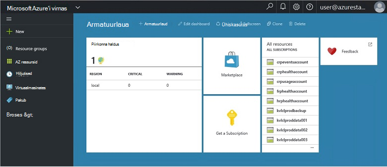
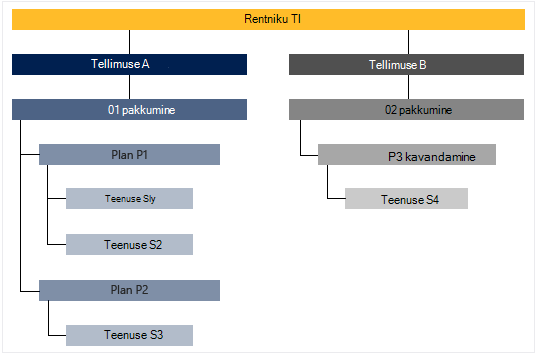

<properties
    pageTitle="Peamised funktsioonid ja Azure virnas põhimõtet | Microsoft Azure'i"
    description="Lisateavet põhifunktsioonide ja Azure virnas põhimõtet."
    services="azure-stack"
    documentationCenter=""
    authors="Heathl17"
    manager="byronr"
    editor=""/>

<tags
    ms.service="azure-stack"
    ms.workload="na"
    ms.tgt_pltfrm="na"
    ms.devlang="na"
    ms.topic="article"
    ms.date="10/25/2016"
    ms.author="helaw"/>

# Põhifunktsioonide ja kontseptsioonide Azure'i virnas

Kui kasutate rakendust Microsoft Azure'i virnas, neid termineid ja funktsioonide kirjeldused võib olla kasulik.

## Personas

On kaks sordi kasutajate Microsoft Azure'i virnas, et teenuse administraator ja rentniku (klient).

-  Oma **teenuse administraator** saab konfigureerida ja hallata ressursi pakkujad, rentniku pakkumised, lepingud, teenused, kvootide ja hinnakirjad.
-  **Rentniku** teenust (või ostud) teenused, mida pakub teenuse administraator. Rentnikud ettevalmistamise, jälgimine ja haldamine teenused, mida nad on tellinud nt veebirakenduste, salvestusruumi ja Virtuaalmasinates.

## Portaal

Microsoft Azure'i virnas suheldes esmane meetodid on portaali ja PowerShelli.

Microsoft Azure'i virnas portaalis on Azure portaali oma serverites. See on veebisait, mis pakub iseteenindusliku kogemus nii teenuse administraatoritele ja rentnikud Rollipõhine juurdepääsu reguleerimine (RBAC) ressursid ja pilveteenuse võimsus, lubamisega kiirülevaate rakenduse ja teenuse arendamise ja juurutamise.

## Regioonid, teenused, lepingud, pakkumised ja tellimused

Azure'i virnas, edastatakse teenuste rentnikud regioonid, tellimused, pakkumised ja lepingud. Rentnike jaoks saate tellida mitme pakkumisi. Pakkumised võib olla üks või mitu lepingud ja lepingute võib-olla ühe või mitme teenuseid.

Näide hierarhia pakkumised, iga erineva a rentniku tellimuste lepingute ja teenuste.

### Piirkondade
Azure'i virnas piirkondade on lihtne osa ulatuse ja juhtimise.  Ettevõtte võib olla mitu piirkondade ressurssidest iga piirkonna.  Piirkondade võib olla erinevad teenuse pakkumised saadaval.

### Teenused

Microsoft Azure'i virnas võimaldab esitamisel mitmesuguseid teenused ja rakendused, nt virtuaalmasinates, SQL serveri andmebaasi, SharePointi, Exchange'i ja muu teenusepakkuja.

### Lepingud

Lepingud, rühmitustega ühe või mitme teenuseid. Nagu pakkuja, saate luua oma rentnikke pakkuda. Omakorda oma rentnikke tellida pakub kasutada lepingute ja teenuste need suvandid on järgmised.

Iga teenuse lisatud lepingu saab konfigureerida kvoodi sätetega abil saate hallata oma pilveteenuses võimsus. Kvootide võivad sisaldada näiteks VM, RAM ja CPU limiit piirangud ja need rakendatakse kasutaja tellimuse kohta. Kvootide võib erineda sõltuvalt asukoha järgi. Leping sisaldab Arvuta teenust piirkonna A võib olla piirmäära 10 protsessorituuma kaks virtuaalmasinates ja 4GB RAM-i.

Pakkumise koostamisel teenuse administraator saab kaasata **base lepingud**. Base tellimislepingud on selle pakkumise tellib rentniku vaikimisi kaasatud. Niipea, kui kasutaja tellib (ja tellimus on loodud), on kasutajal on juurdepääs ressursi pakkujad määratud nende base lepingud (koos vastavate kvootide).

Teenuse administraator saab lisada ka **lisandmooduli lepingute** pakkumise. Lisandmooduli lepinguid ei kuulu vaikimisi tellimuse. Lisandmooduli lepingud tellimuse omanik, saate lisada oma tellimuste pakkumise saadaval täiendavaid lepinguid (kvootide).

### Pakub

Pakkumised on üks või mitu lepingud, millele pakkujad esitada rentnikud osta rühmad (Telli). Näiteks pakub alfa võib sisaldada kava (alates piirkond 1, mis sisaldavad Arvuta teenuseid) ja plaan B (alates piirkond 2 sisaldavad salvestus- ja võrgu teenuseid).

Pakkumise kaasas komplekt base lepingutest ja teenuse administraatorid saate luua lisandmooduli lepingud, millele rentnikud saate lisada oma tellimust.

### Tellimused

Tellimust on, kuidas osta rentnikud teie pakkumisi. Tellimust on hübriidrentnik pakkumise kombinatsioon. Rentniku jaoks võib olla tellimusi mitme pakub. Iga tellimuse kehtib ainult üks pakkumine. A rentniku tellimuste lepingute ja teenuste juurdepääsu kindlaks teha.

Tellimuste aidata pakkujate korraldada ja pilveteenuse ressursid ja teenuste kasutamine.

## Azure'i ressursihaldur

Azure'i ressursihaldur abil saate töötada oma taristu ressursse malli, declaritive mudel.   Pakub liidest, mille abil saate juurutada, hallata ja jälgida oma lahenduse komponendid, nt virtuaalmasinates, salvestusruumi kontod, veebirakenduste ja andmebaaside. Täielik ja juhised leiate teemast [Azure ressursihaldur ülevaade](../azure-resource-manager/resource-group-overview.md).

### Ressursi rühmad

Ressursi rühmad on ressursside, teenuste ja rakenduste – ja iga ressursi on tüüp, nt virtuaalmasinates, virtuaalse võrkude, avaliku IP-d, salvestusruumi kontod ja veebisaidid. Iga ressursi peab olema ressursirühma ja nii ressursirühma aidata loogiliselt jaotada ressursse, näiteks töökoormus või asukoht.

Siin on mõned olulised asjad ressursirühma määratlemisel silmas pidada.

-   Iga ressursi võib olla ainult ühte ressursirühma.

-   Saate juurutada, värskendada ja kustutada üksusi ressursirühma koos. Kui üks ressurss, nt andmebaasiserveri, peab eri juurutamise tsükli olemas, tuleks teise ressursirühma.

-   Saate lisada või ressursirühma ressursi igal ajal eemaldada.

-   Saate teisaldada ressursi ressursi ühest rühmast teise.

-   Ressursirühma võib sisaldada ressursse, mis asuvad eri piirkondades.

-   Ressursirühma saab piiritlemiseks juurdepääsu reguleerimine haldustoimingute kohta.

-   Ressursi saab linkida teise ressursirühm ressurssi kui kaks ressursid peab omavahel suhelda, kuid neil pole sama elutsükli. Näiteks mitme rakendused peab andmebaasiga ühenduse loomiseks, kuid selle andmebaasi peaks olema värskendatud või kustutatud sama kiiresti, kui rakendused.

-   Microsoft Azure'i virnas lepingud ja pakutakse hallatakse ka ressursi rühmad.

-   Te saate ümberkorraldamine ressursirühma.  See on kasulik testimine või arengu eesmärgil.  

### Azure'i ressursihaldur Mallid

Koos Azure ressursihaldur, saate luua lihtsa vormi (JSON-vormingus), mis määratleb juurutus- ja rakenduse konfigureerimine. Selle malli tuntakse mõni Azure ressursihaldur Mall ja deklaratiivseid võimaldab määratleda juurutamise. Malli abil saate korduvalt juurutada rakendust kogu rakenduse elutsükli ja usaldada oma ressursid on juurutatud ühtsete olekus.

## Ressursi pakkujad (RPs) – võrgu RP RP arvutada, salvestusruumi RP

Ressursi pakkujad on veebiteenuste moodustavaid fondi kõik Azure'i IaaS ja PaaS teenused. Azure'i ressursihaldur tugineb erinevate RPs on hoster teenustele juurdepääsu.

On kolm peamist RPs: Network, salvestusruumi ja Arvuta. Iga nende RPs aitab teil konfigureerida ja kontrollida oma vastava ressursse. Teenuseadministraatorid saate lisada uue kohandatud ressursi pakkujad.

### Arvutage RP

Arvutage ressursi pakkuja (CRP) võimaldab Azure'i virnas rentnikke luua oma virtuaalmasinates. See sisaldab ka funktsiooni häälestamise ja konfigureerimise ressursi pakkuja rentnike jaoks teenuse administraator. Funktsiooni CRP sisaldab võimalus luua virtuaalmasinates samuti virtuaalse masina laiendid. Virtuaalse masina laiendi teenuse aitab tagada IaaS võimaluste for Windows ja Linux virtuaalmasinates.

### Võrgu RP

Võrgu ressursi pakkuja (NRP) pakub sarja privaatne pilve tarkvara määratletud Networking (SDN) ja võrgu funktsioon Virtualization (NFV) funktsioone. Need funktsioonid on kooskõlas Azure avaliku pilves, et mallid saate kirjutada üks kord ja juurutatud nii Azure avaliku pilve või kohapealse Microsoft Azure'i Virnlintdiagrammil. Võrgu RP annab teile täpsema võrgu juhtelement, metaandmete sildid, kiirem konfiguratsiooni, Kiire ja korratavad kohandamine ja mitme juhtelemendi liideste (sh PowerShelli, .NET SDK, Node.JS SDK API ülejäänud-põhine). Väljakutsetena abil saate luua tarkvara laadi soolise avaliku IP-d, võrgu turberühmad, virtuaalse võrgu, hulgas.

### Salvestusruumi RP

Salvestusruumi RP pakub nelja Azure'i ühtsete salvestusruumi teenuse: bloobimälu, tabelist, kuhjuda ja konto haldamine. Samuti pakub salvestusruumi haldamine pilveteenus hõlbustamiseks teenuse pakkuja Azure'i ühtsete salvestusruumi teenused. Pakub Azure salvestusruumi paindlikkust talletada ja tuua suurte andmehulkade struktureerimata andmed, nt dokumente ja meediumifaile Azure plekid, ja liigendatud NoSQL põhiste andmete Azure'i tabelite abil. Azure'i säilitamise kohta leiate lisateavet teemast [Sissejuhatus Microsoft Azure'i Tabelimäluga](../storage/storage-introduction.md).

#### Bloobimälu

Bloobimälu talletab kõik andmehulgas. Mõne bloobimälu võib olla mis tahes tüüpi teksti või kahendandmeid, näiteks dokumendi, media fail või rakenduse installer. Tabelimälu talletab liigendatud andmekomplektide. Tabelimälu on NoSQL klahv-atribuut andmete talletamine, mis võimaldab kiire areng ja kiire juurdepääsu suurt hulka andmeid. Järjekorda salvestusruumi pakub usaldusväärne sõnumside töövoo töötlemiseks ja komponentide pilveteenuste vahel.

Iga bloobimälu on korraldatud ümbris alusel. Ümbriste pakuvad ka kasulikul viisil määrata turbepoliitikate objekti rühmi. Salvestusruumi konto võib olla mis tahes arv ümbriste ja ümbris võib olla mõni muu arv plekid salvestusruumi konto 500 TB tööjõudlusega ulatuses. Bloobimälu pakub kolme tüüpi plekid, Blokeeri plekid, lisa plekid ja lehe plekid (ketast). Blokeeri plekid on optimeeritud streaming ja talletamine pilveteenuses objektid ja on hea valik talletamise dokumente, meediumifailide, varukoopiate jne. Lisa plekid sarnanevad Blokeeri plekid, kuid on optimeeritud lisa toimingud. Mõne lisa bloobimälu saab värskendada vaid lisada uus plokk lõppu. Lisa plekid on hea valik stsenaariumid nagu logimine, kus uued andmed tuleb kirjutada ainult selle bloobimälu lõppu. Lehe plekid on optimeeritud tähistav IaaS ketast ja toetavad juhuslik kirjutab ja võib olla kuni 1 TB suurusega. Muu Azure virtuaalse masina kaudu lisatud IaaS ketas on on salvestatud lehe bloobimälu VHD.

#### Tabelimälu

Tabelimälu on Microsofti NoSQL klahv/atribuut poe – kujundus ilma skeemid, mistõttu erineb traditsiooniline pilvepõhised andmebaasid on. Andmeid talletatakse puudumine skeemid, on lihtne andmete nimega oma rakenduse areneb edasi vajadustele kohandada. Tabelimälu on lihtne kasutada, et arendajad saate kiiresti luua rakendusi. Tabelimälu on võti-atribuut talletamine, mis tähendab, et iga väärtuse tabelis on salvestatud tipitud atribuudi nimi. Filtreerimine ja kriteeriumide valiku saab atribuudi nimi. Atribuudid ja nende väärtuste kogumi koosnevad üksus. Tabeli salvestusruumi puudumise skeemid, kuna kaks üksust, samas tabelis võib sisaldada erinevaid kogumeid atribuudid ja nende atribuutide võib olla eri tüüpi. Tabelimälu abil saate talletada paindlik andmekomplektide, nt veebirakenduste, aadressiraamatuid, seadme kohta ja muud tüüpi metaandmed, mis teie teenus nõuab kasutajaandmeid. Saate salvestada mis tahes üksuste arv tabeli ja salvestusruumi konto võib sisaldada mis tahes arv tabelite salvestusruumi konto tööjõudlusega ulatuses.

#### Järjekorra salvestusruum
Azure'i järjekorda salvestusruumi pakub pilveteenuse vahel rakenduse komponendid sõnumside. Rakenduste skaala väljatöötamisel komponendid on sageli sidumata, nii, et nad saavad mastaapimiseks sõltumatult. Järjekorra salvestusruumi pakub asünkroonne sõnumside vahel rakenduse komponendid, kas need töötavad pilves, töölaual, kohapealse serveris või mobiilsideseadmes. Järjekorra salvestusruumi toetab ka asünkroonne ülesannete haldamiseks ja koostamise protsess töövoogudes.

## Rollipõhise juurdepääsu reguleerimine (RBAC)

Saate süsteemi juurdepääsu andmiseks autoriseeritud kasutajad, rühmad ja teenuste rollide tellimus, ressursirühm või üksikute ressursside tase määrates RBAC. Iga rolli määratleb kasutaja, rühma või teenus on Microsoft Azure'i virnas ressursside juurdepääsu tase.

Azure'i RBAC on kolme lihtsa rollid, mis rakenduvad kogu ressursi tüübid: omanik, kaasautor ja lugeja. Omanik on täielik juurdepääs kõigile ressurssidele, sh delegaadi juurdepääsu teistele paremale. Kaasautor, saate luua ja hallata igat tüüpi Azure ressursse, kuid ei saa anda juurdepääsu teistele. Lugeja saab vaadata ainult olemasoleva Azure ressursse. Ülejäänud RBAC rollid Azure luba teatud Azure vahendite haldamine. Näiteks virtuaalse masina kaasautori roll võimaldab loomist ja haldamist virtuaalmasinates, kuid ei võimalda virtuaalse võrgu või alamvõrku, mis ühendab virtuaalse masina haldamine.

## Andmete kasutamine

Microsoft Azure'i virnas kogub ja liitmise kasutusandmete üle kõik ressursi pakkujad esitada sisutihedaid aruande kasutaja kohta. Andmeid saab sama lihtne kui tarbitud ressursside arv või keeruline üksikute jõudlus ja skaala hinnale. Andmed on saadaval REST API-ga. On Azure ühtsete rentniku API kui ka pakkuja ja delegeeritud pakkuja API-de kasutamine andmete toomiseks kõigi rentniku tellimustes. Andmed saab ühendada väliste tööriista või teenuse arveldamine või tagasinõude.

## Järgmised sammud

[Azure'i virnas tehnilise eelvaate 2 (POC) juurutamine](azure-stack-deploy.md)
