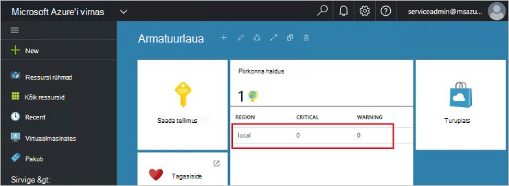
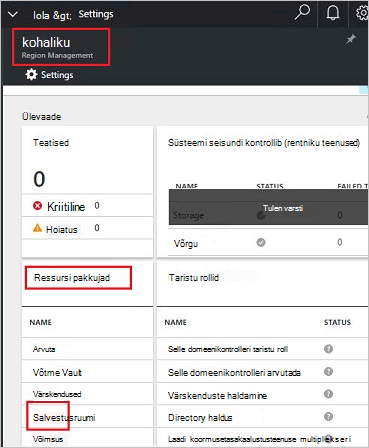
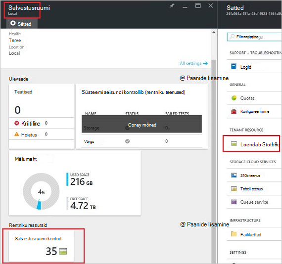
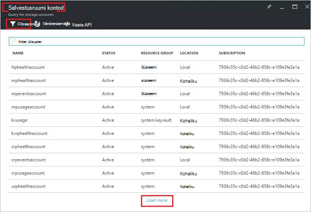
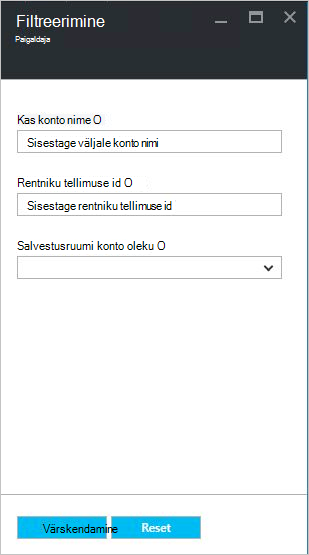
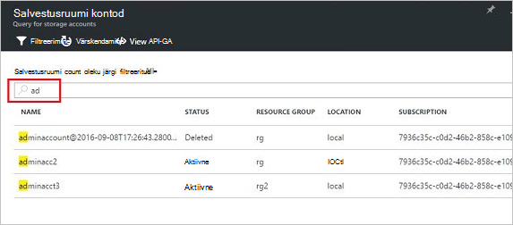
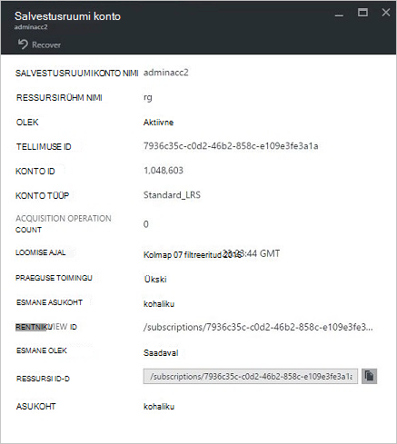
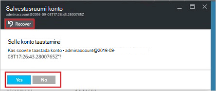
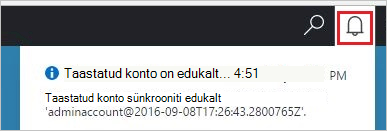
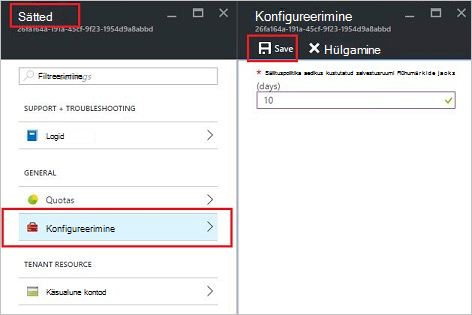

<properties
    pageTitle="Azure'i virnas salvestusruumi kontod haldamine | Microsoft Azure'i"
    description="Saate teada, kuidas leida, hallata, taastada ja nõuda Azure'i virnas salvestusruumi kontod"
    services="azure-stack"
    documentationCenter=""
    authors="AniAnirudh"
    manager="darmour"
    editor=""/>

<tags
    ms.service="azure-stack"
    ms.workload="na"
    ms.tgt_pltfrm="na"
    ms.devlang="na"
    ms.topic="get-started-article"
    ms.date="09/26/2016"
    ms.author="anirudha"/>

# <a name="manage-storage-accounts-in-azure-stack"></a>Salvestusruumi kontod Azure virnas haldamine

Saate teada, kuidas hallata salvestusruumi kontod Azure'i virnas otsimine, taastada ja nõuda mälumaht vastavalt ettevõtte vajadustele.

## <a name="find-a-storage-account"></a>Salvestusruumi konto otsimine

Azure'i virnas, saab vaadata piirkonna salvestusruumi kontode loendis on:

1.  Liikuge brauseris internet [https://portal.azurestack.local](https://portal.azurestack.local/).

2.  Azure'i virnas portaali sisse logima administraatorina (andsite juurutamisel mandaadi abil)

3.  Vaikimisi armatuurlaual – **piirkond halduse** loendit üles leida ja klõpsake soovitud piirkond, mida soovite uurida – näiteks **(kohalik**).

    

4.  Valige loendist **Ressursi pakkujad** **salvestusruumi** .

    

5.  Nüüd salvestusruumi ressursi pakkuja administraator enne – liikuge kerides allapoole jaotiseni "Salvestusruumi kontod" vahekaarti ja klõpsake seda.

    
    
    Järgneval lehel on selle piirkonna salvestusruumi kontode loend.

    

Vaikimisi kuvatakse esimese 10 kontod. Soovi korral saate lisateavet toomiseks klõpsates loendi allservas link "laadida rohkem" <br>
VÕI <br>
Kui olete huvitatud teatud salvestusruumi konto – saate **filtreerida ja toomiseks oluline kontod** ainult.<br>

Filtreerimiseks kontode puhul:

1. Klõpsake nuppu filter tera ülaosas.

2. Enne filter, see võimaldab teil **konto nimi**,  **Tellimuse ID** või **oleku** täpsustada salvestusruumi kontode loend, kuvatakse määramiseks. Kasutage neid vastavalt vajadusele.

3. Klõpsake nuppu Värskenda. Loendi peaks vastavalt värskendada.

    

4. Filtri lähtestamine – klõpsake nuppu filter, tühjendage välja soovitud valikud ja värskendada.

Otsingu tekstivälja peal salvestusruumi kontode loend tera, saate kontode loendis on valitud teksti esile tõsta. See on väga käepärane juhul, kui täielik nimi või id pole kerge vaevaga saadaval.<br>
Olete huvitatud konto leidmiseks saate tasuta tekst.




## <a name="look-at-account-details"></a>Vaadake konto üksikasjad

Kui olete huvitatud vaatamise kontode asuv saate klõpsata kindla konto üksikasjade kuvamiseks. Uue tera avaneb konto üksikasjad tüüpi konto, loomise ajal, asukoha jne.




## <a name="recover-a-deleted-account"></a>Kustutatud konto taastamine

Teil võib olla olukorras, kus soovite taastada kustutatud konto.<br>
AzureStack on väga lihtne viis seda teha.

1.  Liikuge loendis salvestusruumi kontod liikumine [Vt salvestusruumi konto otsimine](#find-a-storage-account)

2.  Otsige loendist üles kindla konto. Võimalik, et peate filtreerida.

3.  Konto oleku kontrollimine Peaks olema kirjas "kustutatud".

4.  Klõpsake konto, mis avab konto üksikasjad tera.

5.  Peale selle tera-leidke "tagasi" nuppu ja klõpsake seda.

6.  Kinnitage vajutades "Jah"

    

7.  On nüüd protsessi... oodata märge, et see õnnestus.
    Võite klõpsata ka ikooni "pill" edenemise tähiste kuvamine portaalis ülaosas.

    

  Kui taastatud konto on edukalt sünkroonitud, saate ühte tagasi minna seda kasutama.

### <a name="some-gotchas"></a>Mõned komistuskive saavutamisel

- Kustutatud konto on kuvatud olek "välja säilitus".

  See tähendab, et kustutatud konto on ületanud säilitusperiood ja ei pruugi olla Taastatavad enam.

- Kustutatud konto kontode loendis ei kuvata.

  See võib kustutatud konto on juba mälust eemaldatud. Sel juhul ei saa taastada enam. Allpool "nõuda võimsus".

## <a name="set-retention-period"></a>Säilitusperiood määramine

Säilitamise periood säte võimaldab administraator, saate määrata teatud ajavahemiku päeva (vahemikus 0 – 9999 päeva) jooksul kustutatud konto potentsiaalselt taastada. Säilitusperiood vaikimisi on seatud 15 päeva. "0" tähendab, et kõik kustutatud konto on kohe välja säilitamise ja märgitud perioodiliste Prügikoristus seadmine väärtus.

Säilitusperiood – muutmiseks

1.  Liikuge brauseris internet [https://portal.azurestack.local](https://portal.azurestack.local/).

2.  Azure'i virnas portaali sisse logima administraatorina (andsite juurutamisel mandaadi abil)

3.  Vaikimisi armatuurlaual – **piirkond halduse** loendit üles leida ja klõpsake soovitud piirkond, mida soovite uurida – näiteks **(kohalik**).

4.  Valige loendist **Ressursi pakkujad** **salvestusruumi** .

5.  Klõpsake avamiseks säte tera ülaosas ikooni sätted.

6.  Klõpsake konfiguratsiooni - säilitusperiood.

7.  Saate redigeerida väärtus ja salvestage see.

 See väärtus oleks kohe tõhus ja kajastuvad kõigis teie kogu regioonis.



## <a name="reclaim-capacity"></a>Nõuda võimsus

Üks pool, millel on säilitusperiood efektid on kustutatud konto jätkab seni, kuni see väljub säilitusperiood peab olema võimsus. Nüüd administraatorina, peate võib-olla nii, et see taastada kustutatud kontod ruumi isegi juhul, kui säilitusperiood ei ole veel aegunud. Praegu saate mõne käsurea konkreetselt säilitusperiood ja kohe nõuda võimsus. Selleks –

1.  Eeldades, et te Azure PowerShelli installinud ja konfigureerinud. Kui ei, järgige juhiseid siin: Azure'i PowerShelli uusima versiooni installimiseks ja seostada Azure tellimuse, teada, [Kuidas installida ja konfigureerida Azure PowerShelli](http://azure.microsoft.com/documentation/articles/powershell-install-configure/).
    Azure'i ressursihaldur cmdlet-käskude kohta leiate lisateavet teemast [Azure ressursihaldur Azure PowerShelli kasutamine](http://go.microsoft.com/fwlink/?LinkId=394767)

2.  Käivitage see cmdlet-käsk:

    ```
    PS C:\\>; Clear-ACSStorageAccount -ResourceGroupName system
    -FarmName <your farmname>
    ```

> Lisateabe saamiseks vaadake [AzureStack PowerShelli dokumentatsioon](https://msdn.microsoft.com/library/mt637964.aspx)

> [AZURE.NOTE] Cmdlet-käsu käitamine jäädavalt kustutada konto ja selle sisu. See pole enam Taastatavad. Kasutage hoolikalt.

