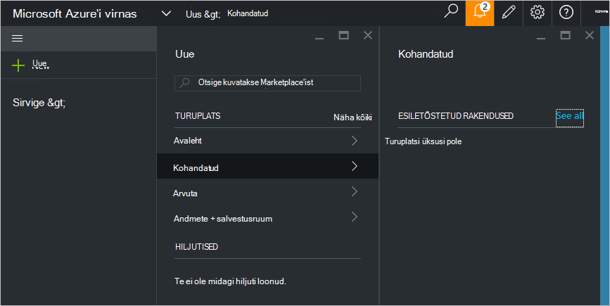

<properties
    pageTitle="Kohandatud turuplatsi üksuse avaldada Azure virnas (teenuse administraator) | Microsoft Azure'i"
    description="Teenuse administraator, saate teada, kuidas avaldada kohandatud turuplatsi üksuse Azure'i virnas."
    services="azure-stack"
    documentationCenter=""
    authors="rupisure"
    manager="byronr"
    editor=""/>

<tags
    ms.service="azure-stack"
    ms.workload="na"
    ms.tgt_pltfrm="na"
    ms.devlang="na"
    ms.topic="article"
    ms.date="09/26/2016"
    ms.author="rupisure"/>

# Virnas Azure'i turuplats

Kuvatakse Marketplace'ist on kohandatud Azure'i virnas, nt teenuste, rakenduste ja -ressursside üksuste kogum. See on koht, kus rentnikud tulla luua uusi ressursse ja kasutusele võtta uued rakendused. Teenuseadministraatorid saate lisada kohandatud üksuste turuplatsi ja rentnikud neid näha kohe.

Kuvatakse Marketplace'ist avamiseks klõpsake nuppu **Uus**.

Kuvatakse Marketplace'ist värskendatakse iga viie minuti järel.

## Turuplatsi üksused

Iga turuplatsi üksus on.

-   Azure'i ressursihaldur modulo ressursside ettevalmistamine

-   Metaandmete, nt stringide, ikoonid ja muu turundustegevuse tagatis

-   Vorminguteavet portaalis üksuse kuvamiseks

Iga üksuse, kuvatakse Marketplace'ist avaldatud vormingus ehk Azure'i Galerii pakett (azpkg). Juurutamise või käitusaja ressursid (nt kood, tarkvara või virtuaalse masina pildid zip-failid) tuleks lisada Azure virnas eraldi, mitte turuplatsi üksuse osana. 

## Järgmised sammud

[Luua ja avaldada turuplatsi üksus](azure-stack-create-and-publish-marketplace-item.md)
