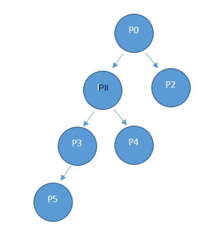

<properties
    pageTitle="Pakkuja ressursikasutus API | Microsoft Azure'i"
    description="Viide ressursikasutus API, mis tuua Azure'i Virnlintdiagrammil kasutamise kohta."
    services="azure-stack"
    documentationCenter=""
    authors="AlfredoPizzirani"
    manager="byronr"
    editor=""/>

<tags
    ms.service="azure-stack"
    ms.workload="na"
    ms.tgt_pltfrm="na"
    ms.devlang="na"
    ms.topic="article"
    ms.date="10/18/2016"
    ms.author="alfredop"/>

# Pakkuja ressursikasutus API

Termini pakkuja kehtib teenuse administraator ja mis tahes delegeeritud pakkujad. Teenuse ja delegeeritud pakkujate abil saate pakkuja kasutus API vaadata nende otsese rentnikud kasutamist. Näiteks P0 saate helistada pakkuja API kasutamine teavet P1 ja P2 on otsene kasutamine ja P1 saate helistada P3 ja P4 kasutusteavet.

## API kõne viide

### Taotlemine

Kutse saab tarbimine üksikasjad nõutud tellimused ja nõutud aja jooksul. Ei ole taotluse keha.

See kasutus API on pakkuja API, helistaja peab olema määratud teenusepakkuja tellimuse omanik, kaasautor või lugeja rolli.

| **Meetod**  | **Taotluse URI** |
| ------------ | ------------------------------------------------------------------------------------------------------------------------------------------------------------------------------------------------------------------------------------------------------------------------------------------------------ |
|  HANKIMINE        | https://{armendpoint}/subscriptions/{subId}/providers/Microsoft.Commerce/subscriberUsageAggregates?reportedStartTime={reportedStartTime}&reportedEndTime={reportedEndTime}&aggregationGranularity={granularity}&subscriberId={sub1.1}&api-version=2015-06-01-preview&continuationToken={token-value} |

### Argumendid

| **Argument**              | **Kirjeldus** |
| -------------------------- | --------------------------------------------------------------------------------------------------------------------------------------------------------------------------------------------------------------------------------------------------------------------------------------------------------------------------------------------------------- |
| *armendpoint*             | Azure'i ressursihaldur Azure'i virnas keskkonna lõpp-punktile. Azure'i virnas mess on ARM lõpp-punkti nimi on https://api vorming. {domeeninime} ". Näiteks kui domeeninimi on azurestack.local, siis ARM lõpp-punkti on https://api.azurestack.local. |
| *subId*                   | Tellimuse ID kasutaja teeb kõne. |
| *reportedStartTime*       | Päringu alguskellaaeg. Väärtus *DateTime* tuleks UTC-vormingus ja tunni, näiteks 13:00 alguses. Igapäevane liitmiseks, määrake selle väärtuseks UTC keskööst. Vorming on *pääsenud* ISO 8601, näiteks 2015-06-16T18% 3a53% 3a11% 2b00% 3a00Z, kus on koolon põgenes 3% ja pluss on põgenes % 2b nii, et see on sõbralik URI. |
| *reportedEndTime*         | Päringu lõppkellaaeg. Piiranguid, mis rakenduvad *reportedStartTime* rakendada ka seda argumenti. *ReportedEndTime* väärtus ei saa olla tulevikus. |
| *aggregationGranularity*  | Valikuline parameeter, mis sisaldab kahte eraldi võimalikud väärtused: iga päev ja tunnis. Nagu väärtused soovitamine, üks tagastab andmed igapäevane granulaarsus ja teine on mõne tunni eraldusvõime. Vaikimisi on iga päev suvand. |
| *subscriberId*            | Tellimuse ID-ga. Filtreeritud andmete toomine otse rentniku pakkuja Tellimuse ID on nõutav. Kui määratud pole tellimuse ID parameeter, tagastab kõne kasutusandmete kõik pakkuja otsese rentnikke. |
| *API-versioon*             | Mida saab teha taotlus-protokolli versiooni. Kasutage 2015-06-01-eelvaade. |
| *continuationToken*       | Luba vormilt kasutus API pakkuja viimase kõne. See on vajalik, kui vastus on suurem kui 1000 jooned. See on pooleli jaoks järjehoidja. Kui ei esine andmed tuuakse päeva alguses või tunni, võttes aluseks granulaarsus edasi. |

### Vastus

SAADA /subscriptions/sub1/providers/Microsoft.Commerce/subscriberUsageAggregates?reportedStartTime=reportedStartTime=2014-05-01T00%3a00%3a00%2b00%3a00 & reportedEndTime = 2015-06-01T00% 3a00% 3a00% 2b00% 3a00 & aggregationGranularity = iga päev & subscriberId = sub1.1 & api-versiooni = 1.0

{

"value":\[

{

"id": "/subscriptions/sub1.1/providers/Microsoft.Commerce/UsageAggregate/sub1.1-

meterID1 ",

"nimi": "sub1.1 meterID1"

"tüüp": "Microsoft.Commerce/UsageAggregate"

"atribuudid": {}

"subscriptionId": "sub1.1"

"usageStartTime": "2015-03-03T00:00:00 + 00:00",

"usageEndTime": "2015-03-04T00:00:00 + 00:00",

"instanceData": "{\\" Microsoft.Resources\\": {\\" resourceUri\\":\\" resourceUri1\\",\\"asukoht\\

":\\" Alaskat\\",\\" siltide\\": null,\\" additionalInfo\\": null}}",

"kogus":2.4000000000,

"meterId": "meterID1"

}

},

…

### Vastuse üksikasjad

| **Argument**       | **Kirjeldus**
| ------------------ | ------------------------------------------------------------------------------------------------------------- |
| *ID*               | Kasutus kokku Ainuidentifikaator
| *Nimi*             | Kasutus liitmise nimi
| *tüüp*             | Ressursside määratlemine
| *subscriptionId*   | Azure'i virnas kasutaja tellimuse ainuidentifikaator
| *usageStartTime*   | UTC alguskellaaeg kasutus ämber, kuhu see kasutus aggregate kuulub
| *usageEndTime*     | UTC lõppaega, kuhu see kasutus aggregate kuulub kasutus ämber
| *instanceData*     | Võti ja väärtuse paarideks eksemplari üksikasjade (uus vormingus):  *resourceUri*: nõuetele täielikult vastav ressursi ID, mis sisaldab ressursi rühmad ja eksemplari nimi   *asukoht*: piirkond, kus on selle teenuse käivitamine   *Sildid*: ressursi sildid, mis on määratud kasutajale   *additionalInfo*: rohkem üksikasju kohta ressursi tarbitud, näiteks OS versioon või pildi tüüp |
| *kogus*         | Ressursside tarbimine toimunud selle aja jooksul |
| *meterId*          | Ainu-ID ressurss, mis oli tarbitud (nimetatakse ka kui *ResourceIdkasutamisel*) |

## Järgmised sammud

[Rentniku ressursikasutus API viide](azure-stack-tenant-resource-usage-api.md)

[Kasutus-seotud KKK](azure-stack-usage-related-faq.md)
