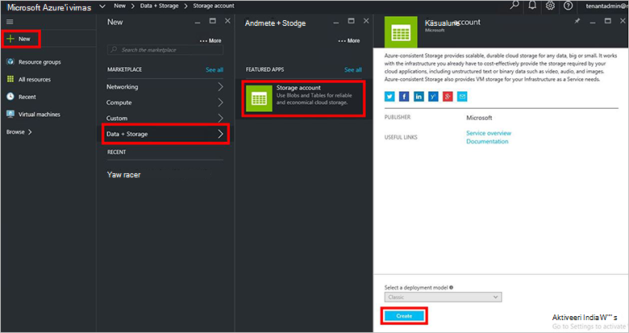
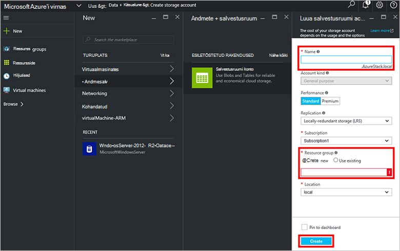
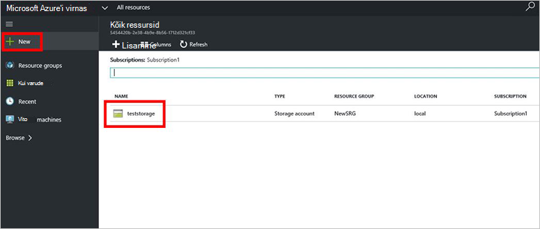

<properties
    pageTitle="Salvestusruumi kontod Azure'i virnas | Microsoft Azure'i"
    description="Saate teada, kuidas luua konto Azure virnas salvestusruumi."
    services="azure-stack"
    documentationCenter=""
    authors="ErikjeMS"
    manager="byronr"
    editor=""/>

<tags
    ms.service="azure-stack"
    ms.workload="na"
    ms.tgt_pltfrm="na"
    ms.devlang="na"
    ms.topic="get-started-article"
    ms.date="09/26/2016"
    ms.author="erikje"/>

# Azure'i virnas salvestusruumi kontod

Salvestusruumi sisaldavad bloobimälu ja tabel ning teie salvestusruumi andmeobjektid kordumatu nimeruumi. Vaikimisi on saadaval ainult teie salvestusruumi konto omanik teie konto andmeid.

1.  Azure'i virnas POC arvutisse sisse logida `https://portal.azurestack.local` [administraator](azure-stack-connect-azure-stack.md#log-in-as-a-service-administrator)ja seejärel klõpsake käsku **Uus** > **andmete + salvestusruumi** > **salvestusruumi konto**.

    

2.  **Loo salvestusruumi konto** tera, tippige oma salvestusruumi konto nimi. Luua uue **Ressursirühma**, või valige olemasoleva seejärel nuppu **Loo** konto salvestusruumi loomiseks.

    

3. Salvestusruumi kontosse vaatamiseks klõpsake nuppu **kõik ressursid**, siis salvestusruumi konto otsida ja klõpsake selle nime.

    
    
## Järgmised sammud

[Azure'i ressursihaldur mallide kasutamine](azure-stack-arm-templates.md)

[Lisateavet Azure salvestusruumi kontod](../storage/storage-create-storage-account.md)

[Azure'i virnas Azure'i ühtsete salvestusruumi valideerimine juhendi allalaadimiseks](http://aka.ms/azurestacktp1doc)
