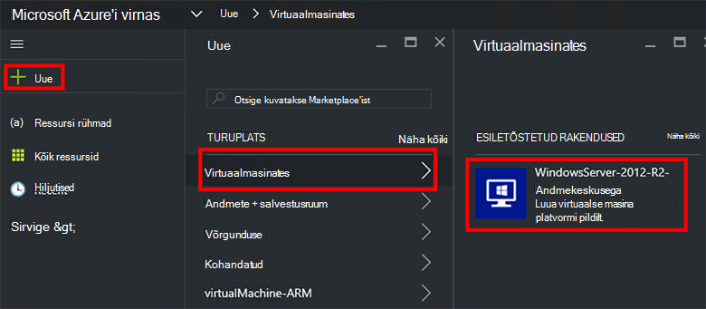
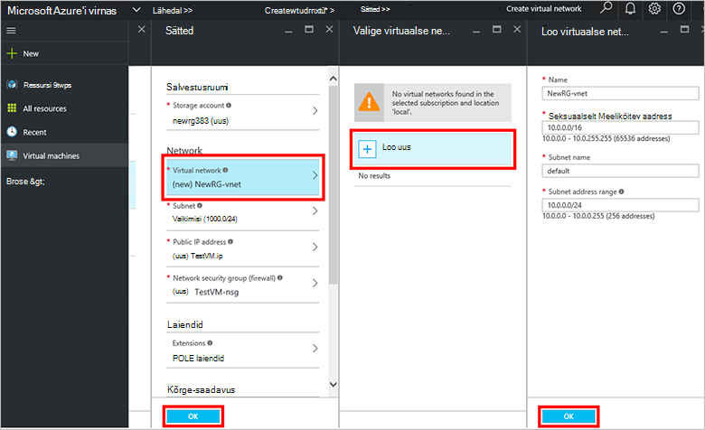
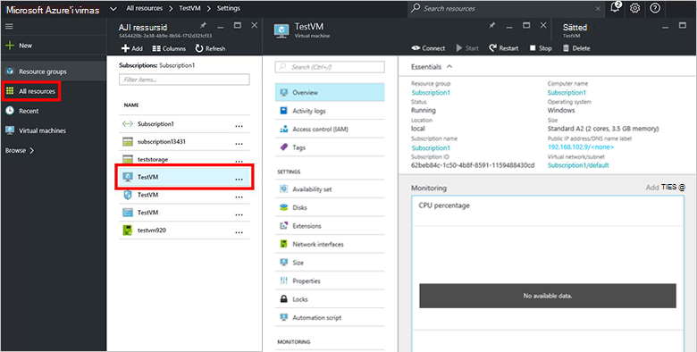

<properties
    pageTitle="Ettevalmistamise VM Azure virnas (rentnik) | Microsoft Azure'i"
    description="Rentniku jaoks, kui saate teada, kuidas ette valmistada VM Azure virnas."
    services="azure-stack"
    documentationCenter=""
    authors="ErikjeMS"
    manager="byronr"
    editor=""/>

<tags
    ms.service="azure-stack"
    ms.workload="na"
    ms.tgt_pltfrm="na"
    ms.devlang="na"
    ms.topic="get-started-article"
    ms.date="10/12/2016"
    ms.author="erikje"/>

# Virtuaalse masina ettevalmistamine

Administraatorina saate luua virtuaalmasinates hinnata ressursid enne nende pakkumine lepingutes.

## Virtuaalse masina ettevalmistamine

1.  Azure'i virnas POC arvutisse sisse logida `https://portal.azurestack.local` [administraator](azure-stack-connect-azure-stack.md#log-in-as-a-service-administrator)ja seejärel klõpsake käsku **Uus** > **virtuaalmasinates** > **WindowsServer 2012 – R2 andmekeskuse**.  

    

2.  **Põhitõed** tera, tippige **nimi**, **kasutajanimi**ja **parool**. **VM ketta tüüp**, valige **HDD**. Valige **tellimus**. **Ressursirühm**, loomine või valige olemasoleva ja seejärel klõpsake nuppu **OK**.  

3.  **Valige suurus** labale nuppu **Tavaline A1**ja klõpsake **Valige**.  

4.  Klõpsake **sätete** labale **Virtual network**. **Valige virtuaalse võrgu** labale nuppu **Loo uus**. **Loo virtuaalse võrgu** labale Aktsepteeri kõik vaikesätted ja klõpsake nuppu **OK**. Tera **sätted** , klõpsake nuppu **OK**.

    

5.  Klõpsake **OK** , et luua virtuaalse masina labale **Kokkuvõte** .  

6. Virtuaalne seadme vaatamiseks klõpsake nuppu **kõik ressursid**, virtuaalse masina otsimine ja klõpsake selle nime.

    

## Järgmised sammud

[Salvestusruumi kontod](azure-stack-provision-storage-account.md)
