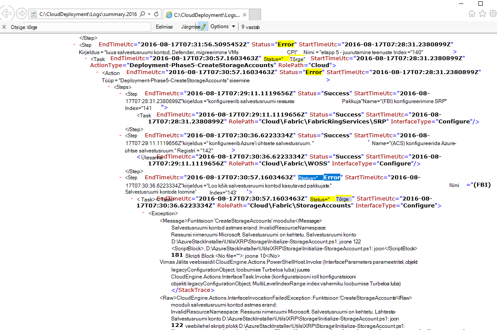

<properties
    pageTitle="Käivitage uuesti juurutamine nurjunud juhise juurest | Microsoft Azure'i"
    description="Tõrke ilmnemisel juurutamise käigus võite proovida järgmist uuesti juurutus, kus see nurjus."
    services="azure-stack"
    documentationCenter=""
    authors="ErikjeMS"
    manager="byronr"
    editor=""/>

<tags
    ms.service="azure-stack"
    ms.workload="na"
    ms.tgt_pltfrm="na"
    ms.devlang="na"
    ms.topic="get-started-article"
    ms.date="09/26/2016"
    ms.author="erikje"/>
    
# Käivitage uuesti nurjunud juhise juurest juurutamine
  
Tõrke ilmnemisel juurutamise käigus võite proovida järgmist uuesti juurutus, kus see nurjus.

## Selle otsimine

Võtke teadmiseks tõrge, spetsiaalselt osa, mis nõuab tähelepanu mis toimingu juures olevat kutsumise nurjus. Näiteks

**2016-08-17 00:30:57 tõrge 1 > 1 > toiming: kutsumise toiming 60.140.143 nurjus. Tegevuskava kutsumise peatamine.**

See on juurutamise etappi, kui hakkate Käivita uuesti, kasutuselevõtu.

## Selle tõrke kohta rohkem üksikasju otsimine

Kui soovite lisateavet selle tõrke kohta, otsige seotud **Kokkuvõte. YYYY-MM-DD.tt.N.log.xml** klõpsake soovitud **C:\CloudDeployment\Logs\* * kausta.
Otsida stringi "Tõrge" ja järgige selle alla kuni väljund seni, kuni näete suurt hulka vormindatud XML-tekst, mis sisaldab tõrketeate (see jaotis sageli langeb kokku viimase astme string "Tõrge"). Näiteks:

Saate seda teavet jälgida Käivita uuesti etappi, "Index" arvud järeltegevus selle viimase tõrke. Ülaltoodud pildil näete (alates all): 143, 140 ja siis kui ülespoole kerimine, kuvatakse 60:

Pannes selle kõik koos (nüüd ülalt alla), saate 60.140.143, nagu PS konsooli väljund tõrke (nagu näha ülal jaotises "Otsimine tõrge").

## Käivitage uuesti juurutamise teatud toimingu juures

Nüüd, kui teil on toiming, mille juurutamise nurjus, võite proovida – Käivita uuesti kasutuselevõtu selle juhise juurest.

> [AZURE.IMPORTANT] Õige kasutaja kontekstis toimunud korral peate käivitama järgmised käsud. Kui tõrge ilmnes enne selle HOSTI on ühendatud domeeni, käivitada kohaliku administraatorikonto järgmist. Kui tõrge ilmnes pärast selle HOSTI on ühendatud domeeni, käivitage neid juhiseid domeeni administraatorina (azurestack\azurestackadmin).

### Invoke-EceAction käsu täitmine

1. Laiendatud PS konsooli, importida järgmisi mooduleid.

        Import-Module C:\CloudDeployment\CloudDeployment.psd1 -Force
        Import-Module C:\CloudDeployment\ECEngine\EnterpriseCloudEngine.psd1 -Force 

2. Seejärel käivitage järgmine käsk (nt kasutatud siin ülevalt):

        Invoke-EceAction -RolePath Cloud -ActionType Deployment -Start 60.140.143 -Verbose

3.  See alustab juurutamise tuvastatud juhises parameetriga - Start käsk Invoke-EceAction

### Tulemuste – Käivita uuesti/alustada.

Sõltumata suvandi valite, juurutamise alustab uuesti alustamiseks määratud - parameeter.

1.  Kui tõrge on Taastatavad, jätkavad juurutamise lõpetamise kaudu.

2.  Kui juurutamise nurjub uuesti...
    
    - samas kohas: seda ei tõenäoliselt Taastatavad ja lähemalt uurida on nõutav.

    - PÄRAST, kui see ei ole Seekord uus koht: saate proovida saada läheb uuesti samad juhised.

    - ENNE, kui see ei ole Seekord uus koht: midagi läks valesti idempotent kõne, mis nõuab täiendavaid uurimine.

## Järgmised sammud

[Ühenduse loomine Azure virnas](azure-stack-connect-azure-stack.md)

