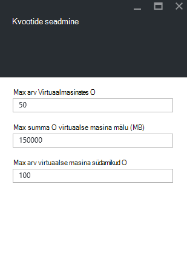

<properties
    pageTitle="Azure'i virnas kvootide | Microsoft Azure'i"
    description="Administraatorid määrata kvootide piirata suurt hulka ressursse, mis rentnikud on juurdepääs."
    services="azure-stack"
    documentationCenter=""
    authors="mattmcg"
    manager="byronr"
    editor=""/>

<tags
    ms.service="azure-stack"
    ms.workload="na"
    ms.tgt_pltfrm="na"
    ms.devlang="na"
    ms.topic="get-started-article"
    ms.date="09/26/2016"
    ms.author="mattmcg"/>

# Azure'i virnas määramine kvoote

Kvootide määratleda ressursid, millest rentniku tellimuse saate ettevalmistamise või tarbimine piirid. Näiteks kvoodi võib lubada rentniku jaoks luua kuni viis VMs. Teenuse lisamiseks leping, peab administraator selle teenuse kvoodi sätete konfigureerimine.

Kvootide on konfigureeritav teenuse ja lubamine administraatorid Varundustöö kontrolliks ressursside tarbimine asukoha kohta. Administraatorid saate luua ühe või mitme kvoodi ressursid ja seostada lepingud, mis tähendab, et nad võivad pakkuda nende teenuste liigendatud pakkumisi. Kvootide antud teenuse saab luua selle teenuse keelest **Ressursi pakkuja** haldus.

Rentniku, mis toetab pakkumise, mis sisaldab mitut lepingute saate kasutada kõigi ressursse, mis on saadaval iga leping.

## Mõne IaaS kvoodi loomiseks

1.  Avage brauseris, [https://portal.azurestack.local](https://portal.azurestack.local/).

    Logige sisse Azure'i virnas portaali administraatorina (mandaadiga juurutamisel sisestatud).

2.  Valige **Uus**ja seejärel valige **kvoodi**.

3.  Valige esimene teenus, mille jaoks soovite luua kvoodi. Mõne IaaS kvoodi tehke Arvuta, võrgu ja salvestusruumi teenuste jaoks.
Selles näites kõigepealt looma piirmäära Arvuta teenuse. Valige loendis **Namespace** **Microsoft.Compute.Admin** nimeruumi.

    > 

4.  Valige asukoht, kus on määratletud kvoodi (nt "kohaliku").

5.  Üksusel **Kvoodi sätted** on kirjas **määratud kvoodi võimsus**. Klõpsake selle üksuse kvoodi sätete konfigureerimine.

6.  Enne **Kvootide seadmine** , kuvatakse kõik Arvuta ressursid, kus saate konfigureerida piirangud. Iga tüüp on vaikeväärtus, mis on seotud. Saate muuta need väärtused või valida allosas tera vaikesätete kinnitamiseks nuppu **Ok** .

    > 

7.  Kui olete konfigureerinud väärtused ja **Ok**klõpsamisel, kuvatakse **Kvoodi sätted** üksust **Configured**. Klõpsake nuppu **Ok** **kvoodi** ressursside loomiseks.

    Peaksite nägema teade selle ressursi kvoodi luuakse.

8.   Pärast kvoodi määramine on loodud, saate teise teate. Arvuta teenuse kvoodi on seotud lepingu valmis. Korrake neid juhiseid võrgu- ja teenuste ja olete valmis looma tegevuskava IaaS!

    >   

## Arvutage kvoodi tüübid

|**Tüüp**                    |**Vaikeväärtus**| **Kirjeldus**|
|--------------------------- | ------------------------------------|------------------------------------------------------------------|
|Max arv virtuaalmasinates   |50|Selles asukohas tellimuse loodud virtuaalmasinates maksimaalne arv. |
|Max arv virtuaalse masina valdkond              |100|Suurim lubatud arv selles asukohas tellimuse loodud valdkond (nt mõne A3 VM on neli protsessorituuma).|
|Max virtuaalse masina mälu (GB) hulk         |150|Suurt hulka RAM-i, mis võivad ette valmistatud megabaitides (nt A1 VM-i tarbib 1,75 GB RAM).|

> [AZURE.NOTE] Arvutage kvootide on ei kehti selle tehnilise eelvaate.

## Mäluruumi kvoot tüübid

|**Üksuse**                           |**Vaikeväärtus**   |**Kirjeldus**|
|---------------------------------- |------------------- |-----------------------------------------------------------|
|Maksimaalne maht (GB)              |500                 |Kokku mälumaht, saate tarbitud tellimuse selles asukohas.|
|Koguarvu salvestusruumi kontod   |20                  |Salvestusruumi kontod selles asukohas tellimuse loodud maksimaalne arv.|

## Võrgu kvoodi tüübid

|**Üksuse**                                                   |**Vaikeväärtus**   |**Kirjeldus**|
|----------------------------------------------------------| ------------------- |--------------------------------------------------------------------------------------------------------------------------------------------------------------------|
| Max avaliku IP-d                         |50                  |Suurim arv avaliku IP-aadressi selles asukohas tellimuse loodud. |
| Max virtuaalne võrkude                   |50                  |Virtuaalne võrkude selles asukohas tellimuse loodud maksimaalne arv. |
| Max virtuaalse võrgu lüüsid           |1                   |Virtuaalse võrgu lüüside (VPN lüüsid) selles asukohas tellimuse loodud maksimaalne arv. |
| Max võrguühenduste                |2                   |Võrguühenduste (kakspunkt või saidilt) üle kõik virtuaalse võrgu lüüside selles asukohas tellimuse loodud maksimumarv. |
| Max koormus soolise                     |50                  |Selles asukohas tellimuse loodud koormus soolise maksimaalne arv. |
| Max NICs                               |100                 |Võrgu liidesed selles asukohas tellimuse loodud maksimaalne arv. |
| Max võrgu turberühmad            |50                  |Tellimust saate luua selles asukohas võrgu turberühmad maksimaalne arv. |
