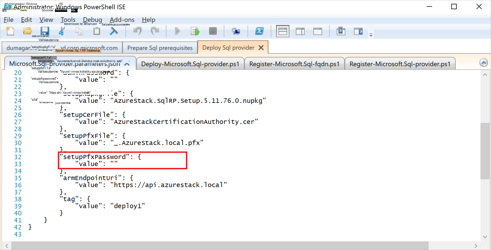

<properties
    pageTitle="SQL serveri ressursi pakkuja kohta Azure virnas juurutamine | Microsoft Azure'i"
    description="Üksikasjalikud juhised juurutada SQL serveri ressursi pakkuja adapterit Azure'i virnas kohta."
    services="azure-stack"
    documentationCenter=""
    authors="Dumagar"
    manager="byronr"
    editor=""/>

<tags
    ms.service="multiple"
    ms.workload="na"
    ms.tgt_pltfrm="na"
    ms.devlang="na"
    ms.topic="article"
    ms.date="09/26/2016"
    ms.author="dumagar"/>

# SQL serveri ressursi pakkuja adapterit Azure virnas juurutamine

> [AZURE.NOTE] Järgmine teave kehtib ainult Azure virnas TP1 juurutuste.

Selles artiklis abil SQL serveri ressursi pakkuja adapterit Azure'i virnas toimetulekuks mõistet (POC) häälestamise üksikasjalikud juhised. Vaadake [SQL Azure'i virnas andmebaaside kasutamine](azure-stack-sql-rp-deploy-short.md) mõista ressursi pakkuja võimalusi ja arhitektuur.

## Enne juurutamist juhiseid häälestamine

Enne juurutamist ressursi pakkuja, peate:

- Windows Server vaikepildi koos .NET 3.5 on
- Internet Explorer (IE) täiustatud turvalisus väljalülitamine
- Installige uusim versioon Azure PowerShell

### Windows Server, sh 3,5 .NET pildi loomine

Kui laadisite Azure'i virnas bittide pärast 2/23/2016 Windows Server 2012 R2 base vaikepilt sisaldab .NET 3.5 framework selle alla laadida ja selle uuemates versioonides saate selle sammu vahele jätta.

Kui laadisite enne 2/23/2016, peate looma Windows Server 2012 R2 andmekeskuse VHD .NET 3.5 pildiga ja on platvormi pilt hoidlas pilti.

### Lülita IE täiustatud turvalisus ja luba küpsised

Ressursi pakkuja juurutamiseks käivitate teenuse PowerShell integreeritud skriptimise keskkonnas (ISE) administraatorina, nii, et peate esmalt lubama küpsiste ja JavaScripti Internet Exploreri profiili abil saate sisse logida Azure Active Directory nii administraator ja kasutajale sisselogimist.

**IE välja lülitada tõhustatud turvalisus:**

1. Azure'i virnas tõendada mõiste (PoC) arvutisse AzureStack/administraatorina sisse logida ja avage serveri haldur.

2. **IE täiustatud turvalisus konfiguratsiooni** välja lülitada nii administraatoritele ja kasutajatele.

3. **ClientVM.AzureStack.local** virtual arvutisse administraatorina sisse logida ja avage serveri haldur.

4. **IE täiustatud turvalisus konfiguratsiooni** välja lülitada nii administraatoritele ja kasutajatele.

**Küpsiste lubamine**

1. Windowsi avakuvale, käsku **Kõik rakendused**, valige **Windowsi tarvikud**, paremklõpsake **Internet Exploreri**, osutage käsule **veel**ja seejärel klõpsake käsku **Käivita administraatorina**.

2. Kui kuvatakse vastav viip, kontrollige **soovitatav kasutada turvalisus**ja seejärel klõpsake nuppu **OK**.

3. Internet Exploreris valige **Tööriistad (hammasrattaikoon)** &gt; **Interneti-suvandid** &gt; vahekaarti **Privaatsus** .

4. Klõpsake nuppu **Täpsemalt**, veenduge, et mõlemad nupud **Aktsepteeri** valitud, klõpsake nuppu **OK**ja seejärel uuesti nuppu **OK** .

5. Sulgege Internet Explorer ja taaskäivitage PowerShell ISE administraatorina.

### Installige Azure'i virnas ühilduvad väljaanne Azure PowerShell

1. Desinstallige kõik olemasolevad Azure PowerShelli oma kliendi VM.

2. Logige sisse Azure'i virnas POC masina AzureStack/administraatorina.

3. Kaugtöölaua kasutamisel sisselogimiseks **ClientVM.AzureStack.local** virtual arvutisse administraatorina.

4. Avage juhtpaneel, klõpsake käsku **Desinstalli programm** &gt; klõpsake **Azure PowerShelli** &gt; klõpsake käsku **desinstalli**.

5. [Uusim Azure PowerShelli, mis toetab Azure virnas alla laadida](http://aka.ms/azstackpsh) ja installida.

    PowerShelli installimist käivitada kontrolli PowerShelli skripti, veenduge, et saate luua ühenduse oma Azure'i virnas eksemplari (peaks kuvatama veebilehele Logi sisse).

## Ressursi pakkuja juurutamise PowerShelli bootstrap

1. Azure'i virnas POC kaugtöölaua ühenduse clientVm.AzureStack.Local ja logige sisse azurestack\\azurestackuser.

2. [Laadi SQLRP kahendfaile](http://aka.ms/massqlrprfrsh) fail. Kui peate Internet allalaadimine turvalisus blokeerimise eemaldamiseks paremklõpsake faili, valige **Atribuudid** ja vahekaardil **üldist** , märkige **Aktiveeri**, **OK**. See peaks ära DeploymentTelemetry.dll ja edaspidised Jälita-juurutamise erandid seotud 'Ei saa laadida faili või komplekteerimine' erandid.

3. Väljavõte failid D:\\SQLRP.

4. D: käivitada\\SQLRP\\Bootstrap.cmd faili administraatorina (azurestack\\administraator).

    Selle tegemisel avaneb Bootstrap.ps1 faili PowerShell ISE.

5. Kui PowerShell ISE akna laadimise lõpule jõudnud, klõpsake nuppu Esita või vajutage klahvi F5.

    

    Kaks põhilist vahekaarti laaditakse iga sisaldavad skripte ja failide juurutamiseks ressursi pakkuja.

## Ettevalmistused eeltingimused

Klõpsake vahekaarti **Ettevalmistamine eeltingimused** :

- Nõutav sertide loomine
- Azure'i virnas salvestusruumi kontot esemeid üleslaadimine
- Galerii üksuste avaldamine

### Nõutav sertide loomine
See **New-SslCert.ps1** skript lisab selle \_. D: AzureStack.local.pfx SSL-i serdi\\SQLRP\\eeltingimused\\BlobStorage\\Container kausta. Serdi tagab suhtlemine ressursi pakkuja ja Azure ressursihaldur kohaliku eksemplari.

1. **Ettevalmistused eeltingimused** põhi menüüs **Uus-SslCert.ps1** vahekaarti ja käivitage see.

2. Tippige küsimus, mis kuvatakse, PFX parool, mida kaitseb privaatvõti ja **märkige see parool**. Peate hiljem.

### Kõik esemeid seotud salvestusruumi konto Azure virnas üles laadida

1. Klõpsake vahekaarti **Üles-Microsoft.Sql-RP.ps1** ja käivitage see.

2. Tippige dialoogiboksi Windows PowerShelli mandaati taotluse Azure'i virnas teenuse administraatori identimisteave.

3. Azure Active Directory rentniku ID küsimise korral sisestage oma Azure Active Directory rentniku täielik domeeninimi: näiteks microsoftazurestack.onmicrosoft.com.

    Hüpikakna küsib mandaat.

    

    > [AZURE.TIP] Kui vahekaardid ei kuvata, saate kas pole sisse lülitatud IE tõhustatud turvalisus lubada JavaScripti selle seadme ja kasutajale või te ei ole vastu IE küpsised. Vaadake [juhiseid enne juurutamist häälestamine](#set-up-steps-before-you-deploy).

4. Sisestage mandaat Azure'i virnas teenuse administraator ja seejärel klõpsake nuppu **Logi sisse**.

### Avaldada Galerii üksusi hiljem ressursside loomine

Valige menüü **Avalda-GalleryPackages.ps1** ja käivitage see. See skript lisab kaks turuplatsi üksuste Azure'i virnas POC portaali turuplats, mille abil saate juurutada andmebaasi ressursid turuplatsi kirjetena.

## SQL serveri ressursi pakkuja VM juurutamine

Nüüd, kui olete valmis Azure'i virnas PoC vajalikud serdid ja turuplatsi üksusi, saate juurutada SQL serveri ressursi pakkuja. Klõpsake vahekaarti **juurutamine SQL-i pakkuja** :

   - Pakkuda juurutamise protsessi viitav faili JSON väärtused
   - Ressursi pakkuja juurutamine
   - Kohalikud DNS-i värskendamine
   - SQL serveri ressursi pakkuja adapterit registreerimine

### Sisestage väärtused JSON-failis

Klõpsake **Microsoft.Sqlprovider.Parameters.JSON**. See fail on Azure ressursihaldur malli peab õigesti juurutada Azure virnas parameetrid.

1. Täitke **tühjad** parameetrid JSON-failis.

    - Veenduge, et esitate **adminusername** ja **adminpassword** SQL-i ressursikeskuse pakkuja VM.

        

    - Veenduge, et parooli ette **SetupPfxPassword** parameetri [ettevalmistamine prequisites](#prepare-prerequisites) etapis tehtud üles.

    

2. Klõpsake nuppu **Salvesta** parameetri faili salvestada.

### Ressursi pakkuja juurutamine

1. Klõpsake vahekaarti **Deploy-Microsoft.sql-provider.PS1** ja käivitage skript.
2. Tippige oma rentniku nimi Azure Active Directory, kui seda küsitakse.
3. Hüpikakna, esitada Azure'i virnas teenuse administraatori identimisteave.

Täielik juurutamise võib võtta mõne väga kasutatud Azure'i virnas POCs 25 ja 55 minutit vahel. Pikima juhiseid saab soovitud oleku konfiguratsioon (DSC) laiendamine ja PowerShelli täitmine, mis on viimane toiming. Iga võib kuluda 10 – 25 minutit.

### Kohalikud DNS-i värskendamine

1. Klõpsake vahekaarti **Register-Microsoft.SQL-fqdn.ps1** ja käivitage skript.
2. Azure Active Directory rentniku ID küsimise korral sisestage oma Azure Active Directory rentniku täielik domeeninimi: näiteks **microsoftazurestack.onmicrosoft.com**.

### SQL-i RP ressursi pakkuja registreerimine##

1. Klõpsake vahekaarti **Register-Microsoft.SQL-provider.ps1** ja käivitage skript.

2. Mandaadi küsimise korral kasutada kasutajanime ja parooli järgmised väärtused:

   - **sqlRpUsername**
   - **sqlRpPassw0rd**

   > [AZURE.IMPORTANT] Need on *sõnasõnaline* mandaadi küsimisel tippige soovitud väärtused. Need pole kohatäited. * *Ei *ole* tüüp ** username\password, mis on salvestatud fail parameetri enne juurutamist VM.

## Azure'i virnas portaalis juurutamise kontrollimine

1. Funktsiooni ClientVM välja logida ja uuesti sisse logida, kui **AzureStack\AzureStackUser**.

2. Töölaual, klõpsake **Azure virnas POC portaali** ja teenuse administraatori portaali sisselogimine

3. Veenduge, et juurutamise õnnestus. Klõpsake nuppu **Sirvi** &gt; **Ressursirühma** &gt; klõpsake ressursirühm, mida kasutasite (vaikimisi **SQLRP**), ja seejärel veenduge, et Essentialsi osa tera (Ülemine pool), loeb **juurutamise õnnestus**.

      

4. Veenduge, et registreerimine õnnestus. Klõpsake nuppu **Sirvi** &gt; **Ressursi pakkujad**ja otsige **SQL kohaliku**:

      

## Võimsus pakkumiseks pakkuja SQL-i ressursikeskuse ühendatud majutusteenuse SQL server

1. Logige sisse portaali Azure'i virnas POC teenuse administraator

2. Klõpsake nuppu **ressurss pakkujate** &gt; **SQL-i kohalik** &gt; **minge pakkuja ressursihalduse** &gt; **serverid** &gt; **lisada**.

    **SQL-i majutusteenuse serverid** tera on, kus saate luua ühenduse SQL serveri ressursi pakkuja SQL serveri tegelik eksemplarid, mis toimib ressursi pakkuja taustväärtus.

    

3. Vormi täitmine ühenduse SQL serveri eksemplar üksikasju. Vaikimisi eelkonfigureeritud SQL serveri nimi "SQLRP" administraatori kasutajanime "sa" ja "adminpassword" parameeter JSON töötab VM parameetrid nupuga parool.

## Esimese SQL-i andmebaasi testimiseks juurutamise loomine

1. Logige sisse portaali Azure'i virnas POC teenus.

2. Klõpsake nuppu **Sirvi** &gt; **SQL andmebaase** &gt; **lisamine**
  

3. Täitke vorm andmebaasi üksikasjad, sh **Uus Server** tera uue *virtuaalserveri* **Serveri nime** **Serveri administraatori kasutajanime**ja **parooli** .

    

    Virtuaalserveri on ka kunstlik ehitada. See ei kaart ise SQL Server, kuid selle asemel manifestid kasutajanimi sees ühendusstring, mis selle protsessi lõpus loob ressursi pakkuja kaudu. **Märkus parool sisestatud virtuaalserveri jaoks eraldi**. Portaali jäänud kunagi parool.

4. Teil palutakse valida hinnakirjad taseme andmebaasi.

    

    Astme ei rakendata selles versioonis, kuid nende tarbimine jälitatakse Azure'i ressursihaldur nii, et näidata eristamiseks saate luua kvoodi täitmine jne.

5. Vormi edastamiseks ja oodake, kuni juurutuse lõpuleviimiseks.

6. Tulemuseks labale teade "Ühendusstring" välja. Saate oma Azure'i virnas see string, mis tahes rakenduses SQL serveri juurde pääseda (nt web app).

    

## Järgmised sammud

Proovige muude [teenuste PaaS](azure-stack-tools-paas-services.md) nagu [MySQL-i serveri ressursi pakkuja](azure-stack-mysql-rp-deploy-short.md) ja [veebirakenduste ressursi pakkuja](azure-stack-webapps-deploy.md).
