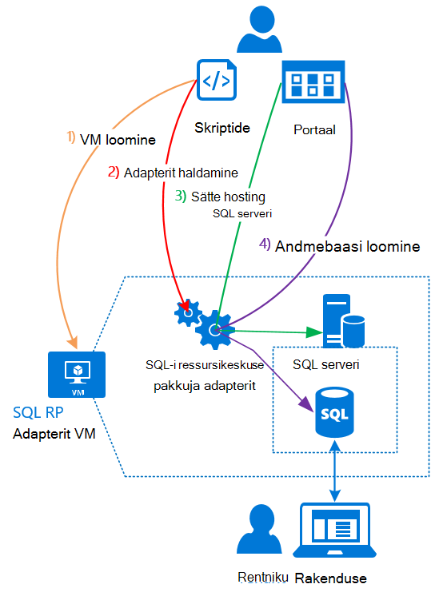

<properties
    pageTitle="Virnas Azure SQL-andmebaase kasutamine | Microsoft Azure'i"
    description="Siit saate teada, kuidas saate juurutada SQL andmebaase teenust Azure virnas ja juhiseid SQL serveri ressursi pakkuja võrguadapteri juurutamine."
    services="azure-stack"
    documentationCenter=""
    authors="Dumagar"
    manager="byronr"
    editor=""/>

<tags
    ms.service="multiple"
    ms.workload="na"
    ms.tgt_pltfrm="na"
    ms.devlang="na"
    ms.topic="article"
    ms.date="09/26/2016"
    ms.author="dumagar"/>

# Azure'i Virnlintdiagrammil SQL andmebaase kasutamine

> [AZURE.NOTE] Järgmine teave kehtib ainult Azure virnas TP1 juurutuste.

SQL serveri ressursi pakkuja võrguadapteri abil esitamist teenuse virnas Azure SQL andmebaase. Ressursi pakkuja installimist ja kasutajate saate luua andmebaaside cloud emakeelena rakendused, veebisaidi, mis põhinevad SQL-i ja töökoormus, mis põhinevad SQL-i ilma ettevalmistamise virtuaalse masina (VM) majutatakse SQL serveri iga kord, kui.

Kuna ressursi pakkuja ei ole kõigi võimaluste Azure'i SQL-andmebaasi ajal tõendada mõistet (PoC), algab käesoleva artikli ressursside pakkuja arhitektuur ülevaade. Seejärel saate kiire ülevaate juhiseid häälestamine ressursi pakkujaga linkide [Deploy SQL-andmebaasi ressursi pakkuja adapterit Azure'i virnas POC](azure-stack-sql-rp-deploy-long.md)üksikasjalikud juhised.

## SQL serveri ressursi pakkuja adapterit arhitektuur
Ressursi pakkuja ei paku kõik andmebaasi Azure'i SQL-andmebaasi haldamise võimalusi. Näiteks elastne andmebaasi kaustu ja sissehelistamist andmebaasi jõudluse üles pealt võimalus pole saadaval. Siiski ressursi pakkuja ei toeta sama loomine, lugemine, värskendamine ja kustutamise (CRUD) toimingute saadaolevad Azure SQL-andmebaasis.

Ressursi pakkuja koosneb kolmest osast:

- **SQL ressursi pakkuja adapterit VM**, mis hõlmab ressursi pakkuja protsess ja SQL serveri majutavad serverid.
- **Ressursi pakkuja ise**, mis töötleb ettevalmistamise taotlusi ja seab andmebaasi ressursid.
- **Serverid, et majutada SQL Server**, mis pakub nii andmebaasid.

Järgmised kontseptuaalne skeem kuvatakse järgmised komponendid ja toiminguid, mis läbida juurutamisel ressursi pakkuja juures luua server majutatakse SQL serveri ja seejärel andmebaasi loomine.

## Kiirtoimingud juurutamiseks ressursi pakkuja
Kui olete juba tuttav Azure'i virnas, tehke järgmist. Kui soovite rohkem üksikasju, linkide kaudu iga jaotise või [Deploy Azure'i virnas POC adapterit SQL-andmebaasi ressursi pakkuja](azure-stack-sql-rp-deploy-long.md)juurde.

1.  Veenduge, et kõik [toimingud enne juurutamist häälestamine](azure-stack-sql-rp-deploy-long.md#set-up-steps-before-you-deploy) ressursi pakkuja:

  - .NET 3.5 framework juba häälestamine rakenduses Windows Server pilti. (Kui laadisite Azure'i virnas bittide pärast 23 veebruar 2016, saate jätate selle etapi.)
  - [Azure'i PowerShelli, mis ühildub Azure'i virnas soovitud versiooni installimist](http://aka.ms/azStackPsh).
  - Internet Exploreri turbesätete ClientVM, [Internet Exploreris tõhustatud turvalisus on välja lülitatud ja küpsised on lubatud](azure-stack-sql-rp-deploy-long.md#Turn-off-IE-enhanced-security-and-enable-cookies).

2. [SQL serveri RP kahendfaile faili alla laadida](http://aka.ms/massqlrprfrsh) ja väljavõte ClientVM sisse oma Azure'i virnas POC.

3. [Käivitage bootstrap.cmd ning skriptide](azure-stack-sql-rp-deploy-long.md#Bootstrap-the-resource-provider-deployment-PowerShell-and-Prepare-for-deployment).

    Kogum skriptide on rühmitatud kaks põhilist vahekaarti avamine rakenduses PowerShelli integreeritud skriptimise keskkonnas (ISE). Kõik laaditud skriptide käitamiseks järjest vasakult paremale iga vahekaardi.

    1. Käivitage skriptide **ettevalmistamine** menüüs vasakult paremale, et:

        - Turvaline side ressursi pakkuja ja Azure ressursihaldur metamärgiga serdi loomine
        - Azure'i virnas üles laadida salvestusruumi konto serdid ja kõik muud esemeid.
        - Galerii-pakettide avaldamine, et SQL-i ja galerii abil saate juurutada.

        > [AZURE.IMPORTANT] Kui mis tahes skriptide hangub ei ole nähtav põhjust, kui saadate oma Azure Active Directory rentniku, turbesätete blokeerivad käivitamiseks juurutamiseks nõutava dll-faili. Lahendanud probleemi, vaadake Microsoft.AzureStack.Deployment.Telemetry.Dll ressursi pakkuja kaustas paremklõpsake seda, klõpsake käsku **Atribuudid**ja seejärel märkige vahekaardil **üldist** **Aktiveeri** .

    1. Käivitage skriptide **Deploy** menüüs vasakult paremale, et:

        - [Deploy VM](azure-stack-sql-rp-deploy-long.md#Deploy-the-SQL-Server-Resource-Provider-VM) , mis hostib ressursi pakkuja ja SQL serveris. See skript viitab JSON parameetri fail, mida peate värskendama mõned väärtused enne skripti käivitamist.
        - [Registreerida kohaliku DNS-i kirje](azure-stack-sql-rp-deploy-long.md#Update-the-local-DNS) ressursi pakkujale VM kaardid.
        - [Ressursi pakkuja registreerida](azure-stack-sql-rp-deploy-long.md#Register-the-SQL-RP-Resource-Provider) koos kohaliku Azure'i ressursihaldur.

        > [AZURE.IMPORTANT] Kõik skriptid Oletame, et operatsioonisüsteemide pilt täidab eeltingimused (.NET 3.5 installitud, JavaScript ja küpsised on ClientVM ning ühilduva Azure PowerShelli installitud lubatud). Kui teil tekib tõrgete skriptide käivitamisel, kontrollige, kas eeltingimused täidetud.

6. [Ühenduse loomine ressursi pakkuja serveris, mis majutab SQL Server](#Provide-capacity-to-your-SQL-Resource-Provider-by-connecting-it-to-a-hosting-SQL-server) Azure'i virnas portaalis. Klõpsake nuppu **Sirvi** &gt; **Ressursi pakkujad** &gt; **SQLRP** &gt; **minge pakkuja ressursihalduse** &gt; **serverid** &gt; **lisada**.

    Kasutage kasutajanimi ja parool, mida kasutasite ressursi pakkuja VM juurutamisel "sa".

7. [Uue SQL serveri ressursi pakkuja Test](/azure-stack-sql-rp-deploy-long.md#create-your-first-sql-database-to-test-your-deployment), juurutada portaalis virnas Azure SQL-andmebaasi. Klõpsake nuppu **Loo** &gt; **kohandatud** &gt; **SQL serveri andmebaasi**.

See peaks saama pakkuja SQL serveri ressursi üles ja töötab umbes 45 minutit (olenevalt teie riistvara).
