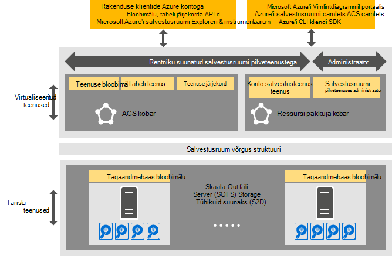

<properties
    pageTitle="Sissejuhatus Azure'i ühtsete salvestusruumi | Microsoft Azure'i"
    description="Lisateavet Azure ühtsete salvestusruum"
    services="azure-stack"
    documentationCenter=""
    authors="AniAnirudh"
    manager="darmour"
    editor=""/>

<tags
    ms.service="azure-stack"
    ms.workload="na"
    ms.tgt_pltfrm="na"
    ms.devlang="na"
    ms.topic="get-started-article"
    ms.date="09/26/2016"
    ms.author="anirudha"/>

# Azure'i ühtsete salvestusruumi tutvustus
Azure'i ühtsete salvestusruumi on salvestusruumi pilveteenustega Microsoft Azure'i virnas kogum. Azure'i ühtsete salvestusruumi pakub bloobimälu, tabel, kuhjuda ja konto funktsioonid koos Azure ühtsete semantika. See sisaldab ka funktsioone, mis aitab pilveteenuse administraator, Halda salvestusruumi teenuseid. Selles artiklis tutvustatakse Azure'i ühtsete salvestusruumi ja kirjeldatakse, kuidas täiendada salvestusruumi pilveteenused Azure'i virnas kenasti rikkaliku [tarkvara määratletud salvestusruumi võimaluste Windows Server 2016](https://blogs.technet.microsoft.com/windowsserver/2016/04/14/ten-reasons-youll-love-windows-server-2016-5-software-defined-storage/).

Azure'i ühtsete salvestusruumi pakub laia järgmisi funktsioone:

- **Plekid**: lehel plekid, blokeerida plekid ja lisa plekid   [Azure ühtsete bloobimälu](https://msdn.microsoft.com/library/azure/dd179355.aspx#Anchor_1) 
   käitumine

- **Tabelite**: üksused, sektsioonid ja muude Tabeliatribuudid   [Azure'i ühtsete](https://msdn.microsoft.com/library/azure/dd179355.aspx#Anchor_3) tabeliga
   käitumine

- **Järjekorrad**: usaldusväärne ja püsivate sõnumeid ja järjekorrad koos   [Azure ühtsete järjekorda](https://msdn.microsoft.com/library/azure/dd179355.aspx#Anchor_2) 
   käitumine

- **Kontod**: ressursi mäluhaldus konto   [Azure ühtsete](https://azure.microsoft.com/documentation/articles/storage-create-storage-account/) kontoga
   üldotstarbeline salvestusruumi kontode kaudu [Azure'i ressursihaldur juurutamise mudeli](https://azure.microsoft.com/documentation/articles/resource-manager-deployment-model/) ette valmistatud käitumine

- **Administreerimine**: rentniku suunatud ja Azure ühtsete salvestusruumi sisemise salvestusruumi teenused (mida käsitletakse teised artiklid)

## Azure'i ühtsete salvestusruumi arhitektuur

Joonis 1. Azure'i ühtsete salvestusruumi: lahenduse kuvamine

## Azure'i ühtsete salvestusruumi virtualiseeritud teenuste ja kogumite

Azure'i ühtsete salvestusruumi arhitektuur, virtualiseeritud kõigi rentniku või administraatori hõlbustusfunktsioonidega salvestusruumi teenuseid. Mis on käivitatakse teenuse pakkuja hallatavad, mis on väga saadaval VMs põhjal [Hyper-V](https://technet.microsoft.com/library/dn765471.aspx) [Windows Server 2016](http://www.microsoft.com/server-cloud/products/windows-server-2016/)funktsioone.
Kuigi VMs on väga kättesaadav [Windows Server tõrkesiirdeklastrite](https://technet.microsoft.com/library/dn765474.aspx) tehnoloogia, on Azure ühtsete salvestusruumi virtualiseeritud teenuseid ise Külastajate rühmitatud, mis on väga saadaval teenuste [Azure teenuse struktuuri](http://azure.microsoft.com/campaigns/service-fabric/)tehnoloogia.

Azure'i ühtsete salvestusruumi töötab kaks teenuse struktuuri kogumite on Azure virnas juurutuse.
Salvestusruumi ressursi pakkuja teenus on juurutatud teenuse struktuuri klaster "(RP klaster), mis jagatakse samuti muud teenused põhilisi ressursi. Ülejäänud talletamist virtualiseeritud andmeteenuste tee – sh bloobimälu, tabeli ja järjekorda teenuste--on majutatud teise teenuse struktuuri kobar ("Azure ühtsete salvestusruumi klaster").

## Bloobimälu teenuste ja tarkvara määratletud salvestusruumi

Bloobimälu, teenuse tagasi lõpetamine teiselt, käivitatakse otse [Skaala-Out faili Server](https://technet.microsoft.com/library/hh831349.aspx) kobar sõlmed. Azure'i virnas lahenduse arhitektuur, skaala-Out faili Server põhineb selle [Salvestusruumi tühikuid otsese](https://technet.microsoft.com/library/mt126109.aspx)-vastavalt, ühiskasutuses midagi tõrkesiirdeklastrite. Joonisel 1 kujutatud põhilist Azure'i ühtsete salvestusruumi komponent teenuste ja nende jaotatud juurutamise mudel. Nagu joonisel näha Azure'i ühtsete salvestusruumi täiendatakse olemasoleva tarkvara määratletud salvestusruumi Windows Server 2016 funktsioone. Ole teisiti riistvara on nõutav Azure ühtsete Storage Lisaks järgmisi Windows Server platvormi nõuded.

## Salvestusruumi serveripargi

Salvestusruumi serveripargi on saidikogumi mäluruumi taristu, ressursside ja tagaandmebaas teenuseid, mis pakuvad koos rentniku suunatud ja administraatori suunatud Azure ühtsete salvestusruumi teenused on Azure virnas juurutamise. Täpsemalt salvestusruumi serveripargi sisaldab järgmist:

- Salvestusruumi riistvara (nt skaala-Out faili Server sõlmed, ketast)

- Salvestusruumi struktuuri ressursid (nt SMB aktsiad)

- Salvestusruumi seotud teenuse struktuuri teenused (nt bloobimälu lõpp-punkti teenus välja Azure'i ühtsete salvestusruumi kobar)

- Salvestusruumi seotud teenuseid, mis töötavad skaala-Out faili Server sõlmed (nt bloobimälu teenus)

## IaaS ja PaaS salvestusruumi kasutamise stsenaariumid

Azure'i ühtsete salvestusruumi lehe plekid Azure, nagu esitada virtuaalse ketast kõik infrastruktuuri teenus (IaaS) kasutamise stsenaariumid:

- Luua kohandatud OS kettapuhastusriista abil lehe bloobimälu VM

- Luua VM, kasutades kohandatud OS pilt lehe bloobimälu

- Luua VM abil pildi Azure'i turuplatsi uue lehe bloobimälu

- Luua VM abil tühi ketas uue lehe bloobimälu

Samuti platvorm nimega service (PaaS) stsenaariumid, Azure'i ühtsete salvestusruumi Blokeeri plekid, lisa plekid järjekordade ja tabelite töötavad Azure samamoodi nagu.

## Kasutaja rollid

Azure'i ühtsete salvestusruumi on väärtuslik kahe kasutaja rollid.

- Rakenduse omanikud, sh arendajad ja ettevõtte IT. Neil pole enam säilitada või kasutada rakenduse ja skriptide, mida täita sama töö üle avaliku pilve ja majutatud privaatne pilv andmekeskuses kaks versiooni. Azure'i ühtsete salvestusruumi pakub salvestusruumi REST API-ga, SDK, cmdlet ja Azure virnas portaali kaudu.

- Teenuse pakkujad, sh ettevõtte IT, kes juurutada ja hallata Microsoft Azure'i virnas, rentnikuga salvestusruumi pilveteenustega.

## Järgmised sammud

- [Azure'i ühtsete salvestusruumi: erinevused ja kaalutlused] (azure-virnas-acs-erinevused-tp2.md)
