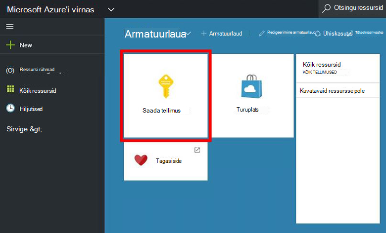
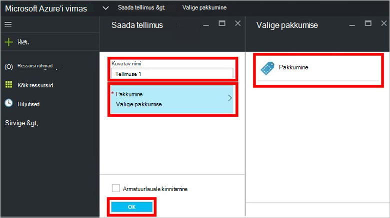
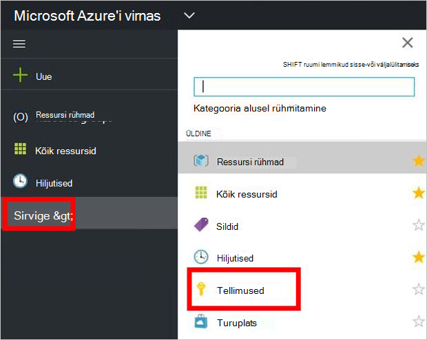

<properties
    pageTitle="Pakkumise tellinud ja seejärel ettevalmistamise VM Azure virnas (rentnik) | Microsoft Azure'i"
    description="Rentniku jaoks, kui saate teada, kuidas tellida pakkumise ja seejärel ettevalmistamise VM Azure virnas."
    services="azure-stack"
    documentationCenter=""
    authors="ErikjeMS"
    manager="byronr"
    editor=""/>

<tags
    ms.service="azure-stack"
    ms.workload="na"
    ms.tgt_pltfrm="na"
    ms.devlang="na"
    ms.topic="get-started-article"
    ms.date="09/26/2016"
    ms.author="erikje"/>

# Pakkumise tellimine

Nüüd, kui olete [loonud pakkumise](azure-stack-create-offer.md), testida, et teie rentnikud saate luua tellimus.

1.  Azure'i virnas POC arvutisse sisse logida `https://portal.azurestack.local` [rentniku](azure-stack-connect-azure-stack.md#log-in-as-a-tenant) ja klõpsake nuppu **Saada tellimus**.

    

2.  Väljale **Kuvatav nimi** tippige oma tellimuse nimi, klõpsake **pakub**, klõpsake ühte pakutakse **valimine pakkumise** tera ja klõpsake nuppu **Loo**.

    

4.  Tellimuse loodud vaatamiseks klõpsake nuppu **Sirvi**, **tellimused**, klõpsake käsku Uus tellimuse.  

    

Kui olete tellinud pakkumise, värskendada portaali näha, millised teenused on osa uude tellimusse.

## Järgmised sammud

[Virtuaalse masina ettevalmistamine](azure-stack-provision-vm.md)
