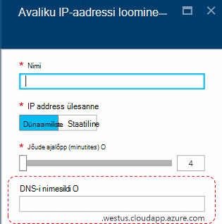
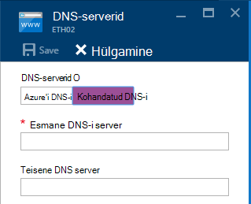
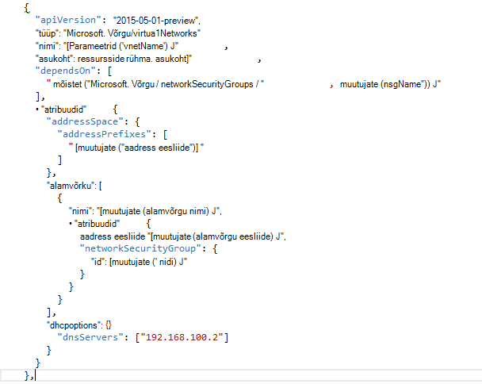

<properties
    pageTitle="DNS-i Azure virnas TP2 mõistmine | Microsoft Azure'i"
    description="Uue DNS-i funktsioone ja võimalusi rakenduses Azure'i virnas TP2 mõistmine"
    services="azure-stack"
    documentationCenter=""
    authors="ScottNapolitan"
    manager="darmour"
    editor=""/>

<tags
    ms.service="azure-stack"
    ms.workload="na"
    ms.tgt_pltfrm="na"
    ms.devlang="na"
    ms.topic="get-started-article"
    ms.date="09/26/2016"
    ms.author="scottnap"/>

# Azure'i virnas jaoks iDNS tutvustus
================================

iDNS on uus funktsioon tehnoloogia eelvaade 2 Azure'i virnas, mis võimaldab teil lahendamiseks välise DNS-i nimi (nt http://www.bing.com).
See võimaldab teil registreerida virtuaalse sisevõrgu nimed. Nii saate lahendada VMs sama virtuaalse võrgu nimi, mitte IP-aadress, ilma vajaduseta kohandatud DNS-serveri kirjed.

See on asi, mis on alati olnud seal Azure, kuid nüüd on saadaval Windows Server 2016 ja Azure virnas, liiga.

Mida teeb iDNS?
------------------

IDNS Azure'i virnas, saate määrata kohandatud DNS-serveri kirjed ilma järgmisi võimalusi.

-   Ühisteenuste DNS-i nimi eraldusvõime rentniku töökoormus.

-   Autoriteetsete DNS-i teenuse nimi eraldusvõime ja DNS-i registreerimise rentniku virtuaalse võrgustikus.

-   Rekursiivsed DNS-i teenus eraldusvõime rentniku VMs Internet nimed. Rentnike jaoks pole enam vaja määrata kohandatud DNS-i kirjed Interneti nimede (nt www.bing.com).

Siiski saate tuua oma DNS-i ja kasutada kohandatud DNS-serverid, kui soovite. Kuid nüüd, kui soovite üksnes soovite proovida lahendada Interneti DNS-i nimed ja saama ühenduse loomine muu virtuaalmasinates virtuaalse samasse võrku, ei pea te määrata midagi ja see ei tööta.

Mida iDNS ei tee?
---------------------

Millist iDNS ei luba teil seda teha on nimi, mida saab väljaspool virtuaalse võrgu kaudu lahendada DNS-i kirje loomine.

Azure'is, on teil võimalik määrata DNS-i nimi silti, mis võib olla seotud avaliku IP-aadressi. Soovi korral saate sildi (eesliide), kuid Azure'i valib järelliite, mis põhineb piirkond, kus luua avaliku IP-aadressi.

Pildil, loob Azure "A" kirje DNS zone **westus.cloudapp.azure.com**jaotises määratud sildi DNS-i nimi. Eesliite ning koos järelliite koostamine on täielikult kvalifitseeritud domeeni nimi (FQDN), mida saab lahendada suvalist avaliku Interneti-ühendusega arvutid.

TP2, Azure'i virnas ainult toetab iDNS sisemine nimi registreerimiseks, nii, et seda ei saa teha järgmist.

-   Mõne olemasoleva majutatud DNS-i tsooni (nt azurestack.local) jaotises DNS-i kirje loomine.

-   Looge DNS-i tsooni (nt Contoso.com).

-   Looge oma kohandatud DNS-i tsooni jaotises kirje.

-   Toeta domeeninime ostmine.

DNS-i kaudu Azure'i virnas TP1 muudatused
-----------------------------------

Azure'i virnas versioonis tehnoloogia Preview 1 (TP1) pidite pakuvad kohandatud DNS-serverid, kui soovite proovida lahendada hosts nimi, mitte IP-aadress. See tähendab, et kui loote olid virtuaalse võrgus või VM, pidite pakuvad vähemalt üks DNS-i kirje. TP1 POC keskkonnas, see mõeldud, sisestades IP POC struktuuri DNS-i server, st 192.168.200.2.

Kui olete loonud VM portaali kaudu, pidite valige **Kohandatud DNS-i** virtuaalse võrgu või ethernet võrguadapteri sätted.

TP2, saate valida Azure'i DNS-i ja pole vaja määrata kohandatud DNS-serveri kirjed.

Kui olete loonud malli kaudu VM oma pilt, teil oli lisada atribuudi **DHCPOptions** ja selleks, et saada DNS-i DNS-i serveri nimi resolutsioon töötamiseks. Järgmisel pildil on kujutatud, mis see vanal.

TP2, teil pole enam vaja muuta nende VM mallide lubamiseks Internet nimede oma VMs. Ei peaks töötama.