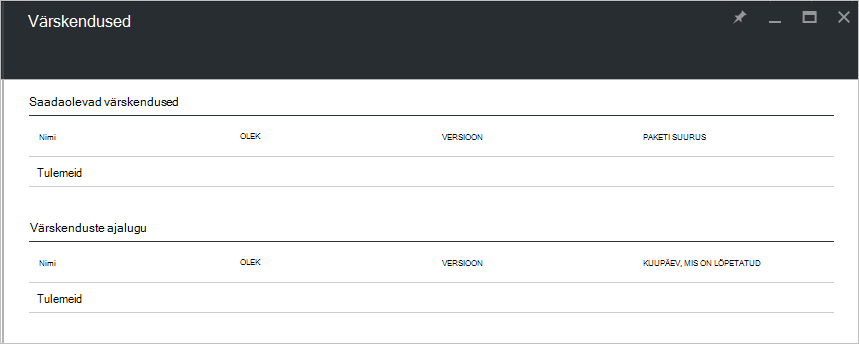

<properties
    pageTitle="Värskenduste Azure virnas | Microsoft Azure'i"
    description="Lisateavet Värskenduste Azure virnas"
    services="azure-stack"
    documentationCenter=""
    authors="HeathL17"
    manager="byronr"
    editor=""/>

<tags
    ms.service="azure-stack"
    ms.workload="na"
    ms.tgt_pltfrm="na"
    ms.devlang="na"
    ms.topic="article"
    ms.date="09/26/2016"
    ms.author="Helaw"/>

# Azure'i virnas värskenduste haldamine
Tehniline eelvaade 2 tutvustab eelvaade Azure'i virnas värskenduste haldamise võimalusi.  Selles teemas saate liikuda sõlme värskendused.  

## Värskenduste blade
1.  Juurdepääs värskenduste tera, klõpsake **Sirvi** ja seejärel klõpsake nuppu **värskendused**.

2.  Klõpsake **kohaliku** asukoht.

3.  Kas saadaolevate värskenduste ekraan ja värskenduste ajalugu.  2 Technical Preview on saadaval installi värskendusi.  

    

## Järgmised sammud
- [Azure'i virnas POC arhitektuur mõistmine](azure-stack-architecture.md)      
- [Juurutamise eeltingimused mõistmine](azure-stack-deploy.md)
- [Azure'i Virnlintdiagrammil juurutamine](azure-stack-run-powershell-script.md)
 
    
  

  

