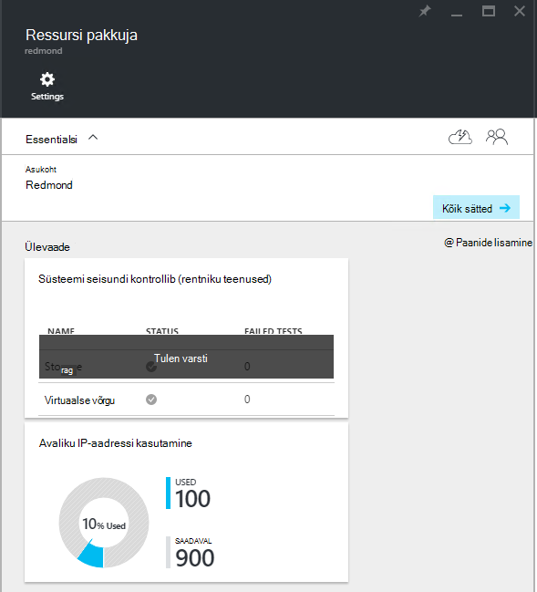
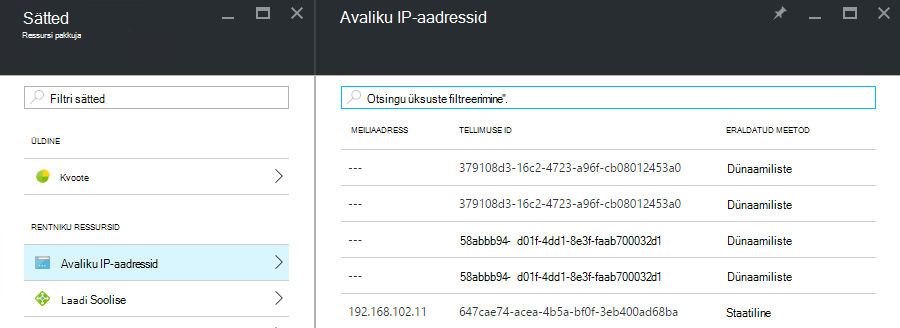

<properties
    pageTitle="Vaatamine avaliku IP-aadressi tarbimine TP2 | Microsoft Azure'i"
    description="Administraatorid saavad vaadata avalike IP-aadresside tarbimine piirkonnas"
    services="azure-stack"
    documentationCenter=""
    authors="ScottNapolitan"
    manager="darmour"
    editor=""/>

<tags
    ms.service="azure-stack"
    ms.workload="na"
    ms.tgt_pltfrm="na"
    ms.devlang="na"
    ms.topic="get-started-article"
    ms.date="09/26/2016"
    ms.author="scottnap"/>

# Azure'i virnas TP2 avaliku IP-aadressi tarbimine kuvamine

Teenuse administraator, saate vaadata arvu avaliku IP-aadressid, eraldatud rentnikega avaliku IP-aadressid, mis on endiselt saadaval eraldamiseks arv ja protsent avaliku IP-aadressid, mis on eraldatud asukohta.

Paani **Avaliku IP-aadressi kasutamine** näitab avaliku IP-aadressid, mis on tarbitud üle kõik avaliku IP address kaustad struktuuri, kas need on kasutatud rentniku IaaS VM eksemplari, struktuuri taristu teenused või avaliku IP address ressursid konkreetselt loodud rentnikud koguarv.

Sellel paanil eesmärk anda Azure'i virnas administraatorite avaliku IP-aadressid, mis on selles asukohas tarbitud koguarv. See aitab määratleda, kas need on otsa saama selle ressursi administraatorid.

Enne **sätted** , **Avaliku IP-aadresside** menüükäsk jaotises **rentniku ressursid** on loetletud ainult need avaliku IP-aadressid, mis on *konkreetselt loodud rentnikud*. Sellisel kujul **kasutatakse** **Avaliku IP-aadressi kasutamine** avaliku IP-aadresside paani arv erineb alati (suurem kui) arvu **Avaliku IP-aadresside** paani jaotises **rentniku ressursid**.

## Avaliku IP-aadressi kasutamine teabe vaatamine

Avaliku IP-aadressid, mis on tarbitud piirkonna koguarvu vaatamiseks tehke järgmist.

1.  Azure'i virnas portaalis, klõpsake nuppu **Sirvi**ja valige **Ressursi pakkujad**.

2.  **Ressursi pakkujate**loendit, valige **Pakkuja võrguadministraatori ressursi**.

3.  Vaheldumisi, võite klõpsata nuppu Sirvi **| Asukohtade** ja valige asukoht, mida soovite loendis kuvada. Seejärel valige paanil **Ressursi pakkujad** **Võrguadministraatori ressursi pakkuja**.

4.  **Ressursi pakkuja** maandumine tera kuvab paani **Avalik IP Address kasutus** jaotises **Ülevaade** .

Pidage meeles, et **kasutatud** number tähistab arv avaliku IP-aadressid kõik avaliku IP-aadress kaustu asukohta, mis on määratud. **Saadaval** number tähistab arv avaliku IP-aadressid kõik avaliku IP-aadresside kaustu, mis ei ole määratud ja on endiselt saadaval. **% Kasutatud** number tähistab kasutatud või määratud aadresside arvu protsendina koguarvu avaliku IP aadressid kõik avaliku IP-aadresside kaustu asukohta.

## Avaliku IP-aadressid, mis on loodud rentniku tellimuste vaatamine

Avaliku IP-aadressid, konkreetselt rentniku tellimuste konkreetse piirkonna loodud loendi vaatamiseks minge **Ressursi pakkuja võrguadministraatori**tera **sätted** ja valige **Avaliku IP-aadressid**.

Võite märgata teatud avaliku IP-aadresside dünaamiliselt eraldatud loendis, kuid ei ole veel nendega seotud aadressi. See on aadressi ressursi on loodud ressursi pakkuja, kuid mitte võrgu domeenikontrolleri veel.

Võrgu domeenikontrolleri määrata aadressi seni, kuni see on tegelikult seotud liidest, kasutajaliidese kaart (NIC), laadi koormusetasakaalustusteenuse või virtuaalse võrgu lüüsi ressurss. Kui avaliku IP-aadress on seotud liidest, võrgu domeenikontrolleri eraldab selle IP-aadress ja kuvatakse see väljale **aadress** .

## Avaliku IP address teabe kokkuvõtva tabeli kuvamine

On mitmeid eri juhtudel, kus on määratud avaliku IP-aadressid, määratleda, kas aadress kuvatakse loendis ühe või teise.

| **Avaliku IP address ülesande puhul** | **Kuvatakse kasutuse Kokkuvõte** | **Kuvatakse rentniku avaliku IP-aadresside loend** |
| ------------------------------------- | ----------------------------| ---------------------------------------------- |
| Dünaamilise avaliku IP-aadressi pole veel määratud NIC või laadi koormusetasakaalustusteenuse, (ajutine) | Ei | Jah |
| Dünaamiliste avaliku IP-aadress on NIC või laadi koormusetasakaalustusteenuse määratud. | Jah | Jah |
| Staatilise avaliku IP-aadressi määratud rentniku NIC või laadi koormusetasakaalustusteenuse. | Jah | Jah |
| Staatilise avaliku IP-aadressi määratud struktuuri taristu teenuse lõpp-punkti. | Jah | Ei |
| Avaliku IP-aadressi peidetult loodud IaaS VM eksemplaride ja Väljamineva meili NAT virtuaalse võrgus kasutada. Need on loodud taustal iga kord, kui rentnik loob VM eksemplari, et VMs saab saata teavet Interneti-ühendus. | Jah | Ei |
