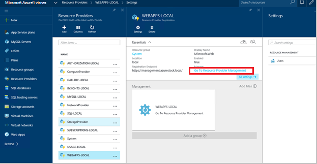
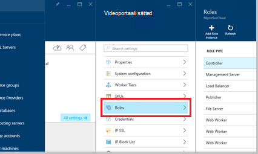
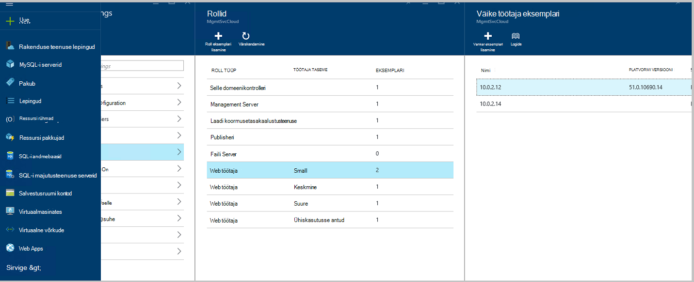
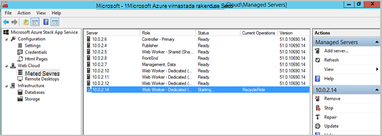
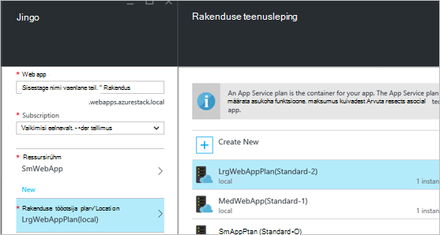
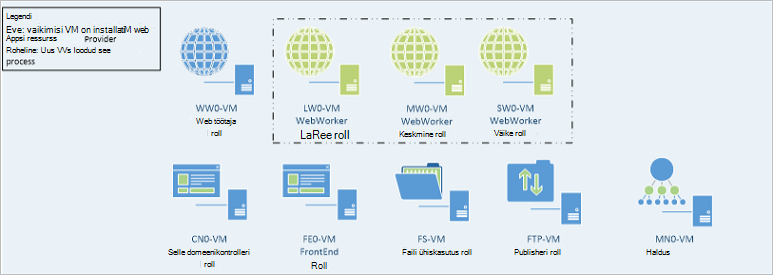

<properties
    pageTitle="Veebirakenduste lisada rohkem Web töötaja rollid | Microsoft Azure'i"
    description="Üksikasjalikud juhised skaleerimist Azure'i virnas Web App"
    services="azure-stack"
    documentationCenter=""
    authors="kathm"
    manager="slinehan"
    editor=""/>

<tags
    ms.service="azure-stack"
    ms.workload="app-service"
    ms.tgt_pltfrm="na"
    ms.devlang="na"
    ms.topic="article"
    ms.date="09/26/2016"
    ms.author="kathm"/>

#   <a name="web-apps-adding-more-web-worker-roles"></a>Web Apps: Lisada rohkem web töötaja rollid

> [AZURE.NOTE] Järgmine teave kehtib ainult Azure virnas TP1 juurutuste.

Selles dokumendis on toodud juhised mastaapimiseks veebirakenduste web töötaja rollid. See sisaldab juhiseid täiendavad veebi töötaja rolli toetamiseks web Appsi pakkumisi, mis tahes suurusega loomise kohta.

Azure'i Virnlintdiagrammil toetab tasuta ja ühiskasutuses web rakendusejuurutuste. Muud tüüpi lisamiseks peate lisama veel web töötaja rollid.

Kui te pole kindel, mis võeti kasutusele vaikimisi veebirakenduste installimisega, saate vaadata täiendavat teavet [siin](azure-stack-webapps-overview.md).

Järgmised toimingud on nõutav skaala web töötaja rollid.

1.  [Luua uue virtuaalse masina](#step-1-create-a-new-vm-to-support-the-new-instance-size)

2.  [Virtuaalse masina konfigureerimine](#step-2-configure-the-virtual-machine)

3.  [Azure'i virnas portaalis web töötaja roll konfigureerimine](#step-3-configure-the-web-worker-role-in-the-azure-stack-portal)

4.  [Rakenduse teenuse lepingute konfigureerimine](#step-4-configure-app-service-plans)

##<a name="step-1-create-a-new-vm-to-support-the-new-instance-size"></a>Samm 1: Luua uue eksemplari suuruse toetamiseks uue VM

Luua virtuaalse masina, nagu on kirjeldatud [selles artiklis](azure-stack-provision-vm.md), et tehtaks järgmisi valikuid:

 - Kasutajanime ja parooli: sisestage sama kasutajanime ja parooli registreerimisel installitud veebirakenduste.

 - Tellimus: Saate kasutada vaikimisi pakkuja tellimus.

 - Ressursirühm: valige **AppService – kohaliku aja järgi**.

> [AZURE.NOTE]Hoidke virtuaalmasinates töötaja rollide sama nimega rakendus on juurutatud veebirakenduste ressursirühma. (See on soovitatav see väljaanne.)

##<a name="step-2-configure-the-virtual-machine"></a>Samm 2: Konfigureerimine virtuaalse masina

Kui juurutamise on lõppenud, web töötaja rolli toetamiseks on vaja järgmist konfiguratsiooni:

1.  Avage Server Manager majutusseadme ning klõpsake **menüü Tööriistad** &gt; **HyperV haldur**.

2.  Ühenduse loomine uue virtuaalse masina sammus 1 loodud Kaugtöölaua protokolli (RDP) abil. Serveri nimi asub kokkuvõttepaanil iga VM valimisel.

3.  Avage PowerShelli, klõpsates nuppu **Start** ja tippides PowerShelli. Paremklõpsake **PowerShell.exe**ja valige **Käivita administraatorina** administraatoriõigustes PowerShelli avamiseks.

4.  Kopeerida ja kleepida iga (ükshaaval) järgmised käsud PowerShelli aken ja vajutage sisestage:

    ```netsh advfirewall firewall set rule group="File and Printer Sharing" new enable=Yes```
    ```netsh advfirewall firewall set rule group="Windows Management Instrumentation (WMI)" new enable=yes```
    ```reg add HKLM\\SOFTWARE\\Microsoft\\Windows\\CurrentVersion\\Policies\\system /v LocalAccountTokenFilterPolicy /t REG\_DWORD /d 1 /f```

5.  Virtuaalne arvuti taaskäivitama.

> [AZURE.NOTE]Märkus: Need on miinimumnõuded Web Apps. Need on kaasas Azure'i virnas Windows 2012 R2 pildi vaikesätted. Hilisemaks ja neile, kes kasutavad erineva pildiga, on antud juhiseid.

##<a name="step-3-configure-the-web-worker-role-in-the-azure-stack-portal"></a>Samm 3: Konfigureerimine web töötaja roll Azure'i Virnlintdiagrammil portaalis

1.  Avage teenus administraatorina sisse **ClientVM**portaal.

2.  Liikuge **Ressursi pakkujad** &gt; **VEEBIRAKENDUSTE – kohaliku aja järgi**.

    
 
3.  Klõpsake **minge ressursside pakkuja haldamine**.

4.  Klõpsake nuppu **rollid**.

    
 
5.  Klõpsake **Lisa rolli eksemplari**.

6.  Klõpsake **esimese taseme** soovite juurutada (väike, Keskmine, suur või ühiskasutuses) uue eksemplari.

    
 
7.  Konfigureerida järgmist.
 - Serveri nimi: Sisestage loodud varasemas versioonis (jaotises 1) serveri IP-aadress.
 - Roll tüüp: Web töötaja.
 - Töötaja tase: Vasteid esimese valitud suurusega.

8. Klõpsake **OK.**

9. CN0-VM sisse logida ja avada **Web Cloud Management MMC**.

10. Liikuge **Web pilve** &gt; **hallatavate serverites**.

11. Klõpsake serveri nime, mida lihtsalt juurutatud. Vaadake üle veerg olek ja oodake, kuni olek on "Valmis" järgmise juhise juurde liikumiseks.

    

##<a name="step-4-configure-app-service-plans"></a>Samm 4: Konfigureerida rakendus teenuse lepingud

> [AZURE.NOTE]Veebirakenduste praeguses versioonis rakenduse teenuse lepingud peavad olema talletatud eraldi ressursi rühmad. Ressursirühma igas suuruses veebiversioonis koostada ja paigutada rakenduse lepingute korral ressurss nende rühmade.

1.  Klõpsake soovitud ClientVM portaali sisse logida.

2.  Liikuge **uue** &gt; **Web ja Mobile**.

3.  Valige veebirakenduse, mida soovite kasutada.

4.  Teavet web app ja seejärel valige **AppService leping / asukoha**.

-   Klõpsake nuppu **Loo uus**.

-   Saate luua oma uue lepingu, valides vastava hinnakirjad taseme lepingu raames.

> [AZURE.NOTE]Saate luua mitme ajal klõpsake selle tera. Enne juurutamist, kuid veenduge, et valitud sobiv leping.

Järgmisel joonisel on kujutatud näide mitme saadaval lepingud:    

##<a name="final-web-app-service-vm-configuration"></a>Lõplik veebirakenduse teenuse VM konfigureerimine

Alloleval pildil annab ülevaate keskkonna, kui teil on mastaabitud web töötaja rollid. Roheline üksuste tähistavad rolli uusi funktsioone.
    
