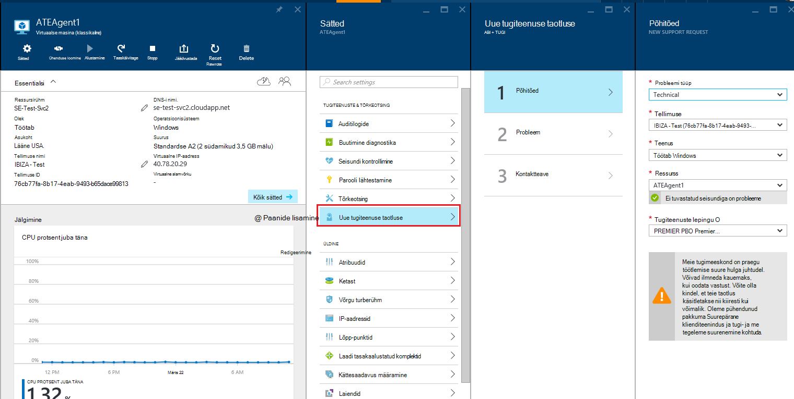
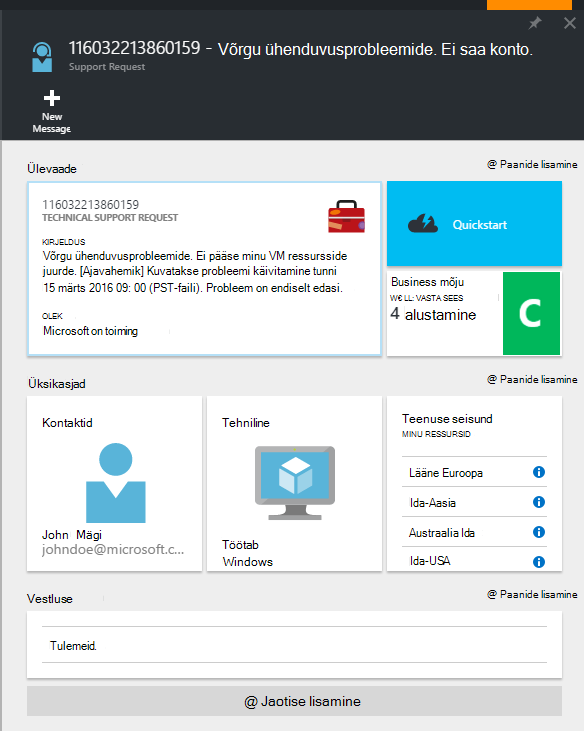

<properties
     pageTitle="Kuidas luua Azure'i tugiteenuse taotluse | Microsoft Azure'i"
     description="Kuidas luua Azure'i tugiteenuse taotluse."
     services="Azure Supportability"
     documentationCenter=""
     authors="ganganarayanan"
     manager="scotthit"
     editor=""/>

<tags
     ms.service="azure-supportability"
     ms.workload="na"
     ms.tgt_pltfrm="na"
     ms.devlang="na"
     ms.topic="article"
     ms.date="10/25/2016"
     ms.author="gangan"/>

# Kuidas luua Azure'i tugiteenuse taotluse

## Kokkuvõte
Azure'i kliendid saate luua ja hallata tugiteenuste taotlusi Azure'i portaalis [https://portal.azure.com](https://portal.azure.com).
>[AZURE.NOTE] Azure'i portaal Saksamaa on [https://portal.microsoftazure.de](https://portal.microsoftazure.de) ja valitsuse Azure'i portaalis on [https://portal.azure.us](https://portal.azure.us).

Klientide tagasiside põhjal oleme värskendanud tugiteenuse taotluse keskenduda kolm peamist eesmärki:

- **Streamlined**: vähendada hiireklõpsuga ja labad muuta esitada tugiteenuse taotluse protsess lihtne.
- **Integreeritud**: probleem on Azure ressurss tõrkeotsingul peaks olema lihtne avada esitada tugiteenuse taotluse selle ressursi konteksti üle viimata.
- **Tõhus**: teie tugiteeninduse tuleb tõhus lahendanud teie probleemi võtme teabe kogumine.

## Alustamine
Saate esitada tugiteenuse taotluse ülemise navigeerimismenüü või otse ressursi tera.

**Ülemisel navigeerimisribal**

**Ressursi tera kaudu**

## Põhitõed
Kõigepealt tugi taotluse protsessi kogub põhiteavet teie probleemi ja teie tugi leping.

Vaatame näide: te olete koos oma virtuaalse masina tehnilise raskusi ja kahtlustate võrguühenduse probleem.
Teenuse ("Virtual masina Windowsiga") ja ressursside (virtuaalne arvuti nimi) valige viisardi esimesel etapil alustab spikri probleemile.

>[AZURE.NOTE] Azure'i toetab piiramatu tellimuse haldamiseks (näiteks arveldus, kvoodi muudatused ja konto edastamine). Tehniline tugi, peate toe kavandamine. [Lisateavet tugiteenuste lepingute kohta](https://azure.microsoft.com/support/plans).

## Probleem
Teise etapi viisardi kogutakse probleemi täiendavad üksikasjad. Selles etapis tuleb täpne üksikasjade võimaldab meil probleemi jaoks parim tugiteeninduse kaasuse marsruutimiseks ja probleemi diagnoosimise kiiresti alustada.

Jätkates Ülaltoodud näites virtuaalse masina Ühenduvus, te soovite vormi tähistamiseks võrguühenduse probleemi täita ja esitate probleemi, sh ligikaudne aeg, millal olete kogenud probleemi kohta lisateavet.

## Seotud abi
Mõned probleemid, pakume seotud Spikrilingid probleemi tõrkeotsinguks. Soovitatavate dokumentide ei aita, saate jätkata kaudu esitada tugiteenuse taotluse loomine.

## Kontaktteave
Viisardi viimases etapis kinnitab kontaktteabe nii, et saaksime teada, kuidas jõuda teid.

Olenevalt teie probleemi tõsidust, võib teil paluda märkimiseks, kui soovite meil teiega ühendust võtta tööaega või kui soovite vastuse 24 x 7, mis tähendab, et saaksime teiega igal ajal.

## Tugiteenuste taotlusi haldamine
Kui olete loonud tugiteenuse taotluse, saate vaadata **Haldamine toetavad taotlusi** lehel üksikasjad.

**Ülemisel navigeerimisribal**

Saate vaadata lehel **Halda tugiteenuse taotlused** tugi kõik kutsed ja nende oleku.

Valige tugiteenuse taotluse üksikasjad, sh raskusaste ja oodatud aega kulub tugiteeninduse vastamise kuvamiseks.

Kui soovite muuta taotluse tõsidust, klõpsake paani **Business mõju** . Eelmises näites kutse on praegu määratud raskusaste C.

Paani näitab teile, saate määrata ka avatud tugiteenuse taotluse raskusastme loendit.

>[AZURE.NOTE] Suurim lubatud raskusaste sõltub teie tugi leping. [Lisateavet tugiteenuste lepingute kohta](https://azure.microsoft.com/support/plans).

## Tagasiside
Oleme alati avatud tagasiside ja soovituste! Saatke meile oma [soovitusi](https://feedback.azure.com/forums/266794-support-feedback). Lisaks saate kaasata meiega [Twitteri](https://twitter.com/azuresupport) või [MSDN-i foorumites](https://social.msdn.microsoft.com/Forums/azure)kaudu.

## Lisateave
[Azure'i tugi KKK](https://azure.microsoft.com/support/faq)
