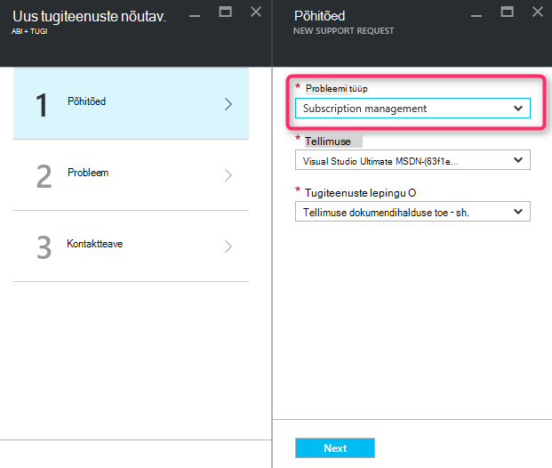
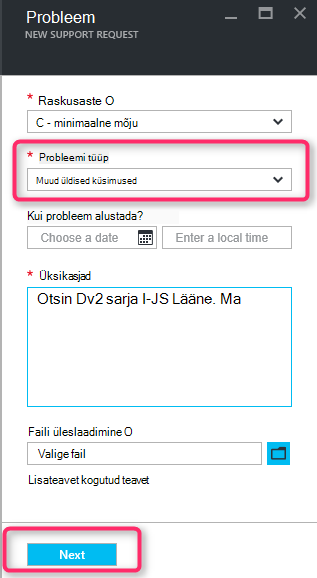
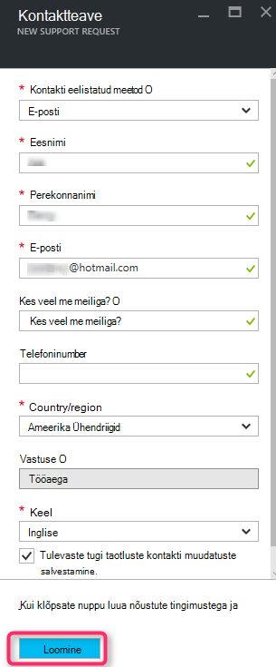

<properties
     pageTitle="SKU sarja saadaval | Microsoft Azure'i"
     description="Mõned SKU sarja pole saadaval valitud tellimuse selle piirkonna jaoks."
     services="Azure Supportability"
     documentationCenter=""
     authors="ganganarayanan"
     manager="scotthit"
     editor=""/>

<tags
     ms.service="azure-supportability"
     ms.workload="na"
     ms.tgt_pltfrm="na"
     ms.devlang="na"
     ms.topic="article"
     ms.date="08/12/2016"
     ms.author="gangan"/>

# SKU sarja pole saadaval

Teatud piirkondadele teatud SKU-d ei ole automaatselt saadaval uus tellimuste kohta.  See võib juhtuda siis, kui [piirkonnas on toodud võimsam SKU-de jaoks](https://azure.microsoft.com/updates/announcing-new-dv2-series-virtual-machine-size/) ja pärand populaarsus SKU keelanud.
Arvuta core kvoodi suurendamiseks esitada tugiteenuse taotluse loomisel, kuvatakse teade "*mõni SKU sarja pole saadaval, selle regiooni jaoks valitud tellimuse*".

SKU-saadavus [Azure'i teenuste regiooniti](https://azure.microsoft.com/regions/#services) lehel võib läbi vaadata. 

SKU-ga, mis on piiratud tellimusest juurdepääsu taotlemise loomine "Tellimuse juhtimine" tugiteenuse taotluse.

- Lehel põhitõed valige probleemi tüüp nimega "Tellimuse haldus" ja "Järgmine" nuppu.

- Lehel probleemi probleemi tüüp valige "Muud üldised küsimused" ja sisestage täpne piirkond ja te ei leia otsitavat SKU-ga.
See aitab sisselogimissätted tugi.

- Klõpsake lehel kontaktteave, sisestage oma kontaktandmed ja nuppu "Loo".

## Tagasiside
Oleme alati avatud tagasiside ja soovituste! Saatke meile oma [soovitused](https://feedback.azure.com/forums/266794-support-feedback). Lisaks saate kaasata meiega [Twitteri](https://twitter.com/azuresupport) või [MSDN-i foorumites](https://social.msdn.microsoft.com/Forums/azure)kaudu.

## Lisateave
[Azure'i tugi KKK](https://azure.microsoft.com/support/faq)
