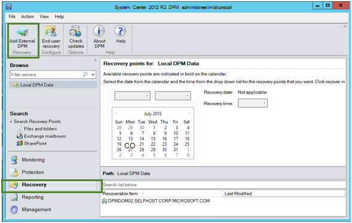

<properties
    pageTitle="Andmete taastamise teise DPM server varukoopiate hoidla | Microsoft Azure'i"
    description="Te olete kaitstud on Azure varukoopia vault mis tahes DPM serverist selle vault registreeritud andmeid taastada."
    services="backup"
    documentationCenter=""
    authors="nkolli1"
    manager="shreeshd"
    editor=""/>

<tags
    ms.service="backup"
    ms.workload="storage-backup-recovery"
    ms.tgt_pltfrm="na"
    ms.devlang="na"
    ms.topic="article"
    ms.date="08/08/2016"
    ms.author="giridham;jimpark;trinadhk;markgal"/>

# Andmete taastamise teise DPM server varukoopiate hoidla
Nüüd saate taastada te olete kaitstud on Azure varukoopia vault mis tahes DPM serverist selle vault registreeritud andmeid. Protsessi teinud, nii et on täielikult integreeritud DPM halduskonsooli ja sarnaneb taastamine teistest töövoogudest.

Andmete taastamine teise DPM server varukoopiate hoidla peate [System Center andmete kaitse Manager UR7](https://support.microsoft.com/en-us/kb/3065246) ja [uusim Azure varukoopia agent](http://aka.ms/azurebackup_agent).

## Andmete taastamine teise DPM Server
Andmete taastamine teise DPM server:

1. DPM halduskonsooli menüü **taastamine** nuppu **Lisa välise DPM** (juures kuvatakse ekraani vasakus ülanurgas).

    

2. Laadige alla uue **hoidla mandaat** seotud **DPM server** , kui andmed on taastatud hoidlast, valige loendist DPM serverite registreeritud varukoopiate hoidla DPM server ja anda seostatud DPM server, mille andmeid tagastada **krüptimine parooli** .

    

    >[AZURE.NOTE] Ainult DPM serverid seotud sama registreerimise vault saate üksteise andmete taastamine.

    Kui välise DPM server on lisatud, saate sirvida välise DPM server ja kohaliku DPM server **taastamine** menüü andmed.

3. Sirvige kaitstud DPM välise serveri tootmisserverid saadaval loendit ja valige sobiv andmeallikas.

    

4. Valige **kuu ja aasta** **taastamise punkte** rippmenüü, valige vajalik **taastamise kuupäeva** taastamine punkti loomise ja valige **taastamise aeg**.

    Loendi failid ja kaustad kuvatakse alumise paani, kus saate sirvida ja taastatud soovitud kohta.

    

5. Paremklõpsake vastav üksus ja klõpsake käsku **Taasta**.

    

6. Vaadake üle **Taasta valik**. Veenduge, et andmed ja taastamine varukoopia aega, samuti allikas, mis loodi varukoopia. Kui valisite vale nuppu tagasi liikumiseks valige sobiv taastamine punkt taastamine menüü **tühistamine** . Kui valisite õige, klõpsake nuppu **edasi**.

    

7. Valige **alternatiivse asukoha taastada**. **Sirvige** õigesse taaskasutamiseks.

    

8. Valige suvand **Kopeeri loomine** **Jäta**või **kirjuta**seotud.
    - **Loo koopia** loob faili koopia juhul, kui seal on nimi kokkupõrke.
    - **Jäta** vahele faili taastamiseks juhul, kui seal on nimi kokkupõrke.
    - **Kirjuta** üle olemasoleva kopeerimise nimi kokkupõrke määratud asukohta.

    Valige vastav variant taastamine **Turvalisus**. Saate rakendada turbesätted, kus andmed on taastatud sihtarvutis või turbesätted, mis olid kehtivad toote taastamine punkti loomise ajal.

    Tuvastada, kas saadetakse teile **teatis** pärast taastamis lõpulejõudmist edukalt.

    

9. **Kokkuvõte** kuva loendeid valitud siiani võimalused. Kui klõpsate nuppu **Taasta"**, kuvatakse vastav kohapealse asukoha andmeid taastada.

    

    >[AZURE.NOTE] Taastamise töö saab jälgida **jälgimis** menüüs DPM server.

    

10. Võite klõpsata **Eemalda välise DPM** DPM serveri eemaldamine DPM välise serveri vaate vahekaardil **taastamine** .

    

## Tõrketeadete tõrkeotsing
|Ei. |  Tõrketeade | Tõrkeotsingu juhiste |
| :-------------: |:-------------| :-----|
|1.|        See server pole registreeritud määratud vault mandaati vault.|  **Põhjus:** See tõrketeade kuvatakse siis, kui valitud faili vault identimisteavet ei kuulu varukoopiate hoidla, mis on seotud DPM serveriga, millel on proovitakse taastamis.   **Eraldusvõime:** Mis on registreeritud DPM serveri varukoopia hoidlast vault mandaati faili alla laadida.|
|2.|        Kas taastatavaid andmeid pole saadaval või valitud server pole DPM server.|   **Põhjus:** On muid DPM serverite DPM 2012 R2 UR7 registreeritud varukoopiate hoidla, et koos DPM 2012 R2 UR7 DPM serverid on pole veel üleslaaditud metaandmeid või valitud server pole DPM server (ehk Windows Serveri või Windowsi kliendi).   **Eraldusvõime:** Kui leidub muid DPM serverid registreeritud varukoopiate hoidla, veenduge, et SCDPM 2012 R2 UR7 ja uusim Azure varukoopia agent on installitud.  Kui DPM muudes serverites – registreeritud varukoopiate hoidla koos DPM 2012 R2 UR7, oodake päeva pärast UR7 taastamise alustamiseks installi. Öösel töö üles laadida varem kaitstud varukoopiate Cloud metaandmed. Andmeid saab taastamine.|
|3.|        Muude DPM server on registreeritud selle vault.|   **Põhjus:** Puudub muude DPM server DPM 2012 R2 UR7 või kohale, kust on proovitakse taastamis vault registreeritud. **Eraldusvõime:** Kui leidub muid DPM serverid registreeritud varukoopiate hoidla, veenduge, et SCDPM 2012 R2 UR7 ja uusim Azure varukoopia agent on installitud. Kui DPM muudes serverites – registreeritud varukoopiate hoidla koos DPM 2012 R2 UR7, oodake päeva pärast UR7 taastamise alustamiseks installi. Öösel töö üles laadida varem kaitstud varukoopiate Cloud metaandmed. Andmeid saab taastamine.|
|4.|        Esitatud krüptimine parooli ei sobi seostatud järgmise serveri parool:**<server name>**|  **Põhjus:** Käigus krüptimise andmete taastamine DPM-serveri andmed kasutatud krüptimine parooli ei vasta esitatud krüptimine parooli. Agent ei saa dekrüptida andmed. Seega taastamise nurjub. **Eraldusvõime:** Sisestage seostatud DPM server, mille andmeid tagastada täpselt sama krüptimise parool.|

## Korduma kippuvad küsimused:
1. **Miks ei saa lisada välisest DPM serverist teise DPM serverist pärast installimist UR7 ja uusim Azure varukoopia agent?**

    (A) jaoks olemasoleva DPM serverid andmeallikad, mis on kaitstud pilveteenusesse (, kasutades mõnda update rollup varem värskendada Rollup 7), peate ootama vähemalt üks päev pärast installimist UR7 ja uusim Azure varukoopia agent alustada *lisada välise DPM server*. See on vajalik üles laadida metaandmeid, DPM kaitse rühmade Azure. See juhtub öösel töö kaudu esimest korda.

2. **Mis on Azure varukoopia agent vaja vähemalt versiooni?**

    (A) Azure varundus agent on vähemalt versioon selle funktsiooni lubamiseks 2.0.8719.0.  Azure'i varundus agenti versiooni saab kontrollida navigeerides Juhtpaneel **>** kõik juhtpaneeli üksuste **>** programmid ja funktsioonid **>** Microsoft Azure taastamise Services Agent. Kui versioon on väiksem kui 2.0.8719.0, [uusim Azure varukoopia agent](https://go.microsoft.com/fwLink/?LinkID=288905) alla laadida ja installida.

    

## Järgmised toimingud:
• [Azure varukoopia KKK](backup-azure-backup-faq.md)
