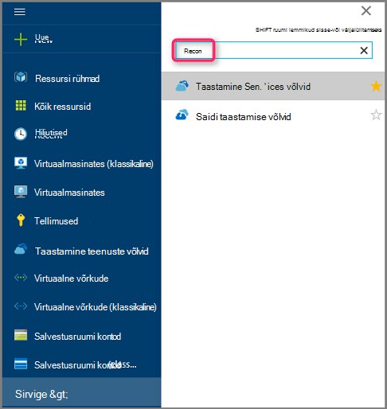
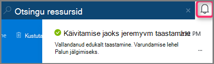

<properties
    pageTitle="Virtuaalmasinates Azure'i portaalis varukoopia põhjal taastamine | Microsoft Azure'i"
    description="Azure'i virtuaalarvuti taastamine taastamise punkti Azure'i portaalis"
    services="backup"
    documentationCenter=""
    authors="markgalioto"
    manager="cfreeman"
    editor=""
    keywords="taastamine varukoopia; Kuidas taastada; punkti taastamine;"/>

<tags
    ms.service="backup"
    ms.workload="storage-backup-recovery"
    ms.tgt_pltfrm="na"
    ms.devlang="na"
    ms.topic="article"
    ms.date="08/10/2016"
    ms.author="trinadhk; jimpark;"/>

# Azure'i portaali abil saate taastada virtuaalmasinates

> [AZURE.SELECTOR]
- [Klassikaline portaalis VMs taastamine](backup-azure-restore-vms.md)
- [Azure'i portaalis VMs taastamine](backup-azure-arm-restore-vms.md)

Andmete kaitsmine võttes andmete hetktõmmiste määratletud intervalliga. Taastamise punkte nimetatakse neid pilte ja need on talletatud taastamine teenuste võlvid. Kui või kui see on vajalik, parandamine või taasloomine VM, saate taastada VM mis tahes salvestatud taastamise punkte. Punkti taastamine taastamisel tagastada või taastada VM riigile taastamine punkti võtmisel. Selles artiklis selgitatakse, kuidas taastada VM.

> [AZURE.NOTE] Azure'i on kaks juurutamise mudelite loomise ja ressursside töötamine: [ressursihaldur ja klassikaline](../resource-manager-deployment-model.md). Sellest artiklist leiate teavet ja juhiseid taastamine VMs juurutatud ressursihaldur mudeli abil.

## Punkti taastamine taastamine

1. [Azure'i portaali](http://portal.azure.com/) sisselogimine

2. Azure'i menüü, klõpsake nuppu **Sirvi** ja teenuste loend, tippige **Taastamise teenused**. Teie tipitava kohandub teenuste loend. Kui näete **taastamise teenused võlvid**, valige see.

    

    Kuvatakse loend võlvid tellimus.

    

3. Valige loendist vault seostatud VM, mille soovite taastada. Vault klõpsamisel avatakse selle armatuurlaua.

    

4. Nüüd, kui olete vault armatuurlaual. **Üksuste varundamine** paani, klõpsake **Azure'i Virtuaalmasinates** seostatud vault VMs kuvamiseks.

    

    **Üksuste varundamine** tera avab ja kuvab Azure'i virtuaalmasinates loendit.

    

5. Valige loendist VM avamiseks armatuurlaud. Armatuurlaua VM avatakse jälgimis alale, mis sisaldab taastamine punktide paani.

    

6. Klõpsake menüü VM armatuurlaud, **taastamine**

    

    Avaneb tera taastamine.

    

7. Enne **taastada** , klõpsake avamiseks **Valige taastamine punkti** tera **taastamine punkti** .

    

    Vaikimisi kuvatakse dialoogiboks kõik taastamine punktid viimase 30 päeva. Kasutage **filtri** muuta ajavahemiku taastamine punktide kuvatakse. Vaikimisi kuvatakse kõik järjepidevuse punktide taastamine. Saate muuta **kõigi taastamine punktide** filtri, et valida kindla järjepidevuse taastamine punktide. Erinevat tüüpi taastamise kohta lisateavet osutage leiate teemast [andmete järjepidevuse](./backup-azure-vms-introduction.md#data-consistency)selgitus.  
    - Valige sellest loendist **taastamine punkti järjepidevuse** .
        - Ootamatult sulguda kooskõlas taastada punktid
        - Rakenduse kooskõlas taastada punktid
        - Faili süsteemi taastamine punktid
        - Kõik taastamine punkte.  

8. Valige Taasta punkti ja klõpsake nuppu **OK**.

    

    **Taastamine** tera kuvatakse taastamise on seatud.

    

9. Enne **taastamine** **konfiguratsiooni** avatakse automaatselt pärast taastamise on seatud.

    

## Valides VM taastamine konfigureerimine

Nüüd, kui olete valinud taastamise, valige konfigureerimine oma taastamine VM. Teie valikud konfigureerida taastatud VM on kasutada: Azure'i portaalis või PowerShelli.

> [AZURE.NOTE] Portaalis kiire loomine suvand taastatud VM. Kui soovite kohandada Wanna-Be taastatud VM VM konfiguratsiooni, PowerShelli kasutamine taastada varundatud ketast ja lisab selle valiku VM konfigureerimine. Vt [taastamine koos spetsiaalne konfiguratsioone VM](#restoring-vms-with-special-network-configurations).

1. Kui te ei ole juba olemas, minge tera **taastamine** . Tagada **taastamine punkti** on valitud, ning klõpsake nuppu **konfiguratsiooni** **taastamise konfiguratsiooni** tera avamiseks.

    

2. Enne **konfiguratsiooni** , sisestage või valige väärtused iga järgmised väljad:
    - **Virtuaalse masina nimi** - VM nimi. Nimi peab olema kordumatu ressursirühm (jaoks ressursihaldur juurutatud VM) või pilveteenuses (klassikaline VM) jaoks. Te ei saa asendada virtuaalse masina, kui see on juba olemas, klõpsake jaotises tellimuse.
    - **Ressursirühm** – saate kasutada olemasolevat ressursi rühma või looge uus. Kui taastate klassikaline VM, selle välja abil saate määrata nimi uue pilveteenusesse. Uue ressursi rühma/pilveteenus loomisel tuleb globaalselt kordumatu nimi. Tavaliselt pilvepõhise teenuse nimi on seostatud avaliku URL-i – näiteks: [cloudservice]. cloudapp.net. Kui proovite kasutada cloud ressursi rühma/cloud teenus, mis on juba kasutatud nimi, Azure'i määrab ressursside rühma/pilveteenuses VM sama nimi. Azure'i kuvab rühmad ressursi pilveteenustega ja VMs pole seotud mis tahes osaleja rühmad. Lisateavet leiate teemast [osaleja rühmadest (VNet) piirkondliku virtuaalse võrgu migreerimine](../virtual-network/virtual-networks-migrate-to-regional-vnet.md).
    - **Virtuaalse võrgu** - valige virtuaalse võrgu (VNET) VM loomisel. Välja toodud kõik VNETs tellimusega seostatud. Ressursirühm VM kuvatakse sulgudes.
    - **Alamvõrgu** – kui selle VNET alamvõrku, esimese alamvõrgu on vaikimisi valitud. Kui loendis on toodud täiendavad alamvõrku, valige soovitud alamvõrgu.
    - **Salvestusruumi konto** – see menüü loetleb salvestusruumi kontode taastamise teenused vault samasse asukohta. Valides salvestusruumi konto, valige konto, mis jagab taastamise teenused vault samasse asukohta. Salvestusruumi kontod, mis on Zone liigsete ei toetata. Kui pole salvestusruumi kontod taastamise teenused vault samasse asukohta, peate looma ühte enne taastetoimingu. Salvestusruumi konto dispersioonanalüüs tüüp on mainitud sulgudes.

    > [AZURE.NOTE] Kui taastate ressursihaldur juurutatud VM, tuleb tuvastada, virtuaalse võrgu (VNET). Virtuaalse võrgu (VNET) on vabatahtlik klassikaline VM.

3. Enne **konfiguratsiooni** , klõpsake nuppu **OK** taastamine konfigureerimine lõpule.

4. Enne **taastamiseks** klõpsake **taastamine** taastetoimingu käivitamiseks.

    

## Taastetoimingu jälgimine

Kui saate käivitada taastetoimingu, loob varukoopia teenuse töö jälgimine taastetoimingu. Varundus teenuse ka loob ja kuvab teate ajutiselt teatised ala portaalis. Kui kuvatakse teade, võite klõpsata alati vaadata teie teatised ikooni teatised.

Vaadata toimingut, kui see on töötlemist või kuvamiseks, kui see on lõpule jõudnud, avage varundamise töö loend.

1. Azure'i menüü, klõpsake nuppu **Sirvi** ja teenuste loend, tippige **Taastamise teenused**. Teie tipitava kohandub teenuste loend. Kui näete **taastamise teenused võlvid**, valige see.

    

    Kuvatakse loend võlvid tellimus.

    

2. Valige loendist vault seostatud taastatud VM. Vault klõpsamisel avatakse selle armatuurlaua.

3. **Varundus töö** vault armatuurlaual paani, klõpsake **Azure'i Virtuaalmasinates** vault seotud töödest kuvamiseks.

    

    **Varundus töö** tera avaneb ja kuvab tööde loendi.

    

## Teisiti võrgu konfiguratsioone VMs taastamine
On võimalik, et varundus ja taaste VMs koos teisiti võrgu järgmised. Neid konfiguratsioone nõuda teatud eritingimused läbimise taastamine.

- VMs jaotises Laadi koormusetasakaalustusteenuse (sise- ja)
- Mitme reserveeritud IP-d VMs
- Mitu NICs VMs

>[AZURE.IMPORTANT] Teisiti võrgukonfiguratsioon vms loomisel Kasutage PowerShelli luua VMs ketast, taastada.

Looge selle virtuaalmasinates täielikult pärast taastamist kettale, toimige järgmiselt.

1. Funktsiooni ketast taastamine taastamise teenuste hoidla [PowerShelli](../backup-azure-vms-automation.md#restore-an-azure-vm) abil

2. Luua nõutavaid laadi koormusetasakaalustusteenuse VM konfiguratsiooni / mitme NIC mitu reserveeritud IP PowerShelli cmdlet-käskude ja kasutage seda, et luua VM, soovitud konfiguratsioon.
    - Pilveteenuses koos [sisemise koormuse koormusetasakaalustusteenuse](https://azure.microsoft.com/documentation/articles/load-balancer-internal-getstarted/) VM loomine
    - VM [Internet vastastikuste laadi koormusetasakaalustusteenuse] ühenduse loomine (https://azure.microsoft.com/en-us/documentation/articles/load-balancer-internet-getstarted/)
    - [Mitu NICs](https://azure.microsoft.com/documentation/articles/virtual-networks-multiple-nics/) VM loomine
    - Luua VM [mitme reserveeritud IP-d](https://azure.microsoft.com/documentation/articles/virtual-networks-reserved-public-ip/)

## Järgmised sammud
Nüüd, kui teie VMs taastamiseks artiklist tõrkeotsingu teavet levinud vigade VMs abil. Ka, vaadake artiklis oma VMs ülesannete haldamiseks.

- [Tõrkeotsing](backup-azure-vms-troubleshoot.md#restore)
- [Virtuaalmasinates haldamine](backup-azure-manage-vms.md)
