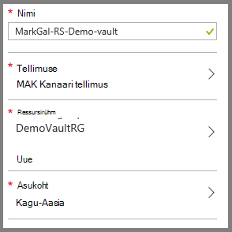
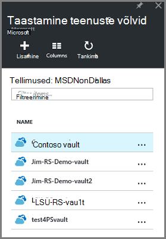
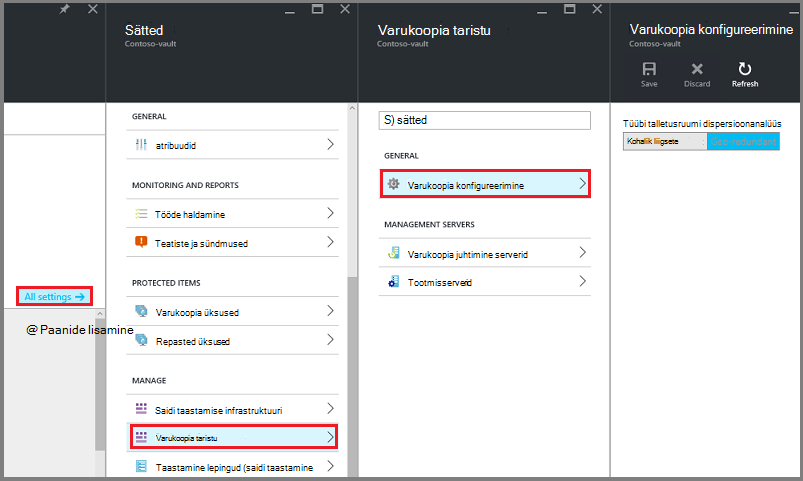
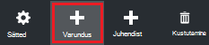
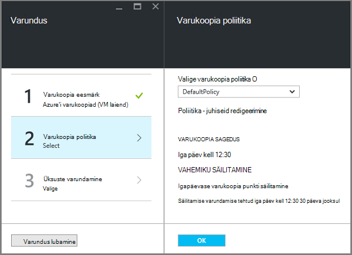
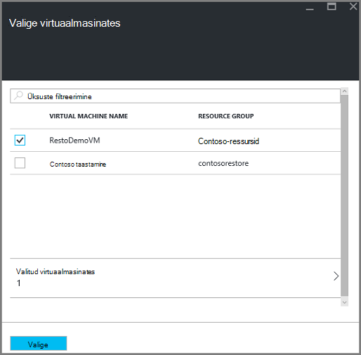

<properties
    pageTitle="Ressursihaldur juurutatud virtuaalmasinates varundada keskkonna ettevalmistamise | Microsoft Azure'i"
    description="Veenduge, et teie keskkond on valmis varundamiseks Azure'i virtuaalmasinates"
    services="backup"
    documentationCenter=""
    authors="markgalioto"
    manager="cfreeman"
    editor=""
    keywords="varukoopiate; varundamise;"/>

<tags
    ms.service="backup"
    ms.workload="storage-backup-recovery"
    ms.tgt_pltfrm="na"
    ms.devlang="na"
    ms.topic="article"
    ms.date="08/21/2016"
    ms.author="trinadhk; jimpark; markgal;"/>


# <a name="prepare-your-environment-to-back-up-resource-manager-deployed-virtual-machines"></a>Ressursihaldur juurutatud virtuaalmasinates varundada keskkonna ettevalmistamiseks

> [AZURE.SELECTOR]
- [Ressursihaldur mudel](backup-azure-arm-vms-prepare.md)
- [Klassikaline mudel](backup-azure-vms-prepare.md)

Sellest artiklist leiate juhised keskkonna varundada ressursihaldur juurutatud virtuaalse masina (VM) ettevalmistamine. Azure'i portaali kasutada toiminguid toodud juhiseid.  

Azure varukoopia teenus on kahte tüüpi kaitsta oma VMs võlvid (varundada võlvid ja taastamise teenuste võlvid). Varukoopiate hoidla kaitseb VMs juurutatud klassikaline juurutamise mudeli abil. Taastamise teenuste hoidla kaitseb **nii klassikaline juurutatud või ressursihaldur juurutatud VMs** . Kasutage taastamise teenused vault kaitsta ressursihaldur juurutatud VM.

>[AZURE.NOTE] Azure'i on kaks juurutamise mudelite loomise ja ressursside töötamine: [ressursihaldur ja klassikaline](../resource-manager-deployment-model.md). Üksikasjad klassikaline juurutamise mudeli VMs töötamise kohta leiate [Azure'i virtuaalmasinates varundada keskkonna ettevalmistamine](backup-azure-vms-prepare.md) .

Enne kui saate kaitsta või varundamine ressursihaldur juurutatud virtuaalse masina (VM), veenduge, et need eeltingimused olemas.

- Taastamise teenuste hoidla loomiseks (või mõne olemasoleva taastamise teenuste hoidla tuvastamine) *sisse oma VM samasse asukohta*.
- Valige stsenaarium, määratlemine varukoopia poliitika ja määratlevad üksuste kaitsta.
- Märkige ruut VM Agent virtual arvutisse installimise.
- Märkige ruut võrguühendus

Kui teate, et teie keskkonnas olemas need tingimused siis jätkake [oma VMs artiklis varundada](backup-azure-vms.md). Kui teil on vaja, saate häälestada ja märkige ruut mis tahes need eeltingimused selles artiklis viib teid läbi juhiseid ettevalmistamiseks selle nõutav.


## <a name="limitations-when-backing-up-and-restoring-a-vm"></a>Kui varundus ja taaste VM piirangud

Enne keskkonna ettevalmistamiseks, palun piirangud on teile arusaadavad.

- Rohkem kui 16 andmete ketast virtuaalmasinates varundada ei toetata.
- Varundada virtuaalmasinates reserveeritud IP-aadress ja pole määratletud lõpp-punkti ei toetata.
- Varukoopia Linux virtuaalmasinates keskmise suurusega laiendiga ei toetata. 
- Varundatud andmete ei sisalda seotud VM võrku ühendatud draivid. 
- Mõne olemasoleva virtuaalse masina asendamisel taastamisel ei toetata. Kui proovite VM taastada, kui VM on olemas, taastetoimingu nurjub.
- Rist-piirkond varundus ja taaste ei toetata.
- Saate varundada kõikide avaliku regioonide Azure'i virtuaalmasinates (vt toetatud regioonide [kontroll-loend](https://azure.microsoft.com/regions/#services) ). Kui täna ei toetata piirkond, mida otsite, ei kuvata ripploendis vault loomise ajal.
- Saate varundada ainult jaoks valige operatsioonisüsteemi versiooni virtuaalmasinates:
  - **Linux**: Azure'i varukoopiad toetab [jaotuse, mis on kinnitatud Azure'i loendi](../virtual-machines/virtual-machines-linux-endorsed-distros.md) peale Core OS Linux.  Muude Too-oma-omanik-Linuxi ka võivad töötada, kui VM on saadaval virtual arvutisse ja tugi Python olemas.
  - **Windows Server**: Windows Server 2008 R2 versioonides ei toetata.
- Domeenikontrolleri taastamine (näiteks Põhiliselt) VM, mis on osa mitme – näiteks Põhiliselt konfiguratsiooni toetatakse ainult PowerShelli kaudu. Lisateavet [mitme – näiteks Põhiliselt domeenikontrolleri taastamine](backup-azure-restore-vms.md#restoring-domain-controller-vms).
- Taastamine on spetsiaalne järgmised toetatakse ainult PowerShelli kaudu. Taasta töövoog kasutajaliidese abil loodud VMs ei pea neid võrgu konfiguratsioone kui taastetoimingu on lõpule jõudnud. Lisateavet leiate teemast [Teisiti võrgu konfiguratsioone VMs taastamine](backup-azure-restore-vms.md#restoring-vms-with-special-netwrok-configurations).
  - Virtuaalmasinates jaotises Laadi koormusetasakaalustusteenuse konfigureerimine (sise- ja)
  - Virtuaalmasinates mitme reserveeritud IP-aadressid
  - Mitme võrguadapteri koos virtuaalmasinates

## <a name="create-a-recovery-services-vault-for-a-vm"></a>VM taastamise teenuste hoidla loomine

Taastamise teenuste hoidla on üksus, mis salvestab varukoopiate ja taastamise punkte, mis on loodud aja jooksul. Taastamise teenuste hoidla sisaldab ka varukoopia poliitikad, mis on seotud kaitstud virtuaalmasinates.

Taastamise teenuste hoidla loomiseks tehke järgmist.

1. [Azure'i portaali](https://portal.azure.com/)sisse logida.

2. Jaoturi menüü, klõpsake nuppu **Sirvi** ja tippige ressursid loendis **Taastamise teenused**. Kui alustate tippimist, loendit filtreeritakse sisendit põhjal. Klõpsake **taastamise teenused vault**.

     <br/>

    Kuvatakse loend taastamise teenused võlvid.

3. Menüü **võlvid taastamise teenused** nuppu **Lisa**.

    

    Taastamise teenused vault tera avaneb, palub teil **nime** **tellimuse** **ressursirühm**ning **asukoht**.

    

4. Sisestage **nimi**sõbralik nimi, mis tähistavad vault. Nimi peab olema kordumatu Azure tellimuse jaoks. Tippige nimi, mis sisaldab 2 – 50 märki. See peab algama tähega ja võib sisaldada ainult tähti, numbreid ja sidekriipse.

5. Klõpsake **tellimuse** saadaolevate tellimuste loendi kuvamiseks. Kui te pole kindel, milline tellimus kasutada, kasutage vaikeväärtust (või soovitatud) tellimus. Seal on mitu valikud ainult juhul, kui ettevõtte konto on seotud mitu Azure tellimust.

6. **Ressursirühm** on saadaval loendi kuvamiseks valige või klõpsake nuppu **Uus** , et luua uue ressursirühma. Ressursi rühmade kohta, leiate [Azure'i ressursihaldur ülevaade](../azure-resource-manager/resource-group-overview.md)

7. Klõpsake **asukoha** valimiseks piirkonnas vault jaoks. Vault **peab** asuma samas piirkonnas virtuaalmasinates, mida soovite kaitsta.

    >[AZURE.IMPORTANT] Kui olete kindel, asukoht, kus teie VM olemas, välja vault loomine dialoogiboksi sulgemiseks ja minge portaali Virtuaalmasinates loendit. Kui teil on mitu piirkondades virtuaalmasinates, peate iga piirkonna taastamise teenused vault loomine. Looge vault esimene asukoht enne järgmise asukohta. Ei ole vaja määramiseks salvestusruumi kontod varukoopia andmete--taastamise teenused vault talletamiseks ja Azure varukoopia teenuse teeb seda automaatselt.

8. Klõpsake nuppu **Loo**. Võib kuluda aega taastamise teenused vault luua. Jälgida Olekuteatised portaalis paremas ülanurgas alal. Kui teie vault on loodud, kuvatakse see taastamise teenused võlvid loendit.

    

    Nüüd, kui olete loonud oma vault, saate teada, kuidas määrata salvestusruumi kopeerimine.

## <a name="set-storage-replication"></a>Seadmine salvestusruumi Dispersioonanalüüs

Salvestusruumi dispersioonanalüüs suvand võimaldab valida geograafilise liigne salvestusruumi ja kohalikult liigsete salvestusruumi. Vaikimisi on teie vault geograafilise liigne salvestusruumi. Jätke suvand, kui see peamine varukoopia geograafilise liigne salvestusruumi väärtuseks. Kui soovite odavamad, mis pole päris nii püsival, valige kohalik liigsete salvestusruumi. Lisateavet [geograafilise liigne](../storage/storage-redundancy.md#geo-redundant-storage) ja [kohalikult liigsete](../storage/storage-redundancy.md#locally-redundant-storage) talletamise võimalused [Azure Storage dispersioonanalüüs ülevaade](../storage/storage-redundancy.md).

Salvestusruumi dispersioonanalüüs säte redigeerimiseks tehke järgmist.

1. Valige oma vault vault armatuurlaua ja tera sätted avamiseks. Kui tera **sätted** ei avane, klõpsake vault armatuurlaua **Kõik sätted** .

2. Enne **sätted** , klõpsake nuppu **Varundus taristu** > **Varukoopia konfiguratsiooni** **Varukoopia konfiguratsiooni** tera avamiseks. Enne **Varukoopia konfiguratsiooni** , valige oma vault salvestusruumi dispersioonanalüüs suvandi.

    

    Pärast valides oma vault salvestusruumi suvandi, olete valmis vault VM seostada. Kõigepealt seost, tuleks leida ja Azure'i virtuaalmasinates registreerida.


## <a name="select-a-backup-goal-set-policy-and-define-items-to-protect"></a>Valige varukoopia eesmärk, poliitika määramine ja üksuste kaitsta määratlemine

Enne registreerumist võlvkelder VM, käivitage discovery uue virtuaalmasinates, mis on lisatud tellimuse registreerida. Protsessi päringute Azure'i virtuaalmasinates tellimus, koos täiendavat teavet loendi nagu pilvepõhise teenuse nimi ja piirkond. Azure'i portaalis stsenaariumi viitab kavatsete kasutusele võtta taastamise teenuste hoidla. Poliitika on ajakava võetakse sageduse ja kui taastamise punkte. Poliitika sisaldab ka erinevatele taastamise punktid.

1. Kui teil on juba taastamise teenused vault Ava, jätkake juhisega 2. Kui te ei saa taastamise teenused, võlvkelder avatud, kuid on Azure portaalis menüü keskuses nuppu **Sirvi**.

  - Tippige väljale ressursid loendis **Taastamise teenused**.
  - Kui alustate tippimist, loendit filtreeritakse sisendit põhjal. Kui näete **taastamise teenused võlvid**, klõpsake seda.

     <br/>

    Kuvatakse loend taastamise teenused võlvid.
  - Valige loendist taastamise teenused võlvid võlvkelder.

    Avab valitud vault armatuurlaud.

    

2. Klõpsake menüüst vault armatuurlaua **varundamise** varundamise tera avamiseks.

    

    Tera avamisel otsib varundamise teenuse ühtegi VMs uus tellimus.

    

3. Enne varukoopia, klõpsake **varundamise eesmärk** varundamise eesmärk tera avamiseks.

    

4. Enne varukoopia eesmärk, määrata **kus töötab teie töökoormus** Azure'i ja **mida soovite varukoopia** virtuaalse masina, seejärel klõpsake nuppu **OK**.

    Varundamise eesmärk tera suletakse ja varundamise poliitika tera.

    

5. Enne varukoopia poliitika, valige varukoopia poliitika, mida soovite rakendada vault ja klõpsake nuppu **OK**.

    

    Vaikepoliitika üksikasjad on loetletud üksikasjad. Kui soovite luua uue poliitika, valige rippmenüüst menüüst käsk **Loo uus** . Rippmenüüst menüü võimaldab ka aeg, millal hetktõmmis tehtud – 19.00 aktiveerimine. Juhised varukoopia poliitika määratlemise kohta leiate teemast [varukoopia poliitikast](backup-azure-vms-first-look-arm.md#defining-a-backup-policy). Pärast nupu **OK**klõpsamist varukoopia poliitika on seostatud vault.

    Valige järgmine VMs vault seostada.

6. Valige soovitud virtuaalmasinates seostada määratud poliitika ja klõpsake nuppu **Vali**.

    

    Kui te ei näe soovitud VM, kontrollige, kas see on olemas taastamise teenused vault Azure samasse asukohta.

7. Nüüd, kui olete määratlenud kõigi jaoks võlvkelder varundamise tera klõpsake nuppu **Luba varundamise** lehe allosas. See juurutamine poliitika on hoidla ja VMs.

    

Järgmise etapi ettevalmistamisel on installimise VM Agent või veenduge, et VM Agent on installitud.


## <a name="install-the-vm-agent-on-the-virtual-machine"></a>Virtuaalse masina VM agendi installimine

Azure'i VM Agent peab olema installitud Azure virtuaalne arvutisse varundamise pikendamise töötamiseks. Kui teie VM loodi Azure galeriist, siis VM Agent on juba olemas virtuaalse masina. See teave on esitatud olukordades, kus te parajasti *ei* VM abil loodud Azure galeriist – näiteks VM migreeritud on kohapealse andmekeskuse. Sellisel juhul VM Agent peab olema installitud virtuaalse masina kaitsmiseks.

Lisateavet [VM Agent](https://go.microsoft.com/fwLink/?LinkID=390493&clcid=0x409) ja [Kuidas installida VM Agent](../virtual-machines/virtual-machines-windows-classic-manage-extensions.md).

Kui teil on probleeme Azure VM varundada, kontrollige, et Azure VM Agent on õigesti virtual arvutisse installitud (vt järgmine tabel). Kui olete loonud kohandatud VM, [veenduge, et märgitud on ruut **installida VM Agent** ](../virtual-machines/virtual-machines-windows-classic-agents-and-extensions.md) enne virtuaalse masina on ette valmistatud.

Järgmine tabel annab Lisateavet VM Agent for Windows ja Linux VMs.

| **Toiming** | **Windows** | **Linux** |
| --- | --- | --- |
| Installimise VM Agent | <li>Laadige alla ja installige [agent MSI](http://go.microsoft.com/fwlink/?LinkID=394789&clcid=0x409). Peate installimise lõpuleviimiseks administraatoriõigused. <li>[VM atribuudi värskendamiseks](http://blogs.msdn.com/b/mast/archive/2014/04/08/install-the-vm-agent-on-an-existing-azure-vm.aspx) , näitamaks, et ta on installitud. | <li> Installige uusim [Linux agent](https://github.com/Azure/WALinuxAgent) GitHub. Peate installimise lõpuleviimiseks administraatoriõigused. <li> [VM atribuudi värskendamiseks](http://blogs.msdn.com/b/mast/archive/2014/04/08/install-the-vm-agent-on-an-existing-azure-vm.aspx) , näitamaks, et ta on installitud. |
| VM Agent värskendamine | Värskendamise VM Agent on sama lihtne nagu [VM Agent kahendfaile](http://go.microsoft.com/fwlink/?LinkID=394789&clcid=0x409)uuesti installida. <br>Veenduge, et ilma varukoopia toiming töötab VM agent värskendamise ajal. | Järgige [Linux VM Agent värskendamise ](../virtual-machines-linux-update-agent.md)kohta. <br>Veenduge, et ilma varukoopia toiming töötab VM Agent värskendamise ajal. |
| VM agendi installimise kontrollimine | <li>Liikuge kausta *C:\WindowsAzure\Packages* Azure VM. <li>Tuleb leida WaAppAgent.exe faili esitus.<li> Paremklõpsake faili, valige **Atribuudid**ja seejärel valige vahekaart **üksikasjad** . Toote versioon välja peaks olema 2.6.1198.718 või uuem versioon. | N/A |


### <a name="backup-extension"></a>Varukoopia laiend

Kui virtual arvutisse on installitud VM Agent, installib Azure varukoopia teenuse varukoopia laiend VM Agent. Azure'i varukoopia teenuse sujuvalt uuendab ja plaastrid varukoopia laiendi.

Varukoopia laiend on installitud varukoopia teenus, kas VM töötab. Töötava VM pakub suurim võimalus saada mõne rakenduse ühtsete taastamine punkti. Azure'i varundus teenuse jätkuvalt varundamine VM isegi juhul, kui see on välja lülitatud ja laiendamine ei saanud installida. Seda nimetatakse ühenduseta VM. Sel juhul on taastamine punkti *ühtsete krahh*.


## <a name="network-connectivity"></a>Võrguühendus

VM hetktõmmiseid haldamiseks peab varukoopia laiend Ühenduvus Azure avaliku IP-aadresse. Ilma õige Interneti-ühenduse, virtuaalse masina HTTP taotleb ajalõpuni ja varukoopia toiming nurjub. Juhul, kui teie juurutusega on juurdepääsupiirangud (kaudu võrgu turberühma (NSG), näiteks), seejärel valige üks järgmistest suvanditest, pakkudes selge varukoopia liikluse:

- [Valge Azure andmekeskuse IP-vahemikke](http://www.microsoft.com/en-us/download/details.aspx?id=41653) - artiklist juhised selle kohta, kuidas nimekirja nimekiri IP-aadressid.
- Juurutada marsruutimise liikluse HTTP-puhverserver.

Otsustamisel, milline võimalus kasutada, on selle kompromisse vahel hallatavust, Varundustöö kontrolli ja maksumus.

|Suvand|Eelised|Puudused|
|------|----------|-------------|
|Nimekiri IP-aadresside vahemikud| Lisatasu.<br><br>Accessi avamise on NSG, kasutada cmdlet <i>Set-AzureNetworkSecurityRule</i> . | Keerukate hallata selle kannatavas IP-aadresside vahemikud aja jooksul muutuda.<br><br>Saab kasutada kogu Azure ja mitte ainult salvestusruumi.|
|HTTP-puhverserver| Talletamist Varundustöö juhtida puhverserveri URL-id lubatud.<br>Ühe punkti Interneti-ühendus vms.<br>Ei kuulu Azure'i IP-aadress muutub.| Täiendavad kulud töötab VM puhverserveri tarkvara.|

### <a name="whitelist-the-azure-datacenter-ip-ranges"></a>Valge Azure andmekeskuse IP-vahemikke

Nimekirja nimekiri Azure andmekeskuse IP-vahemikke, leiate [Azure'i veebisaidi](http://www.microsoft.com/en-us/download/details.aspx?id=41653) andmed IP-aadresside vahemikud ja juhiseid.

### <a name="using-an-http-proxy-for-vm-backups"></a>HTTP-puhverserver VM varufailide abil
Kui varundamine VM, varukoopia laiend VM saadab hetktõmmise haldamise käske Azure Storage API HTTPS-i abil. Marsruutimine varukoopia laiend liikluse kaudu HTTP-puhverserver, kuna see on ainult osa, mis on konfigureeritud lubama avaliku Interneti-ühendus.

>[AZURE.NOTE] Ei ole soovitust puhvri tarkvara, mida tuleks kasutada. Veenduge, et valite puhverserveri, mis ühildub konfiguratsiooni alltoodud juhiseid.

Näide alloleval pildil on näha kolme konfigureerimistoimingute vaja kasutada HTTP-puhverserver:

- Rakenduse VM marsruudib kogu HTTP-liikluse jaoks avaliku Interneti kaudu puhverserveri VM seotud.
- Puhverserveri VM võimaldab virtuaalse võrgu kaudu VMs liiklust.
- Selle võrgu turvalisus jaotises NSG nimega NSF-lukustatud peab on turvalisus reegel võimaldab väljaminev Interneti-liikluse puhverserveri VM.


HTTP-puhverserver suhelda avaliku Interneti kasutamiseks tehke järgmist.

#### <a name="step-1-configure-outgoing-network-connections"></a>Samm 1. Väljaminevate võrguühenduste konfigureerimine

###### <a name="for-windows-machines"></a>Windowsi masinad
Kohalik süsteem konto seadistamine puhverserveri server setup.

1. [PsExec](https://technet.microsoft.com/sysinternals/bb897553) allalaadimine
2. Käivitage järgmine käsk administraatoriõigustes käsuviibas kaudu

     ```
     psexec -i -s "c:\Program Files\Internet Explorer\iexplore.exe"
     ```
     Avaneb internet Exploreri aknas.
3. Minge Tööriistad -> Interneti-suvandid -> ühendused -> Kohtvõrgu sätted.
4. Kontrollige puhverserveri sätted süsteem konto. Määrake puhverserveri IP ja port.
5. Sulgege Internet Explorer.

See loob hõlmav puhverserveri konfigureerimine ja kasutatakse mis tahes väljamineva liikluse HTTP-või HTTPS.

Kui teil on häälestamise puhverserveri Praegune kasutajakonto (mitte kohalik süsteem konto), kasutage järgmist skripti rakendamiseks SYSTEMACCOUNT:

```
   $obj = Get-ItemProperty -Path Registry::”HKEY_CURRENT_USER\Software\Microsoft\Windows\CurrentVersion\Internet Settings\Connections"
   Set-ItemProperty -Path Registry::”HKEY_USERS\S-1-5-18\Software\Microsoft\Windows\CurrentVersion\Internet Settings\Connections" -Name DefaultConnectionSettings -Value $obj.DefaultConnectionSettings
   Set-ItemProperty -Path Registry::”HKEY_USERS\S-1-5-18\Software\Microsoft\Windows\CurrentVersion\Internet Settings\Connections" -Name SavedLegacySettings -Value $obj.SavedLegacySettings
   $obj = Get-ItemProperty -Path Registry::”HKEY_CURRENT_USER\Software\Microsoft\Windows\CurrentVersion\Internet Settings"
   Set-ItemProperty -Path Registry::”HKEY_USERS\S-1-5-18\Software\Microsoft\Windows\CurrentVersion\Internet Settings" -Name ProxyEnable -Value $obj.ProxyEnable
   Set-ItemProperty -Path Registry::”HKEY_USERS\S-1-5-18\Software\Microsoft\Windows\CurrentVersion\Internet Settings" -Name Proxyserver -Value $obj.Proxyserver
```

>[AZURE.NOTE] Kui märkate puhverserveri server log "(407) puhverserveri autentimine nõutav", kontrollige oma autentimine on õigesti häälestatud.

######<a name="for-linux-machines"></a>Linux masinad

Lisage järgmine rida on ```/etc/environment``` faili:

```
http_proxy=http://<proxy IP>:<proxy port>
```

Lisage järgmised read on ```/etc/waagent.conf``` faili:

```
HttpProxy.Host=<proxy IP>
HttpProxy.Port=<proxy port>
```

#### <a name="step-2-allow-incoming-connections-on-the-proxy-server"></a>Samm 2. Puhverserveri sissetulevaid ühendusi lubamiseks tehke järgmist.

1. Puhverserver, avage Windowsi tulemüür. Lihtsaim viis tulemüüri juurdepääsu on otsida täiustatud turvalisusega Windowsi tulemüür.

    

2. Dialoogiboksis Windowsi tulemüür Paremklõpsake **Sissetulevad reeglid** ja nuppu **Uus reegel …**.

    

3. **Uue sissetuleva reegli viisardis**valige **Reegli tüüp** **kohandatud** suvand ja klõpsake nuppu **edasi**.
4. Klõpsake lehel Valige **programmi**, valige käsk **Kõik programmid** ja klõpsake nuppu **edasi**.

5. Lehel **pordid ja Protocol (protokoll)** , sisestage järgmine teave ja klõpsake nuppu **edasi**.

    

    - valida *TCP* *protokolli tüüp*
    - Valige *kohalik* Port *Konkreetset pordid*, määrake väljal allpool olevat ```<Proxy Port>``` mis on konfigureeritud.
    - Valige *Remote pordi* *Kõik pordid*

    Kõik viis lõpetamiseks klõpsake viisardi ülejäänud ja pange selle reegli nimi.

#### <a name="step-3-add-an-exception-rule-to-the-nsg"></a>Samm 3. Funktsiooni NSG reegli erandi lisamiseks tehke järgmist.

Azure'i PowerShelli Käsuviip ja sisestage järgmine käsk:

Järgmine käsk lisab selle NSG erandi. Seda erandit võimaldab TCP-liikluse kaudu mis tahes porti 10.0.0.5 pordi 80 (HTTP) või 443 (HTTPS) mis tahes Interneti-aadressi. Kui vajate kindla pordi avaliku Interneti, lisage kindlasti pordinumber, et selle ```-DestinationPortRange``` ka.

```
Get-AzureNetworkSecurityGroup -Name "NSG-lockdown" |
Set-AzureNetworkSecurityRule -Name "allow-proxy " -Action Allow -Protocol TCP -Type Outbound -Priority 200 -SourceAddressPrefix "10.0.0.5/32" -SourcePortRange "*" -DestinationAddressPrefix Internet -DestinationPortRange "80-443"
```


*Need juhised kasutada teatud nimed ning väärtused selles näites. Kasutage nimed ning väärtused juurutamise sisestamisel, või lõikamine ja kleepides oma koodi üksikasjad.*


Nüüd, kui teate, et teil on võrguühendus, olete valmis oma VM varundada. Vt [ressursihaldur juurutatud VMs varundada](backup-azure-arm-vms.md).

## <a name="questions"></a>Teil on küsimusi?
Kui teil on küsimusi või on mis tahes funktsiooni, mida soovite näha kaasatud, [saatke meile tagasiside](http://aka.ms/azurebackup_feedback).

## <a name="next-steps"></a>Järgmised sammud
Nüüd, kui olete valmis keskkonna varundada oma VM, saate järgmiseks loogika on varukoopia. Kavandamise artiklis antakse täpsemat teavet VMs varundada.

- [Virtuaalmasinates varundamine](backup-azure-vms.md)
- [Teie VM varukoopia taristu kavandamine](backup-azure-vms-introduction.md)
- [Virtuaalse masina varukoopiate haldamine](backup-azure-manage-vms.md)
