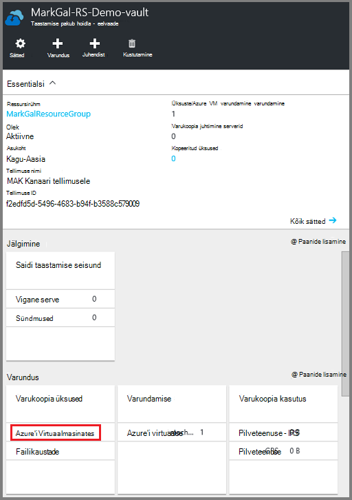
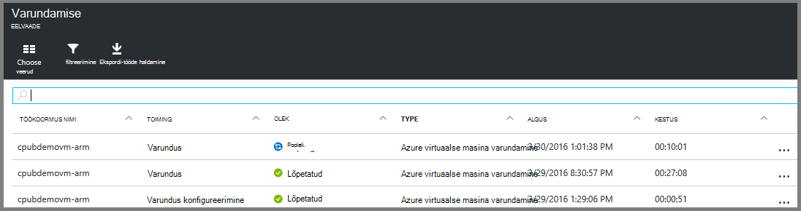

<properties
    pageTitle="Varundamine Azure'i VMs taastamise teenused vault | Microsoft Azure'i"
    description="Vaadake, registreerida ja Azure'i virtuaalmasinates taastamise teenuste hoidla koos Azure virtuaalse masina varundamise kirjeldatud toiminguid saate varundada."
    services="backup"
    documentationCenter=""
    authors="markgalioto"
    manager="cfreeman"
    editor=""
    keywords="virtuaalse masina varundamise; varundamine virtuaalse masina; Varundus- ja Avariijärgne taaste; arm vm varundamine"/>

<tags
    ms.service="backup"
    ms.workload="storage-backup-recovery"
    ms.tgt_pltfrm="na"
    ms.devlang="na"
    ms.topic="article"
    ms.date="07/29/2016"
    ms.author="trinadhk; jimpark; markgal;"/>

# Varundage Azure VMs taastamise teenused vault

> [AZURE.SELECTOR]
- [Varundage VMs taastamise teenused vault](backup-azure-arm-vms.md)
- [Varundus vault VMs varundamine](backup-azure-vms.md)

Sellest artiklist leiate juhiseid varundate taastamise teenused vault Azure VMs (ressursihaldur juurutatud ja klassikaline juurutatud). Enamik tööd varundada VMs läheb ettevalmistamine. Enne kui saate varundamine või kaitse VM, peate täitma [eeltingimused](backup-azure-arm-vms-prepare.md) kaitse oma VMs keskkonna ettevalmistamiseks. Kui olete lõpetanud eeltingimused, saate algatada toiming, hetktõmmiste oma VM varundada.

>[AZURE.NOTE] Azure'i on kaks juurutamise mudelite loomise ja ressursside töötamine: [ressursihaldur ja klassikaline](../resource-manager-deployment-model.md). Te saate kaitsta ressursihaldur juurutatud VMs ja klassikaline VMs taastamise teenused võlvid. Üksikasjad klassikaline juurutamise mudeli VMs töötamise kohta leiate [Azure'i virtuaalmasinates varundamine](backup-azure-vms.md) .

Lisateabe saamiseks lugege artikleid [VM varukoopia taristu Azure kavandamise](backup-azure-vms-introduction.md) ja [Azure'i virtuaalmasinates](https://azure.microsoft.com/documentation/services/virtual-machines/).

## Töö varundada käivitamise

Poliitika seotud taastamise teenused vault, varundage määratleb, kui sageli ja millal varukoopia toiming viiakse. Vaikimisi on esimene ajastatud varundus algse varukoopia. Kuni algse varundamise ilmneb, viimase varukoopia oleku **Varundamise** enne näitab **hoiatus (algse varukoopia ootel)**.

Kui algset varukoopia on väga kiiresti alustada tähtaja, on soovitatav **Varunda kohe**käivitada. Järgmise toimingu algab vault armatuurlaud. Selle toimingu pakub algse Varundustöö töötab, kui olete täitnud kõik eeltingimused. Kui algset Varundustöö on juba käivitatud, see toiming pole saadaval. Seotud varukoopia poliitika määratleb järgmise Varundustöö.  

Algne Varundustöö käivitamiseks tehke järgmist.

1. Klõpsake paani **varundamise** armatuurlaual vault **Azure'i Virtuaalmasinates**.  
    

    **Üksuste varundamine** tera avaneb.

2. Enne **Üksuste varundamine** , paremklõpsake vault, mida soovite varundada, ja klõpsake käsku **varundus kohe**.

    

    Käivitatakse varundus töö.  

    

3. Vaadata, et algne varukoopia on lõppenud, armatuurlaual vault **Varundamise** paanil klõpsake **Azure'i virtuaalmasinates**.

    

    Varundus töö tera avaneb.

4. **Varundus töö** tera, näete kõiki töid olekut.

    

    >[AZURE.NOTE] Varukoopia toimingu osana Azure varukoopia teenuse käsib varukoopia laiend iga virtual kohapeal tühjendage Alustuseks kõik kirjutab ja ühtsete hetktõmmis.

    Varundustöö lõpetades olek on *lõpule viidud*.

## Tõrkeotsing
Kui tekib probleeme varundamise ajal virtual masinat, vaadake [VM tõrkeotsingu artikkel](backup-azure-vms-troubleshoot.md) abi.

## Järgmised sammud

Nüüd, kui teil on kaitstud oma VM, märkige ruut välja järgmised artiklid jaoks täiendavate haldamise toiminguid saate teha oma VMs ja kuidas taastada VMs.

- [Hallata ja jälgida oma virtuaalmasinates](backup-azure-manage-vms.md)
- [Virtuaalmasinates taastamine](backup-azure-arm-restore-vms.md)
