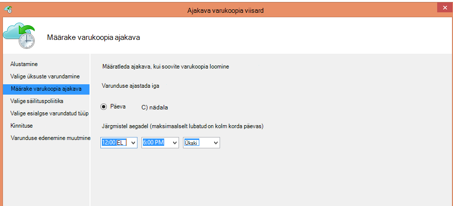
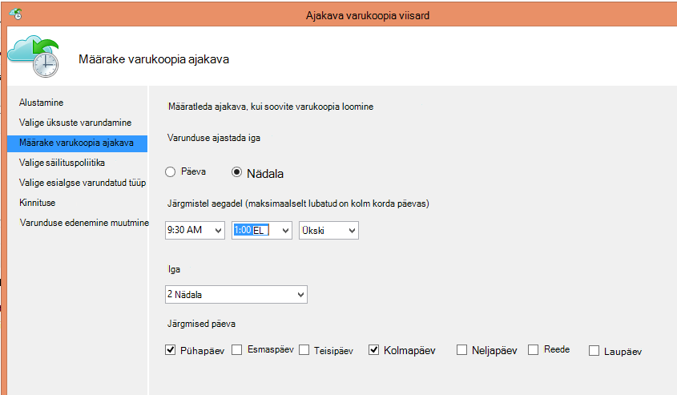
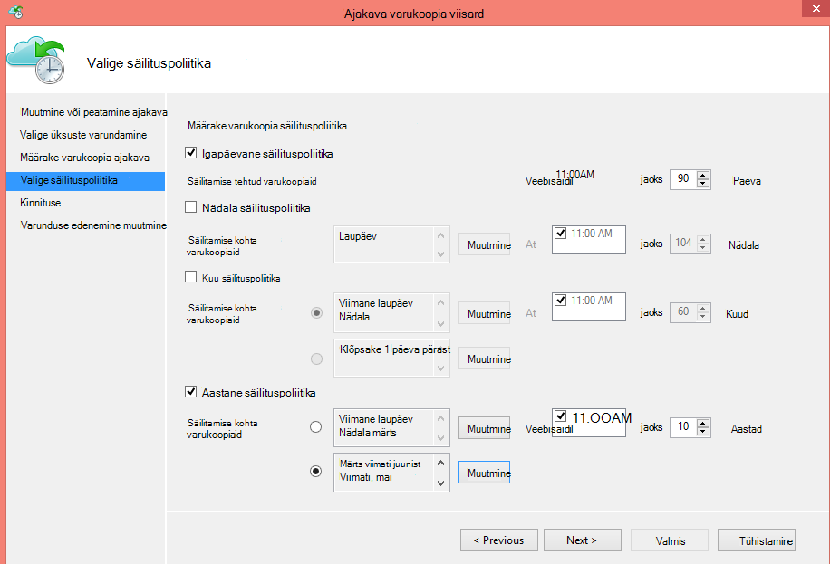
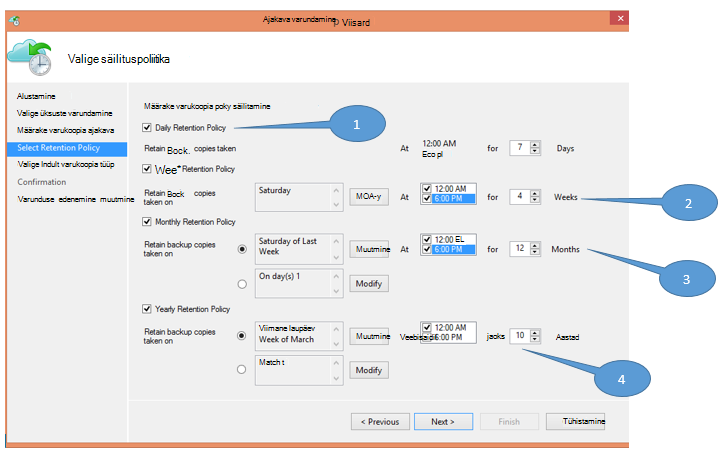
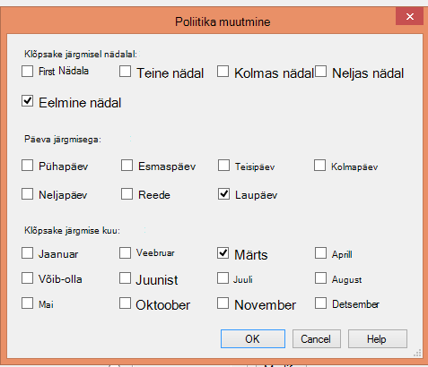

<properties
   pageTitle="Kasutage Azure varukoopia asendamiseks oma lint taristu | Microsoft Azure'i"
   description="Siit saate teada, kuidas Azure'i varukoopia pakub lint-like semantika, mis võimaldab teil varundus ja taaste Azure'i andmed"
   services="backup"
   documentationCenter=""
   authors="trinadhk"
   manager="vijayts"
   editor=""/>
<tags
   ms.service="backup"
   ms.devlang="na"
   ms.topic="article"
   ms.tgt_pltfrm="na"
   ms.workload="storage-backup-recovery"
   ms.date="09/27/2016"
   ms.author="jimpark;trinadhk;markgal"/>

# Kasutage Azure varukoopia asendamiseks oma lint taristu

Azure'i varundus ja süsteemi andmete kaitse Manager kliendid teha järgmist.

- Varundage andmed mis vastavalt ettevõtte vajadustele.
- Varundatud andmete säilitamise pikemaks ajaks
- Tehke nende pikaajaline säilitamine osa peab (lint) asemel Azure.

Selles artiklis selgitatakse, kuidas lubada kliendid varundus-ja säilitus. Kliendid, kes kasutavad lindid käsitlema nende pika-pikaajalise säilitamise peab on nüüd on võimas ja kasulik alternatiiv selle funktsiooni kättesaadavus. See funktsioon on lubatud Azure varukoopia uusim versioon (mis on saadaval [siin](http://aka.ms/azurebackup_agent)). System Center DPM kliendid peavad kasutusele vähemalt DPM 2012 R2 UR5 enne DPM Azure varukoopia teenuse kasutamist.

## Mis on varundamise graafik?
Varunduse ajakava näitab varukoopia toimingu sagedus. Näiteks sätted järgmisel kuvatõmmisel näidata, et varukoopiate võetakse iga päev kell 6 ja keskööst.

Kliendid saavad ajastada ka nädala varukoopia. Näiteks sätted järgmisel kuvatõmmisel näitavad, et varukoopiate iga alternatiivse Pühapäev & Kolmapäev 9:30 kohta ja tehakse 1:00 AM.

## Mis on säilituspoliitika?
Säilituspoliitika määrab kestus, mille varukoopia peavad olema talletatud. Asemel ainult täpsustades "tasapinnalise poliitika" kõik varukoopia punktid, kliendid saavad määrata eri säilituspoliitikate kui varukoopia põhjal. Näiteks varukoopia punkti tehtud iga päev, mis toimib mõnda taastamist punkti, säilib 90 päeva. Pikemaks ajaks säilib varukoopia punkti tehtud kontrollimiseks iga kvartali lõpu seisuga.

"Säilituspoliitika punktid" sätestatud arv on 90 (iga päev punktid) + 40 (üks iga 10 aasta kvartal) = 130.

## Näide – keerukate mõlemat koos

1. **Igapäevane säilituspoliitika**: varukoopiate tehtud iga päev on talletatud seitse päeva.
2. **Nädala säilituspoliitika**: neli nädalat säilivad varukoopiate võtta iga päev keskööst – 18.00 laupäev
3. **Igakuine säilituspoliitika**: varukoopiate keskööst ja 6 pm iga kuu viimase laupäev säilivad 12 kuud
4. **Aastane säilituspoliitika**: varukoopiate võtta keskööst viimase laupäev iga märtsi säilitatakse 10 aastat

"Säilituspoliitika punktid" koguarvu (punktid, kust saate kliendi taastada andmete) eelmisel joonisel arvutatakse järgmiselt:

- kaks küsimust päevas seitse päeva = 14 taastamise punkte
- kaks küsimust nädalas neli nädalat = 8 taastamise punkte
- kaks küsimust kuus 12 kuud = 24 taastamise punkte
- 10 aastat = 10 taastamine aastas ühe punkti võrra

Taastamine punktide arv on 56.

> [AZURE.NOTE] Azure'i varukoopiad pole piirang taastamine punktide arv.

## Täiustatud konfigureerimine
Klõpsates nuppu **Muuda** eelmisel kuval, kliendid on suurem paindlikkus täpsustades säilitamise ajakava.

## Järgmised sammud
Azure'i varundamise kohta leiate lisateavet teemast:

- [Azure'i varukoopiad tutvustus](backup-introduction-to-azure-backup.md)
- [Proovige Azure varundus](backup-try-azure-backup-in-10-mins.md)
