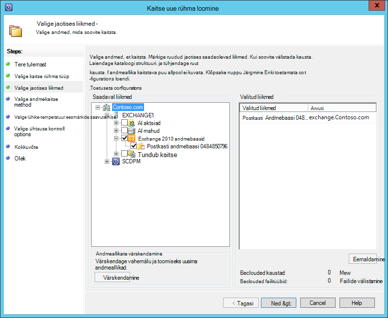
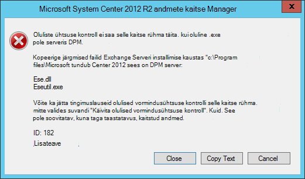
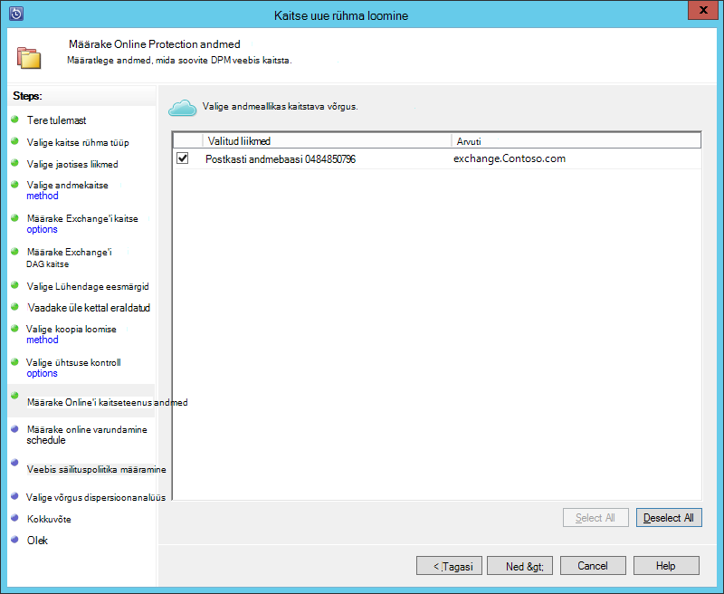
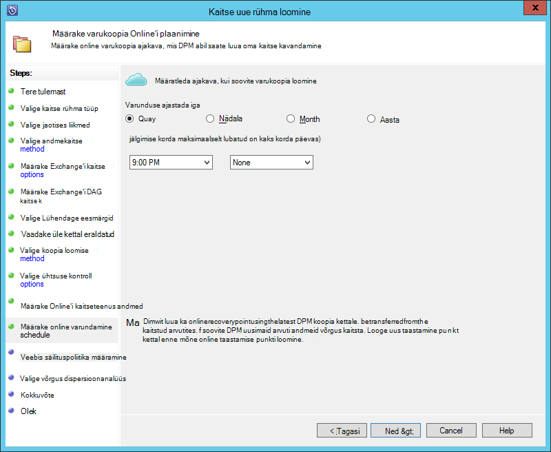
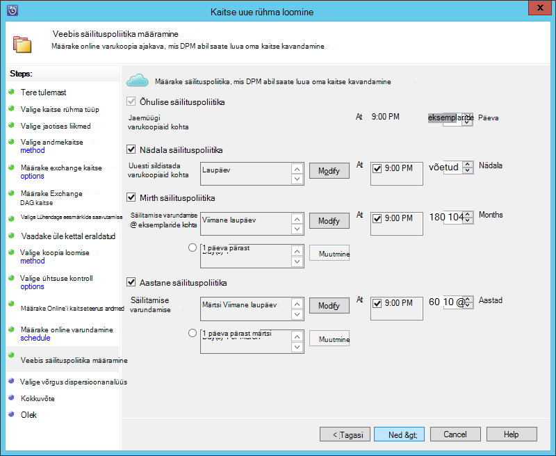
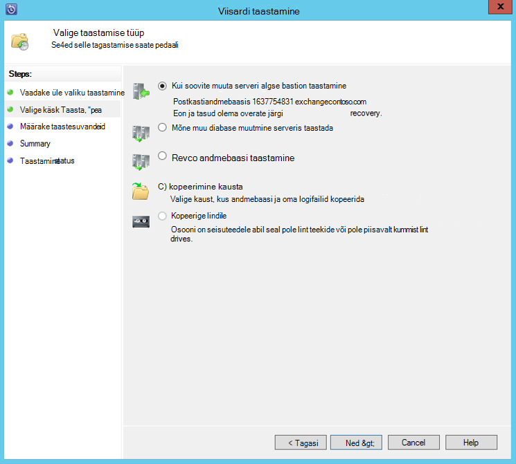

<properties
    pageTitle="Varundamine Exchange'i serveriga Azure varukoopia koos System Center 2012 R2 DPM | Microsoft Azure'i"
    description="Saate teada, kuidas varundada Exchange server Azure'i varundus System Center 2012 R2 DPM abil"
    services="backup"
    documentationCenter=""
    authors="MaanasSaran"
    manager="NKolli1"
    editor=""/>

<tags
    ms.service="backup"
    ms.workload="storage-backup-recovery"
    ms.tgt_pltfrm="na"
    ms.devlang="na"
    ms.topic="article"
    ms.date="08/15/2016"
    ms.author="anuragm;jimpark;delhan;trinadhk;markgal"/>

# Exchange Serveri Azure varukoopia koos System Center 2012 R2 DPM varundamine
Selles artiklis kirjeldatakse, kuidas konfigureerida süsteemi Center 2012 R2 andmete kaitse Manager (DPM) serveri Microsoft Exchange server Azure'i varundus varundada.  

## Värskendused
Edukalt registreerida DPM server Azure'i varundamise, installige uusim update rollup System Center 2012 R2 DPM ja Azure varundus Agent uusim versioon. [Microsofti kataloogi](http://catalog.update.microsoft.com/v7/site/Search.aspx?q=System%20Center%202012%20R2%20Data%20protection%20manager)uusima update rollup toomine.

>[AZURE.NOTE] Selle artikli näited Azure varundus Agent 2.0.8719.0 versioon on installitud ja System Center 2012 R2 DPM Update Rollup 6 on installitud.

## Eeltingimused
Enne jätkamist, veenduge, et kõik [eeltingimused](backup-azure-dpm-introduction.md#prerequisites) Microsoft Azure'i varundamise kaitsmiseks töökoormus on täidetud. Eeltingimused on järgmised:

- Varukoopiate hoidla Azure saidil on loodud.
- Agent ja vault identimisteave alla laadinud DPM serveriga.
- DPM serverisse installitud agent.
- Hoidla mandaat kasutati DPM server registreerimiseks.
- Kui Exchange'i 2016 kaitsmisele uuendage DPM 2012 R2 UR9 või uuem versioon

## DPM kaitse agent  
Exchange Serveri DPM kaitse agent installimiseks tehke järgmist.

1. Veenduge, et tulemüürid on õigesti konfigureeritud. Lugege teemat [konfigureerimine tulemüüri erandid agent](https://technet.microsoft.com/library/Hh758204.aspx).

2. Installige Exchange Serveri agent, klõpsates **haldus > agentide > installimine** DPM administraatori konsool. Üksikasjalikud juhised leiate [DPM kaitse agent installimine](https://technet.microsoft.com/library/hh758186.aspx?f=255&MSPPError=-2147217396) .

## Exchange Serveri kaitse rühma loomine

1. DPM administreerimiskonsool nuppu **kaitse**ja seejärel nuppu **Loo uus kaitse rühm** viisardi avamiseks lindil tööriista **Uus** .

2. Klõpsake **viisardi tervituskuval** nuppu **Järgmine**.

3. Kuval **Valige kaitse rühma tüüp** valige **serverid** ja klõpsake nuppu **edasi**.

4. Valige Exchange Serveri andmebaas, mida soovite kaitsta ja klõpsake nuppu **edasi**.

    >[AZURE.NOTE] Kui teil kaitsta Exchange 2013, kontrollige, et [Exchange 2013 eeltingimused](https://technet.microsoft.com/library/dn751029.aspx).

    Järgmises näites on valitud Exchange 2010 andmebaas.

    

5. Valige andmete kaitse meetod.

    Kaitse rühma nime ja seejärel valige mõlemad järgmistest suvanditest:

    - Soovin lühiajaline kaitse kettapuhastusriista abil.
    - Soovin Online'i kaitseteenus.

6. Klõpsake nuppu **edasi**.

7. Kui soovite kontrollida Exchange Serveri andmebaaside turvalisuse **Käivitada Eseutil kontrollida andmetervikluse** suvandi valimine

    Kui valite selle suvandi, varukoopia järjepidevuse käitatakse serveris DPM vältimiseks I/O liikluse, mis on loodud **eseutil** käsu Exchange Serveri kontrollimine.

    >[AZURE.NOTE]Selle suvandi kasutamiseks peab Ese.dll ja Eseutil.exe failide kopeerimine C:\Program Files\Microsoft System Center 2012 R2\DPM\DPM\bin kataloogi DPM serveris. Muul juhul käivitatakse järgmine tõrketeade:  
    

8. Klõpsake nuppu **edasi**.

9. Valige **Kopeeri**varundamiseks andmebaas ja seejärel klõpsake nuppu **edasi**.

    >[AZURE.NOTE] Kui valite "Täielik varundamine" vähemalt üks DAG koopia andmebaasi, mitte kärbitakse logid.

10. **Lühiajaline varundamise**eesmärkide konfigureerimine ja klõpsake siis nuppu **edasi**.

11. Vaadake vaba kettaruumi ja seejärel klõpsake nuppu **edasi**.

12. Valige aeg, kus DPM server loob algse dispersioonanalüüs, ja klõpsake nuppu **edasi**.

13. Vormindusühtsuse kontrolli suvandite valimine ja seejärel klõpsake nuppu **edasi**.

14. Valige andmebaas, mida soovite varundada Azure ja seejärel klõpsake nuppu **edasi**. Näiteks:

    

15. Määratleda ajakava **Azure varukoopia**ja seejärel klõpsake nuppu **edasi**. Näiteks:

    

    >[AZURE.NOTE] Pange tähele, et Online taastamise punkte põhinevad express täielik taastamise punkte. Seetõttu tuleb plaanimine online taastamise punkti pärast kiire täis on määratud aja taastamine osutage.

16. Säilituspoliitika konfigureerimine **Azure varukoopia**ja seejärel klõpsake nuppu **edasi**.

17. Valige suvand Online'i kopeerimine ja klõpsake nuppu **edasi**.

    Kui teil on suur andmebaas, see võib võtta kaua aega algse varundamiseks üle võrgu luua. Selle probleemi vältimiseks saate luua ka ühenduseta varukoopia.  

    

18. Kinnitage sätted ja seejärel klõpsake nuppu **Loo rühm**.

19. Klõpsake nuppu **Sule**.

## Exchange'i andmebaasi taastamine

1. Rakenduse Exchange'i andmebaasi taastamiseks klõpsake DPM administreerimiskonsool **taastamine** .

2. Otsige üles Exchange'i andmebaas, mida soovite taastada.

3. Valige ripploendist *taastamise ajal* mõne online taastamise punkti.

4. Klõpsake nuppu **Taasta** **Taastamine viisardi**käivitamiseks.

Online taastamise punktid, on viis taastamine tüübid.

- **Taasta originaal Exchange Serveri asukohta:** Andmeid saab taastada algse Exchange Serveri.
- **Exchange Serveri teise andmebaasi taastamine:** Andmed on mõne muu Exchange Serveri mõnda muusse andmebaasi taastada.
- **Taastamise andmebaasi taastamine:** Andmed on taastatud abil soovitud Exchange'i taastamise andmebaasi (RDB).
- **Kopeeri võrgukausta:** Andmeid saab taastada võrgukausta.
- **Kopeeri lindile:** Kui teil on lindi teegi või eraldiseisev lint ketas manustatud ja DPM server on konfigureeritud, siis kopeeritakse taastamine punkti tasuta lint.

    

## Järgmised sammud

- [Azure varukoopia KKK](backup-azure-backup-faq.md)
