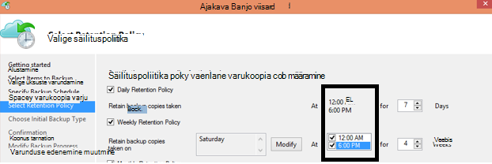

<properties
   pageTitle="Azure varukoopia KKK | Microsoft Azure'i"
   description="Vastused korduma kippuvatele küsimustele varukoopia teenus, varukoopia agent, varundamine ja säilitamine, taastamine, turvalisus ja muud varundus ja Avariijärgne taaste levinud küsimustele."
   services="backup"
   documentationCenter=""
   authors="markgalioto"
   manager="jwhit"
   editor=""
   keywords="Varundus- ja Avariijärgne taaste; varukoopia teenus"/>

<tags
   ms.service="backup"
   ms.workload="storage-backup-recovery"
     ms.tgt_pltfrm="na"
     ms.devlang="na"
     ms.topic="get-started-article"
     ms.date="10/21/2016"
     ms.author="trinadhk; giridham; arunak; markgal; jimpark;"/>

# <a name="azure-backup-service--faq"></a>Azure'i varundus teenuse-KKK


See artikkel kehtib korduma kippuvatele küsimustele (ja vastav vastused) loendi Azure varukoopia teenuse kohta. Meie ühenduse vastuste kiiresti, ja kui sageli palub küsimus, lisame seda artiklit. Vastused küsimustele tavaliselt anda viide või tugiteavet. Saate esitada küsimusi, kohta käesoleva artikli või seotud artikli jaotises Disqus Azure varukoopia. Samuti saate postitada küsimustele Azure varukoopia teenust [Foorum](https://social.msdn.microsoft.com/forums/azure/home?forum=windowsazureonlinebackup).


## <a name="what-is-the-list-of-supported-operating-systems-from-which-i-can-back-up-to-azure-using-azure-backup-br"></a>Mis on toetatud opsüsteemide, kust saate varundan Azure'i Azure varundamise loendit? <br/>
Azure'i varukoopiad toetab opsüsteemid järgmises loendis faili kausta varukoopia, rakenduse varundamise Azure varukoopia serveri ja SCDPM abil.

| Operatsioonisüsteem        | Platvorm           | SKU-GA  |
| :------------- |-------------| :-----|
| Windows 8 ja uusima rakendamise      | 64-bitise | Ettevõtte, Pro |
| Windows 7 ja uusima rakendamise      | 64-bitise | Ultimate, Enterprise, Professional, Home Premium, Home Basic, Starter |
| Windows 8.1 ja uusima rakendamise | 64-bitise      |    Ettevõtte, Pro |
| Windows 10      | 64-bitise | Ettevõtte, Pro, Avaleht |
|Windows Server 2012 R2 ja uusima rakendamise| 64-bitise| Standard andmekeskuses, Foundation|
|Windows Server 2012 ja uusima rakendamise|    64-bitise| Andmekeskuse Foundation, Standard|
|Windowsi salvestusruumi Server 2012 R2 ja uusima rakendamise  |64-bitise|    Standard töörühm|
|Windows salvestusruumi Server 2012 ja uusima rakendamise |64-bitise |Standard töörühm
|Windows Server 2012 R2 ja uusima rakendamise  |64-bitise|    Oluline|
|Windows Server 2008 R2 SP1 |64-bitise|    Standard ettevõtte, Andmekeskuse, Foundation|
|Windows Server 2008 hoolduspaketiga SP2    |64-bitise|    Standard ettevõtte, Andmekeskuse, Foundation|

Azure'i VM varukoopia,

- **Linux**: Azure'i varukoopiad toetab [jaotuse, mis on kinnitatud Azure'i loendi](../virtual-machines/virtual-machines-linux-endorsed-distros.md) peale Core OS Linux.  Muude Too-oma-omanik-Linuxi ka võivad töötada, kui VM on saadaval virtual arvutisse ja tugi Python olemas.
- **Windows Server**: Windows Server 2008 R2 versioonides ei toetata.

## <a name="where-can-i-download-the-latest-azure-backup-agent-br"></a>Kuidas saan uusim Azure varukoopia agent? <br/>
Saate alla laadida uusim agent varundamiseks Windows Server, System Center DPM või Windowsi kliendi [siia](http://aka.ms/azurebackup_agent). Kui soovite varundada virtuaalse masina, kasutage VM Agent (mis installib automaatselt õige pikendamine). VM Agent on juba loodud galeriist Azure'i virtuaalmasinates olemas.

## <a name="which-version-of-scdpm-server-is-supported-br"></a>Millised SCDPM serveri versioon on toetatud? <br/>
Soovitame [uusim](http://aka.ms/azurebackup_agent) Azure varukoopia agent installimine SCDPM uusima värskenduse järgne (UR11 seisuga August 2016)

## <a name="when-configuring-the-azure-backup-agent-i-am-prompted-to-enter-the-vault-credentials-do-vault-credentials-expire"></a>Azure'i varundus agent konfigureerimisel küsitakse sisestamiseks hoidla mandaat. Tehke hoidla mandaat lõpeb?
Jah, hoidla mandaat aeguma 48 tundi. Kui faili aegumist, Azure portaali sisse logida ja alla laadida vault identimisteabe faile oma hoidlast.

## <a name="is-there-any-limit-on-the-number-of-vaults-that-can-be-created-in-each-azure-subscription-br"></a>Kas iga Azure'i tellimus loodud võlvid arv piirata? <br/>
Jah. Seisuga mai 2016, saate luua 25 varukoopia võlvid tellimuse kohta. Saate luua kuni 25 taastamise teenused võlvid iga toetatud piirkonna kohta Azure varukoopia tellimuse kohta. Kui vajate rohkem võlvid, looge uus tellimus.

## <a name="are-there-any-limits-on-the-number-of-serversmachines-that-can-be-registered-against-each-vault-br"></a>Kas on olemas piirid arvu serverid/seadmed registreerida iga vault vastu? <br/>
Jah, saate registreerida kuni 50 masinad vault kohta. Azure'i IaaS virtuaalmasinates, on limiit 200 VMs vault kohta. Kui vajate rohkem seadmed registreerida, looge uus vault.

## <a name="how-do-i-register-my-server-to-another-datacenterbr"></a>Kuidas registreeruda Minu teise andmekeskuse serveri?<br/>
Varundatud andmete saadetakse vault, millele on registreeritud andmekeskuse. Lihtsaim viis muuta andmekeskuse on agent desinstallida ja uuesti agent on uue hoidla, mis kuulub soovitud andmekeskuse registreeruda.

## <a name="what-happens-if-i-rename-a-windows-server-that-is-backing-up-data-to-azurebr"></a>Mis juhtub, kui Windows server, mis on andmeid varundada Azure ümber nimetada?<br/>
Kui nimetate server, kõik praegu konfigureeritud varukoopiate on peatatud.
Peate registreeruma varundamise vault serveri uus nimi. Kui loote uue registreerimine, esimese varukoopia toiming on täieliku varukoopia ja pole varundamist. Kui teil on vaja andmete taastamine, mis on varem varundada vault serveri nime, saate taastada andmeid [**teise serverisse**](backup-azure-restore-windows-server.md#recover-to-an-alternate-machine) suvandiga viisardis kuvatavaid **Andmeid taastada** .

## <a name="what-types-of-drives-can-i-backup-files-and-folders-from-br"></a>Millist tüüpi draivid ma varundamine, failide ja kaustade? <br/>
Järgmised kogumi draivid/maht ei saa varukoopia põhjal:

- Irdkandjale: Ketas aruande fikseeritud olema kasutatud varukoopia kirje allikas.
- Kirjutuskaitstud maht: peab olema kirjutatav draivi vari teenus (VSS) funktsiooni jaoks.
- Ühenduseta maht: Maht peab olema võrgus VSS jaoks funktsiooni.
- Võrgukettal: peab olema kohaliku varundada online varundamise serveriga.
- BitLockeri kaitstud maht: maht peab olema lukustamata enne varukoopia võib tekkida.
- Faili süsteemi ID: NTFS on selles versioonis varukoopia võrguteenuse toetatud ainult failisüsteemis.

## <a name="what-file-and-folder-types-can-i-back-up-from-my-serverbr"></a>Faili- ja milliste saate varundan oma serverist?<br/>
Järgmist tüüpi on toetatud:

- Krüptitud
- Tihendatud
- Vähe
- Tihendatud + vähe
- Suur lingid: Ei toetata, vahele
- Ümbersõelumispunkt: Ei toetata, vahele
- Krüptitud + tihendatud: Ei toetata, vahele
- Krüptitud + vähe: Ei toetata, vahele
- Tihendatud voo: Ei toetata, vahele
- Sparse voo: Ei toetata, vahele

## <a name="whats-the-minimum-size-requirement-for-the-cache-folder-br"></a>Mis on miinimummaht nõue vahemälu kausta? <br/>
Vahemälu kausta mahtu määrab ära andmeid, mis on varundamine. Kausta vahemälu peaks olema 5% andmesalv vajaliku ruumi.

## <a name="if-my-organization-has-one-vault-how-can-i-isolate-one-servers-data-from-another-server-when-restoring-databr"></a>Kui minu ettevõte on üks võlvkelder, kuidas saate ma eristada ühe serveri andmeid teise server taastamisel andmed?<br/>
Kõik serverid, mis on registreeritud sama vault saate taastada teiste *sama parool, mis kasutavad*serverid toetavad andmeid. Kui teil on serverid, mille varukoopia andmeid, mida soovite muudes serverites – ettevõtte isoleeritakse, kasutada nende serverite jaoks määratud parool. Näiteks Personalihaldus serverites võib kasutada ühe krüptimine parooli, accounting serverid teise ja serverit kolmanda.

## <a name="can-i-migrate-my-backup-data-or-vault-between-subscriptions-br"></a>Saate "migreerida" minu varundatud andmete või vault tellimuste vahel? <br/>
Ei. Funktsiooni hoidla on loodud tellimuse tasemel ja ei saa mõnele muule tellimusele pärast selle loomist.

## <a name="does-the-azure-backup-agent-work-on-a-server-that-uses-windows-server-2012-deduplication-br"></a>Azure varundus Agent töötab serveris, mis kasutab Windows Server 2012 korduste eemaldamise? <br/>
Jah. Teenuse agent teisendab deduplicated andmed tavaline andmeid tehes jätta varukoopia toiming. Seejärel optimeerib andmeid varundamise, krüptib andmed ja seejärel saadab krüptitud andmed varukoopia võrguteenuse.

## <a name="if-i-cancel-a-backup-job-once-it-has-started-is-the-transferred-backup-data-deleted-br"></a>Kui Tühistan Varundustöö pärast selle käivitamist, edastatud varundatud andmed kustutada? <br/>
Ei. Varukoopiate hoidla salvestab varundatud andmeid kuni tühistamise üle. Azure'i varukoopiad kasutab kontrollpunkt süsteem aeg-ajalt lisada postkastid varundatud andmete varukoopia. Kuna postkastid on varundatud andmete, saate järgmise varundamist kinnitada terviklus failid. Järgmise varukoopia vallandanud oleks andmed, mida oli varundatud varem suureneva. Mõne varundamist pakub parem ärakasutamine läbilaskevõime, nii, et teil pole vaja korduvalt samade andmete edastamiseks.

Azure VM varundamise, kui pärast töö tühistatakse, ignoreeritakse edastatud andmete ja värske varukoopia edastab suureneva andmeid varem eduka detailse.

## <a name="why-am-i-seeing-the-warning-azure-backups-have-not-been-configured-for-this-server-even-though-i-had-scheduled-regular-backups-previously-br"></a>Miks ma näen "Azure varukoopiate pole konfigureeritud selle serveri" Hoiatus seal varem olnud plaanitud korrapäraste varukoopiate plaanimine? <br/>
Hoiatus juhul, kui varunduse ajakava sätted, mis on talletatud kohalik server pole sama, mis on talletatud varukoopiate hoidla sätted. Kui server või sätted on taastatud teadaolevad oleku, saate varukoopia ajakavasid sünkroonimise kaotsi minna. Kui saate selle hoiatus, [taaskonfigureerimine varukoopia poliitika](backup-azure-manage-windows-server.md) ja seejärel **Käivitage Varunda kohe** kohaliku serveri Azure uuesti.

## <a name="what-firewall-rules-should-be-configured-for-azure-backup-br"></a>Millised tulemüüri reeglid peaks olema konfigureeritud Azure varukoopia? <br/>
Klõpsake tööruumide-Azure ja Azure töökoormus andmete sujuvalt kaitse, on soovitatav lubada tulemüüri suhelda järgmisel URL:

- www.msftncsi.com
- \*. Saidi Microsoft.com
- \*. WindowsAzure.com
- \*. microsoftonline.com
- \*. windows.net

##<a name="can-i-install-the-azure-backup-agent-on-an-azure-vm-already-backed-by-the-azure-backup-service-using-the-vm-extension-br"></a>Azure varukoopia agent saab installida Azure VM, mis toetavad juba Azure varukoopia teenuse abil VM laiend? <br/>
Täiesti. Azure'i varukoopiad pakub VM taseme varundamise Azure VMs VM laiend abil. Saate installida Azure varukoopia agent Külastajate Windows OS failide ja kaustade selle Külastajate OS kaitsta.

## <a name="can-i-install-the-azure-backup-agent-on-an-azure-vm-to-back-up-files-and-folders-present-on-temporary-storage-provided-by-the-azure-vm-br"></a>Azure'i varundus agent saate installida mõne Azure VM varundamiseks failide ja kaustade Esita ajutine salvestusruumi esitatud Azure VM? <br/>
Saate installida Azure varukoopia agent Külastajate Windows OS ja ajutine salvestusruum faile ja kaustu varundada. Arvestage siiski varukoopiate nurjuda, kui ajutiste andmed, mille on kustutamise. Lisaks, kui ajutiste salvestusruumi andmed on kustutatud, saate ainult taastada vajutanud salvestusruumi.

## <a name="i-have-installed-azure-backup-agent-to-protect-my-files-and-folders-can-i-now-install-scdpm-to-work-with-azure-backup-agent-to-protect-on-premises-applicationvm-workloads-to-azure-br"></a>Mul on installitud Azure varukoopia agent kaitsta faile ja kaustu. Saate nüüd installida Azure varukoopia agent kaitsta kohapealse rakenduse/VM töökoormus Azure töötamiseks SCDPM? <br/>
Azure'i varundus SCDPM kasutamiseks on soovitatav installida SCDPM esmalt ja alles siis installida Azure varukoopia agent. See tagab sujuvalt integreerimine Azure varukoopia agendi koos SCDPM ja võimaldab kaitsmine faile ja kaustu, rakenduse töökoormus ja VMs Azure'i otse halduskonsooli, SCDPM. Installimise SCDPM pärast installimist Azure varukoopia eesmärgil eespool on pole soovitatav või toetatud.

## <a name="what-is-the-length-of-file-path-that-can-be-specified-as-part-of-azure-backup-policy-using-azure-backup-agent-br"></a>Mis on faili tee, kasutades Azure varukoopia agent Azure varukoopia poliitika määratud? <br/>  
Azure'i varundus agent tugineb NTFS. Funktsiooni [filepath pikkus määratlus on piiratud Windowsi API -ga](https://msdn.microsoft.com/library/aa365247.aspx#fully_qualified_vs._relative_paths). Korral varundamine faili tee pikkus suurem määratud Windows API need failid, saate valida kliendid ema kaust või ketas, kuhu failid varundada.  

## <a name="what-characters-are-allowed-in-file-path-of-azure-backup-policy-using-azure-backup-agent-br"></a>Faili tee Azure varukoopia poliitika abil Azure varukoopia agent lubatud märgid? <br>  
 Azure'i varundus agent tugineb NTFS. See võimaldab [NTFS toetatud märgid](https://msdn.microsoft.com/library/aa365247.aspx#naming_conventions) faili määratlus osana.  

## <a name="can-i-use-azure-backup-server-to-create-a-bare-metal-recovery-bmr-backup-for-a-physical-server-br"></a>Kasutada Azure varukoopia serveri varukoopia tühjal Metal taastamine (BMR) füüsilise serveri? <br/>
Jah.

## <a name="can-i-configure-the-backup-service-to-send-mail-if-a-backup-job-fails-br"></a>Saate konfigureerida varundamise teenuse saata meilisõnumeid, kui Varundustöö nurjus? <br/>
Jah, varundamise teenus on mitu sündmus põhinev teatised, mida saab kasutada PowerShelli skripti. Täieliku kirjelduse leiate teemast [teatiste](backup-azure-manage-vms.md#alert-notifications)

## <a name="is-there-a-limit-on-the-size-of-each-data-source-being-backed-up-br"></a>Kas iga andmeallika varundamist suurus on piiratud? <br/>
Kuigi vault tasemel pole piiratud andmehulga saate varundada, Azure varukoopia kehtestavad piiranguid (põhimõtteliselt need piirangud on väga kõrge) Andmeallika maksimummaht kohta. August 2015, toetatud opsüsteemide andmeallika maksimaalne maht on:

|S.No | Operatsioonisüsteem |  Andmeallika maksimaalne maht |
| :-------------: |:-------------| :-----|
|1| Windows Server 2012 või uuem| 54400 GB|
|2| Windows 8 või uuem| 54400 GB|
|3| Windows Server 2008, Windows Server 2008 R2 | 1700 GB|
|4| Windows 7 | 1700 GB|

Järgmises tabelis selgitatakse, kuidas iga andmete allikas suurus määratakse.

|   Andmeallikas  |   Üksikasjad |
| :-------------: |:-------------|
|Helitugevuse |Ühe maht serveri või kliendi seadme kaudu varundatud andmete olemise summa|
|Hyper-V virtuaalse masina | Summa kõik VHDs, virtuaalse masina varundamist andmed.|
|Microsoft SQL Serveri andmebaasiga | Ühe SQL-i andmebaasi suurus varundamist suurus |
|Microsoft SharePointi |Summa sisu ja konfiguratsioon andmebaasidele SharePointi serveripargi varundamine|
|Microsoft Exchange'i |Kõik andmebaasid Exchange'i Exchange Serveri varundamist summa|
|BMR/süsteemi olek |Iga üksiku eksemplari BMR või süsteemi seisundi varundamist masina|

## <a name="are-there-limits-on-the-number-of-times-a-backup-job-can-be-scheduled-per-daybr"></a>Kas on mitu korda Varundustöö saab ajastada päevas piirangud?<br/>
Jah, käivitada varundamise Windows Serveri või Windowsi kliendi kuni kolm korda päevas. Saate kasutada varundamise System Center DPM kuni kaks korda iga päev. Käivitada Varundustöö IaaS vms kord päevas.

## <a name="is-there-a-difference-between-the-scheduling-policy-for-dpm-and-windows-server-ie-on-windows-server-without-dpm-br"></a>Kas vahe DPM ajastamise poliitika ja Windows Server (st ilma DPM Windows Server)? <br/>
Jah. DPM saate määrata iga päev, nädala, kuu ja aasta ajakava. Windows Server (ilma DPM) võimaldab teil määrata ainult päeva ja nädala ajakava.

## <a name="is-there-a-difference-between-the-retention-policy-for-dpm-and-windows-serverclient-ie-on-windows-server-without-dpmbr"></a>Kas erinevad säilituspoliitika DPM Windows Serveri kliendi kohta (st ilma DPM Windows Server)?<br/>
Ei, DPM ja Windows Server/klient on iga päev, nädala, kuu ja aasta Säilituspoliitikad.

## <a name="can-i-configure-my-retention-policies-selectively--ie-configure-weekly-and-daily-but-not-yearly-and-monthlybr"></a>Saate konfigureerida minu säilituspoliitika poliitikate valikuliselt-st konfigureerimine iga nädal ja iga päev, kuid pole iga aasta ja kuu?<br/>
Jah, Azure varukoopia säilituspoliitika struktuuri võimaldab teil on täielik paindlikkust määratlemine säilituspoliitika vastavalt oma vajadustele.

## <a name="can-i-schedule-a-backup-at-6pm-and-specify-retention-policies-at-a-different-timebr"></a>Saate "plaanimine varukoopia" kell 6 ja määrake "säilituspoliitikate" erineval ajal?<br/>
Ei. Säilituspoliitikaid saab rakendada ainult varukoopia punktides. Järgmisel pildil on määratud säilituspoliitika varufailide 00; ja 6 pm. <br/>


<br/>

## <a name="is-an-incremental-copy-transferred-for-the-retention-policies-scheduled-br"></a>Selle suureneva koopia kantakse ajastatud säilituspoliitikate jaoks? <br/>
Ei, suureneva koopia saadetakse vastavalt mainitud lehel varukoopia ajakava kellaaja. Punktide, mida võib säilitada määratakse säilituspoliitika põhjal.

## <a name="if-a-backup-is-retained-for-a-long-duration-does-it-take-more-time-to-recover-an-older-data-point-br"></a>Kui varukoopia säilib pika aja jooksul, võtab rohkem aega mõne vanema andmepunkti taastada? <br/>
 Ei – aeg taastada vanimast või uuematest punkti on sama. Iga taastamine punkti käitub nagu punkt.

## <a name="if-each-recovery-point-is-like-a-full-point-does-it-impact-the-total-billable-backup-storagebr"></a>Kui iga taastamine punkti on nagu punkt, ei selle mõju kokku arveldatavate varukoopia salvestusruumi?<br/>
Tüüpilised pikaajaline säilitus punkti toodete hoida varundatud andmete täielik punktid. Täielik punktid on salvestusruumi *ebaefektiivne* , kuid on lihtsam ja kiirem taastada. Suureneva eksemplarid on salvestusruumi *tõhusa* , kuid teil vaja ahelas andmeid, mis mõjutab oma taastamise ajal taastada. Azure'i varundus salvestusruumi arhitektuur annab teile kõige paremini mõlematpidi optimaalselt kiiresti taastab andmete talletamiseks ja kannavad väikese kulud. Selline andmete salvestusruumi lähenemine tagab, et teie sissepääsu ja sealt läbilaskevõime kasutatakse tõhusalt. Nii andmete talletusmahtu ja aega, et taastada andmeid, on võimalikult vähe. Lugege lisateavet selle kohta, kuidas salvestada [varundamiseks](https://azure.microsoft.com/blog/microsoft-azure-backup-save-on-long-term-storage/) on tõhusa.

## <a name="is-there-a-limit-on-the-number-of-recovery-points-that-can-be-createdbr"></a>Kas on piiratud arv taastamise punkte, mida saab luua?<br/>
Ei. Me kõrvaldada piirangud taastamise punkte. Saate luua nii palju taastamise punkte, kui te ei soovi.

## <a name="why-is-the-amount-of-data-transferred-in-backup-not-equal-to-the-amount-of-data-i-backed-upbr"></a>Miks on suurt hulka andmeid varundamise ei võrdu suurt hulka andmeid saab varundada üle?<br/>
 Kõik andmed, mida varundatakse Azure varundus Agent või SCDPM või Azure varundus Server, pakitakse kokku ja enne üle minna. Kui rakendatakse tihendamise ja krüptimise varukoopiate hoidla andmed on 30-40% väiksem.

## <a name="is-there-a-way-to-adjust-the-amount-of-bandwidth-used-by-the-backup-servicebr"></a>Kas on võimalik kohandada varundamise teenuse kasutatav läbilaskevõimet?<br/>
 Jah, kasutage suvand **Muuda atribuudid** varundamise Agent läbilaskevõime reguleerimiseks. Korrigeerida summast ribalaiuse ja korda, kui kasutate selle läbilaskevõime. Lisateabe saamiseks vaadake [Võrgu pidurdamise](../backup-configure-vault.md#enable-network-throttling).

## <a name="my-internet-bandwidth-is-limited-for-the-amount-of-data-i-need-to-back-up-is-there-a-way-i-can-move-data-to-a-certain-location-with-a-large-network-pipe-and-push-that-data-into-azure-br"></a>Interneti-läbilaskevõime on piiratud andmete mul on vaja, varundada. Kas on võimalik, saate teisaldada andmed teatud asukohta suure võrguga toru ja lükake need andmed Azure? <br/>
Saate varundada andmeid Azure'i sisse standard online varundamist kaudu või saate Azure impordi/ekspordi teenust Bloobivahemälu salvestusruumi Azure andmete edastamiseks. On saada varukoopia kuupäeva Azure salvestusruumi pole täiendavaid võimalusi. Azure'i varundamise Azure impordi/ekspordi teenuse kasutamise kohta lisateabe saamiseks lugege artiklist [ühenduseta varundamise töövoo](backup-azure-backup-import-export.md) .

## <a name="how-many-recoveries-can-i-perform-on-the-data-that-is-backed-up-to-azurebr"></a>Kui palju makstud saate andmeid, mida varundatakse Azure'i teha?<br/>
Ei ole piiratud arvu makstud Azure varukoopia põhjal.

## <a name="do-i-have-to-pay-for-the-egress-traffic-from-azure-data-center-during-recoveriesbr"></a>Kas pean ajal makstud sealt liiklus Azure andmekeskuse eest maksta?<br/>
 Ei. Teie need tasuta ning sealt liikluse ei lisandu.

## <a name="is-the-data-sent-to-azure-encrypted-br"></a>Andmed saadetakse Azure'i krüptitud? <br/>
Jah. Andmed on krüptitud AES256 abil kohapealse SCDPM/server/kliendi arvutisse ja turvalise HTTPS-lingi saadetakse andmed.

## <a name="is-the-backup-data-on-azure-encrypted-as-wellbr"></a>Varundatud andmete on samuti krüptitud Azure?<br/>
 Jah. Azure'i saadetud andmeid hoitakse krüptitud (rest) juures. Microsoft dekrüptida, mis tahes hetkel andmete varukoopia. Azure'i VM varukoopia, Azure varukoopia tugineb krüptimise virtuaalse masina st kui teie VM on krüptitud Azure'i ketta krüptimise või mõne muu krüptimistehnoloogiale, Azure varukoopia kasutab krüptimist, et kaitsta teie andmeid.

## <a name="what-is-the-minimum-length-of-encryption-key-used-to-encrypt-backup-data-br"></a>Mis on varundatud andmete krüptimiseks kasutatavat krüptovõtme miinimumpikkus? <br/>
 Krüptovõtme peaks olema vähemalt 16 märki.

## <a name="what-happens-if-i-misplace-the-encryption-key-can-i-recover-the-data-or-can-microsoft-recover-the-data-br"></a>Mis juhtub, kui ma vales krüptovõtme? Ma saan tagasi andmete (või) Microsoft saate taastada andmeid? <br/>
Varundatud andmete krüptimiseks kasutatavat võti esineb ainult kliendi kohapealne. Microsoft ei kvalifitseeru koopia Azure ja on mis tahes juurdepääs võti. Kui kliendi valesse võti, Microsoft ei saa taastada varundatud andmete.

## <a name="how-do-i-change-the-cache-location-specified-for-the-azure-backup-agentbr"></a>Kuidas muuta määratud Azure varukoopia agent vahemälu asukohast?<br/>
 Järjest läbida järgmises vahemälu asukoha muutmiseks täpploend.
- Varundus mootori seiskamiseks täites sisse tõstetud käsuviipa järgmine käsk:

  ```PS C:\> Net stop obengine```

- Teisaldage failid. Selle asemel kopeerige vahemälu ruumi kaust erinevat ketast piisavalt ruumi. Pärast kinnitamist varukoopiaid abivahendina uue vahemälu ruumi vahemälu ruum eemaldada.

- Saate uuendada järgmisi registrikirjeid uue vahemälu ruumi kausta tee.<br/>

|Registri tee | Registrivõtme | Väärtus |
| ------ | ------- | ------|
| `HKEY_LOCAL_MACHINE\SOFTWARE\Microsoft\Windows Azure Backup\Config` | ScratchLocation | *Uue vahemälu kausta asukoht* |
| `HKEY_LOCAL_MACHINE\SOFTWARE\Microsoft\Windows Azure Backup\Config\CloudBackupProvider` | ScratchLocation | *Uue vahemälu kausta asukoht* |

- Taaskäivitage varundamise mootori käivitamist tõstetud käsuviipa järgmine käsk:

  ```PS C:\> Net start obengine```

  Kui varukoopia loomine on edukalt lõpule viidud vahemälu uude asukohta, saate eemaldada algse vahemälu kausta.

## <a name="where-can-i-put-the-cache-folder-for-the-azure-backup-agent-to-work-as-expectedbr"></a>Kui panna vahemälu kausta Azure varundus Agent oodatud viisil töötada?<br/>
Vahemälu-kausta asukohtadest soovitatav on kasutada:

- Võrgu ühiskasutus või irdkandjale: tuleb serveris, mis on vaja, varundada online varundamise kohaliku vahemälu-kaust. Võrgukohtade või irdkandjale, nt USB-draivid ei toetata.
- Ühenduseta maht: Kausta vahemälu peate olema võrgus oodatud Azure varukoopia Agent abil varundamiseks.

## <a name="are-there-any-attributes-of-the-cache-folder-that-are-not-supportedbr"></a>Kas on mis tahes kausta vahemälu atribuute, mis pole toetatud?<br/>
 Vahemälu-kausta ei toetata järgmisi atribuute või nende kombinatsioonid.

- Krüptitud
- Tühistage dubleeritud
- Tihendatud
- Vähe
- – Ümbersõelumispunkt

Soovitatav on, et kausta vahemälu ega metaandmete VHD on Azure varukoopia agent oodatud toimimiseks kohal atribuute.
