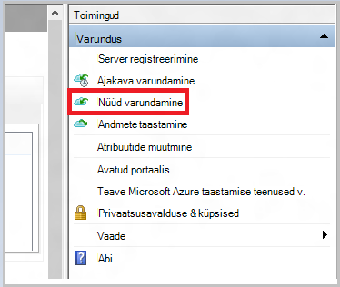

<properties
   pageTitle="Azure'i varundus - ühenduseta varundamine või esialgne külv Azure impordi/ekspordi teenuse abil | Microsoft Azure'i"
   description="Siit saate teada, kuidas Azure'i varundus võimaldab saata andmed välja Azure impordi/ekspordi teenuse abil. Selles artiklis selgitatakse esialgse varundatud andmed ühenduseta külv Azure Import ja eksport teenuse abil."
   services="backup"
   documentationCenter=""
   authors="saurabhsensharma"
   manager="shivamg"
   editor=""/>
<tags
   ms.service="backup"
   ms.devlang="na"
   ms.topic="article"
   ms.tgt_pltfrm="na"
   ms.workload="storage-backup-recovery"
   ms.date="08/16/2016"
   ms.author="jimpark;saurabhsensharma;nkolli;trinadhk"/>

# Ühenduseta varundamise töövoo Azure varukoopia põhjal
Azure'i varukoopiad on mitu sisseehitatud tõhusust, mis salvestamine võrgu- ja kulud andmete Azure esialgse täieliku varundamise ajal. Algne täielik varukoopiate tavaliselt suurte andmehulkade edastamine ja vaja mitme võrgu läbilaskevõime edaspidised varukoopiate, mis edastamine ainult deltad/incrementals võrdlemisel. Azure'i varukoopiad tihendab algse varukoopiad. Ühenduseta külv läbida Azure varukoopia abil saate ketast Azure'i üleslaadimine tihendatud esialgse varundatud andmed ühenduseta.  

[Azure'i impordi/ekspordi teenuse](../storage/storage-import-export-service.md) , mis võimaldab teil edastada Azure'i andmed, kasutades ketast tihedalt ühenduseta külv protsessi Azure varukoopia. Kui teil on, esialgse varundatud andmed, mis tuleb edastada latentsusajaga ja väikese läbilaskevõimega võrgu TB (TBs), saate töövoo ühenduseta külv ühe või mitme kõvaketas on Azure andmekeskusesse algse varukoopia saata. Selles artiklis antakse ülevaade toiminguid, mis selle töövoo lõpetada.

## Ülevaade

Ühenduseta külv võimalusega Azure varukoopia ja Azure impordi/ekspordi, on lihtne üles laadida Azure'i andmed ühenduseta ketast abil. Täielik algne koopia üle võrgu kaudu, mitte varundatud andmete kirjutatakse *lavastus asukoht*. Pärast lõpetamist Azure impordi/ekspordi tööriista abil Kopeeri asukohta lavastus kirjutatakse andmed ühe või mitme SATA ketta sõltuvalt hulka andmeid. Lõpuks saadetakse need draivid lähima Azure'i andmekeskusega.

[August 2016 värskendada Azure varukoopia (ja uuemad versioonid)](http://go.microsoft.com/fwlink/?LinkID=229525) sisaldab *Azure'i ketas ettevalmistamise tööriista*, nimega AzureOfflineBackupDiskPrep, mis:

   - Aitab teil oma draivid ettevalmistamine Azure impordi Azure impordi/ekspordi tööriista abil.
   - [Azure'i klassikaline portaali](https://manage.windowsazure.com) asemel looma sama käsitsi Azure varukoopia vanemate versioonidega loob automaatselt mõne Azure'i importimine töö teenuse Azure impordi/ekspordi.

Kui üles Azure varukoopia andmed on lõpule jõudnud, Azure varukoopia kopeerib varundatud andmete varukoopiate hoidla ja varundamiseks on ajastatud.

  > [AZURE.NOTE] Azure'i ketas ettevalmistamise tööriista kasutamiseks veenduge installinud August 2016 värskenduse Azure varukoopia (või uuem versioon) ja see töövoog kõigi toimingute. Kui kasutate Azure varukoopia vanemat versiooni, saate koostada SATA ketas osades selles artiklis kirjeldatud Azure impordi/ekspordi tööriista abil.

## Eeltingimused

- [Tutvumine töövooga Azure impordi/ekspordi](../storage/storage-import-export-service.md).
- Enne alustamist töövoo, järgmist.
    - Mõne Azure varukoopia vault on loodud.
    - Hoidla mandaat on alla laaditud.
    - Azure varukoopia agent on installitud nii Windows Serveri/Windows kliendi kui süsteemi andmete kaitse Manager server ja Azure varukoopia vault registreeritud arvuti.
- Arvutis, millest plaanite tagasi oma andmete [allalaadimine Azure'i avaldamine faili sätted](https://manage.windowsazure.com/publishsettings) .
- Ettevalmistused lavastus asukohta, mis võib olla võrgu või täiendava ketas arvutis. Lavastus asukoht on ajutine salvestusruumi ja kasutatakse ajutiselt ajal see töövoog. Tagada, et lavastus asukoht on piisavalt vaba kõvakettaruumi hoida oma algne koopia. Näiteks kui proovite varundada 500 GB faili server, veenduge, et koondusalal on vähemalt 500 GB. (Väiksemaid kasutatakse tihendamise tõttu).
- Veenduge, et kasutate toetatud ketas. Ainult 3.5 tolli SATA III ja II kõvaketas on toetatud kasutamine teenusega impordi/ekspordi. Kõvaketas, mis on suuremad kui 8 TB ei toetata. Saate manustada SATA III ja II kettal väliselt enamikes arvutites SATA II/III USB adapterit abil. Viimane hulk draivid, mis toetab teenus dokumentatsioonist Azure impordi/ekspordi.
- Luba, millega on ühendatud SATA ketas kirjutaja arvutis BitLockeri abil.
- [Laadige alla tööriist Azure impordi/ekspordi](http://go.microsoft.com/fwlink/?LinkID=301900&clcid=0x409) arvutisse, kuhu on SATA drive kirjutaja on ühendatud. Seda toimingut ei ole vaja, kui alla laadinud ja installinud August 2016 värskenduse Azure varukoopia (või uuem versioon).

## Töövoo
Selle jaotise teave aitab teil ühenduseta varundamise töövoo lõpuleviimine, et andmete saate toimetatakse on Azure andmekeskuse ja Azure Storage üles laadida. Kui teil on küsimusi importimine teenuse või mis tahes osa protsessi, dokumentatsioonist [importimine teenuse ülevaade](../storage/storage-import-export-service.md) viidatud varasemas versioonis.

### Saate algatada ühenduseta varundamine

1. Kui te ajastate varukoopia, kuvatakse järgmisel kuvatõmmisel (operatsioonisüsteemis Windows Server, Windows kliendi või süsteemi andmed kaitse Manager).

    

    Siin on vastava Kuva System Center andmete kaitse Manager:  
    

    Kirjeldus sisendeid on järgmine:

    - **Lavastus asukoht**: ajutine talletuskoht, millele on kirjutatud algse varukoopia. See võib olla võrgukettal või kohalikku arvutisse. Kui koopia arvutisse ja allika arvuti on erinevad, soovitame, määrake lavastus asukoha täielik tee.
    - **Azure'i importimine töö nimi**: millised Azure impordi teenuseid ja Azure varukoopia jälitada saadetud andmeid kettale Azure kordumatu nimi.
    - **Azure'i avaldamine sätted**: XML-fail, mis sisaldab teavet teie tellimuse profiili. See sisaldab ka turvaline mandaat, mis on seotud teie tellimus. Saate [faili alla laadida](https://manage.windowsazure.com/publishsettings). Sisestage kohaliku tee avalda sätete fail.
    - **Azure'i Tellimuse ID**: The Azure tellimuse ID tellimus, kuhu kavatsete Azure impordi tööd alustada. Kui teil on mitu Azure tellimust, kasutage tellimus, mida soovite seostada importimine töö ID-d.
    - **Azure Storage konto**: klassikaline salvestusruumi konto esitatud Azure'i tellimus, mis on seostatud Azure'i importimine töö.
    - **Azure'i salvestusruumi Container**: nime sihtkoha salvestusruumi bloobimälu Azure storage konto, kus see töö andmete importimist.

    > [AZURE.NOTE] Kui on registreeritud oma server on Azure taastamise teenused vault [Azure'i portaalis](https://portal.azure.com) oma varufailide ja ei ole pilve lahenduse pakkuja (CSP) tellimus, saate siiski klassikaline salvestusruumi konto Azure portaali loomine ja seda ühenduseta varundamise töövoo jaoks kasutada.

    Kogu seda teavet salvestada, sest teil on vaja sisestage see uuesti juhiste. Ainult selle *asukoha lavastus* on nõutav, kui kasutasite Azure'i ketas ettevalmistamise tööriista ettevalmistamiseks on ketast.    

2. Töövoog ja valige ühenduseta varundamise Kopeeri algatada Azure varukoopia halduskonsoolis **Varunda kohe** . Selle toimingu käigus koondusalal kirjutatakse algse varukoopia.

    

    Vastavate töövoo System Center andmete kaitse Manager lõpuleviimiseks Paremklõpsake **Kaitse rühma**ja seejärel valige **käsk Loo taastamise** suvand. Seejärel valite **Online Protection** .

    

    Kui toiming on lõpule jõudnud, on valmis ketta valmistamisel lavastus asukoht.

    

### SATA ketas ettevalmistamine ja Azure ketta ettevalmistamise tööriista abil on Azure impordi töö loomine
Azure'i ketas ettevalmistamise tööriist on saadaval installikaust taastamise teenused agendi (August 2016 värskendada ja uuemad versioonid) järgmises asukohas.

   *\Microsoft* *Azure'i* *Taastamine* *Teenuste* * Agent\Utils\*

1. Minge kataloogi ja kopeerige **AzureOfflineBackupDiskPrep** kataloogi koopia arvutisse on paigaldatud draivid olema valmis. Tagada koopia arvutisse osas järgmist:

      - Koopia arvutisse pääsevad ühenduseta külv töövoo lavastus asukoht, kasutades sama võrguteed leiduva **algatada ühenduseta varundamise** töövoog.

      - BitLockeri on sisse lülitatud.

      - Arvuti saate Azure portaali.

      Vajaduse korral koopia arvutisse võib olla sama arvuti allikas.

2. Avage arvutis Kopeeri käsuviipa Azure'i ketas ettevalmistamine tööriista kataloogis praeguse kausta ja käivitage järgmine käsk:

      *.\AzureOfflineBackupDiskPrep.exe* s: <*Lavastus asukoha tee*> [p: <*PublishSettingsFile tee*>]

| Parameetri | Kirjeldus
|-------------|-------------|
|s: <*Lavastus asukoha tee*> | Kohustusliku sisendit kasutatakse **kontaktiga ühenduseta varundamise** töövoo sisestatud lavastus asukoha tee. |
|p: <*PublishSettingsFile tee*> | Valikuline sisendit kasutatakse **algatada ühenduseta varundamise** töövoo sisestatud **Azure'i avaldamine sätted** faili tee. |

> [AZURE.NOTE] Funktsiooni &lt;tee PublishSettingFile&gt; väärtus on kohustuslik, kui koopia arvutisse ja allika arvuti on erinevad.

Kui käivitate selle käsu, taotleb tööriist valik Azure impordi töö, mis vastab draivid, mida peate olema valmis. Kui ainult ühe importimine töö on seostatud sisestatud lavastus asukoht, näete ekraanil sarnase järgmiselt.

     
3. Sisestage ketas täht ilma lõpunullid koolon ühendatud ketas, mille soovite Azure'i üleandmiseks ette valmistada. Kinnitage selle vormingu ketas, kui seda küsitakse.

Tööriist siis hakkab ettevalmistamine varundatud andmete kettale. Võimalik, et peate täiendavate ketast tööriist juhuks, kui esitatud kettal pole piisavalt ruumi varukoopia andmete küsimisel manustada.  

Eduka tööriista käivitamine lõpus on üks või enam ketast, et olete esitatud valmis Azure saatmine. Lisaks on impordi töökohtade on nimi, mille saate **algatada ühenduseta varundamise** töövoo käigus luuakse Azure klassikaline portaalis. Lõpuks tööriist kuvatakse Azure andmekeskusega, kus on ketast nõutav on saatmine aadress ja link Azure'i klassikaline portaalis importimine töö leidmiseks.

    
4. Saata ketast tööriista esitatud aadressi ja jälgimise numbri hilisemaks hoida. 
5. Kui lähete link, mis kuvatakse tööriista, näete **algatada ühenduseta varundamise** töövoo määratud Azure storage konto. Siin näete vastloodud importimine töö salvestusruumi konto vahekaardil **Impordi/ekspordi** .

    
6. Klõpsake nuppu **Saatmise teave** lehe allosas värskendada oma kontaktandmed, nagu on näidatud järgmisel kuvatõmmisel. Microsoft kasutab seda teavet teie ketast teile saata, kui töö importimine on lõpule jõudnud.

    
7. Sisestage järgmisel kuval saatmine üksikasjad. Sisestage soovitud **Kohaletoimetamise Carrier** ja **Jälgimise Number** üksikasjad vastavad Azure andmekeskusesse Wordiga.

    

### Töövoo lõpuleviimine
Kui töö importimine on lõpule jõudnud, esialgse varundatud andmed on teie salvestusruumi konto jaoks saadaval. Taastamise teenused agendi siis eksemplaride andmete sellelt kontolt varundamise vault või taastamise teenused sisu võlvkelder, kumb on asjakohane. Ajastatud varukoopia järgmisel korral Azure varukoopia agent teeb selle varundamist üle algse varukoopia.

> [AZURE.NOTE] Järgmistes jaotistes kasutajad varasemate versioonide Azure varukoopia, kellel on juurdepääs Azure'i ketas ettevalmistamise tööriista rakendada.

### SATA ketas ettevalmistamine

1. [Microsoft Azure'i impordi/ekspordi tööriista](http://go.microsoft.com/fwlink/?linkid=301900&clcid=0x409) koopia arvutisse alla laadida. Veenduge, et lavastus asukoht on juurdepääsetav arvutist, kuhu kavatsete käskude täitmisega. Vajaduse korral koopia arvutisse võib olla sama arvuti allikas.

2. Pakkige lahti WAImportExport.zip faili. Käivitage WAImportExport vormingud SATA ketas, kirjutab varundatud andmete SATA ketas, mis krüptib see tööriist. Enne järgmine käsk Veenduge, et arvutis on lubatud BitLockeri abil.  

    *.\WAImportExport.exe PrepImport /j: <* JournalFile*> .jrn /id: <*SeansiId*> /sk: <*StorageAccountKey*> /BlobType:**PageBlob* * /t: <*TargetDriveLetter*>/vormindamine / Krüpti /srcdir: <*lavastus asukoht*> /dstdir: <*DestinationBlobVirtualDirectory*>/*

    > [AZURE.NOTE] Kui olete installinud August 2016 värskendus Azure varukoopia (või uuem versioon), veenduge, et teie sisestatud lavastus asukohta on sama, mis ekraanil **Üles nüüd** ja sisaldab AIB ja Base bloobimälu failid.

| Parameetri | Kirjeldus
|-------------|-------------|
| /j: <*JournalFile*>| Töölehe faili tee. Iga ketas peab olema täpselt ühe töölehe fail. Töölehe fail ei tohi olla target ketas. Töölehe faililaiend on .jrn ja on loodud selle käsu osana.|
|/ID: <*SeansiId*> | Seansi ID tuvastab seansi Kopeeri. Seda kasutatakse tagamiseks on katkenud Kopeeri seansi täpne taastamine. Kopeeri seansi kopeeritud failid pärast seansi kettadraivi sihtrakenduse ID kataloogi.|
| /SK: <*StorageAccountKey*> | Konto võti salvestusruumi konto, millele andmete importimist. Võti peab olema sama, nagu see oli sisestatud varukoopia poliitika/kaitse rühma loomise ajal.|
| / BlobType | Bloobimälu tüüp. See töövoog on loodud ainult juhul, kui **PageBlob** on määratud. See pole vaikesuvand, mis peaks olema märgitud selle käsu. |
|/t: <*TargetDriveLetter*> | Ketas täht ilma lõpunullid koolon target kõvaketta Kopeeri praeguse seansi kohta.|
|/Format | Võimalus vormi juhtida. Määrake selle parameetri ketas peab olema vormindatud; muul juhul jätke see välja. Enne tööriista vormingud ketas, palutakse kinnitust konsooli. Määrake kinnituse tõkestamiseks/Silentmode parameeter.|
|/ krüptimine | Suvandi ketta krüptimiseks. Kui ketas pole veel BitLockeri abil krüptitud ja peab olema krüptitud tööriist, määrake see parameeter. Kui ketas on juba krüptitud BitLockeri, jätke see parameeter, /bk parameeter ja olemasoleva BitLockeri võtit. Kui määrate parameetri /format, peate määrama selle / Krüpti parameeter. |
|/srcdir: <*SourceDirectory*> | Failide kopeerimine target kettale sisaldava kausta allikas. Tagada, et määratud kausta nimi on täielik asemel suhteline tee.|
|/dstdir: <*DestinationBlobVirtualDirectory*> | Tee virtuaalse sihtkausta Azure storage konto. Kindlasti kasutama kehtiv container nimed, kui määrate sihtkoha virtuaalkaustad või plekid. Pidage meeles, et container nimed peavad olema väiketähtedeks.  Selles ümbrises nimi peab olema üks, et sisestasite varukoopia poliitika/kaitse rühma loomise ajal.|

  > [AZURE.NOTE] Töölehe fail on loodud WAImportExport kausta, mis sisaldab kogu teavet töövoo. Azure'i portaalis on impordi töökohtade loomisel tuleb teil seda faili.

  

### Azure'i portaalis on impordi töö loomine
1. Minge [Azure'i klassikaline portaali](https://manage.windowsazure.com/)konto salvestusruumi, nuppu **Impordi/ekspordi**ja seejärel **Looge importimine töö** tööpaanil.

    

2. Viisardi juhises 1 näitab, kas olete valmis oma kettale ja teil on saadaval ketas töölehe fail.
3. Viisardi juhises 2 kontaktandmeid isik, kes vastutab selle impordi töö.
4. Sammus 3 laadige eelmises jaotises saadava ketas töölehe failid.
5. Samm 4, sisestage importimine töö varukoopia poliitika/kaitse rühma loomise ajal sisestatud kirjeldav nimi. Sisestatud nimi võib sisaldada ainult väiketähed, arve, sidekriipse ja allakriipsutatud märkideks, peavad algama tähega ning ei tohi sisaldada tühikuid. Nimi, mille valimisel kasutatakse teie töö jälgimiseks, kui nad on pooleli ja need on lõpule viidud.
6. Seejärel valige loendist oma andmekeskuse piirkond. Andmekeskuse piirkond näitab andmekeskuse aadress, millele tuleb saata oma paketi.

    

7. Juhis 5, valige loendist oma saatja vedaja ja sisestage oma carrier konto number. Microsoft kasutab seda kontot saata oma draivid teile pärast oma töö importimine on lõpule viidud.

8. Saata ketta ja sisestage jälgimise numbri jälgida olekut saatmine. Pärast ketta saabub andmekeskuses, kopeeritakse see salvestusruumi konto ja olek on värskendatud.

    

### Töövoo lõpuleviimine
Pärast esialgse varundatud andmed on teie salvestusruumi konto jaoks saadaval, Microsoft Azure taastamise teenused agendi kopeerib andmete sisu sellelt kontolt vault varundamise või taastamise teenused võlvkelder, kumb on. Ajakava varukoopia järgmisel korral Azure varukoopia agent teeb selle varundamist üle algse varukoopia.

## Järgmised sammud
- Küsimusi Azure impordi/ekspordi töövoo, vaadake [kasutamine bloobimälu andmete edastamiseks teenuse Microsoft Azure impordi/ekspordi](../storage/storage-import-export-service.md).
- Vaadake jaotist ühenduseta varundamise Azure varukoopia [FAQ](backup-azure-backup-faq.md) töövoo kohta küsimusi.
