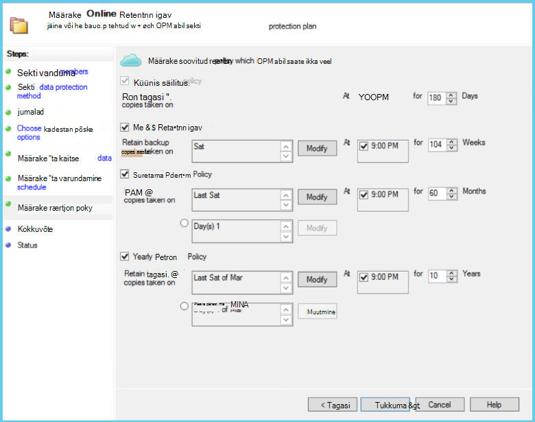
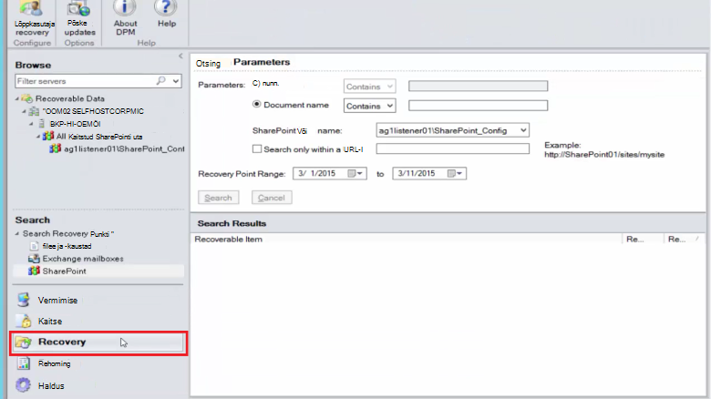
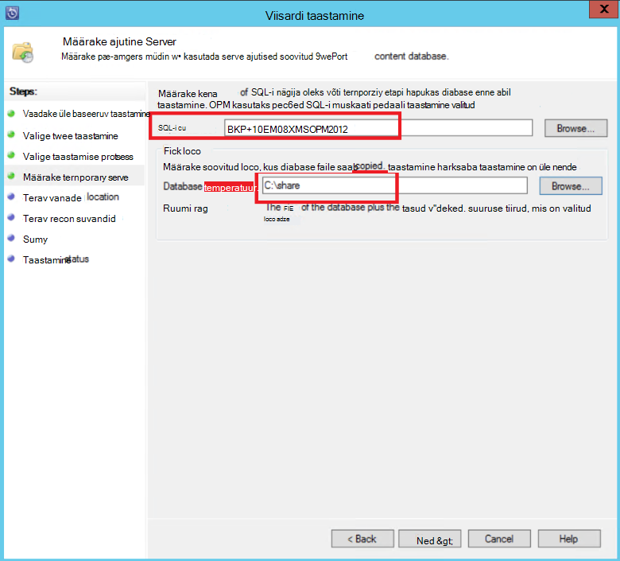
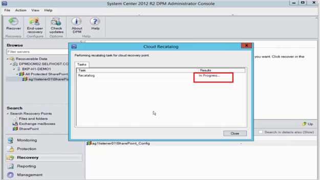

<properties
    pageTitle="SharePointi serveripargi Azure DPM/Azure varukoopia Serveri kaitse | Microsoft Azure'i"
    description="Selles artiklis antakse ülevaade SharePointi pargis DPM/Azure varukoopia Serveri kaitse Azure"
    services="backup"
    documentationCenter=""
    authors="adigan"
    manager="Nkolli1"
    editor=""/>

<tags
    ms.service="backup"
    ms.workload="storage-backup-recovery"
    ms.tgt_pltfrm="na"
    ms.devlang="na"
    ms.topic="article"
    ms.date="09/29/2016"
    ms.author="adigan;giridham;jimpark;trinadhk;markgal"/>

# Azure'i SharePointi serveripargi varundamine
Saate varundada SharePointi pargis Microsoft Azure'i palju sarnaselt muude andmeallikate varundada System Center andmete kaitse Manager (DPM) abil. Azure'i varukoopiad pakub paindlikkust varunduse ajakava loomiseks iga päev, nädala, kuu või aasta varundamise Sihtaadress ja valikuid säilitamise poliitikat erinevate varukoopia punktide. DPM võimaldab salvestada kohalikule kettale koopiaid kiire taastamise ajal eesmärkide (RTO) ja salvestada koopiaid Azure säästlik, pikaajalist säilitamist.

## SharePointi toetatud versioonid ja seotud kaitse stsenaariumid
Azure'i varukoopiad DPM toetab järgmistel juhtudel:

| Töökoormus | Versioon | SharePointi juurutusega | DPM juurutamine | DPM - System Center 2012 R2 | Kaitse ja taastamine |
| -------- | ------- | --------------------- | ------------------- | --------------------------- | ----------------------- |
| SharePointi | SharePoint 2010, SharePoint 2007 SharePoint 3.0 SharePoint 2013 | SharePointi juurutatud füüsilise serveri või Hyper-V/VMware virtuaalse masina   --------------   SQL-i AlwaysOn | Füüsilise serveri või kohapealse Hyper-V virtuaalse masina | Toetab varundamise Azure Update Rollup 5 | Kaitse SharePointi serveripargi taastesuvandeid: taastamine serveripargi, andmebaasi ja faili või loendiüksuse kaudu ketta taastamise punkte.  Serveripargi ja andmebaasi taastamise Azure taastamise punkte. |

## Enne alustamist
On mõned asjad, mida peate enne SharePointi serveripargi Azure varundada kinnitamiseks.

### Eeltingimused
Enne jätkamist, veenduge, et olete täitnud kõiki [eeltingimuste Microsoft Azure'i varundamise](backup-azure-dpm-introduction.md#prerequisites) kaitsmiseks töökoormus. Mõned põhitoimingud eeltingimused kaasata: loomine varukoopiate hoidla, hoidla mandaat alla laadida, installida Azure varukoopia Agent ja vault DPM/Azure varukoopia Serveri registreerida.

### DPM agent
DPM agent peab olema installitud serveris, kus töötab SharePoint, serverites, kus töötab SQL Server ja kõikides serverites, mis on osa SharePointi serveripargi. Kaitse agent häälestamise kohta leiate lisateavet teemast [Häälestamise kaitse Agent](https://technet.microsoft.com/library/hh758034(v=sc.12).aspx).  Ühe erandiks on installida agent ainult ühe veebiserverisse esiosa (WFE). DPM peab agent ühe WFE server ainult kasutada kaitsmise sisenemiskoha.

### SharePointi serveripargi
Iga 10 miljonit üksuste serveripargis, peab olema vähemalt 2 GB ruumi mahu, kus asub DPM kausta. Kataloogi genereerimine on vaja seda ruumi. DPM taastada kindlate üksuste (saidikogumite, saidid, loendid, dokumenditeekide, kaustade, üksikuid dokumente ja loendiüksusi), loob kataloogi genereerimine iga sisuandmebaasi sisalduvad URL-ide loendit. URL-ide loendit saate vaadata DPM administreerimiskonsool alal **taastamine** tööülesande paanil taastatav üksus.

### SQL serveri
DPM töötab paremal konto. SQL serveri andmebaasi varundada, DPM tuleb süsteemiadministraator õigusi selle konto server, mis töötab SQL Server. NT AUTHORITY\SYSTEM määramine *süsteemiadministraator* serveris, kus töötab SQL Server enne selle varundada.

Kui SharePointi serveripargi on SQL serveri andmebaasi, mis on konfigureeritud SQL serveri pseudonüümid, installida SQL serveri kliendi komponendid DPM kaitseb ees veebiserver.

### SharePoint Server
Kuigi jõudlus sõltub palju tegureid, nagu SharePointi serveripargi suurus, üldiseks ühe DPM server saate kaitsta SharePointi pargis 25 TB.

### DPM Update Rollup 5
SharePointi serveripargi Azure'i kaitse alustamiseks on vaja installida DPM Update Rollup 5 või uuem versioon. Update Rollup 5 pakub võimalust kaitsta SharePointi serveripargi Azure kui serveripargis konfigureeritud SQL-i AlwaysOn abil.
Lisateabe saamiseks lugege ajaveebipostitust, milles tutvustatakse [DPM Update Rollup 5]( http://blogs.technet.com/b/dpm/archive/2015/02/11/update-rollup-5-for-system-center-2012-r2-data-protection-manager-is-now-available.aspx)

### Mis on toetatud
- DPM, mida kaitseb SharePointi pargis kaitse otsing registrite või teenuserakenduse andmebaaside. Peate nende andmebaaside kaitse eraldi konfigureerimine.
- DPM ei ole varukoopia SharePointi SQL serveri andmebaasi, mis on majutatud skaala-out failikettad server (SOFS).

## SharePointi kaitse konfigureerimine
Enne DPM abil saate kaitsta SharePointi, tuleb konfigureerida, kasutades **ConfigureSharePoint.exe**teenuse SharePoint VSS Writer (kirjutaja WSS-i teenus).

Leiate **ConfigureSharePoint.exe** [DPM Installitee] \bin kausta veebi-serveris. See tööriist on SharePointi serveripargi kaitse agent identimisteabega. Käivitate ühes WFE serveris. Kui teil on mitu WFE serverid, valige ainult üks kaitse rühma konfigureerimisel.

### Teenuse SharePoint VSS Writer konfigureerimine
1. Serveris WFE käsuviibale, minge \bin\ [DPM installimise kohta]
2. Sisestage ConfigureSharePoint - EnableSharePointProtection.
3. Sisestage serveripargi administraatori õigused. Selle konto peaks olema WFE server kohalike administraatorite rühma liige. Kui serveripargi administraator pole kohalik administraator anda WFE server järgmisi õigusi:
  - Andke WSS_Admin_WPG rühma Täielik kasutusõigus DPM kausta (programmi Files%\Microsoft andmete kaitse Manager\DPM %).
  - Andke WSS_Admin_WPG rühma lugemine juurdepääs DPM registrivõtme (HKEY_LOCAL_MACHINE\SOFTWARE\Microsoft\Microsoft andmete kaitse Manager).

>[AZURE.NOTE] Peate uuesti ConfigureSharePoint.exe iga kord, kui SharePointi serveripargi administraatori identimisteave muutub.

## SharePointi serveripargi varundamine DPM abil
Kui olete konfigureerinud DPM ja SharePointi serveripargi, nagu on selgitatud varem, saate DPM SharePointi kaitstud.

### SharePointi serveripargi kaitsmiseks
1. DPM administreerimiskonsool vahekaardil **kaitse** nuppu **Uus**.
    

2. **Loo uus kaitse rühm** viisardi lehel **Valige kaitse rühma tüüp** valige **serverid**, ja klõpsake nuppu **edasi**.

    

3. Kuval **Valige rühma liikmed** , märkige ruut SharePoint Serveri, mida soovite kaitsta ja klõpsake nuppu **edasi**.

    

    >[AZURE.NOTE] Installitud DPM agent näete viisardis serveri. DPM kuvatakse ka selle struktuurist. Kuna käivitasite ConfigureSharePoint.exe, DPM suhtleb teenuse SharePoint VSS-kirjuti ja selle vastav SQL serveri andmebaasi ja tuvastab SharePointi serveripargi struktuuri, seotud sisuandmebaaside ja vastavad üksused.

4. Klõpsake lehel **Valige andmete kaitse meetod** Sisestage **Kaitse rühma**nimi ja valige oma eelistatud *kaitse meetodid*. Klõpsake nuppu **edasi**.

    

    >[AZURE.NOTE] Ketas kaitse meetod aitab lühike taastamise ajal eesmärkide saavutamisel. Azure'i on lindid võrreldes ökonoomne, pikaajalise kaitse märklaud. Lisateabe saamiseks lugege teemat [Kasutamine Azure varukoopia asendamine oma lint taristu](https://azure.microsoft.com/documentation/articles/backup-azure-backup-cloud-as-tape/)

5. **Määrake lühiajalised eesmärgid** lehel oma eelistatud **säilituspoliitika vahemiku** valimiseks ning kindlaks teha, kui soovite varukoopiate tekkida.

    

    >[AZURE.NOTE] Sest taastamise kõige sagedamini jaoks on vaja andmeid, mis on väiksem kui viis päeva, valitud viis päeva kettal mitmesuguseid säilitamise ja tagada, et varundamine juhtub mitte tekitamiseks tööajal selle näite puhul.

6. Vaadake rühma kaitse eraldatud salvestusruumi pool kettaruumi ja klõpsake seejärel nuppu **edasi**.

7. Iga kaitse rühma puhul DPM eraldab kettaruumi talletamiseks ja haldamiseks koopiad. Selles etapis tuleb DPM valitud andmete koopia loomine. Valige, kuidas ja millal soovite koopia, mis on loodud ja seejärel klõpsake nuppu **edasi**.

    

    >[AZURE.NOTE] Veenduge, et võrguliiklust ei toimu, valige aeg väljaspool tootmise tundi.

8. DPM tagab andmetervikluse täites vastavuse kontrollimine koopia. On saadaval kaks võimalust. Saate määratleda ajakava käivitamiseks vastavuse kontrollimine või DPM saab käitada vormindusühtsuse kontroll automaatselt koopia iga kord, kui see muutub ebaühtlane. Klõpsake soovitud suvandit ja seejärel klõpsake nuppu **edasi**.

    

9. Lehel **Määrake Online Protection andmete** valige SharePointi serveripargi, mida soovite kaitsta, ja seejärel klõpsake nuppu **edasi**.

    

10. Lehel **Määrake Online varundamise graafik** valige eelistatud ajakava ja seejärel klõpsake nuppu **edasi**.

    

    >[AZURE.NOTE] DPM pakub kuni kaks päeva varukoopiate Azure'i korda. Azure'i varukoopiad määrata ka WAN läbilaskevõimet, kasutades [Azure varundus võrgu pidurdamise](https://azure.microsoft.com/en-in/documentation/articles/backup-configure-vault/#enable-network-throttling)varufailide tippväärtus ja aegsasti kasutatavate.

11. Sõltuvalt varukoopia ajakava, mille valisite lehel **Online säilituspoliitika määramiseks** valige säilituspoliitika iga päev, nädala, kuu ja aasta varukoopia punktid.

    

    >[AZURE.NOTE] DPM kasutab vanaisa-isa-poja säilituspoliitika kava, kus saate valida mõne muu säilituspoliitika eri varukoopia punktid.

12. Sarnaselt kettal, kuvatakse algse viide punkti koopia tuleb luua Azure. Klõpsake soovitud suvandit Azure'i algse varukoopia loomiseks ja seejärel klõpsake nuppu **edasi**.

    

13. Teie valitud sätete **Kokkuvõte** lehel vaadake üle ja seejärel klõpsake nuppu **Loo rühm**. Pärast rühma kaitse on loodud, kuvatakse edu sõnum.

    

## SharePointi üksuse taastamine kettalt DPM abil
Järgmises näites *taastamisel SharePointi üksuse* kogemata kustutanud ja seda taastada.

1. Avage **DPM administreerimiskonsool**. Kõik SharePointi parkides, kus on kaitstud DPM on näidatud vahekaardil **kaitse** .

    

2. Üksuse taastamiseks alustamiseks valige vahekaart **taastamine** .

    

3. Saate otsida SharePointi *Taastamisel SharePointi* üksuse taastamine punkti vahemikus metamärkide-põhise otsingu abil.

    

4. Valige otsingutulemite hulgast sobiv taastamine punkti, paremklõpsake üksust ja seejärel valige **Taasta**.

5. Saate sirvida erinevate taastamise punkte ja valige andmebaasi või üksuse taastamiseks. Valige **kuupäeva > taastamise ajal**, ja seejärel valige õige **andmebaasi > SharePointi serveripargi > taastamine punkti > üksuse**.

    

6. Paremklõpsake üksust ja seejärel valige **Taasta** **Taastamine viisardi**avamiseks. Klõpsake nuppu **edasi**.

    

7. Valige taastamine, mida soovite teha, ja seejärel klõpsake nuppu **edasi**.

    

    >[AZURE.NOTE] Valiku **taastada algne** näites taastab üksuse algse SharePointi saidile.

8. Valige **Taastamise protsess** , mida soovite kasutada.
    - Valige **taastamise serveripargi kasutamata taastada** , kui SharePointi serveripargi on muutunud ja on sama parajasti taastatakse taastamine punktina.
    - Valige **Taasta abil taastamine serveripargi** , kui SharePointi serveripargi on muutunud taastamine punkti on loodud.

    

9. Lavastus SQL serveri eksemplar asukoht, kuhu soovite andmebaasi ajutiselt taastada, ning osutab lavastus failikettale DPM serveris ja server, mis on SharePointi üksuse taastamiseks.

    

    DPM manustab sisuandmebaasi, mis majutab SharePointi üksuse ajutine SQL serveri eksemplar. Sisuandmebaasist, DPM server taastab üksus ja paneb DPM server lavastus faili asukoht. Taastatud üksuse, mis on nüüd DPM serveri lavastus asukoht peab lavastus asukoht SharePointi serveripargi eksportida.

    

10. Valige **Määra taastesuvandeid**ning SharePointi serveripargi turbesätete rakendamine või rakendada turbesätete taastamise punkti. Klõpsake nuppu **edasi**.

    

    >[AZURE.NOTE] Kui soovite, et throttle võrgu läbilaskevõime kasutuse. See vähendab mõju tootmise server tootmise tunni jooksul.

11. Kokkuvõtlik teave üle ja seejärel klõpsake nuppu **Taasta** alustamiseks faili.

    

12. Nüüd valige vahekaart **jälgimis** **DPM administreerimiskonsool** taastamis **oleku** vaatamine.

    

    >[AZURE.NOTE] Fail on taastatud. Saate värskendada SharePointi saidi taastatud faili sisse möllida.

## SharePointi andmebaasi taastamine Azure'i DPM abil

1. SharePointi sisuandmebaasi taastamiseks sirvida erinevate taastamise punkte (nagu on näidatud varem) ja valige punkti taastamine, mida soovite taastada.

    

2. Topeltklõpsake punkti SharePointi taastamine saadaval SharePointi kataloogi teabe kuvamiseks.

    > [AZURE.NOTE] Kuna pikaajaline säilitus Azure SharePointi serveripargi on kaitstud, kataloogi teave (metaandmed) DPM server puudub. Selle tulemusena iga kord, kui punkti /-kellaaja SharePointi sisuandmebaasi peab olema taastatud, peate kataloogi SharePointi serveripargi uuesti.

3. Klõpsake **uuesti kataloogi**.

    

    Avaneb aken **Cloud Recatalog** olek.

    

    Kui kataloogi kandmine on lõpule jõudnud, olekuks seatakse *edu*. Klõpsake nuppu **Sule**.

    

4. Klõpsake SharePointi objekti DPM **taastamine** vahekaardil kuvatakse sisu andmebaasi struktuuri saada. Paremklõpsake üksust ja seejärel klõpsake nuppu **Taasta**.

    

5. Selles etapis järgige [taastamise juhiseid selle artikli](#restore-a-sharepoint-item-from-disk-using-dpm) taastada SharePointi sisuandmebaasi kettalt.

## Korduma kippuvad küsimused
Q: millised versioonid DPM toetab SQL Server 2014 ja SQL 2012 (SP2)? 
V: DPM 2012 R2 Update Rollup 4 toetab.

Q: kas SharePointi on konfigureeritud, kasutades SQL-i AlwaysOn (kaitsega kettal) SharePointi üksuse algsesse asukohta taastada? 
V: üksuse taastada algse SharePointi saidile.

Q: kas SharePointi on konfigureeritud, kasutades SQL-i AlwaysOn SharePointi andmebaasi algsesse asukohta taastada? 
V: Kuna SharePoint andmebaasid on konfigureeritud SQL-i AlwaysOn, ei saa muuta kui rühma kättesaadavus on eemaldatud. Seetõttu ei saa algsesse asukohta DPM andmebaasi taastada. Teine SQL serveri eksemplar SQL serveri andmebaasi saab taastada.

## Järgmised sammud
- SharePointi DPM kaitsmise kohta leiate lisateavet - vt [Video sarja - DPM SharePointi kaitse](http://channel9.msdn.com/Series/Azure-Backup/Microsoft-SCDPM-Protection-of-SharePoint-1-of-2-How-to-create-a-SharePoint-Protection-Group)
- Vaadake üle [System Center 2012 - andmete kaitse Manager väljalaskemärkmed](https://technet.microsoft.com/library/jj860415.aspx)
- Vaadake üle [väljalaskemärkmed andmete kaitse Manager System Center 2012 SP1](https://technet.microsoft.com/library/jj860394.aspx)
