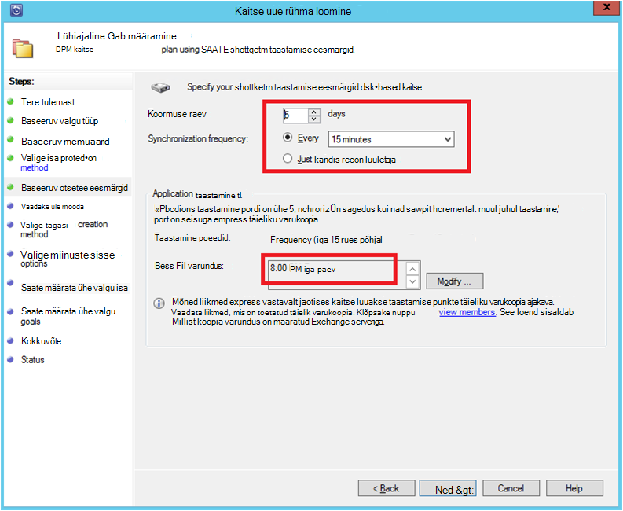
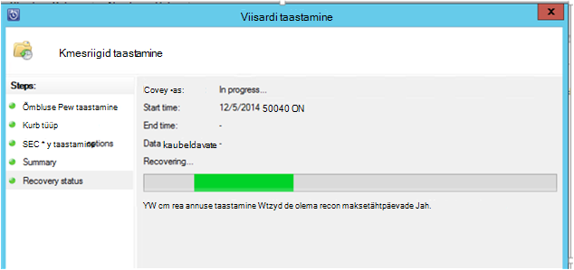

<properties
    pageTitle="Azure'i varukoopiad SQL serveri töökoormus DPM abil | Microsoft Azure'i"
    description="Sissejuhatus Azure'i varundus teenuse kasutamise SQL serveri andmebaasi varundamine"
    services="backup"
    documentationCenter=""
    authors="adigan"
    manager="Nkolli1"
    editor=""/>

<tags
    ms.service="backup"
    ms.workload="storage-backup-recovery"
    ms.tgt_pltfrm="na"
    ms.devlang="na"
    ms.topic="article"
    ms.date="09/27/2016"
    ms.author="adigan;giridham; jimpark;markgal;trinadhk"/>

# Azure'i varukoopiad SQL serveri töökoormus DPM abil

See artikkel viib teid konfigureerimise juhised varukoopia abil varukoopia Azure SQL serveri andmebaasi.

Azure'i konto peate Azure SQL serveri andmebaasi varundada. Kui teil pole kontot, saate luua tasuta prooviversiooni kontoga lihtsalt paar minutit. Lisateavet leiate teemast [Azure tasuta prooviversioon](https://azure.microsoft.com/pricing/free-trial/).

SQL serveri andmebaasi varukoopia Azure ja Azure taastamise haldus hõlmab kolme etappi:

1. Poliitika kaitsta Azure SQL serveri andmebaasi varukoopia loomine.
2. Luua nõudmisel varukoopiaid Azure.
3. Azure'i andmebaasi taastamine.

## Enne alustamist
Enne alustamist, veenduge, et kõik [eeltingimused](../backup-azure-dpm-introduction.md#prerequisites) Microsoft Azure'i varundamise kaitsmiseks töökoormus on täidetud. Eeltingimused kuulu järgmised toimingud: loomise varukoopiate hoidla, hoidla mandaat allalaadimise, installimise Azure varukoopia Agent ja server registreerumist vault.

## Poliitika kaitsta Azure SQL serveri andmebaasi varukoopia loomine

1. DPM server, klõpsake nuppu **kaitse** tööruumi.

2. Klõpsake tööriista lindil nuppu **Uus** kaitse uue rühma loomine.

    

3. DPM kuvatakse avakuva juhised **Kaitse rühma**loomine. Klõpsake nuppu **edasi**.

4. Valige **serverid**.

    

5. Laiendage SQL serveri arvutisse, kus on olemas andmebaasi varundada. DPM kuvatakse mitmesugustest andmeallikatest, mida saab varundada, et server. Laiendage **Kõik SQL-i aktsiad** ja valige (sel juhul me valitud aruandeserveri$ MSDPM2012 ja aruandeserveri$ MSDPM2012TempDB) andmebaasid varundada. Klõpsake nuppu **edasi**.

    

6. Sisestage nimi, rühma kaitse ja märkige ruut **soovin, et online Protection** .

    

7. **Määrake lühiajalised eesmärgid** ekraanil kaasata vajalikud sisendina luua varukoopia punktide kettale.

    Siin näeme, et **vahemiku säilitamine** on seatud *5 päeva*, **sünkroonimise sagedus** on määratud üks kord iga *15 minutit* mis on sagedus, mil varundus on võetud. *8:00 P.M*seatakse **Kiire täielik varukoopia** .

    

    >[AZURE.NOTE] 8:00 PL (vastavalt Kuva sisend) juures luuakse varukoopia punkti iga päev nimistust eelmisel päeval 8.00 varukoopia punkti andmed, mida on muudetud. Seda nimetatakse **Kiire täielik varukoopia**. Logide sünkroonitakse tehingu ajal iga 15 minuti järel, kui on vaja taastada, kell 9:00 – seejärel punkti on loodud uuesti läbimängimise logid viimasena kiire täieliku varukoopia punkti (sel juhul 8 pl).

8. Klõpsake nuppu **Järgmine**

    DPM kuvatakse üldine saadaval salvestusruumi ja on võimalik kettaruumi kasutamise.

    

    Vaikimisi DPM loob ühe helitugevuse kohta andmeallika (SQL Serveri andmebaasiga), mida kasutatakse algse varukoopia. Seda moodust kasutamisel loogilise ketta Manager (LDM) piirab DPM kaitse 300 andmeallikatega (SQL serveri andmebaasi). See piirang, valige soovitud **andmete DPM talletusmahtu asukohti**, suvand. Kui kasutate seda suvandit, DPM kasutab ühte mitmest andmeallikast, mis võimaldab kaitsta kuni 2000 SQL andmebaase DPM.

    Kui valitud on suvand **Automaatne kasvada mahud** , DPM arvestada suurema varukoopia maht kasvab andmetele. Kui **automaatselt kasvada mahud** ruut on märkimata, piirab DPM kasutatakse andmeallikate jaotises kaitse varukoopia säilitamist.

9. Administraatorid on toodud valik üle läbilaskevõime ülekoormuse vältimiseks algse varukoopia käsitsi (väljalülitamine võrgu) või võrgu kaudu. Need saate konfigureerida ka aeg, mille algne üleandmine võib juhtuda. Klõpsake nuppu **edasi**.

    

    Algne varukoopia nõuab kogu andmeallika (SQL Serveri andmebaasiga) üleviimist DPM server tootmise server (SQL serveri kohapeal). Need andmed võib olla suur ja saanud ületada andmeedastuse üle võrgu läbilaskevõime. Seetõttu administraatorid saate valida algse varukoopia: **käsitsi** (abil irdkandjale) vältimiseks läbilaskevõime ülekoormuse või **automaatselt võrgu kaudu** (määratud ajal).

    Kui algse varundamine on lõpule jõudnud, on ülejäänud varukoopiaid varundamiseks klõpsake algse varukoopia. Varundamiseks enamasti small ja võrgus hõlpsalt üle.

10. Valige, kui soovite järjepidevuse kontroll käivitamiseks ja klõpsake nuppu **edasi**.

    

    DPM saab teha mõne järjepidevuse ning kontrollige terviklus varukoopia punkti. See arvutab kontrollsumma varufaili tootmise server (sel juhul SQL serveri kohapeal) ja varundatud andmete DPM selle faili jaoks. On konflikti korral eeldatakse, et DPM varundatud faili on rikutud. DPM parandatud varundatud andmete saatmisega vastav kontrollsumma lahknevuse plokid. Nagu vastavus on jõudluse mahukat toiming, administraatoritel on võimalus plaanimine vormindusühtsuse kontroll või automaatse käivitamise.

11. Funktsiooni andmeallikatele online kaitse määramiseks valige andmebaaside kaitstava Azure ja klõpsake nuppu **edasi**.

    

12. Administraatorid saate valida varukoopia ajakava ja säilituspoliitikad, mis vastavalt oma ettevõtte poliitika.

    

    Selles näites on varukoopiate võtta üks kord päevas kell 12:00 PL-20.00 (alumine osa Kuva)

    >[AZURE.NOTE] See on hea tava on mõned lühiajaline taastamise punkte kettal kiire taastamise. Nende taastamise punkte kasutatakse "taastamist". Azure'i toimib kõrgema SLAs hea välisest allikast asukoha ja tagatud kättesaadavus.

    **Parimaks**: Veenduge, et pärast lõpetamist kohalikule kettale varukoopiate abil DPM on ajastatud Azure'i varukoopiad. See võimaldab uusim ketta varundus Azure'i kopeerida.

13. Valige säilitamise poliitikat ajakava. Säilituspoliitika toimimise kohta üksikasjade osutab [Kasutamine Azure varukoopia asendada oma lint taristu artikkel](backup-azure-backup-cloud-as-tape.md).

    

    Selles näites:

    - Varukoopiate võetakse kord päevas kell 12:00 PL-20.00 (alumine osa Kuva) ja 180 päeva säilitatakse.
    - Varundus laupäev kell 12:00. säilitatakse 104 nädalat
    - Varundus viimase laupäev kell 12:00. on alles 60 kuud
    - Varundus viimase laupäev märts kell 12:00. säilitatakse 10 aastat

14. Klõpsake nuppu **edasi** ja valige vastav variant edastada Azure'i algse varukoopia. Saate valida **automaatselt võrgu kaudu** või **Ühenduseta varukoopia**.

    - **Automaatselt üle võrgu** üle varundatud andmete Azure ühe valitud varundamise graafik.
    - **Ühenduseta varundamise** tööpõhimõte on selgitatud [ühenduseta varundamise töövoo Azure varukoopia](backup-azure-backup-import-export.md).

    Valige asjakohane edastamine süsteem saata Azure'i algse varukoopia nimi ja klõpsake nuppu **edasi**.

15. Kui vaatate poliitika **Kokkuvõte** Kuva üksikasjad, klõpsake töövoo lõpuleviimiseks nuppu **Loo rühm** . Saate jälgida töö jälgimine tööruumi ja klõpsake nuppu **Sule** .

    

## SQL serveri andmebaasi varukoopia nõudmisel
Kui eelnevate juhiste järgimisel loodud varukoopia poliitika, luuakse "taastamine punkti" ainult siis, kui esimese varukoopia esineb. Selle asemel et oodata ajasti algama, osutage päästik luua taastamise allolevad juhised käsitsi.

1. Oodake, kuni kaitse rühma olekuks kuvatakse **OK** andmebaasi enne taastamise punkti loomine.

    

2. Andmebaasi paremklõpsake ja valige käsk **Loo taastamise punkti**.

    

3. Valige rippmenüüst menüü **Online Protection** ja klõpsake nuppu **OK**. Käivitub Azure taastamise punkti loomine.

    

4. Töö edenemist saate vaadata, kust leiate mõne tekstivormingus edenemise **jälgimine** tööruumis töö nagu kujutatud järgmisel joonisel.

    

## Azure SQL serveri andmebaasi taastamine
Järgmised toimingud on vaja taastamine Azure'i kaitstud üksus (SQL Serveri andmebaasiga).

1. Avage DPM server Management Console. Liikuge **taastamine** tööruumi, kus näete DPM toetavad serverid. Sirvige (see juhul aruandeserveri$ MSDPM2012) nõutav andmebaasi. Valige **taastamise** aeg, mis lõpeb **Online**.

    

2. Paremklõpsake andmebaasi nimi ja klõpsake nuppu **Taasta**.

    

3. DPM kuvatakse üksikasjad taastamise punkti. Klõpsake nuppu **edasi**. Andmebaasi ülekirjutamiseks valige taastamise **taastada algne eksemplar SQL serveri**tüüp. Klõpsake nuppu **edasi**.

    

    Selles näites DPM võimaldab andmebaasi taastamine teine SQL serveri eksemplar või autonoomse võrgukausta.

4. **Määrake taastesuvandeid** ekraani, saate valida taastesuvandeid nt võrgu läbilaskevõime kasutuse pidurdamise throttle läbilaskevõime, mis kasutavad taastamine. Klõpsake nuppu **edasi**.

5. **Kokkuvõte** ekraanil näete taastamine konfiguratsioone seni andnud. Klõpsake nuppu **Taasta**.

    Taastamine olek kuvatakse andmebaasi taastamine. Klõpsake viisardi sulgemiseks ja edenemise **jälgimine** tööruumi vaatamine **sulgemine** .

    

    Pärast taastamis on lõpule jõudnud, on taastatud andmebaasi kohase.

### Järgmised toimingud:

• [Azure varukoopia KKK](backup-azure-backup-faq.md)
