<properties
   pageTitle="Kustutamine on Azure varukoopia vault | Microsoft Azure'i"
   description="Kuidas kustutada mõne Azure varukoopia vault. Miks ei saa kustutada varukoopiate hoidla tõrkeotsing. "
   services="service-name"
   documentationCenter="dev-center-name"
   authors="markgalioto"
   manager="cfreeman"
   editor=""/>

<tags
   ms.service="backup"
   ms.devlang="na"
   ms.topic="article"
   ms.tgt_pltfrm="na"
   ms.workload="storage-backup-recovery"
   ms.date="08/29/2016"
   ms.author="markgal;trinadhk"/>

# Kustutage mõni Azure varukoopia vault

Azure varukoopia teenus on kahte tüüpi võlvid - varundamise hoidla ja taastamise teenused vault. Varundus vault oli esimene. Seejärel taastamise teenused vault tuli mööda laiendatud ressursihaldur juurutuste toetamiseks. Laiendatud võimaluste ja vault peavad olema talletatud teabe sõltuvusi, kustutamise taastamise teenused vault võib tunduda raskem kui peab olema.

|**Juurutamise tüüp**|**Portaal**|**Vault nimi**|
|--------------|----------|---------|
|Klassikaline|Klassikaline|Varukoopiate hoidla|
|Ressursihaldur|Azure'i|Taastamise teenuste hoidla|

> [AZURE.NOTE] Varukoopia võlvid ei saa kaitsta ressursihaldur juurutatud lahendusi. Siiski saate taastamise teenused vault klassikalise juurutatud serverid ja VMs kaitsta.  

Selles artiklis me kasutame termin vault varundamise vault või taastamise teenused vault üldise kujul viidata. Kasutame ametlik nimi, varundamise vault või taastamise teenused vault, kui see on vajalik võlvid eristada.

## Taastamise teenused vault kustutamine

Kustutamise taastamise teenused vault on üks samm protsess - *esitatud vault ei sisalda ressursse*. Enne taastamise teenused vault kustutamiseks tuleb eemaldada või kustutada kõik ressursid autoriloomingut. Kui proovite kustutada mõne hoidla, mis sisaldab ressursse, kuvatakse järgmine tõrketeade, nagu järgmisel pildil.

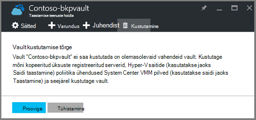  

Enne, kui teil on kustutatud ressursid on hoidlast, klõpsates, **proovige** toodab sama viga. Kui te olete pikka aega teade selle tõrketeate, klõpsake nuppu **Loobu** ja järgige allpool taastamise teenused võlvkelder ressursside kustutamiseks.

### Üksuste eemaldamine hoidlast, VM kaitsmine

Kui teil on juba taastamise teenused vault avamine, jätkake selle teise.

1.  Avage Azure portaali ja armatuurlaualt vault, mille soovite kustutada.

    Kui teil pole kinnitatud armatuurlaud, valige menüü jaoturi vault taastamise teenused klõpsake nuppu **Rohkem teenuseid** ja tippige ressursid loendis **Taastamise teenused**. Kui alustate tippimist, loendi filtrid põhjal sisendit. Klõpsake **taastamise teenused võlvid**.

    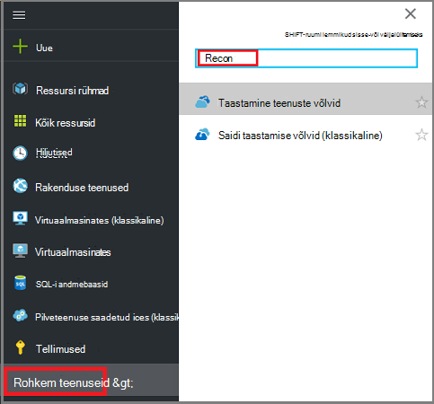  

    Kuvatakse loend taastamise teenused võlvid. Valige loendist vault, mille soovite kustutada.

    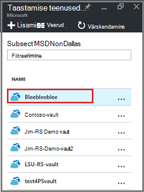

2. Vaates vault pilk **Essentialsi** paani. Võlvkelder kustutamiseks ei saa olla mis tahes kaitstud üksused. Kui kuvatakse mõni muu arv peale nulli, **Üksuste varundamine** või **varundamise management serverid**, peate eemaldama neid üksusi enne kustutamist vault.

    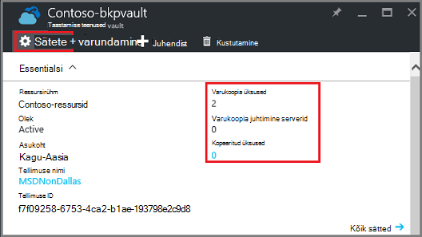

    VMs failide ja kaustade käsitletakse üksuste varundamine ja on ära toodud paani Essentialsi alal **Üksuste varundamine** . DPM server on loetletud paani Essentialsi alal **Varundamise Management Server** . **Kopeeritud üksused** , mis on seotud Azure saidi taastamise teenust.

3. Otsige eemaldada kaitstud üksused kuvatakse hoidlast alustamiseks vault üksused. Vault armatuurlaual nuppu **sätted**ja siis klõpsake nuppu **varundus üksuste** avamiseks selle tera.

    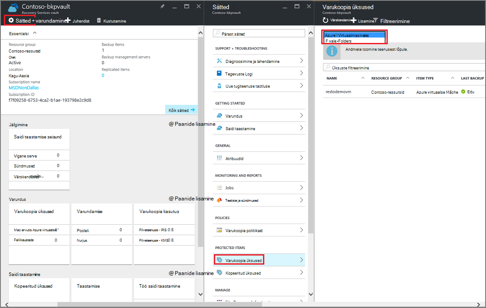

    **Üksuste varundamine** tera on eraldi loendid, võttes aluseks üksuse tüüp: Azure'i Virtuaalmasinates või Failikaustade (vt pilti). Vaikimisi üksuse tüüp loendis kuvatakse on Azure'i Virtuaalmasinates. Vault-Failikaustade üksuste loendi kuvamiseks valige rippmenüüst menüü **- Failikaustade** .

4. Enne, kui kustutate mõne üksuse kaitsmine VM hoidlast, peate üksuse detailse lõpetada ja taastamise punkti andmed kustutada. Iga üksuse autoriloomingut, toimige järgmiselt.

    lisamine. Enne **Varukoopia üksused** , paremklõpsake üksust ja valige kontekstimenüü **varundamise peatamine**.

    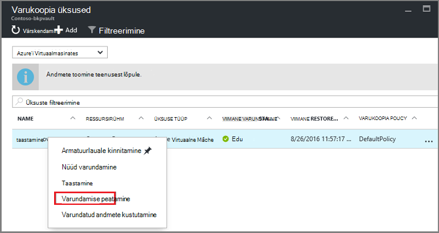

    Varundamise peatamine tera avaneb.

    b. **Peatamine varukoopia** enne, **Valige suvand** menüüst, valige **Kustutamine varundatud andmete** > Tippige üksuse nimi > ja klõpsake käsku **Peata varundus**.

      Tippige nimi, üksuse kinnitamiseks, mida soovite kustutada. Nupp **Peata varundus** ei aktiveeri, kuni kinnitate üksuse lõpetada. Kui te ei näe dialoogiboksis varukoopia üksuse nime, olete valinud suvandi **Varundatud andmete säilitamise** .

    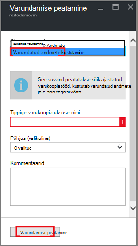

      Soovi korral saate sisestada põhjus, miks andmete kustutamise ja lisada kommentaare. Pärast nupu **Lõpeta varundamise**, luba lõpuleviimiseks, enne kui proovite kustutada vault töö kustutamine. Veenduge, et töö on lõppenud, märkige ruut Azure'i sõnumid .  
   Pärast töö on lõpule jõudnud, kuvatakse teade selle kohta, varundamist on peatatud ja varundatud andmed on kustutatud üksuse kohta.

    c. Pärast kustutamist loendis Valige menüü **Üksuste varundamine** nuppu **Värskenda** kõik ülejäänud üksused autoriloomingut.

      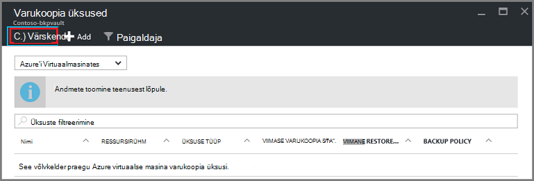

      Kui loendis on üksusi, liikuge kerides varundamise vault tera **Essentialsi** paan. Ei tohiks olla mis tahes **Üksuste varundamine**, **varundamise management serverid**või loendis **paljundatud üksused** . Kui üksused on endiselt kuvatakse autoriloomingut, naaske kolmas juhis ülaltoodud ja valida mõne muu üksuse tüübi loend.  

5. Kui vault tööriistaribal pole veel üksusi, klõpsake nuppu **Kustuta**.

    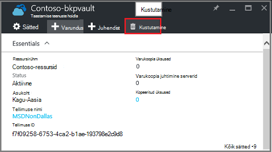

6. Kui teil palutakse kinnitada, et soovite vault kustutada, klõpsake nuppu **Jah**.

    Vault kustutatakse ja portaali tagastab menüüs **Uus** teenus.

## Mida teha, kui ma lõpetanud varundamist, kuid need säilitatakse andmeid?

Kui peatasite varundamist, kuid kogemata *säilitatakse* andmeid, saate enne kustutamist vault varukoopia andmed kustutada. Varundatud andmete kustutamiseks tehke järgmist.

1. Enne **Varukoopia üksused** , paremklõpsake üksust ja klõpsake kontekstimenüü käsku **Kustuta varundatud andmete**.

    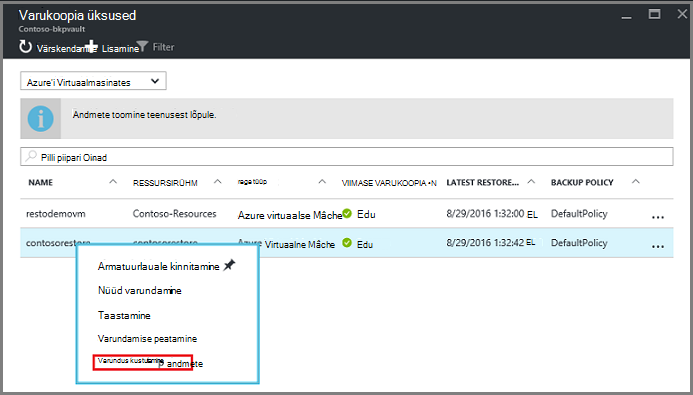

    **Varundus andmete kustutamise** tera avaneb.

2. Enne **Varukoopia andmete kustutamine** , tippige üksuse nimi ja klõpsake nuppu **Kustuta**.

    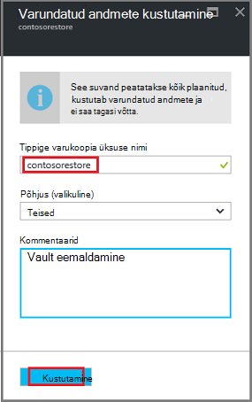

    Pärast andmete kustutamist jätkake 4c, ülaltoodud ja jätkake protsess.

## DPM server kaitsmiseks kasutada võlvkelder kustutamine

Enne kustutamist võlvkelder DPM server kaitsmiseks kasutada, peate tühjendage kõik taastamise punkte, mis on loodud ja seejärel unregister server on hoidlast.

Kaitse rühma seotud andmete kustutamiseks tehke järgmist.

1. DPM administreerimiskonsool nuppu **kaitse**, valige kaitse rühma, valige kaitse rühma liige ja tööriista abil klõpsake lindil nuppu **Eemalda**. Valige kuvada tööriista lindil nuppu **Eemalda** liige. Näites on **dummyvm9**. Kui jaotises kaitse on mitu liiget, hoidke all juhtklahvi (Ctrl) valimiseks mitu liiget.

    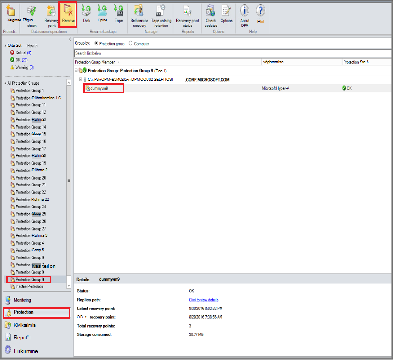

    Avaneb dialoogiboks **Peata kaitse** .

2. Dialoogiboksis **Peata kaitse** valige **Kustuta kaitstud andmed**ja klõpsake nuppu **Peata kaitse**.

    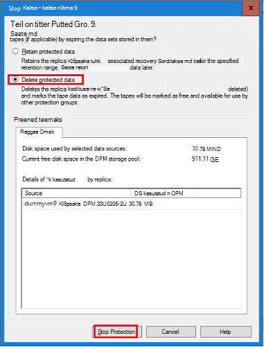

    Te ei soovi säilitada kaitstud andmeid, sest teil on vaja tühjendage vault selleks, et kustutada. Sõltuvalt sellest, mitu taastamise punktid ja kui palju andmeid on jaotises kaitse, võib kuluda suvalist mitu sekundit paar minutit andmete kustutamiseks. Kui töö on valmis, kuvatakse dialoogiboks **Peata kaitse** olek.

    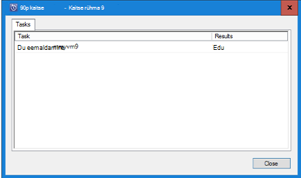

3. Jätkake kõigi rühmade kõik liikmeid.

    Kõikide parooliga kaitstud andmed ja kaitse rühm(ad), peate eemaldama.

4. Pärast kustutamist rühmast kaitse kõigile liikmetele, aktiveerige Azure'i portaalis. Avage vault armatuurlaud, ja veenduge, et ei ole **Üksuste varundamine**, **varundamise management serverid**või **paljundatud üksused**. Klõpsake tööriistaribal vault, klõpsake nuppu **Kustuta**.

    

    Kui varundamise management serverid vault registreeritud, ei saa kustutada isegi juhul, kui puuduvad andmed autoriloomingut vault. Kui teil arvatavasti oli kustutamist seostatud vault varundamise management serverid, kuid on endiselt nähtaval **Essentialsi** paanil serverid, vt [varundamise management serverid registreeritud vault otsimine](backup-azure-delete-vault.md#find-the-backup-management-servers-registered-to-the-vault).

5. Kui teil palutakse kinnitada, et soovite vault kustutada, klõpsake nuppu **Jah**.

    Vault kustutatakse ja portaali tagastab menüüs **Uus** teenus.

## Tootmise server kaitsmiseks kasutada võlvkelder kustutamine

Enne kustutamist võlvkelder tootmise server kaitsmiseks kasutada, peate kustutada või unregister server on hoidlast.

Seotud vault tootmise serveri kustutamiseks tehke järgmist.

1. Azure'i portaalis, avage vault armatuurlaua ja klõpsake nuppu **sätted** > **Varundamise taristu** > **Tootmisserverid**.

    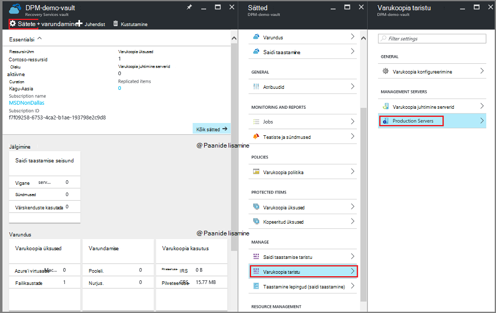

    **Tootmisserverid** tera avatakse ja loetleb kõik tootmisserverid autoriloomingut.

    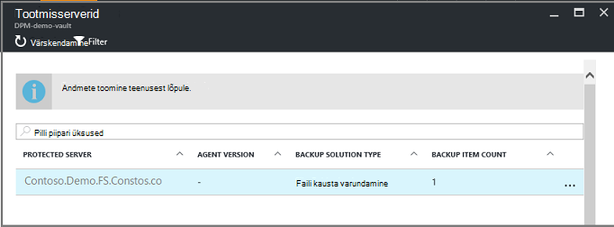

2. Enne **Tootmisserverid** , paremklõpsake server ja klõpsake nuppu **Kustuta**.

    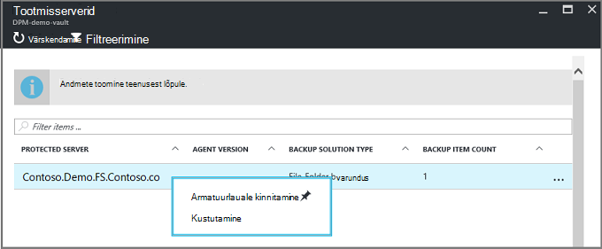

    **Kustutage** tera avaneb.

    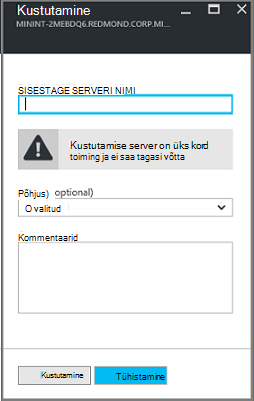

3. Kinnitage **kustutamine** enne serveri kustutada, ja klõpsake nuppu **Kustuta**. Peate sisestama õige aktiveerimiseks nuppu **Kustuta** serveri nimi.

    Kui vault on kustutatud, kuvatakse teade selle kohta, vault on kustutatud. Pärast kustutamist kõikides serverites võlvkelder, liikuge tagasi vault armatuurlaua Essentialsi paani.

4. Armatuurlaua vault, veenduge, et ei ole **Üksuste varundamine**, **varundamise management serverid**või **paljundatud üksused**. Klõpsake tööriistaribal vault, klõpsake nuppu **Kustuta**.

5. Kui teil palutakse kinnitada, et soovite vault kustutada, klõpsake nuppu **Jah**.

    Vault kustutatakse ja portaali tagastab menüüs **Uus** teenus.

## Varundus vault kustutamine

Järgmised juhised on mõeldud kustutamine varundamise vault klassikaline portaalis. Mõne varundamise hoidla ja taastamise teenused vault on samad: enne vault kustutamiseks üksused ja säilitatud andmed kustutada.

1. Avage klassikaline portaal.

2. Valige loendist varukoopia võlvid vault, mille soovite kustutada.

    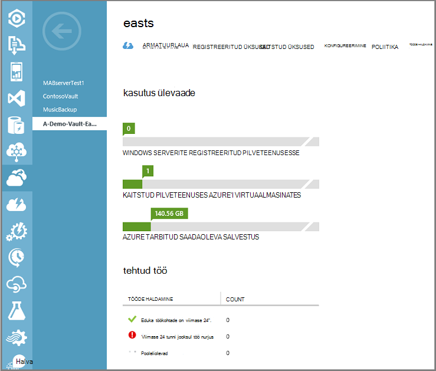

    Armatuurlaua vault avatakse. Vaadake Windows serverite ja/või Azure'i virtuaalmasinates vault seostatud arvu. Vaadake ka kogu talletusmaht tarbitud Azure. Peate varukoopia töökohtade peatada ja kustutada olemasolevate andmete enne kustutamist vault.

3. Klõpsake vahekaarti **Kaitstud üksused** ja seejärel klõpsake nuppu **Peata kaitse**

    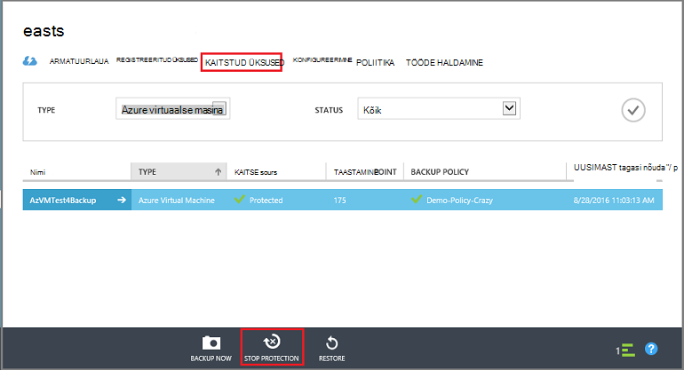

    Kuvatakse dialoogiboks **Peata kaitse "vault"** .

4. Dialoogiboksis **Peata kaitse "vault"** märkige **seotud varundatud andmete kustutamine** ja klõpsake nuppu .  
   Soovi korral saate valida põhjust peatamiseks kaitse ja pakkuda kommentaari.

    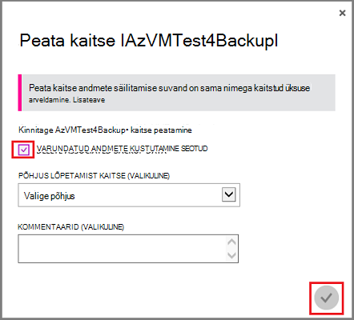

    Pärast kustutamist üksuste vault, vault on tühi.

    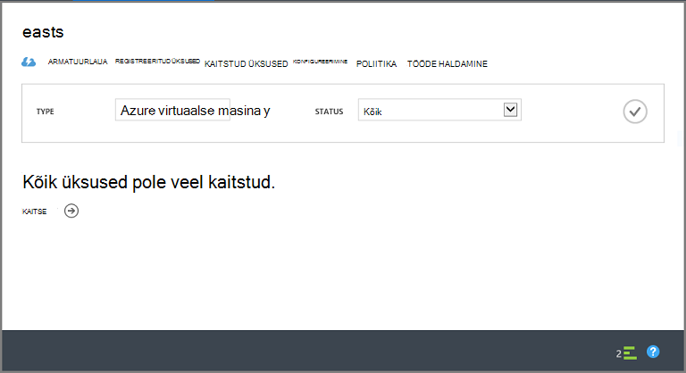

5. Klõpsake menüüd loendis **Registreeritud üksused**. Iga üksuse autoriloomingut registreeritud, valige üksus ja klõpsake **registreerimise tühistamise**.

    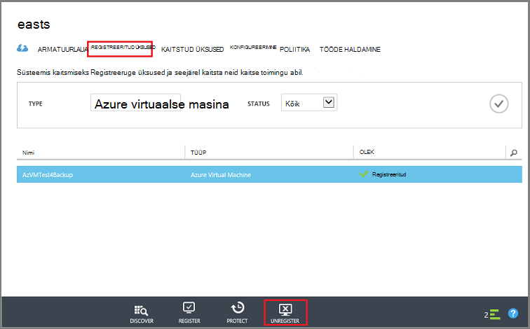

6. Klõpsake vahekaarte loendis **armatuurlaua** selle vahekaardi avamiseks. Veenduge, et pole registreeritud serverid või Azure'i virtuaalmasinates kaitstud pilveteenuses. Lisaks veenduge, et puuduvad salvestusruumi. Klõpsake nuppu **Kustuta** vault kustutada.

    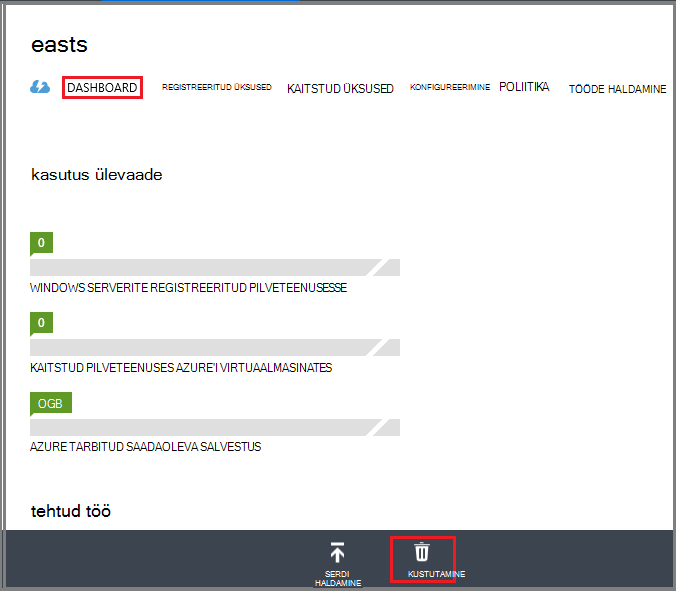

    Avaneb kustutamine varundamise vault kinnituse ekraani. Miks on kustutamise vault ja klõpsake suvandi valimine .  

    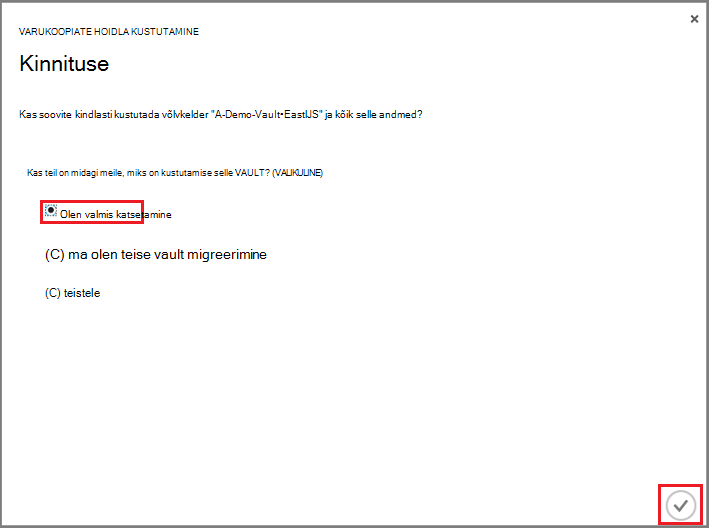

    Vault kustutatakse ja naasete klassikaline portaali armatuurlaud.

### Varundus Management serverid registreeritud vault otsimine

Kui teil on mitu serverid võlvkelder registreeritud, võib olla keeruline neid meeles pidada. Vt vault registreeritud serverid ja kustutage need.

1. Avage vault armatuurlaud.

2. Klõpsake paanil **Essentialsi** **sätted** , et avada selle tera.

    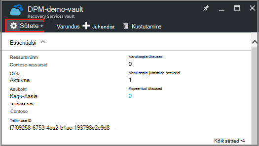

3. Klõpsake **sätete blade** **Varundamise taristu**.

4. **Varundus taristu** enne, klõpsake nuppu **Varundus Management serverid**. Varundus Management serverid tera avaneb.

    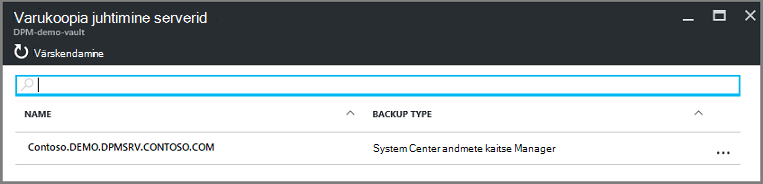

5. Serveri loendist kustutamiseks paremklõpsake serveri nimi ja seejärel klõpsake käsku **Kustuta**.
    **Kustutage** tera avaneb.

6. Enne **kustutada** , sisestage serveri nimi. Kui see on pikk nimi, mida saate kopeerida ja kleepida varundamise Management serverid loendist. Klõpsake nuppu **Kustuta**.  
