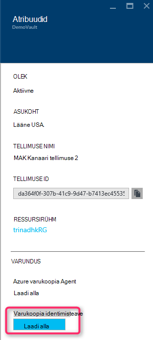
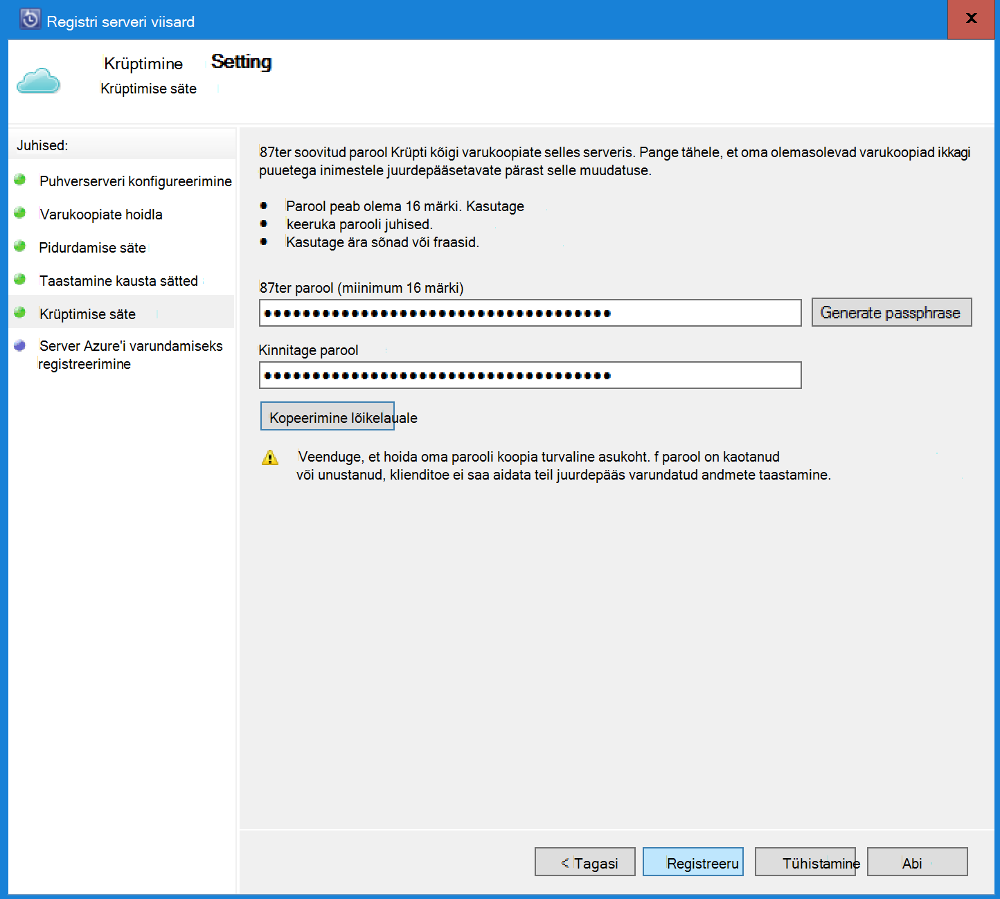

<properties
    pageTitle="Sissejuhatus Azure'i DPM varundus | Microsoft Azure'i"
    description="DPM serverid Azure varukoopia teenuse kasutamist varundada tutvustus"
    services="backup"
    documentationCenter=""
    authors="Nkolli1"
    manager="shreeshd"
    editor=""
    keywords="Süsteemi andmete kaitse Manager, andmete kaitse manager, dpm varundamine"/>

<tags
    ms.service="backup"
    ms.workload="storage-backup-recovery"
    ms.tgt_pltfrm="na"
    ms.devlang="na"
    ms.topic="article"
    ms.date="08/08/2016"
    ms.author="trinadhk;giridham;jimpark;markgal;adigan"/>

# Varundage töökoormus Azure DPM-i ettevalmistamine

> [AZURE.SELECTOR]
- [Azure varukoopia Server](backup-azure-microsoft-azure-backup.md)
- [SCDPM](backup-azure-dpm-introduction.md)
- [Azure varukoopia Server (klassikaline)](backup-azure-microsoft-azure-backup-classic.md)
- [SCDPM (klassikaline)](backup-azure-dpm-introduction-classic.md)

Selles artiklis antakse Sissejuhatus Microsoft Azure'i varundamise kaitsta teie süsteemi Center andmete kaitse Manager (DPM) kui ka töökoormus. Lugedes, saate aru:

- Azure'i DPM serveri varukoopia tööpõhimõtted
- Eeltingimused saavutamiseks sujuvate varukoopia kogemus
- Tüüpilised ilmnenud tõrgete ja kuidas neid
- Toetatud stsenaariumid

> [AZURE.NOTE] Azure'i on kaks juurutamise mudelite loomise ja ressursside töötamine: [ressursihaldur ja klassikaline](../resource-manager-deployment-model.md). Sellest artiklist leiate teavet ja juhiseid taastamine VMs juurutatud ressursihaldur mudeli abil.

System Center DPM varundab faili- ja rakenduse andmeid. Andmeid varundada DPM saate salvestatud lindile kettal, või Azure Microsoft Azure'i varundamise varundada. DPM suhtleb Azure varukoopia järgmiselt:

- **DPM juurutatud füüsilise serveri või kohapealse virtuaalse masina** – kui DPM juurutatakse füüsilise serveri või kohapealse Hyper-V virtuaalse masina saate varundada andmete taastamise teenused vault Lisaks kettale ja lindile varukoopia.
- **Azure'i virtuaalarvuti juurutatud DPM** – kaudu System Center 2012 R2 Update 3, mis on Azure virtuaalse masina saab kasutada DPM. Kui DPM juurutatud Azure virtuaalse masina, mis te saate varundada andmeid Azure ketast lisatud DPM Azure virtuaalse masina või andmete talletamine offload toetuseta ta taastamise teenused vault ülespoole.

## Miks varukoopia DPM Azure?

Azure'i varundamise varundamiseks DPM serverid business eelised on järgmised.

- Kohapealse DPM juurutamiseks saate Azure'i alternatiivina pikaajalise juurutamise lindile.
- DPM juurutuste Azure, Azure varundus võimaldab salvestusruumi Azure'i ketas, et võimaldab skaala kuni talletades vanemate andmete taastamise teenused hoidla ja uute andmete kettale.

## Eeltingimused
Ettevalmistused Azure varukoopia DPM varundada järgmiselt:

1. **Loo taastamise teenused vault** – võlvkelder Azure portaali loomine.
2. **Laadi alla hoidla mandaat** – mandaat, mille abil saate registreerida taastamise teenused vault DPM server alla laadida.
3. **Installige Azure'i varundus Agent** – installida Azure varukoopia agent iga DPM serveris.
4. **Server registreerida** – DPM serveri taastamise teenused vault registreerida.

### 1. taastamise teenuste hoidla loomine
Taastamise teenuste hoidla loomiseks tehke järgmist.

1. [Azure'i portaali](https://portal.azure.com/)sisse logida.

2. Jaoturi menüü, klõpsake nuppu **Sirvi** ja tippige ressursid loendis **Taastamise teenused**. Kui alustate tippimist, loendit filtreeritakse sisendit põhjal. Klõpsake **taastamise teenused vault**.

    

    Kuvatakse loend taastamise teenused võlvid.

3. Menüü **võlvid taastamise teenused** nuppu **Lisa**.

    

    Taastamise teenused vault tera avaneb, palub teil **nime** **tellimuse** **ressursirühm**ning **asukoht**.

    

4. Sisestage **nimi**sõbralik nimi, mis tähistavad vault. Nimi peab olema kordumatu Azure tellimuse jaoks. Tippige nimi, mis sisaldab 2 – 50 märki. See peab algama tähega ja võib sisaldada ainult tähti, numbreid ja sidekriipse.

5. Klõpsake **tellimuse** saadaolevate tellimuste loendi kuvamiseks. Kui te pole kindel, milline tellimus kasutada, kasutage vaikeväärtust (või soovitatud) tellimus. Seal on mitu valikud ainult juhul, kui ettevõtte konto on seotud mitu Azure tellimust.

6. **Ressursirühm** on saadaval loendi kuvamiseks valige või klõpsake nuppu **Uus** , et luua uue ressursirühma. Ressursi rühmade kohta, leiate [Azure'i ressursihaldur ülevaade](../azure-resource-manager/resource-group-overview.md)

7. Klõpsake **asukoha** valimiseks piirkonnas vault jaoks.

8. Klõpsake nuppu **Loo**. Võib kuluda aega taastamise teenused vault luua. Jälgida Olekuteatised portaalis paremas ülanurgas alal.
Kui teie vault on loodud, avatakse portaalis.

### Seadmine salvestusruumi Dispersioonanalüüs

Salvestusruumi dispersioonanalüüs suvand võimaldab valida geograafilise liigne salvestusruumi ja kohalikult liigsete salvestusruumi. Vaikimisi on teie vault geograafilise liigne salvestusruumi. Jätke suvand, kui see peamine varukoopia geograafilise liigne salvestusruumi väärtuseks. Kui soovite odavamad, mis pole päris nii püsival, valige kohalik liigsete salvestusruumi. Lisateavet [geograafilise liigne](../storage/storage-redundancy.md#geo-redundant-storage) ja [kohalikult liigsete](../storage/storage-redundancy.md#locally-redundant-storage) talletamise võimalused [Azure Storage dispersioonanalüüs ülevaade](../storage/storage-redundancy.md).

Salvestusruumi dispersioonanalüüs säte redigeerimiseks tehke järgmist.

1. Valige oma vault vault armatuurlaua ja tera sätted avamiseks. Kui tera **sätted** ei avane, klõpsake vault armatuurlaua **Kõik sätted** .

2. Enne **sätted** , klõpsake nuppu **Varundus taristu** > **Varukoopia konfiguratsiooni** **Varukoopia konfiguratsiooni** tera avamiseks. Enne **Varukoopia konfiguratsiooni** , valige oma vault salvestusruumi dispersioonanalüüs suvandi.

    

    Pärast valides oma vault salvestusruumi suvandi, olete valmis vault VM seostada. Kõigepealt seost, tuleks leida ja Azure'i virtuaalmasinates registreerida.

### 2 alla laadida hoidla mandaat

Vault identimisteabe fail on iga varukoopiate hoidla portaali loodud sert. Portaali seejärel lisatud avalik võti Access Control teenus (ACS). Serdi privaatvõti on kättesaadav kasutajale töövoo, mis on antud sisendina seadme registreerimine töövoo käigus. See autendib masina varundatud andmete saatmiseks on tuvastatud vault teenuses Azure varukoopia.

Vault mandaati kasutatakse ainult registreerimise töövoo käigus. See on kasutaja kohustusi tagamaks, et vault identimisteabe fail on rikutud pole. Kui see jääb kätte petturitest-kasutaja, saab vault identimisteabe faili suhtes sama vault muud seadmed registreerida. Siiski nagu varundatud andmed on krüptitud parool, mis kuulub kliendi, ei saa varukoopia olemasolevaid andmeid kahjustada. Selle probleemi leevendada, hoidla mandaat on seatud 48hrs lõpeb. Saate alla laadida hoidla mandaat taastamine teenuste mis tahes arv kordi – kuid ainult uusima vault mandaati fail on registreerimise töövoo käigus.

Vault mandaati faili alla laadida turvalise kanali Azure portaali kaudu. Azure varukoopia teenus on teadlikud serdi privaatvõti privaatvõti mitte hoitakse portaalis või teenuse. Järgmiste juhiste abil saate vault mandaati faili allalaadimiseks kohalikus arvutis.

1. [Azure'i portaali](https://portal.azure.com/)sisse logida.

2. Avatud taastamise teenused vault, millele soovite registreerida DPM masina.

3. Vaikimisi avab blade sätted. Kui see on suletud, klõpsake **sätete** vault armatuurlaual tera sätted avamiseks. Tera sätted, klõpsake **Atribuudid**.

    

4. Lehe atribuudid, klõpsake **allalaadimine** **Varukoopia mandaat**. Portaali loob vault mandaati faili, mis tehakse allalaadimiseks saadaval.

    

Portaali loob vault mandaati kasutades kombinatsiooni vault nimi ja praeguse kuupäeva. Klõpsake nuppu **Salvesta** alla laadida hoidla mandaat kohaliku konto allalaaditavad failid kausta või menüüst Salvesta, et määrata asukoht hoidla mandaat, valige käsk Salvesta nimega. See võtab faili genereeritakse minutiks.

### Märkus
- Veenduge, et vault identimisteabe fail on salvestatud kohas, kuhu pääseb juurde teie arvutist. Kui see on salvestatud faili ühiskasutusse andmine/SMB, kontrollige juurdepääsu õigusi.
- Vault identimisteabe faili kasutatakse ainult registreerimise töövoo käigus.
- Vault identimisteabe faili aegub pärast 48hrs ja saab alla laadida portaali.

### 3. installida varukoopia Agent

Pärast Azure varukoopia vault loomist peaks olema installitud agenti iga teie Windowsi masinad (Windows Server, Windows klient, süsteemi andmete kaitse Manager server või Azure varukoopia Serveri), mis võimaldab Varundage andmed ja rakenduste Azure.

1. Avatud taastamise teenused vault, millele soovite registreerida DPM masina.

2. Vaikimisi avab blade sätted. Kui see on suletud, klõpsake nuppu **sätted** , et avada tera sätted. Tera sätted, klõpsake **Atribuudid**.

    

3. Sätted, klõpsake lehe **alla laadida** jaotises **Azure varundus Agent**.

    

   Kui agent on alla laaditud, topeltklõpsake MARSAgentInstaller.exe käivitada installi agent Azure varukoopia. Valige Installikaust ja nullist kausta agent nõutav. Määratud vahemälu asukoht peab olema vaba ruumi, mis on vähemalt 5% andmete varukoopia.

4.  Kui kasutate puhverserverit, Interneti-ühenduse **Puhverserveri konfiguratsiooni** ekraani, Sisestage puhverserveri server üksikasjad. Kui kasutate autenditud puhverserverit, sisestage kasutaja nimi ja parool üksikasjad Kuva.

5.  Azure'i varundus agent installib Windows PowerShelli .NET Framework 4.5 ja (kui see pole juba saadaval) installimise lõpuleviimiseks.

6.  Pärast installimist agent **Sule** aken.

    

7. Vahekaardi **haldus** võlvkelder **registreerida DPM Server** klõpsake **Online**. Seejärel valige **registreerida**. Avaneb häälestusviisardi registreerida.

8. Kui kasutate puhverserverit, Interneti-ühenduse **Puhverserveri konfiguratsiooni** ekraani, Sisestage puhverserveri server üksikasjad. Kui te ei kasuta autenditud puhverserverit, sisestage kasutaja nimi ja parool üksikasjad Kuva.

    

9. Kuva vault identimisteabe otsige sirvides üles ja valige vault identimisteabe faili, mille eelnevalt alla laadida.

    

    Vault identimisteabe faili kehtib ainult 48 tundi (kui see on alla laaditud portaali). Kui teil esineb viga Kuva (nt "hoidla mandaat fail on aegunud"), Azure portaali ja allalaadimine hoidla mandaat faili uuesti sisse logida.

    Veenduge, et vault identimisteabe fail on saadaval kohas, kuhu pääseb installi rakenduse. Kui teil tekib juurdepääs seotud tõrgete, kopeerige vault identimisteabe fail ajutist asukohta selle arvuti ja proovige uuesti.

    Kui teil ilmneb tõrge sobimatu vault mandaadi (nt "lubamatud vault identimisteabe antud") fail on kas rikutud või ei ole on uusim identimisteabe teenusega seotud taastamine. Pärast allalaadimist vault mandaati uue faili portaali toimingut korrata. See tõrge on tavaliselt näha, kui kasutaja klõpsab Azure'i portaalis kiiresti järgnevaid suvandi **allalaadimine vault mandaati** . Sel juhul ainult teise vault mandaati fail on lubatud.

10. Kontrollida võrgu läbilaskevõime kasutuse ajal töö- ja mitte-töötundide, **Pidurdamise sätte** Kuva, saate läbilaskevõime kasutuse piirangud ja määratleda töö ning mitte-töö tundi.

    

11. **Taastamine kausta sätte** Kuva, otsige üles kaust, kuhu faile alla laadida Azure on ajutiselt etapiviisilise.

    

12. **Krüptimise säte** ekraanil, saate luua parooli või sisestage parool (vähemalt 16 märki). Ärge unustage Salvesta parool turvalises asukohas.

    

    > [AZURE.WARNING] Kui parool on kaotanud või unustanud; Microsoft ei saa aidata taastada varundatud andmed. Lõppkasutaja kuulub krüptimine parooli ja Microsoft ei ole nähtavus kasutatavaid lõppkasutaja parool. Salvestage fail turvalises asukohas, et see on nõutav taastamine töötamise ajal.

13. Kui klõpsate nuppu **Registreeri** , seade on edukalt registreeritud vault ja nüüd olete valmis alustama Microsoft Azure'i varukoopiat.

14. Andmete kaitse Manager kasutamisel saate muuta, klõpsates nuppu **Konfigureeri** suvandi, valides **Online'i** vahekaardil **haldamine** registreerimise töövoo käigus määratud sätted.

## Nõuded (ja piirangud)

- DPM saate töötama füüsilise serveri või Hyper-V virtuaalse masina System Center 2012 SP1 või System Center 2012 R2 installitud. Saate ka töötama nimega Azure virtuaalse masina, mis töötab System Center 2012 R2 vähemalt DPM 2012 R2 Update Rollup 3 või töötab System Center 2012 R2 vähemalt VMWare virtuaalse masina Windows Update Rollup 5.
- Kui kasutate DPM System Center 2012 SP1 installi värskendamine tööks kuni 2 System Center andmete kaitse Manager SP1. See on vajalik, enne kui saate installida Azure varundus Agent.
- DPM server peaks olema Windows PowerShell ja .net Framework 4.5 installitud.
- DPM saate varundada enamik töökoormus Azure varukoopia. Mis on toetatud, vaadake teemat täieliku loendi leiate Azure'i varundus toeta üksuste allpool.
- Andmed salvestatakse Azure varukoopia ei saa taastada suvandiga "koopia lindile".
- Peate Azure'i konto Azure varukoopia funktsioon on sisse lülitatud. Kui teil pole kontot, saate luua tasuta prooviversiooni konto vaid paar minutit. Lugege [hinnad Azure varukoopia](https://azure.microsoft.com/pricing/details/backup/).
- Azure'i varundamise nõuab Azure varundus Agent olema installitud serverid, mida soovite varundada. Iga server peab olema vähemalt 5% suurust andmed, mida on varundab, kui kohalik tasuta salvestusruumi. Näiteks 100 GB andmeid varundada nõuab vähemalt 5 GB vaba ruumi nullist asukohta.
- Andmed salvestatakse Azure vault salvestusruumi. Saate varundada on Azure varukoopia võlvkelder andmehulga mingeid piiranguid, kuid andmeallikaga (nt virtuaalse masina või andmebaasi) suurust ei tohiks ületa 54400 GB.

Järgmist tüüpi failide on toetatud tagasi registriredaktori Azure:

- Krüptitud (täielik varukoopiad ainult)
- Tihendatud (varundamiseks toetatud)
- Sparse (varundamiseks toetatud)
- Tihendatud ja vähe (koheldakse kui Sparse)

Ja neid ei toetata.

- Serverite tõstutundlik failisüsteemi ei toetata.
- Suur lingid (vahelejäetud)
- Liigenda points (vahelejäetud)
- Krüptitud ja tihendatud (vahelejäetud)
- Krüptitud ja vähe (vahele)
- Tihendatud voo
- Vähe voo

>[AZURE.NOTE] Kaudu rakenduses System Center 2012 DPM aastast SP1 saate varundada üles töökoormus kaitstud DPM Azure kasutades Microsoft Azure varukoopia.
