<properties
    pageTitle="Hallata ja jälgida Azure virtuaalse masina varukoopiate | Microsoft Azure'i"
    description="Saate teada, kuidas hallata ja jälgida on Azure virtuaalse masina varukoopiate"
    services="backup"
    documentationCenter=""
    authors="trinadhk"
    manager="shreeshd"
    editor=""/>

<tags
    ms.service="backup"
    ms.workload="storage-backup-recovery"
    ms.tgt_pltfrm="na"
    ms.devlang="na"
    ms.topic="article"
    ms.date="08/31/2016"
    ms.author="trinadhk; jimpark; markgal;"/>

# <a name="manage-and-monitor-azure-virtual-machine-backups"></a>Hallata ja jälgida Azure virtuaalse masina varukoopiate

> [AZURE.SELECTOR]
- [Azure'i VM varukoopiate haldamine](backup-azure-manage-vms.md)
- [Klassikaline VM varukoopiate haldamine](backup-azure-manage-vms-classic.md)

Selles artiklis kirjeldatakse levinud haldus ja klassikaline-mudeli virtuaalmasinates kaitstud Azure jälgimisega seotud ülesanded.  

>[AZURE.NOTE] Azure'i on kaks juurutamise mudelite loomise ja ressursside töötamine: [ressursihaldur ja klassikaline](../resource-manager-deployment-model.md). Üksikasjad klassikaline juurutamise mudeli VMs töötamise kohta leiate [Azure'i virtuaalmasinates varundada keskkonna ettevalmistamine](backup-azure-vms-prepare.md) .

## <a name="manage-protected-virtual-machines"></a>Kaitstud virtuaalmasinates haldamine

Kaitstud virtuaalmasinates haldamiseks tehke järgmist.

1. Vaadata ja hallata virtuaalse masina varukoopia sätted vahekaarti **Kaitstud üksused** .

2. Klõpsake selle nime kaitstud üksuse kuvamiseks menüü **Varukoopia üksikasjad** kuvatakse teave viimase varukoopia.

    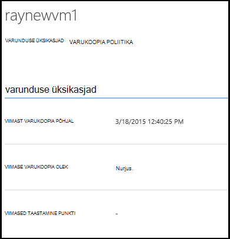

3. Saate vaadata ja hallata varukoopia poliitika virtuaalse masina sätted vahekaarti **poliitika** .

    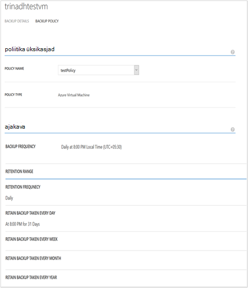

    **Varundus poliitika** vahekaardil kuvatakse olemasoleva poliitika. Saate muuta vastavalt vajadusele. Kui teil on vaja luua uue poliitika nuppu **Loo** lehel **poliitika** . Pange tähele, et kui soovite eemaldada poliitika ei tohiks olla mis tahes virtuaalmasinates seotud.

    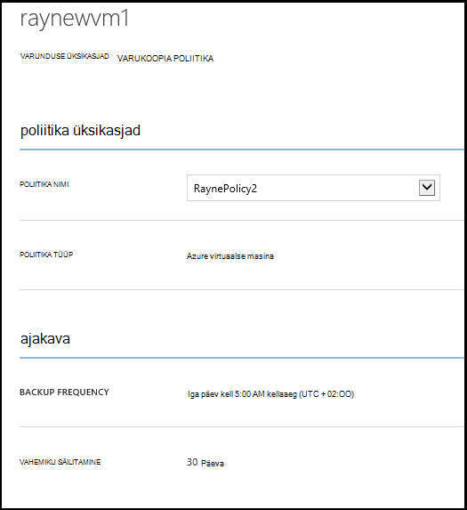

4. Toimingud või oleku kohta lisateabe saamiseks virtuaalse masina lehel **tööde haldamine** . Klõpsake loendis, et saada lisateavet töö või filtreerida teatud virtuaalse masina tööd.

    

## <a name="on-demand-backup-of-a-virtual-machine"></a>Nõudmisel varukoopia virtuaalse masina
Kui see on konfigureeritud kaitse, saate mõne nõudmisel varukoopia virtuaalse masina teha. Kui algset varundus on ootel jaoks virtuaalse masina, loob nõudmisel varukoopia virtuaalse masina täielik koopia Azure varukoopiate hoidla. Kui esimene varundamine on lõpule viidud, nõudmisel varukoopia saavad ainult saada muudatustest eelmise varukoopia põhjal Azure'i varukoopiad võlvkelder st on alati suureneva.

>[AZURE.NOTE] Säilituspoliitika lahtrivahemik, kuvatakse nõudmisel varundus on seatud säilitus määratud igapäevane säilituspoliitika varukoopia poliitika VM vastav väärtus.  

Võtta mõne nõudmisel varukoopia virtuaalse masina:

1. **Kaitstud üksuste** lehele liikumiseks valige **Azure virtuaalse masina** **tüübiks** (kui see pole juba valitud) ja klõpsake nuppu **Vali** .

    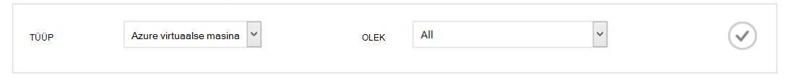

2. Valige virtuaalse masina võtta mõne nõudmisel varukoopia ja **Varukoopia nüüd** lehe allosas nuppu soovite.

    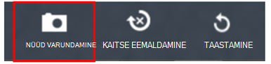

    See loob Varundustöö valitud virtual arvutisse. Säilituspoliitika vahemiku taastamine punkti selle töö kaudu loodud on sama, mis on seotud virtuaalse masina poliitika määratud.

    

    >[AZURE.NOTE] Seotud virtuaalse masina poliitika vaatamiseks virtuaalse masina **Üksuste kaitstud** lehe süvitsiminek ja minge menüüsse varukoopia poliitika.

3. Pärast töö loomist võite klõpsata vastava töö töö lehe kuvamiseks töölauateatisega ribal nuppu **Kuva töö** .

    

4. Pärast töö edukaks, taastamine punkti ei looda, mille abil saate taastada virtuaalse masina. See on ka inkrementida taastamine punkti veeru väärtus 1 **Kaitstud üksuste** lehel.

## <a name="stop-protecting-virtual-machines"></a>Peata kaitse virtuaalmasinates
Saate valida peatamiseks tulevaste varukoopiaid virtuaalse masina abil järgmistest suvanditest:

- Varukoopia virtuaalse masina Azure'i varukoopiate hoidla seotud andmete säilitamise
- Varukoopia virtuaalse masina seotud andmete kustutamine

Kui olete valinud varukoopia virtuaalse masina seotud andmete säilitamise, saate varundatud andmete taastamine virtuaalse masina. Hinnad selliste virtuaalmasinates üksikasju, klõpsake [siin](https://azure.microsoft.com/pricing/details/backup/).

Kaitse virtuaalse masina lõpetamiseks tehke järgmist.

1. **Kaitstud üksuste** lehele liikumiseks ja valige **Azure virtuaalse masina** tüübiks filter (kui see pole juba valitud) ja klõpsake nuppu **Vali** .

    

2. Valige virtuaalse masina ja klõpsake lehe allservas **Peata kaitse** .

    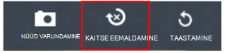

3. Vaikimisi Azure varukoopia ei kustutata virtuaalse masina seotud andmete varukoopia.

    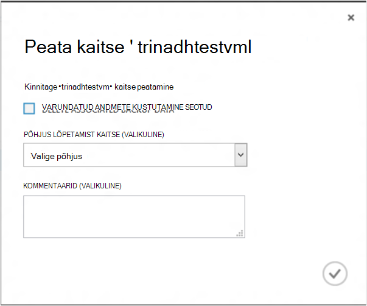

    Kui soovite varundatud andmete kustutamine, märkige ruut.

    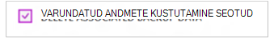

    Valige põhjus peatamine varukoopia. Kui see pole kohustuslik, põhjus aitab tööd tagasiside ja tähtsuse järjekorda seada kliendi stsenaariumid Azure varukoopia.

4. Klõpsake **nuppu **Peata kaitse** töö esitada** . **Kuva töö** vastava töö **töö** lehe kuvamiseks klõpsake nuppu.

    

    Kui te pole valinud ajal **Peata kaitse** viisard ja seejärel postituse töö lõpetamist suvandi **seotud varundatud andmete kustutamine** , kaitse olekuks **Kaitse on peatatud**. Andmed jäävad Azure'i varundamise kuni kustutamiseni otseselt. Alati võite andmed kustutada, valides virtuaalse masina **Kaitstud üksuste** lehel ja klõpsake nuppu **Kustuta**.

    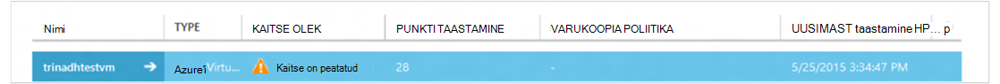

    Kui olete valinud suvandi **seotud varundatud andmete kustutamine** , virtuaalse masina ei saa **Kaitstud üksuste** lehekülje osa.

## <a name="re-protect-virtual-machine"></a>Virtuaalse masina uuesti kaitsmine
Kui olete valinud suvandi **Kustuta sidusettevõtte varundatud andmete** ei **Peata kaitse**, saate uuesti kaitsta virtuaalse masina sarnane varundada registreeritud virtuaalmasinates juhiste järgi. Kui kaitstud, on see virtuaalse masina varundatud andmete säilitatakse enne Peata kaitse ja taastamise punkte, mis on loodud pärast uuesti kaitsta.

Pärast uuesti kaitsta, virtuaalse masina kaitse olek muutub abil **kaitstud** kui andmepunkte on taastamine enne **Peata kaitse**.

  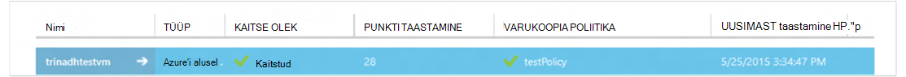

>[AZURE.NOTE] Kui virtuaalse masina uuesti kaitsmisele saate valida muu poliitika, kui poliitika, millega virtuaalse masina kaitstud algselt.

## <a name="unregister-virtual-machines"></a>Unregister virtuaalmasinates

Kui soovite eemaldada virtuaalse masina varukoopia hoidlast.

1. Klõpsake lehe allosas nuppu **registreerimise tühistamise** .

    

    Kinnituse taotlemise ekraani allservas kuvatakse töölauateatis teatis. Klõpsake nuppu **Jah** jätkata.

    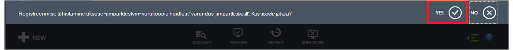

## <a name="delete-backup-data"></a>Varundus andmete kustutamine
Varundatud andmete seostatud virtuaalse masina, kas kustutamine

- Peata kaitse töö käigus
- Peata kaitse pärast töö on lõpule viidud virtual arvutisse

Varundatud andmete virtual arvutisse, mis on *Kaitse on peatatud* olekus postitada kustutamiseks **Peatamine** Varundustöö edukaks:

1. **Kaitstud üksuste** lehele liikumiseks valige **Azure virtuaalse masina** *Tüüp* ja nuppu **valimine** .

    

2. Valige virtuaalse masina. Virtuaalse masina saab **Kaitse on peatatud** olekus.

    

3. Klõpsake lehe allosas nuppu **Kustuta** .

    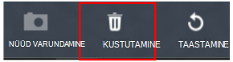

4. **Varundatud andmete kustutamine** viisardis valige põhjus kustutamine varundatud andmete (soovitatav) ning klõpsake nuppu **Edasta**.

    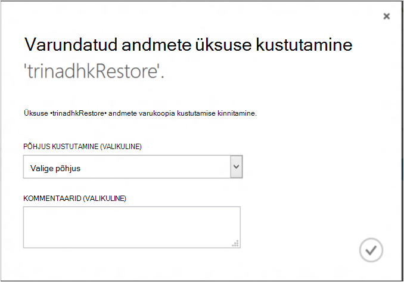

5. See loob töö, mida soovite kustutada valitud virtuaalse masina andmete varukoopia. Klõpsake nuppu **Kuva töö** vastava töö töö lehe kuvamiseks.

    

    Kui töö on lõppenud, eemaldatakse vastav virtuaalse masina **kaitstud üksuste** lehelt.

## <a name="dashboard"></a>Armatuurlaua
**Armatuurlaua** lehel saate vaadata teavet Azure'i virtuaalmasinates oma salvestusruumi ja viimase 24 tunni jooksul nendega tööd. Saate vaadata varukoopia olek ja seotud varukoopia vigu.

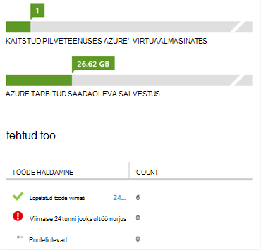

>[AZURE.NOTE] Väärtuste armatuurlaua värskendatakse iga 24 tunni järel.

## <a name="auditing-operations"></a>Auditi toimingud
Azure'i varukoopiad pakub ülevaadet "toiming logid" varukoopia toimingute vallandanud hõlbus täpselt mis toimingute olid varukoopiate hoidla läbi vaadata kliendi poolt. Toimingute logid luba suurepärane tapajärgse ja audit tugi varukoopia toimingud.

Logi sisse loginud järgmisi toiminguid:

- Registreeru
- Registreerimise tühistamine
- Kaitse konfigureerimine
- Varundus (nii ajastatud samuti nõudmisel varukoopia BackupNow kaudu)
- Taastamine
- Kaitse eemaldamine
- Varundatud andmete kustutamine
- Teabehalduspoliitika lisamine
- Poliitika kustutamine
- Poliitika
- Katkestamine

Varukoopiate hoidla vastav logi vaatamiseks tehke järgmist.

1. Liikuge **halduse teenused** Azure'i portaalis, ja seejärel klõpsake vahekaarti **Logi** .

    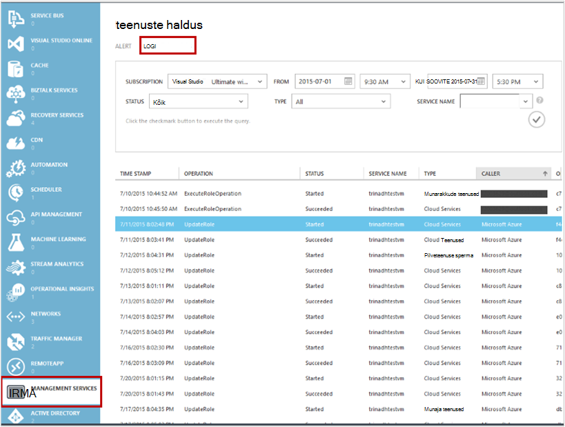

2. Filtrid, valige *tüübiks* **varukoopia** ja määrake varukoopiate hoidla nimi *teenuse nimi* ja klõpsake **Edasta**.

    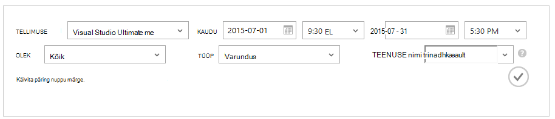

3. Toimingute logid, valige kõik toimingud ja klõpsake nuppu **üksikasjad** vastava toimingu üksikasjade kuvamiseks.

    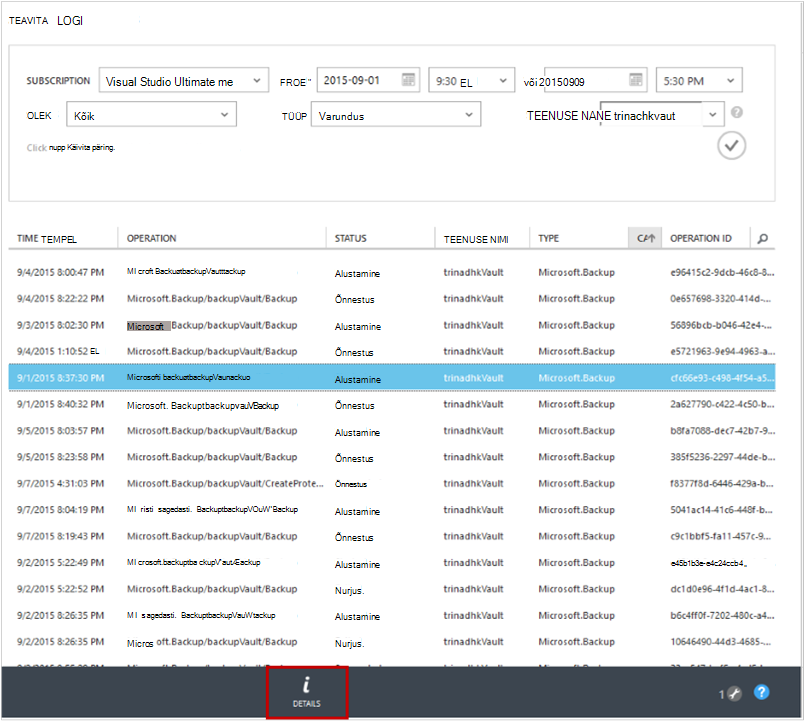

    **Viisardi üksikasjad** sisaldab teavet toimingu käivitada, töö Id, ressursside kohta, kuhu see toiming käivitatakse ja alguskellaaeg toimingu.

    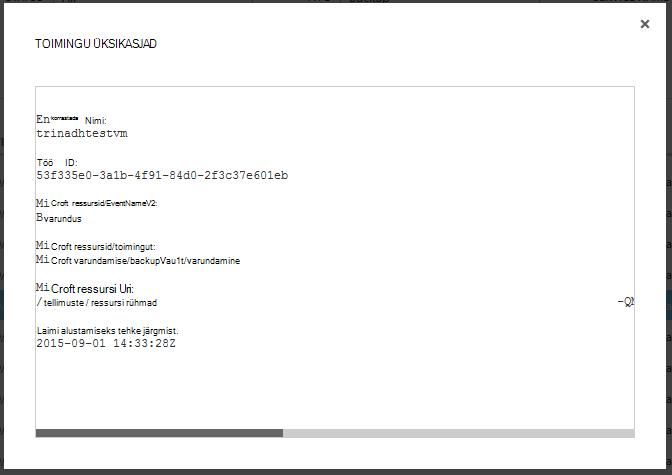

## <a name="alert-notifications"></a>Teatiste
Saate kohandatud teatiste jaoks tööde portaalis. See on saavutada määramist PowerShelli vastavalt funktsionaalseid logid sündmused. Soovitame kasutada *PowerShelli versioon 1.3.0 või ülaltoodud*.

Määratleda kohandatud teatise jaoks varukoopia tõrkeid hoiatada, näeb näide käsk:

```
PS C:\> $actionEmail = New-AzureRmAlertRuleEmail -CustomEmail contoso@microsoft.com
PS C:\> Add-AzureRmLogAlertRule -Name backupFailedAlert -Location "East US" -ResourceGroup RecoveryServices-DP2RCXUGWS3MLJF4LKPI3A3OMJ2DI4SRJK6HIJH22HFIHZVVELRQ-East-US -OperationName Microsoft.Backup/backupVault/Backup -Status Failed -TargetResourceId /subscriptions/86eeac34-eth9a-4de3-84db-7a27d121967e/resourceGroups/RecoveryServices-DP2RCXUGWS3MLJF4LKPI3A3OMJ2DI4SRJK6HIJH22HFIHZVVELRQ-East-US/providers/microsoft.backupbvtd2/BackupVault/trinadhVault -Actions $actionEmail
```

**ResourceIdkasutamisel**: te võite seda toimingute logid popup, nagu on kirjeldatud ülal jaotises. Toimingu üksikasjad hüpikakna ResourceUri on ResourceIdkasutamisel esitatavaid cmdlet-käsu jaoks.

**OperationName**: see oleks vorming "Microsoft.Backup/backupvault/<EventName>" kui EventName on üks Register, registrist kustutamise, ConfigureProtection, varundamine, taastamine, StopProtection, DeleteBackupData, CreateProtectionPolicy, DeleteProtectionPolicy, UpdateProtectionPolicy

**Olek**: toetatud väärtused on alustamine, õnnestus ja nurjus.

**ResourceGroup**: ResourceGroup, kus käivitatakse toiming ressursi. Saate selle hankida ResourceIdkasutamisel väärtuse. Väljade */resourceGroups/* ja */providers/* ResourceIdkasutamisel väärtus väärtus ResourceGroup väärtus.

**Nimi**: reegli nimi.

**CustomEmail**: saate määrata kohandatud meiliaadress, millele soovite saata hoiatus

**SendToServiceOwners**: see suvand saadab teatis teatis kõik administraatorid ja kaasadministraatorite tellimuse. Seda saate kasutada cmdlet-käsu **New-AzureRmAlertRuleEmail**

### <a name="limitations-on-alerts"></a>Teatiste piirangud
Teatiste sündmus põhinev läbivad järgmistele piirangutele:

1. Teatisi luuakse kõik virtuaalmasinates varukoopiate hoidla sisse. Mida ei saa kohandada määratud virtuaalmasinates rakenduses varukoopiate hoidla teatiste saamiseks.
2. See funktsioon on eelvaates. [Lisateave](../monitoring-and-diagnostics/insights-powershell-samples.md#create-alert-rules)
3. Saate teatiste "alerts-noreply@mail.windowsazure.com". Praegu ei saa muuta e-posti saatja.

## <a name="next-steps"></a>Järgmised sammud

- [Azure'i VMs taastamine](backup-azure-restore-vms.md)
